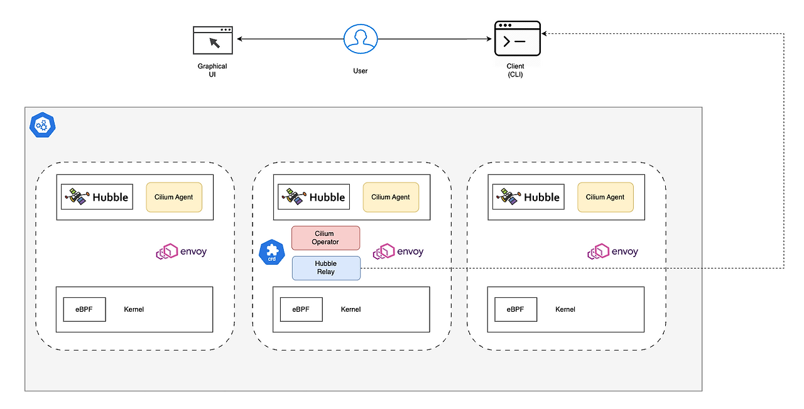
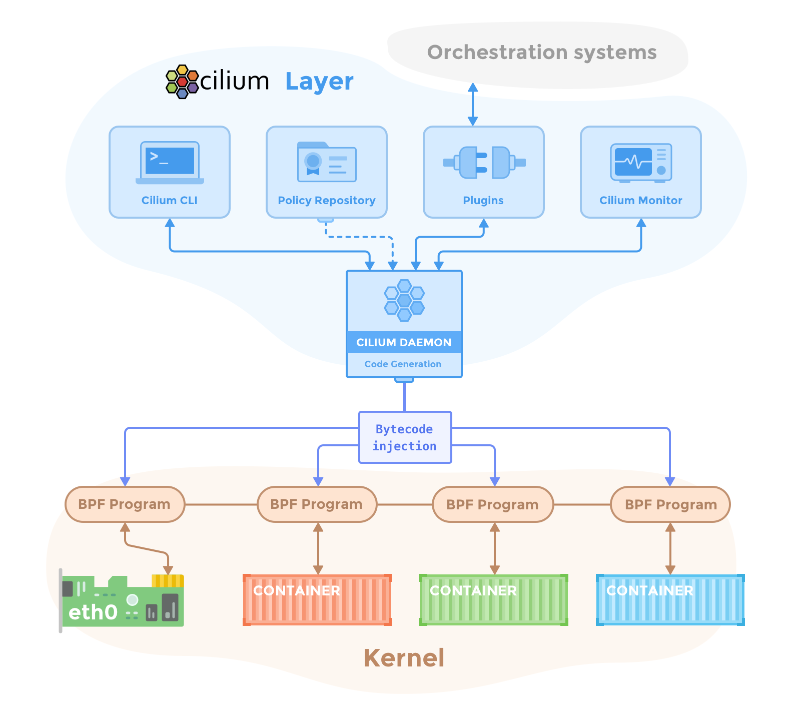

# `Cilium` 간단 요약

## TL;DR
1. Cilium Agent runs on each node(DaemonSet)  
실리움 에이전트는 각 노드에서 데몬셋을 사용하여 실행된다.

2. Cilium agent listens to k8s events and API calls to understand the cluster's networking and security requirements.  
클러스터의 네트워킹 및 보안 요구사항을 파악하기 위해 kubernetes events와 API call을 모니터링한다.  

3. Cilium agent manages eBPF programs.  
실리움 에이전트는 eBPF 프로그램을 관리, 로딩을 담당하여 적절한 인터페이스에 연결되도록한다.

4. Cilium Operator manages cluster-wide tasks.  
실리움 오퍼레이터는 클러스터 전반의 작업을 관리한다.

5. Envoy proxy handles all L7 traffic (eBPF can only work with L3/L4).  
엔보이 프락시는 각 노드당 하나씩 배치 되며 모든 L7트래픽을 처리한다.(eBPF는 모든 L3, L4를 처리한다)

6. Envoy proxy can be deployed within the Cilium agent pods or as a standalone pod.  
엔보이 프락시는 실리움 에이전트 파드 내 또는 독립 파드로 배포될 수 있다.

7. Cilium uses kubernetes CRDs as a data store to propagate state between agents.  
또한 Cilium은 k8s CRDs를 데이터 스토어로 사용하여 에이전트 간의 상태를 전파한다.

8. The Hubble server runs on each node and captures traffic flows  
허블 서버는 각 노드에서 실행되며 트래픽 흐름을 캡처한다.

9. The Hubble Relay componets aggregates flow data from multiple Hubble servers to provide cluster-wide visibility.  
허블 릴레이 구성 요소는 여러 허블 서버에서 데이터 플로우를 집계하여 클러스터 전체의 가시성을 제공한다.

10. Hubble CLI is command line tool used to query the Hubble Relay for flow data.  
허블 CLI는 허블 릴레이에서 데이터흐름을 쿼리하는데 사용되는 CLI이다.

11. Hubble UI utilizes relay-based visibility to provide a graphical service dependency and connectivity map.  
Hubble UI는 릴레이 기반 가시성을 사용하여 그래픽 서비스 의존성 및 연결맵을 제공한다.  

12. Sidecar-based service mesh requires a sidecar proxy for each application.  
사이드카 기반 서비스메시는 각 어플레케이션 마다 사이드카 프록시를 필요로한다.  
  
  

13. Sidecar model leads to higher complexity, higher resource usage, higher latency, longer start times.  
사이드카 모델은 높은 복잡성, 높은 리소스 사용량, 높은 지연, 긴 시작 시간을 초래한다.  

  
14. Cilium uses a sidecarless model where eBPF programs handle all L3/L4 logic, and an Envoy Proxy (one per node) handles L7.    
실리움은 사이드카리스 모델을 사용하는데 eBPF가  L3/L4 로직을 핸들링하며 각 노드당 배치된 엔보이 프락시가 L7를 담당한다.    

15. Sidecarless model requires less resources, less complexity, and lower latency.  
사이드카리스 모델은 보다 적은 리소스 사용량, 적은 복잡도, 낮은 지연을 요구한다.  

## 서비스 메시를 구현하는 두가지 모델 : Sidecar vs Sidecarless(Cilium의 접근방식)
서비스 메시를 구현하는 두가지 모델 : Sidecar vs Sidecarless ( Cilium의 접근 방식)
1. 전통적인 사이드카 (Sidecar) 모델
- 아키텍처: Envoy와 같은 전용 프록시가 모든 애플리케이션 파드 내부에 "사이드카" 컨테이너로 배포되며 애플리케이션을 오가는 모든 트래픽은 이 프록시를 통과
- 장점: 특정 프로그래밍 언어에 구애받지 않으며 애플리케이션 코드 변경이 필요 없음
- 단점:
  - 높은 리소스 사용량: 모든 파드에 추가 프록시 컨테이너가 필요하여 CPU 및 메모리 소비가 증가 
  - 높은 복잡성: 많은 프록시를 수동으로 구성하고 관리해야함
  - 지연 시간 증가: 모든 요청에 대해 추가적인 네트워크 홉이 발생
  - 느린 시작 시간: 애플리케이션은 사이드카 프록시가 시작될 때까지 기다려야 함

2. Cilium의 사이드카리스 (Sidecar-less) 모델
아키텍처: Cilium은 eBPF와 노드별 프록시를 활용하여 더 효율적인 모델을 제공

- eBPF: 모든 레이어 3 및 레이어 4 네트워킹과 보안을 커널에서 직접 처리하여 해당 트래픽에 대한 프록시 필요성을 없앰.
- Envoy 프록시: 고급 레이어 7 트래픽 관리(예: HTTP 인식 정책)를 위해 Cilium은 파드별이 아닌 노드별로 실행되는 단일 Envoy 프록시를 사용한다. eBPF 프로그램은 필요한 L7 트래픽만 이 공유 프록시로 지능적으로 리디렉션함
- 장점:
  - 적은 리소스: 프록시 수를 대폭 줄여 CPU와 메모리를 절약 
  - 낮은 복잡성: 관리할 부분이 적어 관리가 단순해짐
  - 더 나은 성능 및 낮은 지연 시간: L3/L4 트래픽에 대한 추가적인 네트워크 홉을 피함

# [Detail] 구성 요소 개요

원글
https://docs.cilium.io/en/stable/overview/component-overview/

## Agent
Cilium Agent는 클러스터의 각 노드에서 동작한다.  High-level에서 Agent는k8s또는 API를 통해 네트워킹, 서비스 로드 밸런싱
네트워크 폴리시 그리고 visibility 및 모니터링 요구사항에 대한 구성을 허용한다.

Cilium Agent는 쿠버네티스와 같은 오케스트레이션 시스템 이벤트를 수신하여 컨테이너 또는 워크로드의 시작 및 종료시점을 파악한다. 
또한 리눅스 커널이 해당 컨테이너의 모든 네트워크 접근을 제어하는데 사용하는 eBPF 프로그램을 관리한다.

## Debug Client(CLI)

Cilium debug CLI client(clium-dbg)는 Cilium Agent와 함께 설치되는 command-line-tool이다. 
동일한 노드에서 실행 중인 Cilium Agent의 REST API와 상호작용하며 Debug CLI를 통하여 로컬 Agent 상태를 검사할 수 도 있다. 
또한 eBPF 맵에 직접 액세스하여 상태를 검증할 수 있는 도구도 제공한다. 

> Agent 내의  Cilium Debug CLI client는 Cilium을 빠르게 설치 및 관리하기 위한 cli와 혼동해서는 안된다

## Operator

Cilium Operator는 클러스터의 각 노드에서 개별적으로 처리되는 작업이 아닌 전체 클러스터를 대상으로 논리적으로 한번만 처리되어야하는
일들을 관리한다. 

Cilium Operator는 어떠한 포워딩이나 네트워크 정책 결정의 핵심 경로(Critical path)에 있지않다. 따라서 
오퍼레이터가 일시적으로 중단되더라도 클러스터는 일반적으로 계속 작동한다. 하지만 설정에 따라 오퍼레이터의 가용성에 
문제가 생기면 아래와 같은 결과로 이어질 수 있다. 

- IP 주소 관리(IPAM) 지연 : 오퍼레이터가 새 IP주소를 할당해야 하는 경우, 지연으로 인해 새로운 워크로드의 스케쥴링이 늦어짐
- kvstore 하트빗 키를 업데이트하지 못하면 Agent가 kvstore가 비정상적이라고 선언하고 다시 시작

## CNI Plugin

CNI 플러그인 (clium-cni)는 노드에서 파드가 스케쥴링되거나 종료될때 쿠버네티스에 의해 호출 된다. 이 플러그인은 해당 노드의 Cilium API와 
상호 작용하여 파드에 네트워킹, 로드밸런싱, 네트워크 정책을 제공하는데 필요한 데이터경로(datapath) 설정을 실행한다.

## Hubble

### Server
`Hubble` 서버는 각 노드에서 실행되며 Cilium으로부터 eBPF 기반의 가시성(visibility) 정보를 가져온다. 높은 성능과 낮은 오버헤드를 위해
Cilium Agent에 내장되어있다. flow정보를 가져오고 프로메테우스 메트릭을 제공하는 gRPC 서비스를 제공한다.
### Relay
릴레이(hubble-relay)는 실행중인 모든 Hubble 서버를 인지하는 독립적인 컴포넌트이다. 각 서버의 gRPC API에 연결하여 클러스터 전반의 가시성을 제공하며
클러스터의 모든 서버를 대표하는 API를 제공한다.

### Client(CLI)
Hubble CLI는 hubble-relay의 gRPC API나 로컬 서버에 연결하여 flow events를 가져올 수 있는 커맨드라인 도구이다. 

### Graphical UI(GUI)
그래픽 사용자 인터페이스(hubble-ui)는 릴레이 기반의 가시성을 활용하여 그래픽 형태의 서비스 의존성 및 연결성 맵을 제공한다. 

## eBPF

eBPF는 원래 tcpdum나 소켓 필터와 같이 네트워크 패킷을 필터링 하기 위해 도입된 리눅스 커널 바이트코드 해석기다. 이후 해시 테이블 및 배열과 같은 
추가적인 자료 구조와 패킷조작, 포워팅, 캡슐화 등을 지원하기 위한 추가적인 액션들로 확장되었다. 커널 내 검증기(verifier)는 eBPF 프로그램이 안전하게 실행될 
수 있도록 보장하며, JIT 컴파일러는 바이트코드를 CPU 아키텍처별 명령어로 변환하여 네이티브 실행 효율을 높인다. eBPF 프로그램은 들어오고 나가는 패킷과
같은 커널 내의 다양한 후킹 지점(hooking points)에서 실행될 수 있다. 

Cilium은 리눅스 커널에서 사용 가능한 기능들을 탐지할 수 있으며 최신 기능이 발견되면 자동으로 활용한다. 
## Data Store

Cilium은 에이전트 간의 상태를 전파하기 위해 데이터 저장소가 필요하다. 

### Kubernetes CRD(default)
데이터를 저장하고 상태를 전파하기 위한 기본 선택지는 CRD를 사용하는 것이다. CRD는 클러스터 구성요소가 쿠버네티스 리소스를 통해 설정과 상태를 나타
낼 수 있도록 쿠버네티스에서 제공된다. 

### key-value Store
Cilium의 기본 설정에 구성된 쿠버네티스 CRD만으로도 상태 저장 및 전파에 대한 모든 요구 사항을 충족할 수 있다. 선택적으로 key-value 스토어
를 사용하여 클러스터 확장성을 향상시키는 최적화 방안으로 사용할 수 있는데 변경 알림 및 저장 공간 요구사항이 직접 key-value store를 사용할 때 
더 효율적이기 때문이다.

현재 지원되는 key-value 스토어
- etcd
