- 실습환경 배포파일
  - `Vagrantfile` : 가상머신 정의, 부팅 시 초기 프로비저닝 설정
  - `init_cfg.sh` : args 참고하여 설치
  - `kus-ctr.sh` : kubeadm init (Pod/ServiceCIDR), 편리성 설정(k, kc)
  - `k8s-w.sh` : kubeadm join


```bash
mkdir cilium-lab && cd cilium-lab

curl -O https://raw.githubusercontent.com/gasida/vagrant-lab/refs/heads/main/cilium-study/1w/Vagrantfile

vagrant up
```

- 배포후 `vagrant ssh k8s-ctr`,`vagrant ssh k8s-w1`,`vagrant ssh k8s-w2` 접속

- 기본정보 확인
```bash
# ssh 접속 전, 노드들의 eth0 IP 확인
for i in ctr w1 w2 ; do echo ">> node : k8s-$i <<"; vagrant ssh k8s-$i -c 'ip -c -4 addr show dev eth0'; echo; done #
```

## control plane(k8s-ctr 정보확인)
```bash
kubectl cluster-info
# 노드 정보 : 상태, INTERNAL-IP 확인
kubectl get node -owide

# 파드 정보 : 상태, 파드 IP 확인 - kube-proxy 확인
kubectl get pod -A -owide

# 단축어 확인(kc = kubecolor) & coredns 파드 상태 확인
k  describe pod -n kube-system -l k8s-app=kube-dns
kc describe pod -n kube-system -l k8s-app=kube-dns

```

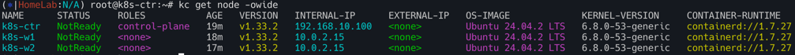
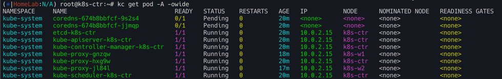
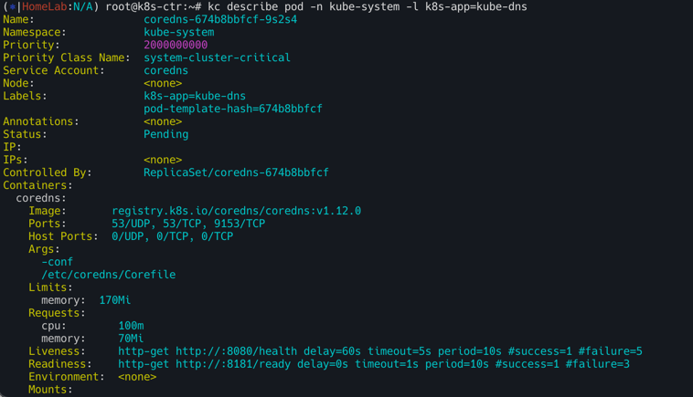

- INTERNAL-IP 변경 설정
```bash
#
cat /var/lib/kubelet/kubeadm-flags.env

# INTERNAL-IP 변경 설정
NODEIP=$(ip -4 addr show eth1 | grep -oP '(?<=inet\s)\d+(\.\d+){3}')
sed -i "s/^\(KUBELET_KUBEADM_ARGS=\"\)/\1--node-ip=${NODEIP} /" /var/lib/kubelet/kubeadm-flags.env
systemctl daemon-reexec && systemctl restart kubelet

cat /var/lib/kubelet/kubeadm-flags.env
```
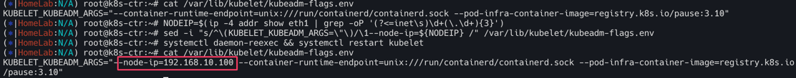
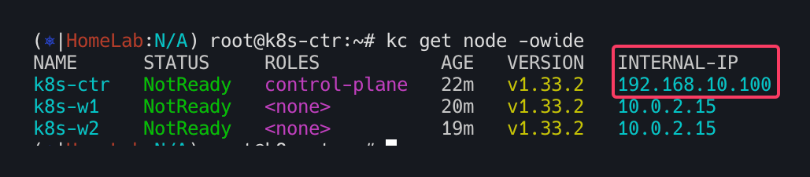


## 워커노드 INTERNAL-IP 변경설정(k8s-w1,w2)

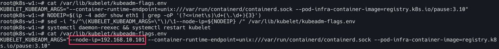
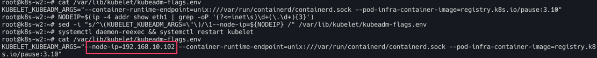


각 노드 INTERNAL-IP 확인


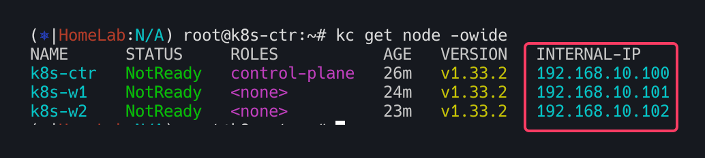
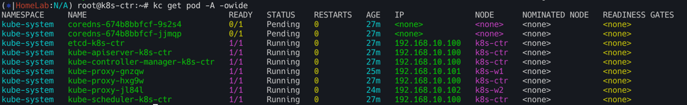


## Control-plane의 static 파드의 IP 변경 설정

```bash
tree /etc/kubernetes/manifests
/etc/kubernetes/manifests
├── etcd.yaml
├── kube-apiserver.yaml
├── kube-controller-manager.yaml
└── kube-scheduler.yaml

# etcd 정보 확인
cat /etc/kubernetes/manifests/etcd.yaml
...
  volumes:
  - hostPath:
      path: /etc/kubernetes/pki/etcd
      type: DirectoryOrCreate
    name: etcd-certs
  - hostPath:
      path: /var/lib/etcd
      type: DirectoryOrCreate
    name: etcd-data

tree /var/lib/etcd/
/var/lib/etcd/
└── member
    ├── snap
    │   └── db
    └── wal
        ├── 0000000000000000-0000000000000000.wal
        └── 0.tmp
```

최종적으로 아이피 변경 유무 확인

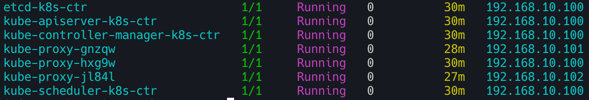


## Flannel CNI 설치 확인

### 설치 전 확인
```
kubectl cluster-info dump | grep -m 2 -E "cluster-cidr|service-cluster-ip-range"
                            "--service-cluster-ip-range=10.96.0.0/16",
                            "--cluster-cidr=10.244.0.0/16",

kubectl get pod -n kube-system -l k8s-app=kube-dns -owide

#
ip -c link
ip -c route
brctl show

ip -c addr
ifconfig | grep -iEA1 'eth[0-9]:'

#
iptables-save
iptables -t nat -S
iptables -t filter -S
iptables -t mangle -S

#
tree /etc/cni/net.d/

```


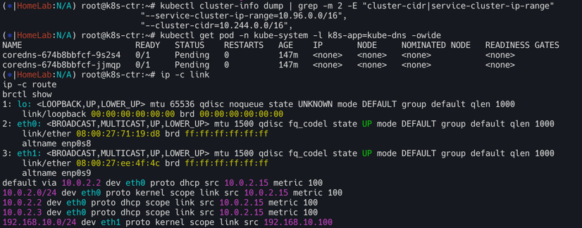
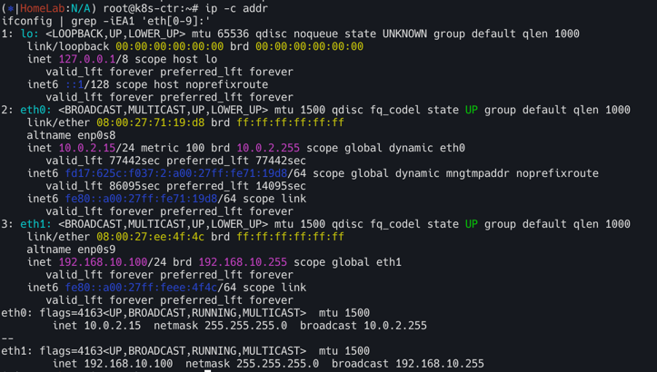

### flannel CNI 설치

```bash
# Needs manual creation of namespace to avoid helm error
kubectl create ns kube-flannel
kubectl label --overwrite ns kube-flannel pod-security.kubernetes.io/enforce=privileged

helm repo add flannel https://flannel-io.github.io/flannel/
helm repo list
helm search repo flannel
helm show values flannel/flannel

# k8s 관련 트래픽 통신 동작하는 nic 지정
cat << EOF > flannel-values.yaml
podCidr: "10.244.0.0/16"

flannel:
  args:
  - "--ip-masq"
  - "--kube-subnet-mgr"
  - "--iface=eth1"  
EOF

# helm 설치
helm install flannel --namespace kube-flannel flannel/flannel -f flannel-values.yaml
helm list -A

# 확인 : install-cni-plugin, install-cni
kc describe pod -n kube-flannel -l app=flannel

tree /opt/cni/bin/ # flannel
tree /etc/cni/net.d/
cat /etc/cni/net.d/10-flannel.conflist | jq
kc describe cm -n kube-flannel kube-flannel-cfg
...
net-conf.json:
----
{
  "Network": "10.244.0.0/16",
  "EnableNFTables": false,
  "Backend": {
    "Type": "vxlan"
  }
}

# 설치 전과 비교해보자
ip -c link
ip -c route | grep 10.244.
10.244.0.0/24 dev cni0 proto kernel scope link src 10.244.0.1 
10.244.1.0/24 via 10.244.1.0 dev flannel.1 onlink 
10.244.2.0/24 via 10.244.2.0 dev flannel.1 onlink 

ping -c 1 10.244.1.0
ping -c 1 10.244.2.0

brctl show
iptables-save
iptables -t nat -S
iptables -t filter -S

# k8s-w1, k8s-w2 정보 확인
for i in w1 w2 ; do echo ">> node : k8s-$i <<"; sshpass -p 'vagrant' ssh -o StrictHostKeyChecking=no vagrant@k8s-$i ip -c link ; echo; done
for i in w1 w2 ; do echo ">> node : k8s-$i <<"; sshpass -p 'vagrant' ssh -o StrictHostKeyChecking=no vagrant@k8s-$i ip -c route ; echo; done
for i in w1 w2 ; do echo ">> node : k8s-$i <<"; sshpass -p 'vagrant' ssh -o StrictHostKeyChecking=no vagrant@k8s-$i brctl show ; echo; done
for i in w1 w2 ; do echo ">> node : k8s-$i <<"; sshpass -p 'vagrant' ssh -o StrictHostKeyChecking=no vagrant@k8s-$i sudo iptables -t nat -S ; echo; done

```

CNI 설치 전

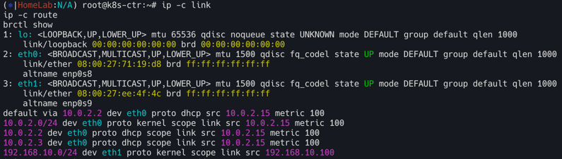

CNI 설치 후

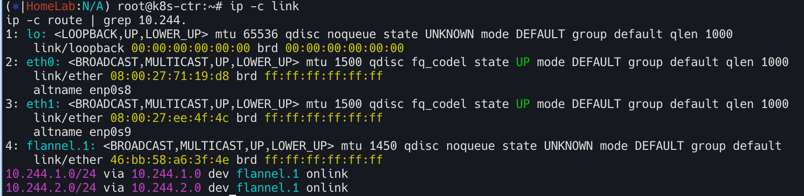

샘플 애플리케이션 배포 및 확인


```bash
# 샘플 애플리케이션 배포
cat << EOF | kubectl apply -f -
apiVersion: apps/v1
kind: Deployment
metadata:
  name: webpod
spec:
  replicas: 2
  selector:
    matchLabels:
      app: webpod
  template:
    metadata:
      labels:
        app: webpod
    spec:
      affinity:
        podAntiAffinity:
          requiredDuringSchedulingIgnoredDuringExecution:
          - labelSelector:
              matchExpressions:
              - key: app
                operator: In
                values:
                - sample-app
            topologyKey: "kubernetes.io/hostname"
      containers:
      - name: webpod
        image: traefik/whoami
        ports:
        - containerPort: 80
---
apiVersion: v1
kind: Service
metadata:
  name: webpod
  labels:
    app: webpod
spec:
  selector:
    app: webpod
  ports:
  - protocol: TCP
    port: 80
    targetPort: 80
  type: ClusterIP
EOF


# k8s-ctr 노드에 curl-pod 파드 배포
cat <<EOF | kubectl apply -f -
apiVersion: v1
kind: Pod
metadata:
  name: curl-pod
  labels:
    app: curl
spec:
  nodeName: k8s-ctr
  containers:
    - name: curl
      image: alpine/curl
      command: ["sleep", "36000"]
EOF

#
crictl ps
for i in w1 w2 ; do echo ">> node : k8s-$i <<"; sshpass -p 'vagrant' ssh vagrant@k8s-$i sudo crictl ps ; echo; done
```

확인
```bash
# 배포 확인
kubectl get deploy,svc,ep webpod -owide
kubectl api-resources | grep -i endpoint   
kubectl get endpointslices -l app=webpod

# 배포 전과 비교해보자
ip -c link
brctl show
iptables-save
iptables -t nat -S

# k8s-w1, k8s-w2 정보 확인
for i in w1 w2 ; do echo ">> node : k8s-$i <<"; sshpass -p 'vagrant' ssh -o StrictHostKeyChecking=no vagrant@k8s-$i ip -c link ; echo; done
for i in w1 w2 ; do echo ">> node : k8s-$i <<"; sshpass -p 'vagrant' ssh -o StrictHostKeyChecking=no vagrant@k8s-$i ip -c route ; echo; done
for i in w1 w2 ; do echo ">> node : k8s-$i <<"; sshpass -p 'vagrant' ssh -o StrictHostKeyChecking=no vagrant@k8s-$i brctl show ; echo; done
for i in w1 w2 ; do echo ">> node : k8s-$i <<"; sshpass -p 'vagrant' ssh -o StrictHostKeyChecking=no vagrant@k8s-$i sudo iptables -t nat -S ; echo; done
```

- 통신 확인

```bash
kubectl get pod -l app=webpod -owide
kubectl exec -it curl-pod -- curl $POD1IP

kubectl get svc,ep webpod
kubectl exec -it curl-pod -- curl webpod
kubectl exec -it curl-pod -- curl webpod | grep Hostname
kubectl exec -it curl-pod -- sh -c 'while true; do curl -s webpod | grep Hostname; sleep 1; done'

# Service 동작 처리에 iptables 규칙 활용 확인 >> Service 가 100개 , 1000개 , 10000개 증가 되면???
kubectl get svc webpod -o jsonpath="{.spec.clusterIP}"
SVCIP=$(kubectl get svc webpod -o jsonpath="{.spec.clusterIP}")
iptables -t nat -S | grep $SVCIP
for i in w1 w2 ; do echo ">> node : k8s-$i <<"; sshpass -p 'vagrant' ssh -o StrictHostKeyChecking=no vagrant@k8s-$i sudo iptables -t nat -S | grep $SVCIP ; echo; done
-A KUBE-SERVICES -d 10.96.255.104/32 -p tcp -m comment --comment "default/webpod cluster IP" -m tcp --dport 80 -j KUBE-SVC-CNZCPOCNCNOROALA
-A KUBE-SVC-CNZCPOCNCNOROALA ! -s 10.244.0.0/16 -d 10.96.255.104/32 -p tcp -m comment --comment "default/webpod cluster IP" -m tcp --dport 80 -j KUBE-MARK-MASQ
```
