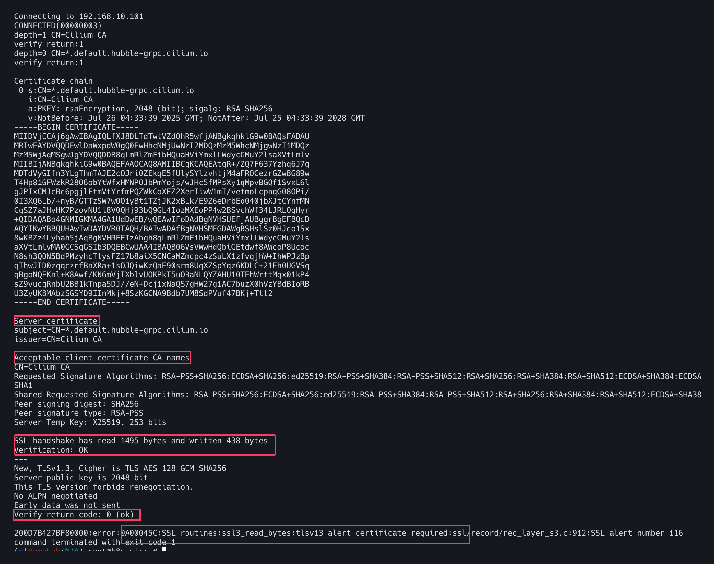

# Configure TLS with Hubble

## Hubble API에서 TLS 활성화
허블 릴레이가 배포되면 허블은 호스트 네트워크의 TCP 포트에서 수신대기한다. 이를 통해 허블 릴레이는 클러스터 내의 모든
허블 인스턴스와 통신 할 수 있다. 허블 인스턴스와 허블릴레이 간의 연결은 기본적으로 mTLS를 사용하여 보호된다. 


## TLS인증서 구성

인증서 교체 방법은 여러가지가 존재하지만 최종적으로 key쌍이 포함된 비밀정보가 업데이트 된다. 허블 서버와 
허블 릴레이는 CA인증서를 포함한 TLS 인증서의 핫 re-loading을 지원하므로 기존 연결은 끊어지지않는다.
허블 서버나 릴레이를 다시 시작 할 필요 없이 새 인증서를 사용하여 자동으로 새연결이 설정된다. 


## Helm을 이용한 인증서 설치 (다양한 방법이 존재)
Helm을 사용하는 경우 설치나 업그레이드를 위해 Helm을 사용할 때마다 TLS 인증서가 다시 생성된다. 
Helm 방식의 단점은 인증서가 자동으로 생성되지만 `자동으로 갱신되지는 않는다`는 점이다. 
따라서 인증서가 만료되기 직전에 `helm upgrade hubble.tls.auto.certValidityDuration` 실행을 해주어야한다.

```bash
# Cilium Helm 리포지토리를 추가하고 업데이트
helm repo add cilium https://helm.cilium.io/
helm repo update

helm upgrade cilium cilium/cilium --namespace kube-system --reuse-values \
--set hubble.enabled=true \
--set hubble.relay.enabled=true \
--set hubble.ui.enabled=true \
--set hubble.tls.auto.enabled=true \
--set hubble.tls.auto.method=helm \
--set hubble.tls.auto.certValidityDuration=1095
```


## 설치 검증
`Hubble` TLS가 활성화 되었는지 그리고 `Hubble Relay`와 `Hubble Server`간의 연결이 mTLS를 사용하여
세션을 보호하는지 확인하는 방법이다. 
만약 TLS구성에 문제가 생길 경우 아래 명령을 사용하여 문제를 해결할 수 있다. 


올바르게 TLS가 구성되어있는지 확인하자

```bash
kubectl get configmap -n kube-system cilium-config -oyaml | grep hubble-disable-tls
# hubble-disable-tls: "false"면 OK
```


Hubble 구성 요소가 실행되는 namespace 내에 Hubble CLI 파드를 만들어 시작한다. (ex kube-system)

```bash
kubectl apply -n kube-system -f https://raw.githubusercontent.com/cilium/cilium/main/examples/hubble/hubble-cli.yaml
```
> 공식문서  yaml을 그대로 이용할시 이미지 풀링 에러가 발생한다. 해당 레포지토리에서 원하는 `image` 버전을 찾아서 바꾸어주자.


전체 `hubble-cli.yaml`의 내용

```yaml
---
apiVersion: apps/v1
kind: Deployment
metadata:
  name: hubble-cli
  namespace: kube-system
  labels:
    app.kubernetes.io/name: hubble-cli
spec:
  replicas: 1
  selector:
    matchLabels:
      app.kubernetes.io/name: hubble-cli
  template:
    metadata:
      labels:
        app.kubernetes.io/name: hubble-cli
    spec:
      containers:
      - name: hubble-cli
        image: quay.io/cilium/hubble:v1.16.4 # 공식문서버전 말고 최신버전으로 변경해줌
        ## 레포지토리 https://quay.io/repository/cilium/hubble?tab=tags&tag=v0.13.4@sha256:4487484557e9b4d4f33e21b7f52e6a644251c72a562e3a7a913fc2edde57edf3
        imagePullPolicy: IfNotPresent
        env:
          - name: HUBBLE_SERVER
            value: "$(HUBBLE_RELAY_SERVICE_HOST):$(HUBBLE_RELAY_SERVICE_PORT)"
        command:
          - tail
        args:
          - -f
          - /dev/null
        volumeMounts:
          - mountPath: /var/run/cilium
            name: hubble-sock-dir
            readOnly: true
          - mountPath: /var/lib/hubble-relay/tls
            name: tls
            readOnly: true
      restartPolicy: Always
      volumes:
      - hostPath:
          path: /var/run/cilium
          type: Directory
        name: hubble-sock-dir
      - name: tls
        projected:
          sources:
          - secret:
              name: hubble-relay-client-certs # 시크릿 이름
              items:
                - key: tls.crt
                  path: client.crt
                - key: tls.key
                  path: client.key
                - key: ca.crt
                  path: hubble-server-ca.crt
```

새롭게 생성된 파드 내에서 `hubble watch peers` 명령어를 실행함으로서 `Hubble Server`를 리스트해본다. 


```bash
kubectl exec -it -n kube-system deployment/hubble-cli -- \
hubble watch peers --server unix:///var/run/cilium/hubble.sock
```


위의 그림과 같이 서버이름과 IP 주소를 메모하자. 
출력에 `TLS.ServerName`이 없으면 허블 서버에 TLS가 활성화 되어 있지 않은 것이므로 다음 단계는 작동하지 않는다. 


아래와 같이 k8s-w1 노드를 대상으로 Hubble Relay 클라이언트 인증서를 사용하여 올바르게 연결을 수락하는지 확인해보자. 성공적이다. 

```bash
kubectl exec -i -n kube-system deployment/hubble-cli -- \
openssl s_client -showcerts -servername ${SERVERNAME} -connect ${IP?}:4244 \
  -CAfile /var/lib/hubble-relay/tls/hubble-server-ca.crt \
  -cert /var/lib/hubble-relay/tls/client.crt \
  -key /var/lib/hubble-relay/tls/client.key
```


client certificate를 제공하지 않고 허블 서버에 질의 해본다. 
당연하게도 인증서를 요구하면서 실패한다.


TLS없이 시도해보자. 역시나 커넥션에러가 발생한다. 

```bash
$ kubectl exec -it -n kube-system deployment/hubble-cli -- \
hubble observe --server ${IP?}:4244
```


## 커넥션 문제해결

Hubble CLI 파드에서 OpenSSL을 설치 후 Hubble 서버에 연결한다. TLS 핸드쉐이크에 대한 자세한 내용을 확인하여
디버깅할 수 있다. 

먼저 Hubble CLI파드에 접속후 openssl을 설치한다. 
```bash
kubectl exec -it -n kube-system deployment/hubble-cli -- apk add --update openssl
```


파드내에서 클라이언트 인증서가 없는 실패할 커넥션을 시도해본다. 

```bash
kubectl exec -it -n kube-system deployment/hubble-cli -- \
openssl s_client -showcerts -servername ${SERVERNAME} -connect ${IP?}:4244 \
-CAfile /var/lib/hubble-relay/tls/hubble-server-ca.crt
```

출력결과 


- `Server Certificate`: 이는 서버가 제시하는 서버 인증서

- `Acceptable client certificate CA names`: 서버가 클라이언트 인증서에 대해 허용하는 CA 이름

- `SSL handshake has read 1108 bytes and written 387 bytes`: 핸드셰이크에 대한 세부 정보. 오류가 발생할 경우 여기에 표시될 수 있다.

- `Verification: OK`: 서버 인증서가 유효
- `Verify return code: 0 (ok)`: 서버 인증서가 성공적으로 확인

- `error:0A00045C:SSL routines:ssl3_read_bytes:tlsv13 alert certificate required`: 서버에 클라이언트 인증서가 필요 클라이언트 인증서가 제공되지 않아 연결에 실패


올바른 클라이언트 인증서와 키를 함께 연결을 시도한다.

```bash
kubectl exec -i -n kube-system deployment/hubble-cli -- \
openssl s_client -showcerts -servername ${SERVERNAME} -connect ${IP?}:4244 \
  -CAfile /var/lib/hubble-relay/tls/hubble-server-ca.crt \
  -cert /var/lib/hubble-relay/tls/client.crt \
  -key /var/lib/hubble-relay/tls/client.key
```

정상연결이 되었으며 오류메세지가 없다. 


중간에 아래와 같은 `Post-Handshake New Session Ticket arrived`라는 섹션이 있는데 이 섹션이 있으면 클라이언트 인증서가 유효하고 TLS 세션이 설정되었음을 나타낸다. 
연결이 종료된 후  출력되는 TLS 세션 요약도 TLS 세션의 지표로 활용할 수 있다. 


### Hubble Metrics TLS 그리고 인증
`Cilium 1.16` 부터 Hubble은 `Hubble observer API` 외에도 `Hubble metrics API`에서 TLS를 구성을 지원한다. 

활성화 하기 위해서는 옵션목록에 아래와 같은 Helm 플래그를 추가한다. 

```bash
--set hubble.metrics.tls.enabled=true # Enable TLS on the Hubble metrics API
```