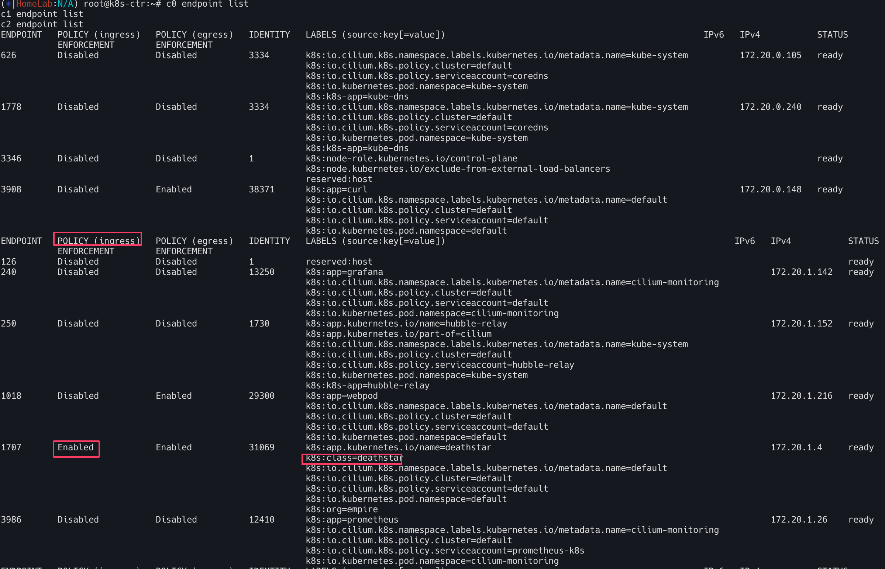

# Hubble 

허블은 Cilium과 eBPF를 기반으로 한 분산형 네트워크 및 보안 관측 플랫폼이다. 서비스 간 통신과 동작, 네트워크 인프라에 대한 깊은 가시성을 낮은 오버헤드로 제공한다. 

## 주요 구성요소 및 작동방식
- `Hubble`(노드 수준) : 기본적으로 각 노드에 설치된 `Cilium Agent` 는 해당 노드의 트래픽만 관찰한다. 
- `Hubble Relay`(클러스터 수준) : 클러스터 전체 또는 여러 클러스터의 데이터를 집계하여 중앙에서 가시성을 제공하는 구성요소이다. 
- `Hubble UI` : Hubble Relay에 연결하여 데이터를 시각화 하는 웹 인터페이스이다. L3／L4부터 L7 수준의 서비스 의존성 맵과
 데이터 흐름을 자동으로 검색하고 필터링한다. 


# Hubble Client 설치  (리눅스 기준)

```bash 
HUBBLE_VERSION=$(curl -s https://raw.githubusercontent.com/cilium/hubble/master/stable.txt)
HUBBLE_ARCH=amd64
if [ "$(uname -m)" = "aarch64" ]; then HUBBLE_ARCH=arm64; fi
curl -L --fail --remote-name-all https://github.com/cilium/hubble/releases/download/$HUBBLE_VERSION/hubble-linux-${HUBBLE_ARCH}.tar.gz{,.sha256sum}
sudo tar xzvfC hubble-linux-${HUBBLE_ARCH}.tar.gz /usr/local/bin
which hubble
hubble status
```

# Hubble API Access 검증

`Hubble API`에 접근하기 위해서는 로컬 머신에서 `Hubble service`를 포트포워딩 해야한다. 

이는 Hubble Client의 4245 포트로 접속하는 것과 클러스터 내의 Hubble Relay service에 접근하는 것을 허용해준다.

```bash
cilium hubble port-forward&

ss -tnlp | grep 4245

# Now you can validate that you can access the Hubble API via the installed CLI
hubble status
Healthcheck (via localhost:4245): Ok
Current/Max Flows: 12,285/12,285 (100.00%)
Flows/s: 41.20

# hubble (api) server 기본 접속 주소 확인
hubble config view 
...
port-forward-port: "4245"
server: localhost:4245
...

# (옵션) 현재 k8s-ctr 가상머신이 아닌, 자신의 PC에 kubeconfig 설정 후 아래 --server 옵션을 통해 hubble api server 사용해보자!
hubble help status | grep 'server string'
      --server string                 Address of a Hubble server. Ignored when --input-file or --port-forward is provided. (default "localhost:4245")

# You can also query the flow API and look for flows
kubectl get ciliumendpoints.cilium.io -n kube-system # SECURITY IDENTITY
hubble observe
hubble observe -h
hubble observe -f
```

# Hubble/UI 데모

## 배포
아래와 같이 데모 어플리케이션을 배포하자. 

- `deathstar`(Web Service 80 port, 2 Pod), `tiefighter`,`xwing` 애플리케이션


```bash
kubectl apply -f https://raw.githubusercontent.com/cilium/cilium/1.17.6/examples/minikube/http-sw-app.yaml
kubectl get pod --show-labels
kubectl get deploy,svc,ep deathstar
kubectl get ciliumidentities.cilium.io
kubectl exec -it -n kube-system ds/cilium -c cilium-agent -- cilium endpoint list
kubectl exec -it $CILIUMPOD0 -n kube-system -c cilium-agent -- cilium endpoint list
kubectl exec -it $CILIUMPOD1 -n kube-system -c cilium-agent -- cilium endpoint list
kubectl exec -it $CILIUMPOD2 -n kube-system -c cilium-agent -- cilium endpoint list
```


## 현재 접근상태 확인

deathstar에서의 관점은 

허가 
- `org=empire` 의 `label`

하지만 아직 정책을 수행하지 않으므로 `Xwing`, `tiefighter` 모두 요청 가능

이제 이를 테스트해보자. 


```bash
# 아래 출력에서 xwing 와 tiefighter 의 IDENTITY 메모
c1 endpoint list | grep -iE 'xwing|tiefighter|deathstar'
c2 endpoint list | grep -iE 'xwing|tiefighter|deathstar'
XWINGID=7526
TIEFIGHTERID=56716
DEATHSTARID=2454

# 모니터링 준비 : 터미널 3개, 단축키 설정
## 각각 monitor 확인
c0 monitor -v -v
c1 monitor -v -v
c2 monitor -v -v

# 모니터링 준비 : 터미널 1개
hubble observe -f

XWINGID=50633
TIEFIGHTERID=19274
DEATHSTARID=318

hubble observe -f --from-identity $XWINGID
hubble observe -f --protocol udp --from-identity $XWINGID
hubble observe -f --protocol tcp --from-identity $XWINGID

hubble observe -f --protocol tcp --from-identity $DEATHSTARID


# 호출 시도 1
kubectl exec xwing -- curl -s -XPOST deathstar.default.svc.cluster.local/v1/request-landing
while true; do kubectl exec xwing -- curl -s -XPOST deathstar.default.svc.cluster.local/v1/request-landing ; sleep 5 ; done


# 호출 시도 2
kubectl exec tiefighter -- curl -s -XPOST deathstar.default.svc.cluster.local/v1/request-landing
while true; do kubectl exec tiefighter -- curl -s -XPOST deathstar.default.svc.cluster.local/v1/request-landing ; sleep 5 ; done

## 모니터링
hubble observe -f --protocol tcp --from-identity $TIEFIGHTERID
hubble observe -f --protocol tcp --from-identity $DEATHSTARID
```


아래 정책은 TCP 포트 80에서 레이블(org=empire)이 있는 모든 팟에서 레이블(org=empire, class=deathstar)이 있는 데스스타 팟으로 전송되는 트래픽을 화이트리스트로 작성

```bash
apiVersion: "cilium.io/v2"
kind: CiliumNetworkPolicy
metadata:
  name: "rule1"
spec:
  description: "L3-L4 policy to restrict deathstar access to empire ships only"
  endpointSelector:
    matchLabels:
      org: empire
      class: deathstar
  ingress:
  - fromEndpoints:
    - matchLabels:
        org: empire
    toPorts:
    - ports:
      - port: "80"
        protocol: TCP
```

## 정책 검사

```bash
# deathstar 에 ingress 에 policy 활성화 확인
c0 endpoint list
c1 endpoint list
c2 endpoint list
```



## 테스트 HTTP


tiefighter, xwing에게 deathstar API에 대한 전체 액세스 권한을 부여하거나 완전 액세스 권한을 부여하지 않는 것으로 충분 할 수도 있지만
마이크로서비스 간에 가장 강력한 보안(최소 권한 격리 강제)을 제공하기 위해서는 API를 호출하는 각 서비스가 합법적인 운영에 필요한 HTTP 요청 세트만 수행하도록 제한해야함

`deathstar` service가 임의의 제국 선박이 호출해서는 안 되는 일부 유지보수 API를 노출한다고 가정


```bash
# 호출해서는 안 되는 일부 유지보수 API를 노출
kubectl exec tiefighter -- curl -s -XPUT deathstar.default.svc.cluster.local/v1/exhaust-port
```

기존 `CiliumNetworkPolicy` 업데이트 

```yaml
# 기존 rule1 정책을 업데이트 해서 사용
apiVersion: "cilium.io/v2"
kind: CiliumNetworkPolicy
metadata:
  name: "rule1"
spec:
  description: "L7 policy to restrict access to specific HTTP call"
  endpointSelector:
    matchLabels:
      org: empire
      class: deathstar
  ingress:
  - fromEndpoints:
    - matchLabels:
        org: empire
    toPorts:
    - ports:
      - port: "80"
        protocol: TCP
      rules:
        http:
        - method: "POST"
          path: "/v1/request-landing"
```

`/v1/request-landing` API는 성공


`/v1/exhaust-port`  API는 실패

# Layer 7 Protocol Visibility  
Monitoring Datapath State는 datapath state에 대한 성찰을 제공하지만, 기본적으로 L3/L4 패킷 이벤트에 대한 가시성만 제공한다. 따라서 L7 프로토콜 가시성을 원한다면 L7 Cilium Network Policies 을 사용해야한다. 실제 L7동작처리는
`cilium-envoy` 데몬셋이 담당한다. 
(L7 네트워크 정책은 가시성을 가능하게 할 뿐만 아니라 파드의 인아웃 트래픽을 제한한다는 점이 중요!)


# L7 네트워크 정책 (가시성) 생성 및 확인

L7정책 가시성을 확인하기 위해 또 다른 터미널에서 반복접속을 시행해 두자.  
```bash
kubectl exec -it curl-pod -- sh -c 'while true; do curl -s webpod | grep Hostname; sleep 1; done'
```

`CiliumNetworkPolicy` 리소스 확인한다. 
아래와 같이 `rules: http:[{}]`를 통해 모든 HTTP요청을 허용 및 L7에대한 가시성을 활성화한다. 
```bash
cat <<EOF | kubectl apply -f -
apiVersion: "cilium.io/v2"
kind: CiliumNetworkPolicy
metadata:
  name: "l7-visibility"
spec:
  endpointSelector:
    matchLabels:
      "k8s:io.kubernetes.pod.namespace": default  # default 네임스페이스 안의 모든 Pod에 대해 egress 정책이 적용
  egress:
  - toPorts:
    - ports:
      - port: "53"
        protocol: ANY  # TCP, UDP 둘 다 허용
      rules:
        dns:
        - matchPattern: "*"  # 모든 도메인 조회 허용, L7 가시성 활성화
  - toEndpoints:
    - matchLabels:
        "k8s:io.kubernetes.pod.namespace": default
    toPorts:
    - ports:
      - port: "80"  # default 다른 파드의 HTTP TCP 80 요청 허용
        protocol: TCP
      - port: "8080"  # default 다른 파드의 HTTP TCP 8080 요청 허용
        protocol: TCP
      rules:
        http: [{}]  # 모든 HTTP 요청을 허용, L7 가시성 활성화
EOF
```

정책 적용 후 호출 확인(실제 L7 정책처리는 envoy가 한다.)
```bash
kubectl exec -it curl-pod -- curl -s webpod
```


가시성 확인
```bash
hubble observe -f -t l7 -o compact
```


프로메테우스 `rate(hubble_http_requests_total[5m])` 확인


## 민감정보 출력상태
민감정보(`user_id`)를 포함한 curl요청 시도한다.

`kubectl exec -it curl-pod -- sh -c 'curl -s webpod/?user_id=1234'`

user_id가 그대로 보이는 것을 확인할 수 있다.

`hubble observe -f -t l7`


보안을 강화하기 위해 Cilium은 Hubble이 L7 흐름에 존재하는 민감한 정보를 마스킹 할 수 있도록 `--hubble-redact-enabled`옵션을 제공한다. 민감정보 미출력 설정을 시도해보자. 

```bash
helm upgrade cilium cilium/cilium --namespace kube-system --reuse-values \
  --set extraArgs="{--hubble-redact-enabled,--hubble-redact-http-urlquery}"
```

이제는 user_id가 보이지않는다


`-hubble-redact-kafka-apikey` : Kafka 프로토콜 통신에서 사용되는 민감한 API 키 정보를 관찰 데이터에서 제거

HTTP 헤더는 두 가지 방식 중 하나를 선택하여 민감한 정보를 제거
- 허용목록 방식 : `-hubble-redact-kafka-apikey`
- 거부목록 방식 : `-hubble-redact-http-headers-deny`
