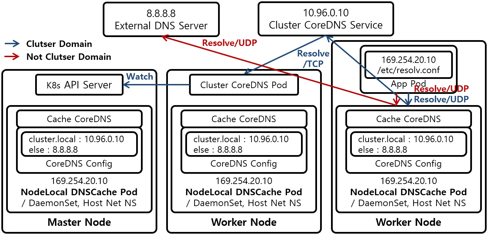

# IPAM
IPAM이란? IP Address Management) 네트워크 엔드포인트(컨테이너 등)에 대한 IP할당과 관리

```bash
kubectl cluster-info dump | grep -m 2 -E "cluster-cidr|service-cluster-ip-range"
cilium config view | grep ^ipam
kubectl get nodes -o jsonpath='{range .items[*]}{.metadata.name}{"\t"}{.spec.podCIDR}{"\n"}{end}'
kc describe pod -n kube-system kube-controller-manager-k8s-ctr
kubectl get ciliumnode -o json | grep podCIDRs -A2
kubectl get ciliumendpoints.cilium.io -A

```

샘플 애플리케이션 배포 
```bash
cat << EOF | kubectl apply -f -
apiVersion: apps/v1
kind: Deployment
metadata:
  name: webpod
spec:
  replicas: 2
  selector:
    matchLabels:
      app: webpod
  template:
    metadata:
      labels:
        app: webpod
    spec:
      affinity:
        podAntiAffinity:
          requiredDuringSchedulingIgnoredDuringExecution:
          - labelSelector:
              matchExpressions:
              - key: app
                operator: In
                values:
                - sample-app
            topologyKey: "kubernetes.io/hostname"
      containers:
      - name: webpod
        image: traefik/whoami
        ports:
        - containerPort: 80
---
apiVersion: v1
kind: Service
metadata:
  name: webpod
  labels:
    app: webpod
spec:
  selector:
    app: webpod
  ports:
  - protocol: TCP
    port: 80
    targetPort: 80
  type: ClusterIP
EOF


# k8s-ctr 노드에 curl-pod 파드 배포
cat <<EOF | kubectl apply -f -
apiVersion: v1
kind: Pod
metadata:
  name: curl-pod
  labels:
    app: curl
spec:
  nodeName: k8s-ctr
  containers:
  - name: curl
    image: nicolaka/netshoot
    command: ["tail"]
    args: ["-f", "/dev/null"]
  terminationGracePeriodSeconds: 0
EOF
```

확인
```bash
# 배포 확인
kubectl get deploy,svc,ep webpod -owide
kubectl get endpointslices -l app=webpod
kubectl get ciliumendpoints # IP 확인
kubectl exec -it -n kube-system ds/cilium -c cilium-agent -- cilium-dbg endpoint list

# 통신 확인
kubectl exec -it curl-pod -- curl webpod | grep Hostname
kubectl exec -it curl-pod -- sh -c 'while true; do curl -s webpod | grep Hostname; sleep 1; done'

```

허블확인
```bash
# hubble ui 웹 접속 주소 확인 : default 네임스페이스 확인
NODEIP=$(ip -4 addr show eth1 | grep -oP '(?<=inet\s)\d+(\.\d+){3}')
echo -e "http://$NODEIP:30003"

# hubble relay 포트 포워딩 실행
cilium hubble port-forward&
hubble status


# flow log 모니터링
hubble observe -f --protocol tcp --to-pod curl-pod
hubble observe -f --protocol tcp --from-pod curl-pod
hubble observe -f --protocol tcp --pod curl-pod
l 26 08:15:33.840: default/curl-pod (ID:37934) <> 10.96.88.194:80 (world) pre-xlate-fwd TRACED (TCP)
Jul 26 08:15:33.840: default/curl-pod (ID:37934) <> default/webpod-697b545f57-2h59t:80 (ID:23913) post-xlate-fwd TRANSLATED (TCP)
Jul 26 08:15:33.840: default/curl-pod:53092 (ID:37934) -> default/webpod-697b545f57-2h59t:80 (ID:23913) to-network FORWARDED (TCP Flags: SYN)
Jul 26 08:15:33.841: default/curl-pod:53092 (ID:37934) <- default/webpod-697b545f57-2h59t:80 (ID:23913) to-endpoint FORWARDED (TCP Flags: SYN, ACK)
pre-xlate-fwd , TRACED : NAT (IP 변환) 전 , 추적 중인 flow
post-xlate-fwd , TRANSLATED : NAT 후의 흐름 , NAT 변환이 일어났음

# 호출 시도
kubectl exec -it curl-pod -- curl webpod | grep Hostname
kubectl exec -it curl-pod -- curl webpod | grep Hostname
혹은
kubectl exec -it curl-pod -- sh -c 'while true; do curl -s webpod | grep Hostname; sleep 1; done'


# tcpdump 확인 : 파드 IP 확인
tcpdump -i eth1 tcp port 80 -nn
17:23:25.920613 IP 10.244.0.144.39112 > 10.244.1.180.80: Flags [P.], seq 1:71, ack 1, win 502, options [nop,nop,TS val 3745105977 ecr 1971332111], length 70: HTTP: GET / HTTP/1.1

#
tcpdump -i eth1 tcp port 80 -w /tmp/http.pcap

#
termshark -r /tmp/http.pcap
```


# ROUTING

## 라우팅방식1: Encapsulation 

작동원리 : 클러스터 노드간의 모든 트래픽을 `VXLAN` 또는 `Geneve`와 같은 UDP 기반 프로토콜로 감싸서(캡슐화) 터널을 통해 전송한다.

네트워크 요구사항
- 가장 적은 요구사항을 가지며 기본 네트워크가 PodCIDR를 인식할 필요가 없다
- 노드들이 서로 IP/UDP 통신만 가능하면 됨
- 방화벽이 `VXLAN(UDP 8472)`, `Geneve(UDP 6081)`포트를 허용해야함

**장점**
- 단순성 : 복잡한 라우팅 설정이 필요하지않아 쉽게 클러스터를 구성
- 유연성 : 노드가 여러 라우팅 도메인에 걸쳐 있어도 동작
- 메타데이터전송 : Cilium은 캡슐화 헤더를 통해 소스보안 ID와 같은 메타데이터를 전송하여 성능을 최적화할 수 있음. 
  
**단점**
- MTU 오버헤드 : 캡슐화 헤더가 추가되어 유효 MTU가 감소하고 최대 처리량이 약간 낮아질 수 있음. 점보프레임을 사용하면 이 문제를 완화할 수있음

설정 : `tunnel-protocol`을 `vxlan`또는 `geneve`로 설정한다


## 라우팅방식2: Native-Routing

작동원리 : 캡슐화없이 기본 네트워크 라우팅 기능을 직접 활용하여 패킷을 전달. 로컬 엔드포인트가 아닌 트래픽은 리눅스 커널의 라우팅 시스템에 위임된다. 

네트워크 요구사항
- 기본 네트워크가 PodCIDR를 라우팅할 수 있어야한다. 

PodCIDR 라우팅 방안
- 모든 노드가 PodCIDR을 인지하는 방식: 각 노드가 다른 모든 노드의 PodCIDR 정보를 리눅스 커널라우팅 테이블에 직접 추가한다. 동일한 L2 네트워크에 있다면 `auto-direct-node-routes: true`로 설정해 자동으로 처리할 수 있다. 그렇지 않다면 BGP 데몬 같은 추가적인 시스템이 필요
- 클라우드 공급자 통합방식 : 노드는 PodCIDRE을 알지 못하지만 네트워크에 존재하는 라우터(예: 클라우드 제공자의 라우터)가 모든 Pod에 도달하는 방법을 알고 있는 방식. 

장점
- 성능 : 캡슐 오버헤드가 없어 패킷 처리량이 높다
- 네이티브 : 기본 네트워크 라우팅 기능을 최대한 활용

단점 
- 복잡성 : 기본 네트워크가 PodCIDR을 라우팅할 수 있도록 설정해야하므로, 네트워크 구성이 더 복잡해질 수 있다. 온프레미스 환경에서는 BGP와 같은 추가적 구성이 필요

설정 : `routing-mode: native`를 활성화하고 필요에 따라 `ipv4-native-routing-cidr` 및 `auto-direct-node-routes`를 설정

# Masquerading

 Cilium은 클러스터를 벗어나는 모든 트래픽의 소스 IP 주소를 노드의 IPv4 주소로 자동 마스커레이딩(변환)한다. (이는 노드의 IP 주소가 이미 네트워크에서 라우팅 가능하기 때문)

OFF시 : `enable-ipv4-masquerade: false` , `enable-ipv6-masquerade: false`

기본 동작은 로컬노드의 IP 할당 CIDR내에서 모든 목적지를 제외하는 것


## 구현 모드 (Implementation Modes)
Cilium은 마스커레이딩을 구현하기 위해 두 가지 모드를 제공한다.

### eBPF 기반 (eBPF-based)
- 특징: 가장 효율적인 구현 방식. (IPv4는 프로덕션 환경에 적합하고, IPv6는 베타 기능)

- 활성화: `bpf.masquerade=true` 헬름(Helm) 옵션으로 활성화할 수 있다.

- 의존성: 현재 BPF NodePort 기능에 의존

- 작동 방식: eBPF 마스커레이딩 프로그램이 실행되는 장치(디바이스)에서만 마스커레이딩이 수행된다.

- 기본적으로, BPF NodePort 장치 감지 메커니즘이 선택한 디바이스에 프로그램이 자동으로 연결된다.
  - `devices` 헬름 옵션을 사용하여 수동으로 변경할 수 있다.
  - `cilium status` 명령을 통해 어떤 디바이스에 프로그램이 실행 중인지 확인할 수 있다.

- 지원 프로토콜: TCP, UDP, ICMP(일부 메시지로 제한) 패킷을 마스커레이딩할 수 있다.

- 동작 규칙
  - `ipv4-native-routing-cidr` 범위 밖에 있는 목적지로 향하는 모든 팟 패킷은 마스커레이딩된다.
  - 클러스터 내 다른 노드로 향하는 패킷은 마스커레이딩되지 않음
  - eBPF 마스커레이딩이 활성화되면, 파드에서 클러스터 노드의 외부 IP로 향하는 트래픽도 마스커레이딩되지 않음. 이는 iptables 기반 구현과 다른 점임

- `ip-masq-agent`: 더 세밀한 제어를 위해 eBPF에서 `ip-masq-agent`를 구현하며, `ipMasqAgent.enabled=true` 옵션으로 활성화할 수 있다.
  - 에이전트는 `nonMasqueradeCIDRs` 설정 파일을 통해 마스커레이딩하지 않을 CIDR을 지정한다.
  - 설정 파일이 비어 있으면, `10.0.0.0/8`, `172.16.0.0/12` 등 일반적으로 사용되는 사설 IP 대역을 마스커레이딩하지 않는 CIDR로 자동 설정한다.
  - 설정 파일은 `ConfigMap`을 통해 구성할 수 있으며, 헬름 옵션으로도 직접 설정할 수 있다.


### iptables 기반 (iptables-based)

- 특징: 모든 커널 버전에서 작동하는 기존 구현 방식
- 작동 방식:
  - 기본적으로 Cilium 네트워크 장치가 아닌 모든 네트워크 장치에서 나가는 트래픽을 마스커레이딩한다.
  - `egress-masquerade-interfaces: eth0` 옵션을 사용하여 마스커레이딩을 수행할 네트워크 인터페이스를 제한할 수 있다. eth+와 같이 접두사로 여러 인터페이스를 지정할 수도 있다.
  - `enable-masquerade-to-route-source: true` 옵션을 사용하면, 라우팅 레이어가 선택한 소스 주소로 마스커레이딩한다.
  - `egress-masquerade-interfaces` 옵션을 함께 사용하여 마스커레이딩할 네트워크 인터페이스를 세밀하게 제어할 수 있다


## Masquerading 실습

현재 상태 확인
```bash
# 현재상태 확인
kubectl exec -it -n kube-system ds/cilium -c cilium-agent  -- cilium status | grep Masquerading

#
cilium config view  | grep ipv4-native-routing-cidr

# 통신 확인
kubectl exec -it curl-pod -- curl -s webpod | grep Hostname
kubectl exec -it curl-pod -- curl -s webpod | grep Hostname
```



**router eth1 192.168.10.200 통신 확인**
<br>

```bash
# 터미널 2개 사용
[k8s-ctr] tcpdump -i eth1 icmp -nn 혹은 hubble observe -f --pod curl-pod
[router] tcpdump -i eth1 icmp -nn

# router eth1 192.168.10.200 로 ping >> IP 확인해보자!
kubectl exec -it curl-pod -- ping 192.168.10.101
kubectl exec -it curl-pod -- ping 192.168.10.200
...

---
# 터미널 2개 사용
[k8s-ctr] tcpdump -i eth1 tcp port 80 -nnq 혹은 hubble observe -f --pod curl-pod
[router] tcpdump -i eth1 tcp port 80 -nnq

# router eth1 192.168.10.200 로 curl >> IP 확인해보자!
kubectl exec -it curl-pod -- curl -s webpod
kubectl exec -it curl-pod -- curl -s webpod
kubectl exec -it curl-pod -- curl -s 192.168.10.200
...
```

router loop1/2 통신 확인
```bash
# router
ip -br -c -4 addr
loop1            UNKNOWN        10.10.1.200/24
loop2            UNKNOWN        10.10.2.200/24
...

# k8s-ctr
ip -c route | grep static
10.10.0.0/16 via 192.168.10.200 dev eth1 proto static


# 터미널 2개 사용
[k8s-ctr] tcpdump -i eth1 tcp port 80 -nnq 혹은 hubble observe -f --pod curl-pod
[router] tcpdump -i eth1 tcp port 80 -nnq


# router eth1 192.168.10.200 로 curl >> IP 확인해보자!
kubectl exec -it curl-pod -- curl -s 10.10.1.200
kubectl exec -it curl-pod -- curl -s 10.10.2.200

```


# CoreDNS, NodeLocalDNS


