# IPAM
IPAM이란? IP Address Management) 네트워크 엔드포인트(컨테이너 등)에 대한 IP할당과 관리

```bash
kubectl cluster-info dump | grep -m 2 -E "cluster-cidr|service-cluster-ip-range"
cilium config view | grep ^ipam
kubectl get nodes -o jsonpath='{range .items[*]}{.metadata.name}{"\t"}{.spec.podCIDR}{"\n"}{end}'
kc describe pod -n kube-system kube-controller-manager-k8s-ctr
kubectl get ciliumnode -o json | grep podCIDRs -A2
kubectl get ciliumendpoints.cilium.io -A

```

쿠버네티스 호스트 범위 IPAM 모드는 `ipam:kubernetes`에서 활성화 된다. 클러스터의 각 개별 노드에 주소 할당을 위임함

IP는 쿠버네티스에 의해 각 노드에 연결된 `PodCIDR` 범위에서 할당된다. 이 모드에서는 Cilium 에이전트가`kubernetes v1.Node`객체를 통해 PodCIDR 범위가 다음 방법중 하나를 통해 활성화된 모든 주소 패밀리에대해
제공될 때까지 시작시 대기한다. 

```bash
# 클러스터 정보 확인
kubectl cluster-info dump | grep -m 2 -E "cluster-cidr|service-cluster-ip-range"
                            "--service-cluster-ip-range=10.96.0.0/16",
                            "--cluster-cidr=10.244.0.0/16",

# ipam 모드 확인
cilium config view | grep ^ipam
ipam                                              kubernetes

# 노드별 파드에 할당되는 IPAM(PodCIDR) 정보 확인
# --allocate-node-cidrs=true 로 설정된 kube-controller-manager에서 CIDR을 자동 할당함
kubectl get nodes -o jsonpath='{range .items[*]}{.metadata.name}{"\t"}{.spec.podCIDR}{"\n"}{end}'
k8s-ctr 10.244.0.0/24
k8s-w1  10.244.1.0/24

kc describe pod -n kube-system kube-controller-manager-k8s-ctr
...
    Command:
      kube-controller-manager
      --allocate-node-cidrs=true
      --cluster-cidr=10.244.0.0/16
      --service-cluster-ip-range=10.96.0.0/16
...

kubectl get ciliumnode -o json | grep podCIDRs -A2

# 파드 정보 : 상태, 파드 IP 확인
kubectl get ciliumendpoints.cilium.io -A
```

샘플 애플리케이션 배포 
```bash
cat << EOF | kubectl apply -f -
apiVersion: apps/v1
kind: Deployment
metadata:
  name: webpod
spec:
  replicas: 2
  selector:
    matchLabels:
      app: webpod
  template:
    metadata:
      labels:
        app: webpod
    spec:
      affinity:
        podAntiAffinity:
          requiredDuringSchedulingIgnoredDuringExecution:
          - labelSelector:
              matchExpressions:
              - key: app
                operator: In
                values:
                - sample-app
            topologyKey: "kubernetes.io/hostname"
      containers:
      - name: webpod
        image: traefik/whoami
        ports:
        - containerPort: 80
---
apiVersion: v1
kind: Service
metadata:
  name: webpod
  labels:
    app: webpod
spec:
  selector:
    app: webpod
  ports:
  - protocol: TCP
    port: 80
    targetPort: 80
  type: ClusterIP
EOF


# k8s-ctr 노드에 curl-pod 파드 배포
cat <<EOF | kubectl apply -f -
apiVersion: v1
kind: Pod
metadata:
  name: curl-pod
  labels:
    app: curl
spec:
  nodeName: k8s-ctr
  containers:
  - name: curl
    image: nicolaka/netshoot
    command: ["tail"]
    args: ["-f", "/dev/null"]
  terminationGracePeriodSeconds: 0
EOF
```

확인
```bash
# 배포 확인
kubectl get deploy,svc,ep webpod -owide
kubectl get endpointslices -l app=webpod
kubectl get ciliumendpoints # IP 확인
kubectl exec -it -n kube-system ds/cilium -c cilium-agent -- cilium-dbg endpoint list

# 통신 확인
kubectl exec -it curl-pod -- curl webpod | grep Hostname
kubectl exec -it curl-pod -- sh -c 'while true; do curl -s webpod | grep Hostname; sleep 1; done'

```

허블확인
```bash
# hubble ui 웹 접속 주소 확인 : default 네임스페이스 확인
NODEIP=$(ip -4 addr show eth1 | grep -oP '(?<=inet\s)\d+(\.\d+){3}')
echo -e "http://$NODEIP:30003"

# hubble relay 포트 포워딩 실행
cilium hubble port-forward&
hubble status


# flow log 모니터링
hubble observe -f --protocol tcp --to-pod curl-pod
hubble observe -f --protocol tcp --from-pod curl-pod
hubble observe -f --protocol tcp --pod curl-pod
l 26 08:15:33.840: default/curl-pod (ID:37934) <> 10.96.88.194:80 (world) pre-xlate-fwd TRACED (TCP)
Jul 26 08:15:33.840: default/curl-pod (ID:37934) <> default/webpod-697b545f57-2h59t:80 (ID:23913) post-xlate-fwd TRANSLATED (TCP)
Jul 26 08:15:33.840: default/curl-pod:53092 (ID:37934) -> default/webpod-697b545f57-2h59t:80 (ID:23913) to-network FORWARDED (TCP Flags: SYN)
Jul 26 08:15:33.841: default/curl-pod:53092 (ID:37934) <- default/webpod-697b545f57-2h59t:80 (ID:23913) to-endpoint FORWARDED (TCP Flags: SYN, ACK)
pre-xlate-fwd , TRACED : NAT (IP 변환) 전 , 추적 중인 flow
post-xlate-fwd , TRANSLATED : NAT 후의 흐름 , NAT 변환이 일어났음

# 호출 시도
kubectl exec -it curl-pod -- curl webpod | grep Hostname
kubectl exec -it curl-pod -- curl webpod | grep Hostname
혹은
kubectl exec -it curl-pod -- sh -c 'while true; do curl -s webpod | grep Hostname; sleep 1; done'


# tcpdump 확인 : 파드 IP 확인
tcpdump -i eth1 tcp port 80 -nn
17:23:25.920613 IP 10.244.0.144.39112 > 10.244.1.180.80: Flags [P.], seq 1:71, ack 1, win 502, options [nop,nop,TS val 3745105977 ecr 1971332111], length 70: HTTP: GET / HTTP/1.1

#
tcpdump -i eth1 tcp port 80 -w /tmp/http.pcap

#
termshark -r /tmp/http.pcap
```

## Cilium Cluster Scope & 마이그레이션 실습

노드별 PodCIDR 할당
- 클러스터 전체 IP 풀에서 각 노드에 PodCIDR을 나누어 할당함.
- 각 노드는 *호스트 범위 할당기(host-scope allocator)*를 사용하여 자체적으로 Pod IP를 관리함.

Kubernetes 기본 IPAM과의 유사점
-방식 자체는 Kubernetes의 호스트 범위 IPAM과 유사함.

차이점
- Kubernetes는 v1.Node 객체의 spec.PodCIDR 필드를 통해 CIDR을 할당.
- Cilium은 자체 CRD인 v2.CiliumNode 객체를 통해 PodCIDR을 할당 및 관리.
- 따라서 Cilium은 Kubernetes에 의존하지 않고 자체적으로 IPAM 수행 가능.

운영상의 장점
- Kubernetes의 PodCIDR 할당 기능을 꺼도 되고,
- 클러스터 외부에서 IP 풀을 더 유연하게 관리 가능.

서브넷 마스크 조건
- 최소 마스크 길이는 /30, 권장 마스크 길이는 /29 이상
- 서브넷당 2개 IP는 예약됨 (네트워크 및 브로드캐스트 주소)

기본 Pod CIDR
- 기본 클러스터 IP 풀은 10.0.0.0/8
- Helm 또는 Cilium 설정에서 `clusterPoolIPv4PodCIDRList` 항목으로 조정 가능

```bash
# 반복 요청 해두기
kubectl exec -it curl-pod -- sh -c 'while true; do curl -s webpod | grep Hostname; sleep 1; done'


# Cluster Scopre 로 설정 변경
helm upgrade cilium cilium/cilium --namespace kube-system --reuse-values \
--set ipam.mode="cluster-pool" --set ipam.operator.clusterPoolIPv4PodCIDRList={"172.20.0.0/16"} --set ipv4NativeRoutingCIDR=172.20.0.0/16

kubectl -n kube-system rollout restart deploy/cilium-operator # 오퍼레이터 재시작 필요
kubectl -n kube-system rollout restart ds/cilium


# 변경 확인
kubectl get nodes -o jsonpath='{range .items[*]}{.metadata.name}{"\t"}{.spec.podCIDR}{"\n"}{end}'
cilium config view | grep ^ipam
kubectl get ciliumnode -o json | grep podCIDRs -A2
kubectl get ciliumendpoints.cilium.io -A
```
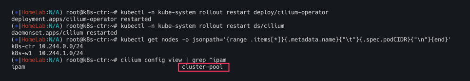
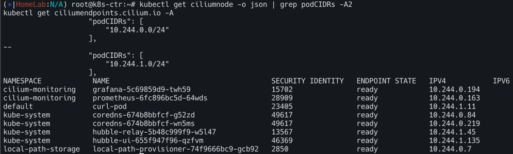

```bash
# 
kubectl delete ciliumnode k8s-w1
kubectl -n kube-system rollout restart ds/cilium
kubectl get ciliumnode -o json | grep podCIDRs -A2
kubectl get ciliumendpoints.cilium.io -A

#
kubectl delete ciliumnode k8s-ctr
kubectl -n kube-system rollout restart ds/cilium
kubectl get ciliumnode -o json | grep podCIDRs -A2
kubectl get ciliumendpoints.cilium.io -A # 파드 IP 변경 되는가?
```
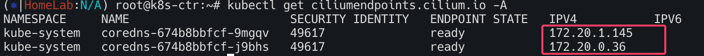

```bash
# 노드의 poccidr static routing 자동 변경 적용 확인
ip -c route
sshpass -p 'vagrant' ssh vagrant@k8s-w1 ip -c route


# 직접 rollout restart 하자! 
kubectl get pod -A -owide | grep 10.244.

kubectl -n kube-system rollout restart deploy/hubble-relay deploy/hubble-ui
kubectl -n cilium-monitoring rollout restart deploy/prometheus deploy/grafana
kubectl rollout restart deploy/webpod
kubectl delete pod curl-pod

#
cilium hubble port-forward&


# k8s-ctr 노드에 curl-pod 파드 배포
cat <<EOF | kubectl apply -f -
apiVersion: v1
kind: Pod
metadata:
  name: curl-pod
  labels:
    app: curl
spec:
  nodeName: k8s-ctr
  containers:
  - name: curl
    image: nicolaka/netshoot
    command: ["tail"]
    args: ["-f", "/dev/null"]
  terminationGracePeriodSeconds: 0
EOF

# 파드 IP 변경 확인!
kubectl get ciliumendpoints.cilium.io -A

# 반복 요청
kubectl exec -it curl-pod -- sh -c 'while true; do curl -s webpod | grep Hostname; sleep 1; done'
```
파드 IP 변경 확인!
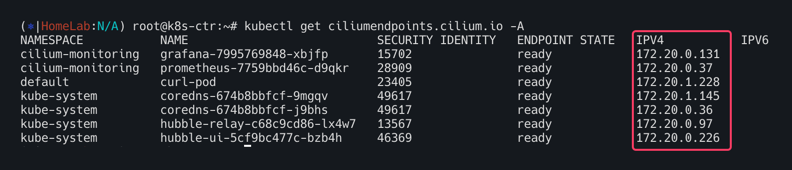

# ROUTING

## 라우팅방식1: Encapsulation 

작동원리 : 클러스터 노드간의 모든 트래픽을 `VXLAN` 또는 `Geneve`와 같은 UDP 기반 프로토콜로 감싸서(캡슐화) 터널을 통해 전송한다.

네트워크 요구사항
- 가장 적은 요구사항을 가지며 기본 네트워크가 PodCIDR를 인식할 필요가 없다
- 노드들이 서로 IP/UDP 통신만 가능하면 됨
- 방화벽이 `VXLAN(UDP 8472)`, `Geneve(UDP 6081)`포트를 허용해야함

**장점**
- 단순성 : 복잡한 라우팅 설정이 필요하지않아 쉽게 클러스터를 구성
- 유연성 : 노드가 여러 라우팅 도메인에 걸쳐 있어도 동작
- 메타데이터전송 : Cilium은 캡슐화 헤더를 통해 소스보안 ID와 같은 메타데이터를 전송하여 성능을 최적화할 수 있음. 
  
**단점**
- MTU 오버헤드 : 캡슐화 헤더가 추가되어 유효 MTU가 감소하고 최대 처리량이 약간 낮아질 수 있음. 점보프레임을 사용하면 이 문제를 완화할 수있음

설정 : `tunnel-protocol`을 `vxlan`또는 `geneve`로 설정한다


## 라우팅방식2: Native-Routing

작동원리 : 캡슐화없이 기본 네트워크 라우팅 기능을 직접 활용하여 패킷을 전달. 로컬 엔드포인트가 아닌 트래픽은 리눅스 커널의 라우팅 시스템에 위임된다. 

네트워크 요구사항
- 기본 네트워크가 PodCIDR를 라우팅할 수 있어야한다. 

PodCIDR 라우팅 방안
- 모든 노드가 PodCIDR을 인지하는 방식: 각 노드가 다른 모든 노드의 PodCIDR 정보를 리눅스 커널라우팅 테이블에 직접 추가한다. 동일한 L2 네트워크에 있다면 `auto-direct-node-routes: true`로 설정해 자동으로 처리할 수 있다. 그렇지 않다면 BGP 데몬 같은 추가적인 시스템이 필요
- 클라우드 공급자 통합방식 : 노드는 PodCIDRE을 알지 못하지만 네트워크에 존재하는 라우터(예: 클라우드 제공자의 라우터)가 모든 Pod에 도달하는 방법을 알고 있는 방식. 

장점
- 성능 : 캡슐 오버헤드가 없어 패킷 처리량이 높다
- 네이티브 : 기본 네트워크 라우팅 기능을 최대한 활용

단점 
- 복잡성 : 기본 네트워크가 PodCIDR을 라우팅할 수 있도록 설정해야하므로, 네트워크 구성이 더 복잡해질 수 있다. 온프레미스 환경에서는 BGP와 같은 추가적 구성이 필요

설정 : `routing-mode: native`를 활성화하고 필요에 따라 `ipv4-native-routing-cidr` 및 `auto-direct-node-routes`를 설정

# Masquerading

 Cilium은 클러스터를 벗어나는 모든 트래픽의 소스 IP 주소를 노드의 IPv4 주소로 자동 마스커레이딩(변환)한다. (이는 노드의 IP 주소가 이미 네트워크에서 라우팅 가능하기 때문)

OFF시 : `enable-ipv4-masquerade: false` , `enable-ipv6-masquerade: false`

기본 동작은 로컬노드의 IP 할당 CIDR내에서 모든 목적지를 제외하는 것


## 구현 모드 (Implementation Modes)
Cilium은 마스커레이딩을 구현하기 위해 두 가지 모드를 제공한다.

### eBPF 기반 (eBPF-based)
- 특징: 가장 효율적인 구현 방식. (IPv4는 프로덕션 환경에 적합하고, IPv6는 베타 기능)

- 활성화: `bpf.masquerade=true` 헬름(Helm) 옵션으로 활성화할 수 있다.

- 의존성: 현재 BPF NodePort 기능에 의존

- 작동 방식: eBPF 마스커레이딩 프로그램이 실행되는 장치(디바이스)에서만 마스커레이딩이 수행된다.

- 기본적으로, BPF NodePort 장치 감지 메커니즘이 선택한 디바이스에 프로그램이 자동으로 연결된다.
  - `devices` 헬름 옵션을 사용하여 수동으로 변경할 수 있다.
  - `cilium status` 명령을 통해 어떤 디바이스에 프로그램이 실행 중인지 확인할 수 있다.

- 지원 프로토콜: TCP, UDP, ICMP(일부 메시지로 제한) 패킷을 마스커레이딩할 수 있다.

- 동작 규칙
  - `ipv4-native-routing-cidr` 범위 밖에 있는 목적지로 향하는 모든 팟 패킷은 마스커레이딩된다.
  - 클러스터 내 다른 노드로 향하는 패킷은 마스커레이딩되지 않음
  - eBPF 마스커레이딩이 활성화되면, 파드에서 클러스터 노드의 외부 IP로 향하는 트래픽도 마스커레이딩되지 않음. 이는 iptables 기반 구현과 다른 점임

- `ip-masq-agent`: 더 세밀한 제어를 위해 eBPF에서 `ip-masq-agent`를 구현하며, `ipMasqAgent.enabled=true` 옵션으로 활성화할 수 있다.
  - 에이전트는 `nonMasqueradeCIDRs` 설정 파일을 통해 마스커레이딩하지 않을 CIDR을 지정한다.
  - 설정 파일이 비어 있으면, `10.0.0.0/8`, `172.16.0.0/12` 등 일반적으로 사용되는 사설 IP 대역을 마스커레이딩하지 않는 CIDR로 자동 설정한다.
  - 설정 파일은 `ConfigMap`을 통해 구성할 수 있으며, 헬름 옵션으로도 직접 설정할 수 있다.


### iptables 기반 (iptables-based)

- 특징: 모든 커널 버전에서 작동하는 기존 구현 방식
- 작동 방식:
  - 기본적으로 Cilium 네트워크 장치가 아닌 모든 네트워크 장치에서 나가는 트래픽을 마스커레이딩한다.
  - `egress-masquerade-interfaces: eth0` 옵션을 사용하여 마스커레이딩을 수행할 네트워크 인터페이스를 제한할 수 있다. eth+와 같이 접두사로 여러 인터페이스를 지정할 수도 있다.
  - `enable-masquerade-to-route-source: true` 옵션을 사용하면, 라우팅 레이어가 선택한 소스 주소로 마스커레이딩한다.
  - `egress-masquerade-interfaces` 옵션을 함께 사용하여 마스커레이딩할 네트워크 인터페이스를 세밀하게 제어할 수 있다


## Masquerading 실습

현재 상태 확인
```bash
# 현재상태 확인
kubectl exec -it -n kube-system ds/cilium -c cilium-agent  -- cilium status | grep Masquerading

#
cilium config view  | grep ipv4-native-routing-cidr

# 통신 확인
kubectl exec -it curl-pod -- curl -s webpod | grep Hostname
kubectl exec -it curl-pod -- curl -s webpod | grep Hostname
```

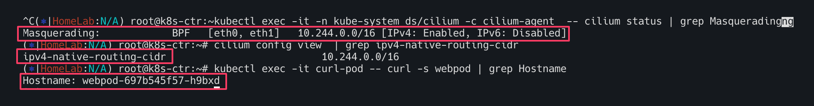

**router eth1 192.168.10.200 통신 확인**
<br>

```bash
# 터미널 2개 사용
[k8s-ctr] tcpdump -i eth1 icmp -nn 혹은 hubble observe -f --pod curl-pod
[router] tcpdump -i eth1 icmp -nn

# router eth1 192.168.10.200 로 ping >> IP 확인해보자!
kubectl exec -it curl-pod -- ping 192.168.10.101
kubectl exec -it curl-pod -- ping 192.168.10.200
...

---
# 터미널 2개 사용
[k8s-ctr] tcpdump -i eth1 tcp port 80 -nnq 혹은 hubble observe -f --pod curl-pod
[router] tcpdump -i eth1 tcp port 80 -nnq

# router eth1 192.168.10.200 로 curl >> IP 확인해보자!
kubectl exec -it curl-pod -- curl -s webpod
kubectl exec -it curl-pod -- curl -s webpod
kubectl exec -it curl-pod -- curl -s 192.168.10.200
...
```

router loop1/2 통신 확인
```bash
# router
ip -br -c -4 addr
loop1            UNKNOWN        10.10.1.200/24
loop2            UNKNOWN        10.10.2.200/24
...

# k8s-ctr
ip -c route | grep static
10.10.0.0/16 via 192.168.10.200 dev eth1 proto static


# 터미널 2개 사용
[k8s-ctr] tcpdump -i eth1 tcp port 80 -nnq 혹은 hubble observe -f --pod curl-pod
[router] tcpdump -i eth1 tcp port 80 -nnq


# router eth1 192.168.10.200 로 curl >> IP 확인해보자!
kubectl exec -it curl-pod -- curl -s 10.10.1.200
kubectl exec -it curl-pod -- curl -s 10.10.2.200
```

## ip-masq-agent 설정

`ip-msq-agent` 목적
- Pod에서 나가는 패킷에 SNAT(Masquerade)를 적용할지 말지를 제어한다.
- `nonMasqueradeCIDRs`에 포함된 대역은 마스커레이딩 없이 그대로 전달된다.
- 이는 사설망, DMZ, 로컬 라우터 등 NAT 없는 환경에 필수적이다

Helm으로 적용
```bash
helm upgrade cilium cilium/cilium \
  --namespace kube-system \
  --reuse-values \
  --set ipMasqAgent.enabled=true \
  --set ipMasqAgent.config.nonMasqueradeCIDRs='{10.10.1.0/24,10.10.2.0/24}'
```
파드가 `10.10.1.0/24` 또는 `10.10.2.0/24`로 나갈 때 SNAT 없이 직접 전달됨.

설정 적용확인
```bash
kubectl get cm -n kube-system ip-masq-agent -o yaml | yq
kc describe cm -n kube-system ip-masq-agent
cilium config view | grep -i ip-masq
kubectl exec -n kube-system ds/cilium -c cilium-agent -- cilium-dbg bpf ipmasq list 
```

모니터링 준비
```bash
[k8s-ctr] tcpdump -i eth1 tcp port 80 -nnq 혹은 hubble observe -f --pod curl-pod
[router] tcpdump -i eth1 tcp port 80 -nnq
```


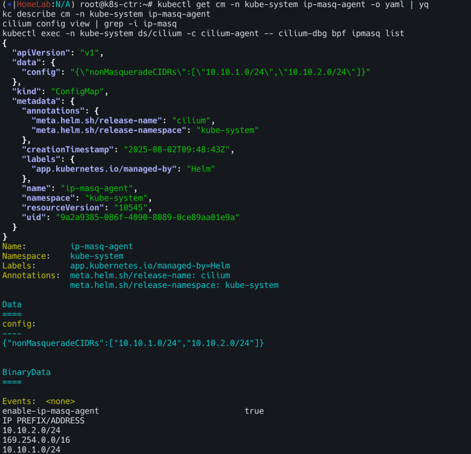


routehr eth1 192.168.10.200로 curl 
`kubectl exec -it curl-pod -- curl -s 10.10.1.200`
`kubectl exec -it curl-pod -- curl -s 10.10.2.200`

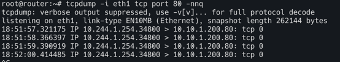

k8s-ctr : 노드의 PodCIDR 미리 확인
```bash
kubectl get ciliumnode -o json
```
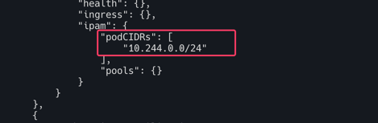

router 에 static route 설정 : 아래 노드별 PodCIDR에 대한 static routing 설정
```bash
ip route add 172.20.1.0/24 via 192.168.10.100
ip route add 172.20.0.0/24 via 192.168.10.101
ip -c route | grep 172.20
```
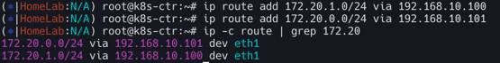

router eth1 192.168.10.200 로 curl >> IP 확인
```bash
kubectl exec -it curl-pod -- curl -s 10.10.1.200
kubectl exec -it curl-pod -- curl -s 10.10.2.200
```
# CoreDNS, NodeLocalDNS
## CoreDNS
CoreDNS 정의 - [Link](https://kubernetes.io/ko/docs/tasks/administer-cluster/dns-custom-nameservers/)

파드 DNS 설정 정보 확인하기
```bash
# 파드의 DNS 설정 정보 확인
kubectl exec -it curl-pod -- cat /etc/resolv.conf

#
cat /var/lib/kubelet/config.yaml | grep cluster -A1

#
kubectl get svc,ep -n kube-system kube-dns

kubectl get pod -n kube-system -l k8s-app=kube-dns

#
kc describe pod -n kube-system -l k8s-app=kube-dns


kc describe cm -n kube-system coredns
...
Corefile:
----
.:53 {              # 모든 도메인 요청을 53포트에서 수신
    errors          # DNS 응답 중 에러가 발생할 경우 로그 출력
    health {        # health 엔드포인트를 제공하여 상태 확인 가능
       lameduck 5s  # 종료 시 5초간 lameduck 모드로 트래픽을 점차 줄이며 종료
    }
    ready           # ready 엔드포인트 제공, 8181 포트의 HTTP 엔드포인트가, 모든 플러그인이 준비되었다는 신호를 보내면 200 OK 를 반환
    kubernetes cluster.local in-addr.arpa ip6.arpa {    # Kubernetes DNS 플러그인 설정(클러스터 내부 도메인 처리), cluster.local: 클러스터 도메인
       pods insecure                         # 파드 IP로 DNS 조회 허용 (보안 없음)
       fallthrough in-addr.arpa ip6.arpa     #  해당 도메인에서 결과 없으면 다음 플러그인으로 전달
       ttl 30                                #  캐시 타임 (30초)
    }
    prometheus :9153 # Prometheus metrics 수집 가능
    forward . /etc/resolv.conf {             # CoreDNS가 모르는 도메인은 지정된 업스트림(보통 외부 DNS)으로 전달, .: 모든 쿼리
       max_concurrent 1000                   # 병렬 포워딩 최대 1000개
    }
    cache 30 {                        # DNS 응답 캐시 기능, 기본 캐시 TTL 30초
       disable success cluster.local  # 성공 응답 캐시 안 함 (cluster.local 도메인)
       disable denial cluster.local   # NXDOMAIN 응답도 캐시 안 함
    } 
    loop         # 간단한 전달 루프(loop)를 감지하고, 루프가 발견되면 CoreDNS 프로세스를 중단(halt).
    reload       # Corefile 이 변경되었을 때 자동으로 재적용, 컨피그맵 설정을 변경한 후에 변경 사항이 적용되기 위하여 약 2분정도 소요.
    loadbalance  # 응답에 대하여 A, AAAA, MX 레코드의 순서를 무작위로 선정하는 라운드-로빈 DNS 로드밸런서.
}

#
cat /etc/resolv.conf
```
<br>

파드에서 DNS질의 확인

모니터링1

```bash
cilium hubble port-forward&
hubble observe -f --port 53
hubble observe -f --port 53 --protocol UDP
```

모니터링2

```bash
tcpdump -i any udp port 53 -nn
```

```bash
# 파드 IP 확인
kubectl get pod -owide
kubectl get pod -n kube-system -l k8s-app=kube-dns -owide

kubectl exec -it curl-pod -- cat /etc/resolv.conf

# 실습 편리를 위해 coredns 파드를 1개로 축소
kubectl scale deployment -n kube-system coredns --replicas 1
kubectl get pod -n kube-system -l k8s-app=kube-dns -owide

#
kubectl exec -it curl-pod -- curl kube-dns.kube-system.svc:9153/metrics | grep coredns_cache_ | grep -v ^#

# 도메인 질의
kubectl exec -it curl-pod -- nslookup webpod
kubectl exec -it curl-pod -- nslookup -debug webpod
kubectl exec -it curl-pod -- nslookup -debug google.com


# coredns 로깅, 디버깅 활성화
k9s → configmap → coredns 선택 → E(edit) → 아래처럼 log, debug 입력 후 빠져나오기
    .:53 {
        log
        debug
        errors

# 로그 모니터링 3
kubectl -n kube-system logs -l k8s-app=kube-dns -f


# 도메인 질의
kubectl exec -it curl-pod -- nslookup webpod
kubectl exec -it curl-pod -- nslookup google.com


# CoreDNS가 prometheus 플러그인을 사용하고 있다면, 메트릭 포트(:9153)를 통해 캐시 관련 정보를 수집.
## coredns_cache_entries 현재 캐시에 저장된 엔트리(항목) 수 : type: success 또는 denial (정상 응답 or NXDOMAIN 등)
## coredns_cache_hits_total	캐시 조회 성공 횟수
## coredns_cache_misses_total	캐시 미스 횟수
## coredns_cache_requests_total	캐시 관련 요청 횟수의 총합

kubectl exec -it curl-pod -- curl kube-dns.kube-system.svc:9153/metrics | grep coredns_cache_ | grep -v ^#
```


## NodeLocalDNS

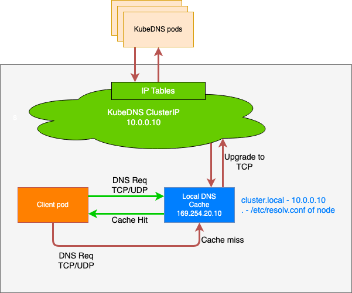
NodeLocal DNSCache는 쿠버네티스 클러스터의 DNS 성능을 향상시키기 위해 각 노드에 DNS 캐싱 에이전트를 DaemonSet 형태로 배포하는 솔루션이다. 에이전트는 해당 노드에서 실행되는 모든 파드(Pod)의 DNS 쿼리를 먼저 처리하여, 불필요한 네트워크 트래픽과 지연 시간을 줄이는 역할을 한다.

## NodeLocal DNSCache가 해결하는 문제 (기존　DNS 아키텍처의 단점)

기존 `ClusterFirst` 모드의 파드들이 DNS 쿼리를 처리하는 과정
- 파드는 DNS 쿼리를 위해 `kube-dns` 또는  `CoreDNS` 서비스의 클러스터IP로 요청을 보냄
- 이 요청은 `kube-proxy`가 추가한 iptables 규칙에 의해 `kube-dns/CoreDNS` 파드의 실제 엔드포인트로 변환(DNAT)
- 이 과정에서 iptables 규칙을 거치고 연결추적(conntrack) 테이블에 항목이 추가된다.

### NodeLocal DNSCache가 해결하는 문제 (기존 DNS 아키텍처의 단점)
- 불필요한 네트워크 트래픽 : DNS쿼리가 외부로 나가야할 수 도 있다. DNS 쿼리가 많은 파드가 로컬 `kube-dns`파드가 없는 노드에 있을 경우 다른 노드로 쿼리를 보내야하므로 지연시간이 증가한다.
- 연결 추적 오버헤드 : UDP 기반 DNS 쿼리는 `conntrack`테이블에 많은 임시 항목을 생성한다. UDP 항목은 타임아웃(기본값 30초)이 지나야 제거 되므로 테이블이 가득차면 연결 추적 레이스가 발생하거나 패킷이 드랍 될 수 있음
- 높은 지연시간 : 패킷 드랍이 발생하면 DNS 타임아웃으로 인해 응답이 오기까지 지연 될 수 있음

## NodeLocal DNSCache 작동 방식 및 장점

- 파드는 DNS 쿼리를 위해 동일 노드에서 실행되는 DNS 캐싱 에이전트로 요청을 보낸다
- 캐싱 에이전트는 먼저 자체 캐시를 확인하여 응답을 반환
- 캐시에 없는 경우(cache miss), 캐싱 에이전트가 `kube-dns` 서비스로 쿼리를 호출

### 장점
- 지연 시간 감소 : 파드가 로컬 캐싱 에이전트에 직접 접근하므로 `iptables DNAT` 규칙과 `conntrack` 오버헤드를 건너뛸 수 있다. `kube-dns`파드가 다른 노드에 있더라도 쿼리가 노드 내부에서 처리되므로 네트워크 왕복이 필요 없어진다.
- 안정성 향상 및 리소스 절약
  - UDP DNS 쿼리 트래픽이 캐싱 에이전트에서 `kube-dns`로 가는 과정에서 TCP 연결로 업그레이드됨.
  - TCP 연결은 종료될 때 `conntrack` 테이블에서 바로 제거되므로, UDP 항목이 테이블을 채우는 문제를 방지하고 conntrack 레이스를 줄인다
  - 이를 통해 UDP 패킷 손실로 인한 DNS 타임아웃과 지연 시간을 크게 줄일 수 있다.
- 네거티브 캐싱
  - NodeLocal DNSCache는 네거티브 캐싱(Negative Caching) 기능을 재활성화하여, 존재하지 않는 도메인에 대한 쿼리 결과도 캐시한다.
  - 이는 `kube-dns` 서비스에 대한 불필요한 쿼리 수를 줄여 `kube-dns`의 부하를 낮춤
- 가시성
  -  노드 수준에서 DNS 요청에 대한 메트릭과 가시성을 확보할 수 있어, 문제 해결에 용이하다.
- 애플리케이션 변경 불필요
  -  로컬 캐싱 에이전트가 UDP DNS 쿼리를 리스닝하기 때문에, 애플리케이션 코드를 변경할 필요가 없다.


### with iptables kube-proxy Mode


- 아키텍처 : 모든 노드에 DaemonSet으로 NodeLocal DNSCache 파드가 배포된다. 이 파드 안에는 캐시모드로 동작하는 CoreDNS가 있으며 이 CoreDNS는 호스트 네트워크 네임스페이스에서 동작한다.
- IP 주소 및 인터페이스 : NodeLocal DNSCache 파드는 `nodelocaldns`라는 더미 인터페이스를 생성하고 CordDNS Service의 ClustIP와 로컬주소를 이 인터페이스에 할당한다.
- DNS 쿼리처리 : 파드의 애플리케이션은 CoreDNS Service의 ClusterIP로 DNS 쿼리를 전송한다
- 트래픽 리다이렉션: iptable raw테이블에 `NOTRACK` 규칙이 적용되어, `10.96.0.10` 또는 `169.254.25.10`으로 향하는 패킷은 NAT를 우회하고 conntrack 추적대상에서 제외된다. 이로 인해 DNS 쿼리가 Cluster CoreDNS 대신 노드의 NodeLocal DNSCache파드로 바로전달된다

**장점**
- DNS 쿼리가 각 노드의 캐시 서버로 분산되어 네트워크 홉이 줄어든다
- `NOTRACK` 규칙 덕분에 conntrack 경합 상태로 인한 패킷 드랍현상을 피할수 있다.
- NodeLocal DNSCache 적용 여부를 자유롭게 변경할 수 있으며 파드를 재시작할 필요가 없다.

**단점**
- NodeLocal DNSCache 파드가 비정상적으로 종료되면 NOTRACK 규칙이 남아있어 DNS쿼리가 Cluster CoreDNS로 전달되지 않아 장애가 발생할 수 있다.

```bash
# Host Network Namespace에서 동작하며 CoreDNS Service의 ClusterIP인 10.96.0.10과,
# Local Address IP 중 하나인 169.254.25.10을 IP 주소로 갖는 nodelocaldns Dummy Interface를 생성한다.
ip -c addr show dev nodelocaldns
32: nodelocaldns: <BROADCAST,NOARP> mtu 1500 qdisc noop state DOWN group default 
    link/ether a6:45:bb:74:30:95 brd ff:ff:ff:ff:ff:ff
    inet 169.254.20.10/32 scope global nodelocaldns
       valid_lft forever preferred_lft forever
    inet 10.96.0.10/32 scope global nodelocaldns
       valid_lft forever preferred_lft forever

# dummy 인터페이스 생성 확인
ip -details link show dev nodelocaldns
32: nodelocaldns: <BROADCAST,NOARP> mtu 1500 qdisc noop state DOWN mode DEFAULT group default 
    link/ether a6:45:bb:74:30:95 brd ff:ff:ff:ff:ff:ff promiscuity 0  allmulti 0 minmtu 0 maxmtu 0 
    dummy addrgenmode eui64 numtxqueues 1 numrxqueues 1 gso_max_size 65536 gso_max_segs 65535 tso_max_size 65536 tso_max_segs 65535 gro_max_size 65536 

# Pod에서 CoreDNS Service의 ClusterIP인 10.96.0.10 IP 주소로 Domain Resolve 요청을 전송하여도,
# 요청이 Cluster CoreDNS Pod이 아닌, NodeLocal DNSCache Pod에게 전송되는 이유는 iptables raw Table을 확인하면 알 수 있다.
iptables -t raw -nvL
Chain PREROUTING (policy ACCEPT 0 packets, 0 bytes)
 pkts bytes target     prot opt in     out     source               destination         
    0     0 CT         17   --  *      *       0.0.0.0/0            10.96.0.10           udp dpt:53 /* NodeLocal DNS Cache: skip conntrack */ NOTRACK
    0     0 CT         6    --  *      *       0.0.0.0/0            10.96.0.10           tcp dpt:53 /* NodeLocal DNS Cache: skip conntrack */ NOTRACK
    0     0 CT         17   --  *      *       0.0.0.0/0            169.254.20.10        udp dpt:53 /* NodeLocal DNS Cache: skip conntrack */ NOTRACK
    0     0 CT         6    --  *      *       0.0.0.0/0            169.254.20.10        tcp dpt:53 /* NodeLocal DNS Cache: skip conntrack */ NOTRACK

Chain OUTPUT (policy ACCEPT 0 packets, 0 bytes)
 pkts bytes target     prot opt in     out     source               destination         
    0     0 CT         6    --  *      *       10.96.0.10           0.0.0.0/0            tcp spt:8080 /* NodeLocal DNS Cache: skip conntrack */ NOTRACK
    0     0 CT         6    --  *      *       0.0.0.0/0            10.96.0.10           tcp dpt:8080 /* NodeLocal DNS Cache: skip conntrack */ NOTRACK
    0     0 CT         17   --  *      *       0.0.0.0/0            10.96.0.10           udp dpt:53 /* NodeLocal DNS Cache: skip conntrack */ NOTRACK
    0     0 CT         6    --  *      *       0.0.0.0/0            10.96.0.10           tcp dpt:53 /* NodeLocal DNS Cache: skip conntrack */ NOTRACK
    0     0 CT         17   --  *      *       10.96.0.10           0.0.0.0/0            udp spt:53 /* NodeLocal DNS Cache: skip conntrack */ NOTRACK
    0     0 CT         6    --  *      *       10.96.0.10           0.0.0.0/0            tcp spt:53 /* NodeLocal DNS Cache: skip conntrack */ NOTRACK
 1776  148K CT         6    --  *      *       169.254.20.10        0.0.0.0/0            tcp spt:8080 /* NodeLocal DNS Cache: skip conntrack */ NOTRACK
 2594  185K CT         6    --  *      *       0.0.0.0/0            169.254.20.10        tcp dpt:8080 /* NodeLocal DNS Cache: skip conntrack */ NOTRACK
    0     0 CT         17   --  *      *       0.0.0.0/0            169.254.20.10        udp dpt:53 /* NodeLocal DNS Cache: skip conntrack */ NOTRACK
    0     0 CT         6    --  *      *       0.0.0.0/0            169.254.20.10        tcp dpt:53 /* NodeLocal DNS Cache: skip conntrack */ NOTRACK
    0     0 CT         17   --  *      *       169.254.20.10        0.0.0.0/0            udp spt:53 /* NodeLocal DNS Cache: skip conntrack */ NOTRACK
    0     0 CT         6    --  *      *       169.254.20.10        0.0.0.0/0            tcp spt:53 /* NodeLocal DNS Cache: skip conntrack */ NOTRACK

# iptables kube-proxy Mode일때는 Pod안의 App은 NodeLocal DNSCache 기법 적용 유무에 관계없이,
# 동일하게 10.96.0.10 IP 주소로 Domain Resolve 요청을 전송하면 된다 
# 파드 내의 DNS 서버 주소는 CoreDNS Service(ClusterIP)!
kubectl exec -it curl-pod -- cat /etc/resolv.conf
search default.svc.cluster.local svc.cluster.local cluster.local
nameserver 10.96.0.10 
options ndots:5
```


### with IPVS kube-proxy Mode
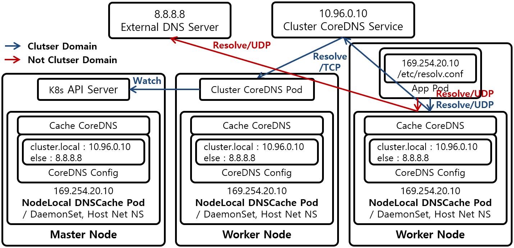

- 아키텍처: iptables 모드와 전반적인 아키텍처는 유사하지만, DNS 쿼리 처리 방식에 차이가 있다.
- IP 주소 및 인터페이스: nodelocaldns 더미 인터페이스에는 로컬 주소 IP(`169.254.25.10`)만 할당된다. CoreDNS Service의 ClusterIP(`10.96.0.10`)는 사용되지 않는다.
- DNS 쿼리 처리: 파드는 ClusterIP 대신 NodeLocal DNSCache의 로컬 주소 IP(`169.254.25.10`)로 DNS 쿼리를 보낸다.
- 트래픽 리다이렉션: IPVS는 `NOTRACK` 규칙을 무시하고 로드 밸런싱을 수행하기 때문에, ClusterIP를 사용하여 DNS 쿼리를 NodeLocal DNSCache 파드로 강제로 보낼 수 없다. 따라서 로컬 주소 IP를 직접 사용해야 한다.

장점: iptables 모드와 마찬가지로 DNS 성능 향상 및 conntrack 문제 해결이 가능하다.

단점: NodeLocal DNSCache 적용 여부를 변경하려면 kubelet의 DNS 서버 주소 설정을 변경하고 재시작해야 하며, 모든 파드도 재시작해야 하는 번거로움이 있다.

```bash
# 10.96.0.10 IP 주소는 이용되지 않기 때문에 nodelocaldns Dummy Interface에도 설정되지 않으며, 
# NodeLocal DNSCache Pod의 CoreDNS도 169.254.25.10 IP 주소로만 Listen 상태로 대기하며 Domain Resolve 요청을 대기한다.
# 10.96.0.10은 없고, 169.254.25.10 IP만 있다!
ip addr
...
16: nodelocaldns: <BROADCAST,NOARP> mtu 1500 qdisc noop state DOWN group default
    link/ether be:29:ca:e7:39:4b brd ff:ff:ff:ff:ff:ff
    inet 169.254.25.10/32 brd 169.254.25.10 scope global nodelocaldns
       valid-lft forever preferred-lft forever
...

# 
ip -details link show
...
16: nodelocaldns: <BROADCAST,NOARP> mtu 1500 qdisc noop state DOWN mode DEFAULT group default
    link/ether be:29:ca:e7:39:4b brd ff:ff:ff:ff:ff:ff promiscuity 0
    dummy addrgenmode eui64 numtxqueues 1 numrxqueues 1 gso-max-size 65536 gso-max-segs 6553
...

# raw Table에도 CoreDNS Service의 ClusterIP인 10.96.0.10 IP 주소는 설정되어 있지 않고, 
# Local Address IP인 169.254.25.10 IP 주소만 설정되어 있는걸 확인할 수 있다. 
# 169.254.25.10 IP 주소로 전송되는 Domain Resolve 요청 Packet이 Linux conntrack Race Condition에 의해서, 
# Drop되는 현상을 막기 위한 용도로 NOTRACK Rule이 설정되어 있다
iptables -t raw -nvL
Chain PREROUTING (policy ACCEPT 18166 packets, 75M bytes)
 pkts bytes target     prot opt in     out     source               destination
    0     0 CT         udp  --  *      *       0.0.0.0/0            169.254.25.10        udp dpt:53 NOTRACK
    0     0 CT         tcp  --  *      *       0.0.0.0/0            169.254.25.10        tcp dpt:53 NOTRACK
...
Chain OUTPUT (policy ACCEPT 9161 packets, 1478K bytes)
 pkts bytes target     prot opt in     out     source               destination
    0     0 CT         tcp  --  *      *       169.254.25.10        0.0.0.0/0            tcp spt:8080 NOTRACK
    0     0 CT         tcp  --  *      *       0.0.0.0/0            169.254.25.10        tcp dpt:8080 NOTRACK
    0     0 CT         udp  --  *      *       0.0.0.0/0            169.254.25.10        udp dpt:53 NOTRACK
    0     0 CT         tcp  --  *      *       0.0.0.0/0            169.254.25.10        tcp dpt:53 NOTRACK
    0     0 CT         udp  --  *      *       169.254.25.10        0.0.0.0/0            udp spt:53 NOTRACK
    0     0 CT         tcp  --  *      *       169.254.25.10        0.0.0.0/0            tcp spt:53 NOTRACK
...
```

### NodeLocal DNS Cache 설치
```bash
# iptables 확인
iptables-save | tee before.txt

#
wget https://github.com/kubernetes/kubernetes/raw/master/cluster/addons/dns/nodelocaldns/nodelocaldns.yaml

# kubedns 는 coredns 서비스의 ClusterIP를 변수 지정
kubedns=`kubectl get svc kube-dns -n kube-system -o jsonpath={.spec.clusterIP}`
domain='cluster.local'    ## default 값
localdns='169.254.20.10'  ## default 값
echo $kubedns $domain $localdns

# iptables 모드 사용 중으로 아래 명령어 수행
sed -i "s/__PILLAR__LOCAL__DNS__/$localdns/g; s/__PILLAR__DNS__DOMAIN__/$domain/g; s/__PILLAR__DNS__SERVER__/$kubedns/g" nodelocaldns.yaml

# nodelocaldns 설치
kubectl apply -f nodelocaldns.yaml

#
kubectl get pod -n kube-system -l k8s-app=node-local-dns -owide

#
kubectl edit cm -n kube-system node-local-dns # 'cluster.local' 과 '.:53' 에 log, debug 추가
kubectl -n kube-system rollout restart ds node-local-dns

kubectl describe cm -n kube-system node-local-dns
...
cluster.local:53 {
    errors
    cache {
            success 9984 30
            denial 9984 5
    }
    reload
    loop
    bind 169.254.20.10 10.96.0.10
    forward . __PILLAR__CLUSTER__DNS__ {
            force_tcp
    }
    prometheus :9253
    health 169.254.20.10:8080
    }
    ...
.:53 {
    errors
    cache 30
    reload
    loop
    bind 169.254.20.10 10.96.0.10
    forward . __PILLAR__UPSTREAM__SERVERS__
    prometheus :9253
    }
...

# iptables 확인 : 규칙 업데이트까지 다소 시간 소요!
iptables-save | tee after.txt
diff before.txt after.txt
```

--------------------------------------------
NodeLocal DNSCache 설치 전후의 iptables 설정 변화 분석

```bash
# PREROUTING 규칙 추가
-A PREROUTING -d 10.96.0.10/32 -p udp --dport 53 -j NOTRACK
-A PREROUTING -d 10.96.0.10/32 -p tcp --dport 53 -j NOTRACK
-A PREROUTING -d 169.254.20.10/32 -p udp --dport 53 -j NOTRACK
-A PREROUTING -d 169.254.20.10/32 -p tcp --dport 53 -j NOTRACK
```
목적: DNS 요청을 conntrack 없이 빠르게 처리 (성능 개선)

대상: CoreDNS 서비스 IP(10.96.0.10) 및 NodeLocal DNS IP(169.254.20.10)


```bash
# INPUT 체인에 허용 규칙 추가
-A INPUT -d 10.96.0.10/32 -p udp --dport 53 -j ACCEPT
-A INPUT -d 10.96.0.10/32 -p tcp --dport 53 -j ACCEPT
-A INPUT -d 169.254.20.10/32 -p udp --dport 53 -j ACCEPT
-A INPUT -d 169.254.20.10/32 -p tcp --dport 53 -j ACCEPT
```
목적: DNS 질의 요청을 해당 포트에서 수신 허용

두 IP에 대해 UDP/TCP 53 포트 모두 허용

```bash
# OUTPUT 체인에 허용 및 NOTRACK 규칙 추가
-A OUTPUT -d ... --dport 53 -j NOTRACK
-A OUTPUT -s ... --sport 53 -j NOTRACK
...
-A OUTPUT -d ... --dport 53 -j ACCEPT
-A OUTPUT -s ... --sport 53 -j ACCEPT
```
DNS 응답 트래픽에 대해 conntrack 건너뛰기

해당 트래픽 명시적으로 허용 (ACCEPT)


```bash
#Health Check 포트 허용
-A OUTPUT -s 169.254.20.10/32 -p tcp --sport 8080 -j NOTRACK
-A OUTPUT -d 169.254.20.10/32 -p tcp --dport 8080 -j NOTRACK
```

----------------------------------
확인
```bash
##
iptables -t filter -S | grep -i dns

##
iptables -t raw -S | grep -i dns

# logs : 
kubectl -n kube-system logs -l k8s-app=kube-dns -f
kubectl -n kube-system logs -l k8s-app=node-local-dns -f

# 테스트용 curl Pod 생성 및 DNS 확인
kubectl exec -it curl-pod -- cat /etc/resolv.conf

# 169.254.20.10이 nameserver로 잡혀 있어야 정상
kubectl exec -it curl-pod -- nslookup webpod
kubectl exec -it curl-pod -- nslookup google.com

#curl Pod 재생성
kubectl delete pod curl-pod

cat << EOF | kubectl apply -f -
apiVersion: v1
kind: Pod
metadata:
  name: curl-pod
  labels:
    app: curl
spec:
  containers:
  - name: curl
    image: nicolaka/netshoot
    command: ["tail"]
    args: ["-f", "/dev/null"]
  terminationGracePeriodSeconds: 0
EOF

kubectl exec -it curl-pod -- cat /etc/resolv.conf

# 로그 확인 시 현재 nodelocaldns 미활용
kubectl -n kube-system logs -l k8s-app=kube-dns -f
kubectl -n kube-system logs -l k8s-app=node-local-dns -f

#
kubectl exec -it curl-pod -- nslookup webpod
kubectl exec -it curl-pod -- nslookup google.com
```


