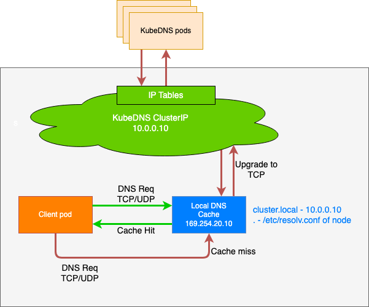

# CoreDNS, NodeLocalDNS

## CordeDNS 기본
CoreDNS 정의 - [Link](https://kubernetes.io/ko/docs/tasks/administer-cluster/dns-custom-nameservers/)


 파드 DNS 설정 정보 확인하기

```bash
# 파드의 DNS 설정 정보 확인
kubectl exec -it curl-pod -- cat /etc/resolv.conf

#
cat /var/lib/kubelet/config.yaml | grep cluster -A1

#
kubectl get svc,ep -n kube-system kube-dns

kubectl get pod -n kube-system -l k8s-app=kube-dns

#
kc describe pod -n kube-system -l k8s-app=kube-dns


kc describe cm -n kube-system coredns
...
Corefile:
----
.:53 {              # 모든 도메인 요청을 53포트에서 수신
    errors          # DNS 응답 중 에러가 발생할 경우 로그 출력
    health {        # health 엔드포인트를 제공하여 상태 확인 가능
       lameduck 5s  # 종료 시 5초간 lameduck 모드로 트래픽을 점차 줄이며 종료
    }
    ready           # ready 엔드포인트 제공, 8181 포트의 HTTP 엔드포인트가, 모든 플러그인이 준비되었다는 신호를 보내면 200 OK 를 반환
    kubernetes cluster.local in-addr.arpa ip6.arpa {    # Kubernetes DNS 플러그인 설정(클러스터 내부 도메인 처리), cluster.local: 클러스터 도메인
       pods insecure                         # 파드 IP로 DNS 조회 허용 (보안 없음)
       fallthrough in-addr.arpa ip6.arpa     #  해당 도메인에서 결과 없으면 다음 플러그인으로 전달
       ttl 30                                #  캐시 타임 (30초)
    }
    prometheus :9153 # Prometheus metrics 수집 가능
    forward . /etc/resolv.conf {             # CoreDNS가 모르는 도메인은 지정된 업스트림(보통 외부 DNS)으로 전달, .: 모든 쿼리
       max_concurrent 1000                   # 병렬 포워딩 최대 1000개
    }
    cache 30 {                        # DNS 응답 캐시 기능, 기본 캐시 TTL 30초
       disable success cluster.local  # 성공 응답 캐시 안 함 (cluster.local 도메인)
       disable denial cluster.local   # NXDOMAIN 응답도 캐시 안 함
    } 
    loop         # 간단한 전달 루프(loop)를 감지하고, 루프가 발견되면 CoreDNS 프로세스를 중단(halt).
    reload       # Corefile 이 변경되었을 때 자동으로 재적용, 컨피그맵 설정을 변경한 후에 변경 사항이 적용되기 위하여 약 2분정도 소요.
    loadbalance  # 응답에 대하여 A, AAAA, MX 레코드의 순서를 무작위로 선정하는 라운드-로빈 DNS 로드밸런서.
}

#
cat /etc/resolv.conf
```
<br>
<br>
<br>
<br>
파드에서 DNS질의 확인

모니터링1

```bash
cilium hubble port-forward&
hubble observe -f --port 53
hubble observe -f --port 53 --protocol UDP
```

모니터링2

```bash
tcpdump -i any udp port 53 -nn
```

```bash
# 파드 IP 확인
kubectl get pod -owide
kubectl get pod -n kube-system -l k8s-app=kube-dns -owide

kubectl exec -it curl-pod -- cat /etc/resolv.conf

# 실습 편리를 위해 coredns 파드를 1개로 축소
kubectl scale deployment -n kube-system coredns --replicas 1
kubectl get pod -n kube-system -l k8s-app=kube-dns -owide

#
kubectl exec -it curl-pod -- curl kube-dns.kube-system.svc:9153/metrics | grep coredns_cache_ | grep -v ^#

# 도메인 질의
kubectl exec -it curl-pod -- nslookup webpod
kubectl exec -it curl-pod -- nslookup -debug webpod
kubectl exec -it curl-pod -- nslookup -debug google.com


# coredns 로깅, 디버깅 활성화
k9s → configmap → coredns 선택 → E(edit) → 아래처럼 log, debug 입력 후 빠져나오기
    .:53 {
        log
        debug
        errors

# 로그 모니터링 3
kubectl -n kube-system logs -l k8s-app=kube-dns -f


# 도메인 질의
kubectl exec -it curl-pod -- nslookup webpod
kubectl exec -it curl-pod -- nslookup google.com


# CoreDNS가 prometheus 플러그인을 사용하고 있다면, 메트릭 포트(:9153)를 통해 캐시 관련 정보를 수집.
## coredns_cache_entries 현재 캐시에 저장된 엔트리(항목) 수 : type: success 또는 denial (정상 응답 or NXDOMAIN 등)
## coredns_cache_hits_total	캐시 조회 성공 횟수
## coredns_cache_misses_total	캐시 미스 횟수
## coredns_cache_requests_total	캐시 관련 요청 횟수의 총합

kubectl exec -it curl-pod -- curl kube-dns.kube-system.svc:9153/metrics | grep coredns_cache_ | grep -v ^#
```


## NodeLocalDNS


NodeLocal DNSCache는 쿠버네티스 클러스터의 DNS 성능을 향상시키기 위해 각 노드에 DNS 캐싱 에이전트를 DaemonSet 형태로 배포하는 솔루션이다. 에이전트는 해당 노드에서 실행되는 모든 파드(Pod)의 DNS 쿼리를 먼저 처리하여, 불필요한 네트워크 트래픽과 지연 시간을 줄이는 역할을 한다.

## NodeLocal DNSCache가 해결하는 문제 (기존　DNS 아키텍처의 단점)

기존 `ClusterFirst` 모드의 파드들이 DNS 쿼리를 처리하는 과정
- 파드는 DNS 쿼리를 위해 `kube-dns` 또는  `CoreDNS` 서비스의 클러스터IP로 요청을 보냄
- 이 요청은 `kube-proxy`가 추가한 iptables 규칙에 의해 `kube-dns/CoreDNS` 파드의 실제 엔드포인트로 변환(DNAT)
- 이 과정에서 iptables 규칙을 거치고 연결추적(conntrack) 테이블에 항목이 추가된다.

### NodeLocal DNSCache가 해결하는 문제 (기존 DNS 아키텍처의 단점)
- 불필요한 네트워크 트래픽 : DNS쿼리가 외부로 나가야할 수 도 있다. DNS 쿼리가 많은 파드가 로컬 `kube-dns`파드가 없는 노드에 있을 경우 다른 노드로 쿼리를 보내야하므로 지연시간이 증가한다. 
- 연결 추적 오버헤드 : UDP 기반 DNS 쿼리는 `conntrack`테이블에 많은 임시 항목을 생성한다. UDP 항목은 타임아웃(기본값 30초)이 지나야 제거 되므로 테이블이 가득차면 연결 추적 레이스가 발생하거나 패킷이 드랍 될 수 있음
- 높은 지연시간 : 패킷 드랍이 발생하면 DNS 타임아웃으로 인해 응답이 오기까지 지연 될 수 있음

## NodeLocal DNSCache 작동 방식 및 장점

- 파드는 DNS 쿼리를 위해 동일 노드에서 실행되는 DNS 캐싱 에이전트로 요청을 보낸다
- 캐싱 에이전트는 먼저 자체 캐시를 확인하여 응답을 반환
- 캐시에 없는 경우(cache miss), 캐싱 에이전트가 `kube-dns` 서비스로 쿼리를 호출
  
### 장점
- 지연 시간 감소 : 파드가 로컬 캐싱 에이전트에 직접 접근하므로 `iptables DNAT` 규칙과 `conntrack` 오버헤드를 건너뛸 수 있다. `kube-dns`파드가 다른 노드에 있더라도 쿼리가 노드 내부에서 처리되므로 네트워크 왕복이 필요 없어진다. 
- 안정성 향상 및 리소스 절약
  - UDP DNS 쿼리 트래픽이 캐싱 에이전트에서 `kube-dns`로 가는 과정에서 TCP 연결로 업그레이드됨. 
  - TCP 연결은 종료될 때 `conntrack` 테이블에서 바로 제거되므로, UDP 항목이 테이블을 채우는 문제를 방지하고 conntrack 레이스를 줄인다
  - 이를 통해 UDP 패킷 손실로 인한 DNS 타임아웃과 지연 시간을 크게 줄일 수 있다.
- 네거티브 캐싱
  - NodeLocal DNSCache는 네거티브 캐싱(Negative Caching) 기능을 재활성화하여, 존재하지 않는 도메인에 대한 쿼리 결과도 캐시한다.
  - 이는 `kube-dns` 서비스에 대한 불필요한 쿼리 수를 줄여 `kube-dns`의 부하를 낮춤
- 가시성
  -  노드 수준에서 DNS 요청에 대한 메트릭과 가시성을 확보할 수 있어, 문제 해결에 용이하다. 
- 애플리케이션 변경 불필요
  -  로컬 캐싱 에이전트가 UDP DNS 쿼리를 리스닝하기 때문에, 애플리케이션 코드를 변경할 필요가 없다.
