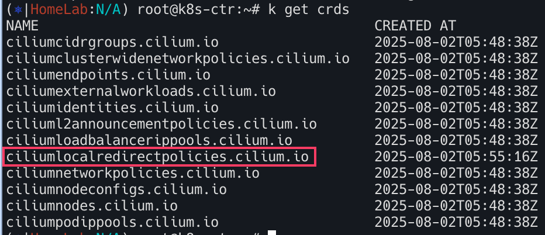

# 로컬 리디렉션 정책 (Local Redirect Policy)

[Link](https://docs.cilium.io/en/stable/network/kubernetes/local-redirect-policy/)

eBPF를 사용하여 IP 주소, 포트/프로토콜 튜플 또는 쿠버네티스 서비스로 향하는 파드 트래픽을 노드 내 백엔드 파드로 로컬 리디렉션할 수 있도록 하는 Cilium의 로컬 리디렉션 정책을 구성하는 방법을 설명하고 있다. 

> 백엔드 파드의 네임스페이스는 정책의 네임스페이스와 일치해야한다. 

Local Redirect Policy에는 두 가지 유형이 지원된다.
- ServiceMatcher 타입 (ClusterIP 타입): 쿠버네티스 서비스가 리다이렉션이 필요할경우
- AddressMatcher 타입 : 쿠버네티스에 속하지 않은 포트/프로토콜/IP주소를 매칭시켜야할 경우


위 유형들은 쿠버네티스 RBAC(Role-based access controle) 프레임워크를 통해 제어될 수 있다. 


## 필수 조건

Helm 저장소 설정
```bash
helm repo add cilium https://helm.cilium.io/
```

헬름 명령어를 통해 `localRedirectPolicies.enabled : true` 로 설정한다.

```bash
helm upgrade cilium cilium/cilium --version 1.18.0 \
  --namespace kube-system \
  --reuse-values \
  --set localRedirectPolicies.enabled=true
```


=============================

목적별 설정
1) 전체 `kube-proxy` 교체를 활성화
   
kube-proxy를 Cilium의 eBPF 구현으로 대체하고 로컬 리디렉션 정책을 활용하려는 사용자를 위한 것
```bash
kubeProxyReplacement: true
localRedirectPolicies:
  enabled: true
```
2) 파드 네임스페이스에서 소켓 수준 로드밸런서를 우회

파드 네임스페이스에서 소켓 수준 로드 밸런서를 비활성화하려는 사용자를 위한 것. 예를들어 파드 네임스페이스에 소켓 수준 로드밸런서와
충돌하는 사용자 지정 리다이렉션 규칙이 있는 경우
```yaml
kubeProxyReplacement: true
socketLB:
  hostNamespaceOnly: true
localRedirectPolicies:
  enabled: true
```
3) 소켓 수준 로드밸런서만 활성화

전반적인 서비스 처리를 위해 kube-proxy를 유지하지만 여전히 Cilium의 로컬 리디렉션 정책을 활용하려는 사용자를 위한 것
```yaml
kubeProxyReplacement: false
socketLB:
   enabled: true
localRedirectPolicies:
   enabled: true
```
4) 파드에서 액세스하는 ClusterIP 서비스를 제외한 모든 서비스 처리를 비활성화

서비스 처리를 위해 `kube-proxy`에 전적으로 의존하려면 파드 네임스페이스에서 액세스하는 ClusterIP 서비스를 제외한 모든 kube-proxy 대체 기능을 비활성화

이 설정에서는 호스트 네임스페이스에서 발생하는 파드 트래픽이 로컬 리디렉션 정책에 의해 처리되지 않는다
```yaml
kubeProxyReplacement: false
localRedirectPolicies:
  enabled: true
```

===============================================================================


이제 적용시키기 위해 에이전트 파드와 오퍼레이트를 롤아웃하자. 
```bash
kubectl rollout restart deploy cilium-operator -n kube-system
kubectl rollout restart ds cilium -n kube-system
```


오퍼레이터와 Cilium 오퍼레이터가 작동중인지 확인한다. 
```
kubectl -n kube-system get pods -l k8s-app=cilium
kubectl -n kube-system get pods -l name=cilium-operator
```


Cilium Local Redirect Policy CRD가 등록되어있는지 확인한다. 
```bash
kubectl get crds
```


## 백엔드와 클라이언트 파드 생성하기
CiliumLocalRedirectPolicy에 지정된 구성에 따라 트래픽을 리다이렉션해야하는 백엔드 파드를 배포한다. 메타데이터 레이블, 컨테이너 포트 및 프로토콜은 각각 다음 단계에서 생성될 CiliumLocalRedirectPolicy 사용자 리소스에 지정된 레이블 포트 및 프로토콜 필드와 일치한다. 

```yaml
apiVersion: v1
kind: Pod
metadata:
  name: lrp-pod
  labels:
    app: proxy
spec:
  containers:
    - name: lrp-pod
      image: nginx
      ports:
        - containerPort: 80
          name: tcp
          protocol: TCP
```
`kubectl apply -f https://raw.githubusercontent.com/cilium/cilium/1.18.0/examples/kubernetes-local-redirect/backend-pod.yaml`


파드 실행중 확인
```bash
kubectl get pods | grep lrp-pod
```


CiliumLocalRedirectPolicy에 지정된 구성에 따라 리다이렉션되는 트래픽을 생성하는 클라이언트 파드를 배포한다. 

```bash
kubectl create -f https://raw.githubusercontent.com/cilium/cilium/1.18.0/examples/kubernetes-dns/dns-sw-app.yaml
kubectl wait pod/mediabot --for=condition=Ready
kubectl get pods
```


## Cilium Local Redirect Policy Custom Resource 생성하기

CiliumLocalRedirectPolicy에서는 리다이렉션해야할 트래픽을 일치시키기위해 두 가지 타입의 구성이 지원된다. 

### AddressMatcher


```yaml
apiVersion: "cilium.io/v2"
kind: CiliumLocalRedirectPolicy
metadata:
  name: "lrp-addr"
spec:
  redirectFrontend:
    addressMatcher: #  리디렉션을 시작할 트래픽의 조건을 정의
      ip: "169.254.169.254" # 트래픽의 목적지 IP 주소가 169.254.169.254인 트래픽을매칭
      toPorts:
        - port: "8080" # 목적지 포트가 8080인 트래픽을 매칭
          protocol: TCP # 프로토콜이 TCP인 트래픽을 매칭
  redirectBackend:
    localEndpointSelector: # 리디렉션된 트래픽을 보낼 백엔드 파드를 선택
      matchLabels: 
        app: proxy # 레이블을 가진 로컬 파드를 백엔드 엔드포인트로 선택
    toPorts:
      - port: "80" # 백엔드 파드로 리디렉션될 때 목적지 포트를 80으로 변경
        protocol: TCP # 프로토콜은 TCP로 유지
```

```bash
kubectl apply -f https://raw.githubusercontent.com/cilium/cilium/1.18.0/examples/kubernetes-local-redirect/lrp-addrmatcher.yaml
```


아래 과정을 통해 `CiliumLocalRedirectPolicy`가 eBPF 레이어에 정확하게 로드되어, 정의된 대로 트래픽을 `lrp-pod`로 리디렉션할 준비가 되었음을 검증할 수 있다.

- `CiliumLocalRedirectPolicy`에 의해 `localEndpointSelector`로 선택된 파드(`lrp-pod`)의 IP 주소를 확인 
- `lrp-pod`와 동일한 노드에서 실행 중인 Cilium 파드에 접속
- Cilium 파드 내에서 `cilium-dbg service list` 명령어를 실행
- 백엔드 IP 주소가 `lrp-pod`의 IP와 일치하는 LocalRedirect 유형의 서비스 항목이 생성되었는지 확인


tcmp dump요청하여 확인. (사용자 정의 리소스 에 지정된 IP 주소와 포트 구성으로 curl요청)
```bash
kubectl exec mediabot -- curl -I -s http://169.254.169.254:8080/index.html
sudo tcpdump -i any -n port 80
## tcpdump: verbose output suppressed, use -v or -vv for full protocol decode
## listening on any, link-type LINUX_SLL (Linux cooked), capture size 262144 bytes
## 01:36:24.608566 IP 10.16.215.55.60186 > 10.16.70.187.80: Flags [S], seq 2119454273, ## win ack 239, win 229, options [nop,nop,TS val 2541637677 ecr 2962246962], length 0

```

### ServiceMatcher
이 모드는 특정 ClusterIP 서비스로 향하는 트래픽을 식별하여, `localEndpointSelector`로 지정된 동일 노드 내의 다른 파드로 리디렉션하는 데 사용된다. 이를 위해서는 리다이렉션 대상 서비스가 `ClusterIP` 타입이어야 하고, 정책이 적용되기 전에 미리 배포되어 있어야 한다. 이 정책이 적용되면 해당 서비스의 기존 eBPF 항목이 `LocalRedirect` 항목으로 대체되며, 트래픽은 노드 로컬 백엔드로만 전달한다.


배포

```bash
apiVersion: v1
kind: Service
metadata:
  name: my-service
spec:
  selector:
    app: MyApp
  ports:
    - name: tcp
      protocol: TCP
      port: 80
```

```bash
kubectl apply -f https://raw.githubusercontent.com/cilium/cilium/1.18.0/examples/kubernetes-local-redirect/k8s-svc.yaml
kubectl get service | grep 'my-service'
kubectl exec -it -n kube-system ds/cilium -- cilium-dbg service list
```


정책생성

```bash
apiVersion: "cilium.io/v2"
kind: CiliumLocalRedirectPolicy
metadata:
  name: "lrp-svc"
spec:
  redirectFrontend:
    serviceMatcher:
      serviceName: my-service
      namespace: default
  redirectBackend:
    localEndpointSelector:
      matchLabels:
        app: proxy
    toPorts:
      - port: "80"
        protocol: TCP

```


```bash
$ kubectl apply -f https://raw.githubusercontent.com/cilium/cilium/1.18.0/examples/kubernetes-local-redirect/lrp-svcmatcher.yaml
kubectl get ciliumlocalredirectpolicies | grep svc
kubectl exec -it -n kube-system cilium-5ngzd -- cilium-dbg service list
```


필요하다면 tcpdump로 트래픽 확인

```bash
kubectl exec mediabot -- curl -I -s http://<FRONT-END-IP-ADDRESS>/index.html
sudo tcpdump -i any -n port 80
## tcpdump: verbose output suppressed, use -v or -vv for full protocol decode
## listening on any, link-type LINUX_SLL (Linux cooked), capture size 262144 bytes
## 01:36:24.608566 IP 10.16.215.55.60186 > 10.16.70.187.80: Flags [S], seq 2119454273, ## win ack 239, win 229, options [nop,nop,TS val 2541637677 ecr 2962246962], length 0
```

## 제한사항
로컬 리디렉션 정책을 생성하면 정책 시행 후 설정되는 모든 새 연결에 대한 트래픽이 리디렉션된다. 하지만 정책에 지정된 구성과 일치하는 원격 파드에 대한 기존 활성 연결이 있는 경우, 해당 연결은 리디렉션되지 않을 수 있다. 이러한 모든 연결이 로컬에서 리디렉션되도록 하려면 `CiliumLocalRedirectPolicy`를 구성한 후 클라이언트 파드를 재시작한다.

로컬 리디렉션 정책 업데이트는 현재 지원되지 않아므로 변경사항이 있는 경우 기존 정책을 삭제하고 새 정책을 다시 만들어야한다. 

## 유즈케이스

로컬 리다이렉션 정책을 통해 다음과 같은 유즈케이스를 지원
- Node Local DNS Cache
- EKS상에서의 kiam 리다이렉션

### EKS상에서의 kiam 리다이렉션
`kiam` 에이전트는 EKS 클러스터의 각 노드에서 실행되며 AWS 메타데이터 서버로 가는 요청을 가로채서 파드의 보안 자격 증명을 가져온다.

- 파드에서 kiam 에이전트로만 트래픽을 리다이렉션하고 `kiam` 에이전트에서 AWS 메타데이터 서버로 리다이렉션 없이 트래픽을 전달하려면 데이터 경로에 소켓 조회 기능이 필요하다
  (v5.1.16, v5.2.0 또는 최신 Linux 커널이 필요)

- helm차트를 이용하여 `kiam`을 배포
```bash
helm repo add uswitch https://uswitch.github.io/kiam-helm-charts/charts/
helm repo update
helm install --set agent.host.iptables=false --set agent.whitelist-route-regexp=meta-data kiam uswitch/kiam
```

로컬 리다이렉션 정책을 배포하여 파드 트래픽을 배포된 `kiam` 에이전트로 리다이렉션한다.
```bash
kubectl apply -f https://raw.githubusercontent.com/cilium/cilium/1.18.0/examples/kubernetes-local-redirect/kiam-lrp.yaml
```

파드들이 AWS 메타데이터 서버 (169.254.169.254:80) 에 접근하려고 할 때, Cilium이 해당 요청을 로컬 노드의 `kiam-agent`가 리슨 중인 포트로 리다이렉션 하도록 구성하는 것

kiam 에이전트 파드들이 모두 running상태가 되면 애플리케이션 파드로부터의 메타데이터 요청은 노드 로컬의 `kiam` 에이전트 파드로 리다이렉션된다. 이 동작은 애플리케이션 파드 중 하나에서 aws메타데이터 서버로 curl명령어를 실행하고
동일한 EKS 클러스터 노드에서 `tcpdump` 명령어를 실행하여 확인할 수 있다. 

다음은 예시 출력이며, 여기서
- `192.169.98.118`은 애플리케이션 파드의 IP 주소이고,
- `192.168.60.99`는 해당 파드와 동일한 노드에서 실행 중인 kiam 에이전트의 IP 주소입니다.

```bash
kubectl exec app-pod -- curl -s -w "\n" -X GET http://169.254.169.254/latest/meta-data/
# ami-id
# ami-launch-index
# ami-manifest-path
# block-device-mapping/
# events/
# hostname
# iam/
# identity-credentials/
# (...)
```

```bash
sudo tcpdump -i any -enn "(port 8181) and (host 192.168.60.99 and 192.168.98.118)"
# tcpdump: verbose output suppressed, use -v or -vv for full protocol decode
# listening on any, link-type LINUX_SLL (Linux cooked), capture size 262144 bytes
# 05:16:05.229597  In de:e4:e9:94:b5:9f ethertype IPv4 (0x0800), length 76: 192.168.98.118.47934 > 192.168.60.99.8181: Flags [S], seq 669026791, win 62727, options [mss 8961,sackOK,TS val 2539579886 ecr 0,nop,wscale 7], length 0
# 05:16:05.229657 Out 56:8f:62:18:6f:85 ethertype IPv4 (0x0800), length 76: 192.168.60.99.8181 > 192.168.98.118.47934: Flags [S.], seq 2355192249, ack 669026792, win 62643, options [mss 8961,sackOK,TS val 4263010641 ecr 2539579886,nop,wscale 7], length 0
```
