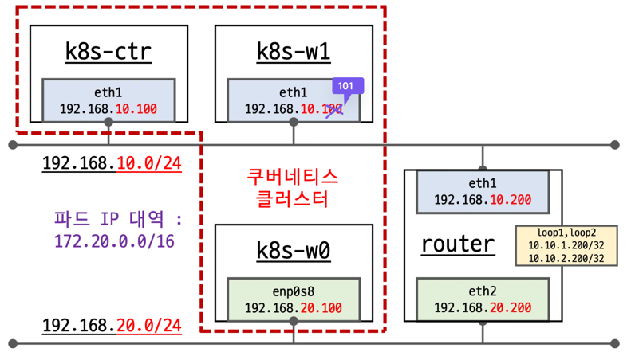
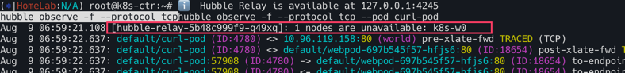
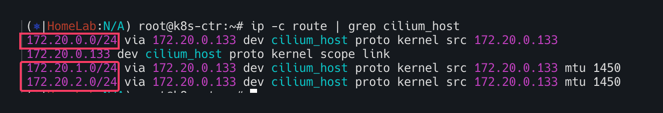
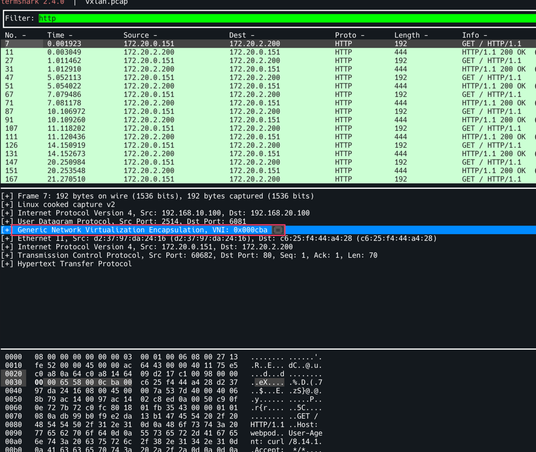

# 실습환경



먼저 위와 같이 `k8s-ctr(control-plane)`, `k8s-w1(worker-node 1)`, `k8s-w0(worker-node 2)`, router를 가상 머신으로 배포한다.
`k8s-w0(192.168.20.0/24)`는 보는 바와 같이 컨트롤 플레인(192.168.10.0/24)과 다른 네트워크 대역에 배치된다.

`eth1`과 `eth2`는 각각 게이트웨이 역할을 하며 서로 다른 대역의 네트워크와 통신하기 위해 존재한다. 

배포파일 및 배포
```bash
mkdir cilium-lab && cd cilium-lab

curl -O https://raw.githubusercontent.com/gasida/vagrant-lab/refs/heads/main/cilium-study/4w/Vagrantfile

vagrant up
```

배포 후 확인
```bash
# k9s 설치되어 있음
CLI_ARCH=amd64
if [ "$(uname -m)" = "aarch64" ]; then CLI_ARCH=arm64; fi
wget https://github.com/derailed/k9s/releases/latest/download/k9s_linux_${CLI_ARCH}.deb -O /tmp/k9s_linux_${CLI_ARCH}.deb
apt install /tmp/k9s_linux_${CLI_ARCH}.deb
k9s # node/pod 정보 확인 - metrics-server 설치되어 있어서, cpu/mem 확인 가능
```


podCIDR 확인
```bash
kubectl get ciliumnode -o json | grep podCIDRs -A2
```


Router 인터페이스 정보 확인
```bash
ip -br -c -4 addr
```


`k8s-ctr(192.168.10.100)` 및 `k8s-w1(192.168.10.101)`과 같이 `192.168.10.0/24` 대역이 `192.168.20.0/24`와 통신하기 위해서는
`eth1(192.168.10.200)`의 static routing으로 통신한다.


## -set routingMode=native --set autoDirectNodeRoutes=true 동작이해

`--set autoDirectNodeRoutes=true`의 의미는 같은 네트워크 대역에 있는 `podCIDR`만 `static`으로 추가된다. 

노드별 podCIDR
- `172.20.0.0/24` (k8s-ctr) - `192.168.10.0/24` 대역
- `172.20.1.0/24` (k8s-w1) - `192.168.10.0/24` 대역
- `172.20.2.0/24` (k8s-w0) - `192.168.20.0/24` 대역

k8s-ctr


k8s-w1


k8s-ctr과 k8s-w1의 라우팅 정보를 보면 `192.168.10.0/24` 대역이 아닌 `k8s-w0(192.168.20.0/24)`노드의 
`podCIDR(172.20.2.0/24)`는 찾아볼 수 없다. 

그렇다면 통신을 확인해보자. 
```bash
# 통신 확인
ping -c 1 10.10.1.200     # router loop1 
ping -c 1 192.168.20.100  # k8s-w0 eth1
```


당연히 k8s-w0의 노드 IP`(192.168.20.100)`로는 통신이 가능하다. 하지만 노드 상의 **파드간 통신**은 서로 다른 대역끼리 불가능한 상태다.


# Native Routing Mode

네이티브 라우팅 모드 실습을 위해 샘플애플리케이션 배포한다.

```bash
cat << EOF | kubectl apply -f -
apiVersion: apps/v1
kind: Deployment
metadata:
  name: webpod
spec:
  replicas: 3
  selector:
    matchLabels:
      app: webpod
  template:
    metadata:
      labels:
        app: webpod
    spec:
      affinity:
        podAntiAffinity:
          requiredDuringSchedulingIgnoredDuringExecution:
          - labelSelector:
              matchExpressions:
              - key: app
                operator: In
                values:
                - sample-app
            topologyKey: "kubernetes.io/hostname"
      containers:
      - name: webpod
        image: traefik/whoami
        ports:
        - containerPort: 80
---
apiVersion: v1
kind: Service
metadata:
  name: webpod
  labels:
    app: webpod
spec:
  selector:
    app: webpod
  ports:
  - protocol: TCP
    port: 80
    targetPort: 80
  type: ClusterIP
EOF


# k8s-ctr 노드에 curl-pod 파드 배포
cat <<EOF | kubectl apply -f -
apiVersion: v1
kind: Pod
metadata:
  name: curl-pod
  labels:
    app: curl
spec:
  nodeName: k8s-ctr
  containers:
  - name: curl
    image: nicolaka/netshoot
    command: ["tail"]
    args: ["-f", "/dev/null"]
  terminationGracePeriodSeconds: 0
EOF
```
<br>


배포 확인

```bash
# 배포 확인
kubectl get deploy,svc,ep webpod -owide
kubectl get endpointslices -l app=webpod
kubectl get ciliumendpoints # IP 확인

#
kubectl exec -n kube-system ds/cilium -- cilium-dbg ip list
kubectl exec -n kube-system ds/cilium -- cilium-dbg endpoint list

kubectl exec -n kube-system ds/cilium -- cilium-dbg service list

kubectl exec -n kube-system ds/cilium -- cilium-dbg bpf lb list
kubectl exec -n kube-system ds/cilium -- cilium-dbg bpf lb list | grep 10.96.32.212
kubectl exec -n kube-system ds/cilium -- cilium-dbg bpf nat list

# map
kubectl exec -n kube-system ds/cilium -- cilium-dbg map list | grep -v '0             0'

kubectl exec -n kube-system ds/cilium -- cilium-dbg map get cilium_lb4_services_v2
kubectl exec -n kube-system ds/cilium -- cilium-dbg map get cilium_lb4_services_v2 | grep 10.96.32.212

kubectl exec -n kube-system ds/cilium -- cilium-dbg map get cilium_lb4_backends_v3
kubectl exec -n kube-system ds/cilium -- cilium-dbg map get cilium_lb4_reverse_nat
kubectl exec -n kube-system ds/cilium -- cilium-dbg map get cilium_ipcache_v2
```
<br>

## 통신확인을 해보자. 서로 다른 대역에 있는 파드간 통신을 해결하기 위해서는 어떻게 해야할까?

### 문제 확인
아래의 명령어로 반복접근을 실시해보자. 
```bash
# 통신 확인 : 문제 확인
kubectl exec -it curl-pod -- curl webpod | grep Hostname
kubectl exec -it curl-pod -- sh -c 'while true; do curl -s --connect-timeout 1 webpod | grep Hostname; echo "---" ; sleep 1; done'
```

아래와 같이 서로 다른 네트워크 대역의 파드는 통신이 되지 않는것 을 볼 수 있다.(되는 파드는 Hostname에 정확히 파드이름이 뜨는 것을 확인가능) 


그러면 이제 `k8s-w0`노드에 배포된 webpod 파드로 curl요청을 날려보자. 
```bash
# k8s-w0 노드에 배포된 webpod 파드 IP 지정
export WEBPOD=$(kubectl get pod -l app=webpod --field-selector spec.nodeName=k8s-w0 -o jsonpath='{.items[0].status.podIP}')
echo $WEBPOD

# 신규 터미널 [router]
tcpdump -i any icmp -nn

# 
kubectl exec -it curl-pod -- ping -c 2 -w 1 -W 1 $WEBPOD

```

k8s-ctr의 파드는 우측 상단의 빨간 네모에서 보는 것처럼 IP주소는 `172.20.0.106`이며 k8s-w0 파드의 `172.20.2.26`로 요청을 보내고 있다.
`eth1`로 요청이 들어왔는데 `eth2`로 보내야하지만 `eth0(10.0.0.2)`으로 보내고 있다. 


결국 router 머신의 라우트 정보에 그 어디에도 `172.20.2.26`을 알 수 있는 정보가 없다. 따라서 default 라우트에 매치가 됨으로 eth0으로 빠져 나가는 것을 확인할 수 있다. 
당연히 라우터는 podCIDR의 정보를 알리가 없다. 

아래 명령어로 트래픽 경로를 유추 할 수 있다. (eth0으로 빠져나가는 것을 확인) 
```bash
ip route get 172.20.2.26
```


허블에서도 확인해보자. 

```bash
#
kubectl exec -it curl-pod -- sh -c 'while true; do curl -s --connect-timeout 1 webpod | grep Hostname; echo "---" ; sleep 1; done'

# 신규 터미널 [router]
tcpdump -i any tcp port 80 -nn

# hubble 확인
# hubble ui 웹 접속 주소 확인 : default 네임스페이스 확인
NODEIP=$(ip -4 addr show eth1 | grep -oP '(?<=inet\s)\d+(\.\d+){3}')
echo -e "http://$NODEIP:30003"

# hubble relay 포트 포워딩 실행
cilium hubble port-forward&
hubble status

# flow log 모니터링
hubble observe -f --protocol tcp --pod curl-pod
```

hubble에서 확인해보면 k8s-w0의 경우 TCP Flags: SYN이외에 아무런 응답이 없는 것을 확인 할 수 있다.

(허블을 관측하는 순간 아래와 같이 k8s-w0노드가 이용할 수 없다고 뜨기도 함)

<br>
<br>
<br>
<br>
결국 해결 방안은 두가지 방법이 있음. 
- 라우팅 설정 - 수동 또는 자동 **BGP**
- Overlay Network


# Overlay Network (Encapsulation) mode

Overlay Network에는 두가지 모드가 있음
- VXLAN(default) : 8472/UDP
- Geneve : 6081/UDP

기본적으로는 위 두가지 모드는 활성화 되어 있지는 않다. 별도로 세팅을 해보자.  
```bash
# [커널 구성 옵션] Requirements for Tunneling and Routing
grep -E 'CONFIG_VXLAN=y|CONFIG_VXLAN=m|CONFIG_GENEVE=y|CONFIG_GENEVE=m|CONFIG_FIB_RULES=y' /boot/config-$(uname -r)
CONFIG_FIB_RULES=y # 커널에 내장됨
CONFIG_VXLAN=m # 모듈로 컴파일됨 → 커널에 로드해서 사용
CONFIG_GENEVE=m # 모듈로 컴파일됨 → 커널에 로드해서 사용
```

사용하기 위해 커널 로드
```bash
#  커널 로드
lsmod | grep -E 'vxlan|geneve'
modprobe vxlan # modprobe geneve
lsmod | grep -E 'vxlan|geneve'
```


```bash
# k8s-w1 노드에 배포된 webpod 파드 IP 지정
export WEBPOD1=$(kubectl get pod -l app=webpod --field-selector spec.nodeName=k8s-w1 -o jsonpath='{.items[0].status.podIP}')
echo $WEBPOD1

# 반복 ping 실행해두기
kubectl exec -it curl-pod -- ping $WEBPOD1
```


```bash
# 업그레이드
helm upgrade cilium cilium/cilium --namespace kube-system --version 1.18.0 --reuse-values \
  --set routingMode=tunnel --set tunnelProtocol=vxlan \
  --set autoDirectNodeRoutes=false --set installNoConntrackIptablesRules=false

kubectl rollout restart -n kube-system ds/cilium
```

```bash
cilium features status
cilium features status | grep datapath_network

kubectl exec -it -n kube-system ds/cilium -- cilium status | grep ^Routing
cilium config view | grep tunnel
```

```bash
# cilium_vxlan 확인
ip -c addr show dev cilium_vxlan
for i in w1 w0 ; do echo ">> node : k8s-$i <<"; sshpass -p 'vagrant' ssh vagrant@k8s-$i ip -c addr show dev cilium_vxlan ; echo; done

# 라우팅 정보 확인 : k8s node 간 다른 네트워크 대역에 있더라도, 파드의 네트워크 대역 정보가 라우팅에 올라왔다!
ip -c route | grep cilium_host
```
다른 네트워크 대역에 있는 노드와 통신할때는 오버레이 하기 위한 새로운 인터페이스가 생성되었다. 


라우팅 정보를 보면 172.20.0.0/24, 172.20.1.0/24, 172.20.2.0/24가 모두 올라온 것을 확인 할 수 있다.


```bash
ip route get 172.20.1.10
ip route get 172.20.2.10

for i in w1 w0 ; do echo ">> node : k8s-$i <<"; sshpass -p 'vagrant' ssh vagrant@k8s-$i ip -c route | grep cilium_host ; echo; done


# cilium 파드 이름 지정
export CILIUMPOD0=$(kubectl get -l k8s-app=cilium pods -n kube-system --field-selector spec.nodeName=k8s-ctr -o jsonpath='{.items[0].metadata.name}')
export CILIUMPOD1=$(kubectl get -l k8s-app=cilium pods -n kube-system --field-selector spec.nodeName=k8s-w1  -o jsonpath='{.items[0].metadata.name}')
export CILIUMPOD2=$(kubectl get -l k8s-app=cilium pods -n kube-system --field-selector spec.nodeName=k8s-w0  -o jsonpath='{.items[0].metadata.name}')
echo $CILIUMPOD0 $CILIUMPOD1 $CILIUMPOD2

# router 역할 IP 확인
kubectl exec -it $CILIUMPOD0 -n kube-system -c cilium-agent -- cilium status --all-addresses | grep router
kubectl exec -it $CILIUMPOD1 -n kube-system -c cilium-agent -- cilium status --all-addresses | grep router
kubectl exec -it $CILIUMPOD2 -n kube-system -c cilium-agent -- cilium status --all-addresses | grep router

#
kubectl exec -n kube-system ds/cilium -- cilium-dbg bpf ipcache list
kubectl exec -n kube-system $CILIUMPOD0 -- cilium-dbg bpf ipcache list
kubectl exec -n kube-system $CILIUMPOD1 -- cilium-dbg bpf ipcache list
kubectl exec -n kube-system $CILIUMPOD2 -- cilium-dbg bpf ipcache list

#
kubectl exec -n kube-system ds/cilium -- cilium-dbg bpf socknat list
kubectl exec -n kube-system $CILIUMPOD0 -- cilium-dbg bpf socknat list
kubectl exec -n kube-system $CILIUMPOD1 -- cilium-dbg bpf socknat list
kubectl exec -n kube-system $CILIUMPOD2 -- cilium-dbg bpf socknat list
```

via뒤에 있는 `172.20.0.12`의 정체가 궁금할 텐데 이는 router의 IP임을 확인 할 수 있다. 


## 파드간 통신 확인

curl파드로 부터 반복접근을 시도 해보자. 
```bash
# 통신 확인
kubectl exec -it curl-pod -- curl webpod | grep Hostname
kubectl exec -it curl-pod -- sh -c 'while true; do curl -s --connect-timeout 1 webpod | grep Hostname; echo "---" ; sleep 1; done'
```

일단 3개의 파드가 모두 뜨는 것을 확인 할 수 있다.  


```bash
# k8s-w0 노드에 배포된 webpod 파드 IP 지정
export WEBPOD=$(kubectl get pod -l app=webpod --field-selector spec.nodeName=k8s-w0 -o jsonpath='{.items[0].status.podIP}')
echo $WEBPOD
```

Overlay Network는 router를 경유하는데 vxlan의 포트번호 8472로 설정해준다. 
```bash
# 신규 터미널 [router]
tcpdump -i any udp port 8472 -nn
```

```bash
kubectl exec -it curl-pod -- ping -c 2 -w 1 -W 1 $WEBPOD
```
먼저 eth1 In 과 eth2 Out이 보인다. `k8s-ctr(192.168.10.100)`에서 `k8s-w0(192.168.20.100)`으로 요청을 보내고 있는데
eth1로 들어와서 eth2로 나간다는 것을 알 수있다. 


 두번째로 `172.20.0.158`이 보이는데 Inner Header의 정보를 볼 수 있다. 


### 실제로 Router에서 tcpdump를 확인해보자. 

```bash
# 신규 터미널 [router]
tcpdump -i any udp port 8472 -w /tmp/vxlan.pcap
tshark -r /tmp/vxlan.pcap -d udp.port==8472,vxlan
termshark -r /tmp/vxlan.pcap
termshark -r /tmp/vxlan.pcap -d udp.port==8472,vxlan
```


`termshark -r /tmp/vxlan.pcap -d udp.port==8472,vxlan` 로 확인, Filter에 http를 입력한다. 
특정 트래픽을 선택하면 Outer Header에 `SrcIP : 192.168.10.100 (k8s-ctr)`, `DstIP: 192.168.20.100(k8s-w0)` 로 되어 있는 것을 확인할 수 있다.
Router는 여기까지만 확인하며 (L2/L3까지만 확인 후) 뒷단의 페이로드는 확인하지 않는다. 따라서 7번째 줄의 `Src: 172.20.0.158`, `Dst: 172.20.2.115`가 있더라도
무시할 수 있는 것이다. 


`VXLAN` 모드임도 확인할 수 있다. 디켑슐레이션하는 포트를 8472로 해야 확인 할 수 있다. 


`Inner Header`에 파드 to 파드 IP를 확인할 수 있다. 


`Hubble`
```bash
# hubble relay 포트 포워딩 실행
cilium hubble port-forward&
hubble status

# flow log 모니터링
hubble observe -f --protocol tcp --pod curl-pod
```
허블에서도 아래와 같이 `to-overlay`로 Overlay Network임을 확인 할 수 있다. 


지금까지의 과정이 Datapath의 중 Encapsulate, Route에 해당한다. 


# GENEVE MODE 확인
VXLAN 대신 GENEVE 모드로 변경 설정 후 설정 상태와 통신 트래픽을 확인한다. 결과적으로 설정과 트래픽 확인측면에서는 VXLAN과 차이는 보이지 않는다.
<br>

커널 구성 옵션 확인
```bash
# [커널 구성 옵션] Requirements for Tunneling and Routing
grep -E 'CONFIG_VXLAN=y|CONFIG_VXLAN=m|CONFIG_GENEVE=y|CONFIG_GENEVE=m|CONFIG_FIB_RULES=y' /boot/config-$(uname -r)
CONFIG_FIB_RULES=y # 커널에 내장됨
CONFIG_VXLAN=m # 모듈로 컴파일됨 → 커널에 로드해서 사용
CONFIG_GENEVE=m # 모듈로 컴파일됨 → 커널에 로드해서 사용
```
<br>

GENEVE 모드로 커널 로드한다. k8s-w0, k8s-w1 노드에도 동일하게 적용해준다.
```bash
modprobe geneve # modprobe geneve
lsmod | grep -E 'vxlan|geneve'
```
<br>

트래픽 반복접근 해두기
```bash
# k8s-w1 노드에 배포된 webpod 파드 IP 지정
export WEBPOD1=$(kubectl get pod -l app=webpod --field-selector spec.nodeName=k8s-w1 -o jsonpath='{.items[0].status.podIP}')
echo $WEBPOD1

# 반복 ping 실행해두기
kubectl exec -it curl-pod -- ping $WEBPOD1
```
<br>

cilium 업그레이드를 진행하자. 
`vxlan` 대신 `--set tunnelProtocol=geneve`로 바꾸어 아래 명령어를 실행한다. 
```
# 업그레이드
helm upgrade cilium cilium/cilium --namespace kube-system --version 1.18.0 --reuse-values \
  --set routingMode=tunnel --set tunnelProtocol=geneve \
  --set autoDirectNodeRoutes=false --set installNoConntrackIptablesRules=false

# 데몬셋 재실행
kubectl rollout restart -n kube-system ds/cilium
```

<br>
설정을 확인하자. 

```bash
# 설정 확인
cilium features status
cilium features status | grep datapath_network
```
<br>

아래와 같이 `cilium_feature_datapath_network` `mode=overlay-geneve`가 `YES`로 되어있고 각 3개의 노드가 모두 활성화 되어있다. 

<br>

인터페이스 확인
```bash
ip -c addr show dev cilium_geneve
```


<br>

라우팅 정보 확인 : k8s node 간 다른 네트워크 대역에 있더라도, 파드의 네트워크 대역 정보가 라우팅에 올라왔다!

```bash
ip -c route | grep cilium_host
```

<br>

이전과 마찬가지로 via 뒤에 있는 `172.20.0.133`은 라우터 ip주소이다. 

<br>

이제 통신을 확인하자. 
```bash
# 통신 확인
kubectl exec -it curl-pod -- curl webpod | grep Hostname
kubectl exec -it curl-pod -- sh -c 'while true; do curl -s --connect-timeout 1 webpod | grep Hostname; echo "---" ; sleep 1; done'

# k8s-w0 노드에 배포된 webpod 파드 IP 지정
export WEBPOD=$(kubectl get pod -l app=webpod --field-selector spec.nodeName=k8s-w0 -o jsonpath='{.items[0].status.podIP}')
echo $WEBPOD

```

vxlan는 포트번호 `8472`를 geneve의 경우 `6081`로 설정
```bash
# 신규 터미널 [router]
tcpdump -i any udp port 6081 -nn

# 
kubectl exec -it curl-pod -- ping -c 2 -w 1 -W 1 $WEBPOD

# 신규 터미널 [router] : 라우팅이 어떻게 되는가?
tcpdump -i any icmp -nn
```

```bash
# 반복 접속
kubectl exec -it curl-pod -- curl webpod | grep Hostname
kubectl exec -it curl-pod -- sh -c 'while true; do curl -s --connect-timeout 1 webpod | grep Hostname; echo "---" ; sleep 1; done'

# 신규 터미널 [router]
tcpdump -i any udp port 6081 -w /tmp/geneve.pcap
tshark -r /tmp/vxlan.pcap -d udp.port==6081,geneve
termshark -r /tmp/geneve.pcap
termshark -r /tmp/geneve.pcap -d udp.port==6081,geneve

# 신규 터미널 [k8s-ctr] hubble flow log 모니터링 : overlay 통신 모드 확인!
hubble observe -f --protocol tcp --pod curl-pod
```
vxlan과 큰 차이는 없이 eth1 인입 eth2로 아웃되는 것이 보이며 inner header도 확인가능하다. 

<br>

GENEVE모드이므로 아래와 같이 `Generic Network Virtualization Encapsulation, VNI: 0x000cba`가 확인이 가능하다. 

<br>

hubble flow log 모니터링을 진행하자.  `to-overlay`가 확인되며 `overlay` 통신모드 확인이 가능하다. 

<br>
