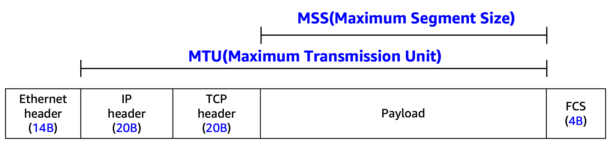
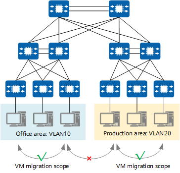
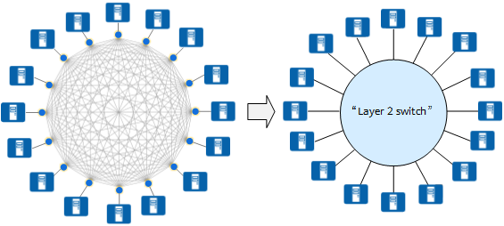
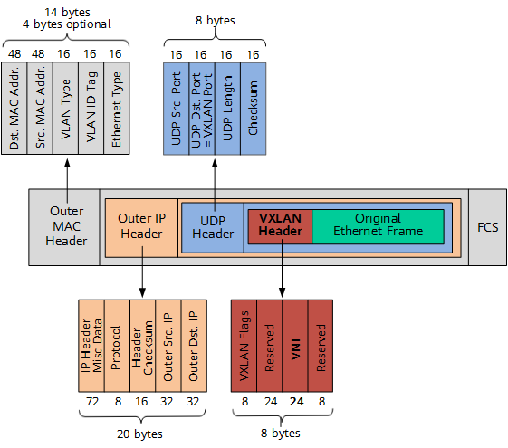
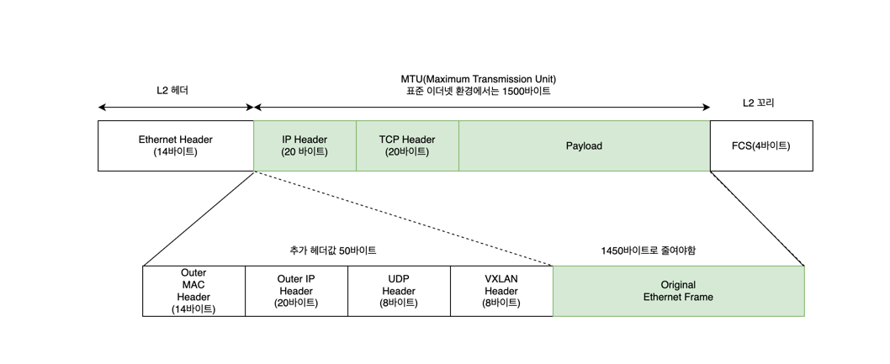
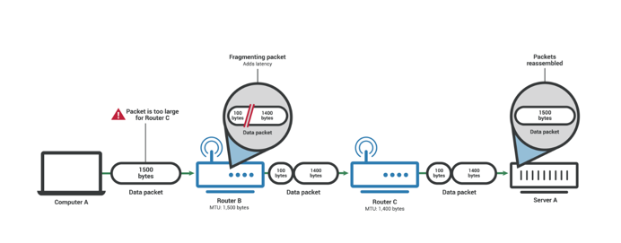
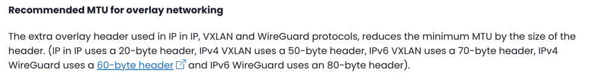

MTU 1450의 의미를 알아 보기 위해선 우선 VXLAN의 배경에 대해서 알아볼 필요가 있어 보인다. 
MTU/MSS의 정의 및 VXLAN의 배경 그리고 실무상 주의할점에 대해서 정리해본다. 

# MTU / MSS 기본
https://aws.amazon.com/ko/blogs/tech/aws-mtu-mss-pmtud/

- MTU : 네트워크 계층 (OSI Model 3 layer, L3)에서 정의되는 IP패킷의 최대 크기로, 네트워크 인터페이스가 단일 IP 패킷으로 전송할 수 있는 최대 바이트수
- MSS : 네트워크 계층 (OSI Model 4 layer, L4)에서 정의되는 TCP 세그먼트의 최대 데이터 크기로 TCP헤더를 제외한 순수 애플리케이션 데이터만을 의미. MSS는 TCP 3-way 핸드셰이크 과정에서 양측이 서로 광고한 MSS값 중 작은 값으로 결정되어 해당 TCP 세션에서 사용된다.

 

표준 이더넷 환경에서 MTU는 **1500바이트**로, 이는 전체 이더넷 프레임 크기 1518바이트에서 Layer 2 오버헤드 18바이트를 제외한 값이다.

# VXLAN이란?

- VXLAN(Virtual Extensible LAN)은 대규모 레이어 2 네트워크에서 널리 사용되는 네트워크 가상화 기술
- VXLAN은 소스 네트워크 장치와 목적지 네트워크 장치 사이에 논리적 터널을 구축하고, 이 터널을 통해 패킷에 MAC-in-UDP 캡슐화를 적용한다.
  - 먼저 원본 이더넷 프레임을 UDP패킷으로 캡슐화 한다. 
  - 물리적 네트워크의 IP헤더와 이더넷 헤더를 외부헤더로 사용하여 UDP패킷을 캡슐화
  - 일반 IP 패킷처럼 네트워크 전체로 라우팅 할 수 있도록한다. 
- 이를 통해 L2 네트워크의 VM은 L2및 L3 네트워크 구조적 제약에서 벗어날 수 있음

# VXLAN은 왜 필요한가?
- 동적 VM 마이그레이션
  - 기존의 서버 가상화는 물리적 서버를 VM이라고하는 여러개의 논리적 서버로 가상화하는 방식으로 동작한다. 서버 가상화는 에너지 소비와 운영 비용을 절감하는 동시에 서버 효율성을 향상시키는 효과적인 방법이며. 이러한 장점 덕분에 서버 가상화는 널리 사용되고 있다.
  - 이후 동적 VM 마이그레이션이 보편화 되었는데 VM마이그레이션 중 서비스 연속성을 보장하려면 VM의 IP주소와 실행상태 (예:TCP 세션상태)가 변경되면 않됨. 따라서 동일한 L2 도메인에서만 동적으로 마이그레이션이 가능함
 

  - 결국 광범위한 범위 또는 지역간에 VM을 원할하게 마이그레이션 하려면 관련서버가 모두 대규모 L2 도메인에 배포되어야한다.
  - L2 스위치는 스위치에 연결된 서버 간의 L2통신을 지원 할 수 있고 서버가 L2 스위치의 한 포트에서 다른 포트로 마이그레이션될때 서버의 IP 주소는 변경되지 않는다. ➡️ VXLAN 설계에 영감

  - VXLAN은 IP 네트워크에서 소스 노드와 목적지 노드 간에 통신이 필요할 때 사용자 데이터를 투명하게 전달하기 위해 IP 네트워크에 가상 터널을 생성하는 방법을 제공한다.
  - 기본 네트워크 구조 및 기타 세부 정보와 관계 없이 모든 두 노드는 VXLAN 터널을 통해 통신이 가능
  - 서버의 경우 VXLAN은 전체 인프라 네트워크를 대규모 L2 가상 스위치로 가상화하여 모든 서버가 이 스위치에 연결되도록한다.
  - 물리적 서버가 물리적 스위치의 한 포트에서 다른포트로 전환될 때 동작하는 방식과 유사하게 VM도 L2 가상 스위치의 한 포트에서 다른 포트로 마이그레이션될 때 IP주소를 변경할 필요가 없다. 
- 테넌트 급증으로 네트워크 격리 수요증가
  - 표준에 따르면 기존 VLAN 네트워크는 최대 약 4000개의 VLAN을 지원한다. 서버를 가상화 한 후에 물리적 서버는 여러개의 VM을 호스팅하며 각 VM은 독립적인 IP주소와 MAC주소를 갖게 된다. ➡️ 서버의 수 증가와 일치
    - 클라우드 데이터 센터만 생각해보아도 수만명 이상의 테넌트를 수용해야하므로 기존의 VLAN으로는 요구사항 충족하기가 힘듦

# VXLAN은 이러한 요구사항을 어떻게 충족할 것인가?
VXLAN은 VLAN ID에 해당하는 24비트 VXLAN 네트워크 식별자 (VNI)를 VXLAN 헤더에 추가한다.
- 이론적으로 최대 16M개의 VXLAN 세그먼트가 지원되어 방대한 테넌트 식별 및 격리 요구사항을 충족한다. 

# VXLAN의 패킷 모습

- VXLAN 헤더 (8바이트)
  - 여러 테넌트를 정의하는데 사용되는 VNI 필드(24비트)
  - VXLAN 플래그 필드(8비트, 00001000으로 설정)
  - Reserved 필드(24비트, 8비트)
- UDP 헤더
  - UDP 헤더에서 목적지 포트번호 (VXLAN Port)는 4789로 고정 되어 있으며 원본 포트번호(UDP Src. Port)는 원본 이더넷 프레임을 기반으로 해시알고리즘을 사용하여 계산
- 외부 IP 헤더
  - 외부 IP헤더에서 Outer Src. IP는 소스 VM에 연결된 VTEP의 IP주소 이고, Outer Dst. IP는 대상 VM에 연결된 VTEP IP주소
- 외부 MAC 헤더
  - 외부 MAC 헤더는 외부 이더넷 헤더라고도 함. `Src. MAC Addr.`는 출발지 VM에 연결된 VTEP의 MAC 주소이고, `Dst. MAC Addr.`는 목적지 VTEP로 가는 경로상의 다음 홉의 MAC 주소임

# 다시 돌아와 MTU 1450의 의미는 무엇인가

즉, VXLAN 네트워크 가상화 기술이 적용된 이상 한번에 전송할 수 있는 IP 패킷의 최대크기가 1450 바이트이다. (단편화 없이 보낼 수 있는 최대크기) 

# 실무에서 고려해야할 부분

경로 MTU 발견(PMTUD)는 네트워크 경로 사의 모든 장치, 라우터, 스위치의 MTU를 찾아내는 과정을 말한다. 예를들어
컴퓨터 A와 서버 A가 PMTUD를 이용하고 있었다면, 라우터 B의 MTU 요구 사항을 알아냈을 것이고 분할을 피하기 위해 패킷 크기를 조정했을 것이다.
 

만약 송신자는 IP 헤더의 DF(Don’t Fragment) 비트를 설정하여 패킷을 전송하고, 경로상에 더 작은 MTU를 가진 링크가 있을 경우 해당 라우터로부터 ICMP “Fragmentation Needed”(Type 3, Code 4) 메시지를 수신합니다. 이를 통해 IP 단편화로 인한 성능 저하와 패킷 손실을 효과적으로 방지할 수 있습니다.
하지문 문제는 많은 방화벽/보안 정책상 ICMP를 전부 막아버리는 경우가 존재한다. PMTUD는 ICMP 메세지를 받아야 작동하므로 
중간 장비가 패킷 크기 문제를 알려주려고 ICMP를 보내도 송신지는 방화벽으로 인해 ICMP를 받을 수 없으므로 MTU가 작은 구간이 있다는 것을 모른다. 이는 계속해서 큰 패킷을 보내게 되고 중간에서 패킷드랍이 일어나며 통신 불능이 발생할 수 있다. (PMTUD Black Hole)
 
- ICMP Type 3 code 4 허용(Fragmentation Needed 메세지 허용)
- MSS Clampling 적용 : TCP세션 초기부터 작은 MSS로 강제
- 터널 환경에서는 MTU를 사전에 줄여서 설정

## 캡슐화 오버헤드 계산

어떤 터널 / 프로토콜을 쓰느냐에 따라 MTU를 얼마나 줄여야하는지가 달라진다.
- VXLAN + IPv4 : 50바이트 헤더 사용
- VXLAN + IPv6 : 70바이트 헤더 사용
- IPv4 WireGuard : 60바이트 헤더사용

## 성능 고려
- MTU가 작으면 전송횟수 증가 하므로 CPU 오버헤드가 증가 할 수 있다. 
- MTU가 크면 전송 효율을 좋아 질 수 있으나 일부 장비, 경로에서 패킷 드랍이 일어날 수 있다. 
- Jumbo Frame(9000 MTU)를 쓰려면 모든 경로 장비가 지원해야한다.
