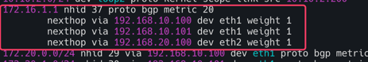
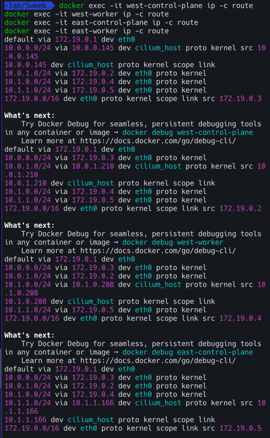
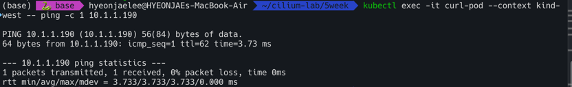
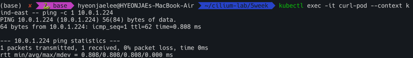

# 실습환경


- k8s-ctr (192.168.10.0/24) - 192.168.10.100
- k8s-w1 (192.168.10.0/24) - 192.168.10.101
- k8s-w0 (192.168.20.0/24) - 192.168.20.100 (k8s-ctr/w1 노드와 다른 대역 배치)
- router 192.16.10.0/24 - 192.168.20.0/24 대역 라우팅 (BGP 동작을 위한 frr 툴 설치)

현재 위와 같은 실습 환경을 가지며 노드내 파드들끼리만 통신되는 중이며 이것을 해결하는 과정을 살펴본다.

# Cilium BGP Control Plane

Cilium BGP 컨트롤 플레인은 BGP 피어, 정책, 광고를 유연하게 구성할 수 있는 맞춤형 리소스로 관리된다.


- `CiliumBGPClusterConfig`: 전체 클러스터에 적용되는 BGP 인스턴스(BGP 라우터)와 피어(peer)를 설정한다.
- `CiliumBGPPeerConfig`: 여러 BGP 피어에서 공통으로 사용할 수 있는 피어링 설정을 정의한다.
- `CiliumBGPAdvertisement`: BGP 라우팅 테이블에 주입(injection)할 IP 접두사(prefixes)를 정의한다.
- `CiliumBGPNodeConfigOverride`: 노드별로 BGP 설정을 다르게 적용하여 더 세밀하게 제어할 수 있게 한다.

##### By Gemini
>간단한 비유
>이 리소스들을 회사에 비유해본다.
>- `CiliumBGPClusterConfig`: '우리 회사(클러스터)는 모든 지사(노드)에 공통으로 이 전화번호(AS 번호)와 주소(라우터 ID)를 사용할 거야'라고 본사 차원에서 정하는 규칙.
>- `CiliumBGPPeerConfig`: '외부 협력사(BGP 피어)와 연락할 때 사용할 공통 비밀번호(인증 키)를 미리 정해두는 것'.
>- `CiliumBGPAdvertisement`: '우리 회사가 담당하는 사업 지역(IP 접두사)이 이 곳들이라고 외부에 공개적으로 알리는 것'.
>- `CiliumBGPNodeConfigOverride`: '모든 지사는 공통 규칙을 따르지만, 서울 지사(특정 노드)만 특별한 업무 때문에 다른 전화번호를 추가로 사용하도록 예외를 두는 것'.

## 라우터에 접속

### 라우터 접속 및 프로세스 확인
k8s-ctr 에서 router 로 ssh 접속
```bash
sshpass -p 'vagrant' ssh vagrant@router
```
<br>

TCP/UDP 소켓 정보를 보여주는 `ss` 명령어를 사용하여 `zebra` , `bgpd`프로세스가 실행중인지 확인한다. 

또한 ps 명령으로 FRR 관련 프로세스가 실행중인지 확인

- watchfrr : FRR 데몬들을 감시하고 문제가 발생하면 재시작하는 메인 프로세스
- zebra : FRR의 핵심 데몬으로 라우팅 테이블 정보를 관리하고 다른 데몬들과 통신
- bgpd: BGP 프로토콜을 처리하는 데몬
<br>

```bash
ss -tnlp | grep -iE 'zebra|bgpd'
ps -ef |grep frr
root        4127       1  0 13:38 ?        00:00:00 /usr/lib/frr/watchfrr -d -F traditional zebra bgpd staticd
frr         4140       1  0 13:38 ?        00:00:00 /usr/lib/frr/zebra -d -F traditional -A 127.0.0.1 -s 90000000
frr         4145       1  0 13:38 ?        00:00:00 /usr/lib/frr/bgpd -d -F traditional -A 127.0.0.1
frr         4152       1  0 13:38 ?        00:00:00 /usr/lib/frr/staticd -d -F traditional -A 127.0.0.1
```
<br>

vtysh는 FRR의 통합 쉘.


```bash
#
vtysh -c 'show running'
cat /etc/frr/frr.conf 
...
log syslog informational
!
router bgp 65000
  bgp router-id 192.168.10.200
  bgp graceful-restart
  no bgp ebgp-requires-policy
  bgp bestpath as-path multipath-relax
  maximum-paths 4
```

<br>

BGP 피어링 상태를 간략하게 보여준다. 피어와의 세션이 established되었는지, 받은/보낸 경로의 개수는 몇 개인지 등을 확인
```bash
vtysh -c 'show running'
vtysh -c 'show ip bgp summary'
vtysh -c 'show ip bgp'
```


- `router bgp 65000`: 이 라우터가 AS(Autonomous System) 번호 65000에 속함을 나타낸다.
- `bgp router-id 192.168.10.200`: BGP 라우터의 고유 식별자(ID)를 192.168.10.200으로 설정한다.
- `bgp graceful-restart`: BGP 세션이 일시적으로 중단되어도 라우팅 정보를 보존하는 기능
- `maximum-paths 4`: ECMP(Equal-Cost Multi-Path) 기능을 활성화하며, 동일한 목적지에 대해 최대 4개의 경로를 사용하여 트래픽을 분산함을 의미
<br><br><br>

```bash
ip -c route
vtysh -c 'show ip route'
```
FRR 라우터의 전체 IP 라우팅 테이블을 보여준다.. BGP를 통해 학습된 경로 외에, 직접 연결된 네트워크(C)나 정적 경로(S) 등 모든 경로가 표시
<br><br><br>


이제 FRR에 BGP 피어링 설정을 추가하여, Cilium 노드(192.168.x.x)들과 BGP 세션을 맺어보자. 이 과정을 거치면 FRR 라우터는 Cilium으로부터 Pod 및 서비스 IP 경로를 학습하고, 외부 트래픽을 해당 경로로 라우팅할 수 있게 된다.


## Cilium 노드 연동 설정 방안1
/etc/frr/frr.conf 파일에 BGP 피어링 설정을 직접 추가한다. 

```bash
# Cilium node 연동 설정 방안 1
cat << EOF >> /etc/frr/frr.conf
  neighbor CILIUM peer-group
  neighbor CILIUM remote-as external
  neighbor 192.168.10.100 peer-group CILIUM
  neighbor 192.168.10.101 peer-group CILIUM
  neighbor 192.168.20.100 peer-group CILIUM 
EOF

cat /etc/frr/frr.conf

systemctl daemon-reexec && systemctl restart frr
systemctl status frr --no-pager --full

# 모니터링 걸어두기!
journalctl -u frr -f
```


- `neighbor CILIUM peer-group`: CILIUM이라는 피어 그룹을 정의한다. 여러 개의 피어(노드)에 동일한 설정을 적용할 때 유용하다.
- `neighbor CILIUM remote-as external`: 이 그룹에 속한 피어들은 외부 AS(Cilium의 AS)에 속함을 의미한다.
- `neighbor <IP_ADDRESS> peer-group CILIUM`: 192.168.10.100, 192.168.10.101, 192.168.20.100 등의 Cilium 노드들이 CILIUM 피어 그룹에 속하도록 설정한다.
- `systemctl daemon-reexec && systemctl restart frr`: 설정을 변경한 후, FRR 데몬을 재시작하여 변경 사항을 적용한다.
<br><br><br>

## Cilium 노드 연동 설정 방안2
FRR의 통합 쉘인 vtysh를 통해 대화형으로 설정을 변경하는 방법

```bash
# Cilium node 연동 설정 방안 2
vtysh
---------------------------
?
show ?
show running
show ip route

# config 모드 진입
conf
?

## bgp 65000 설정 진입
router bgp 65000
?
neighbor CILIUM peer-group
neighbor CILIUM remote-as external
neighbor 192.168.10.100 peer-group CILIUM
neighbor 192.168.10.101 peer-group CILIUM
neighbor 192.168.20.100 peer-group CILIUM 
end

# Write configuration to the file (same as write file)
write memory

exit
---------------------------

cat /etc/frr/frr.conf
```

## cilium에 BGP 설정
이제 Cilium과 FRR 라우터를 연동하여 BGP를 통해 Pod 트래픽을 외부 라우터로 광고하고 확인해보자. 
```bash
# 신규 터미널 1 (router) : 모니터링 걸어두기!
journalctl -u frr -f

# 신규 터미널 2 (k8s-ctr) : 반복 호출
kubectl exec -it curl-pod -- sh -c 'while true; do curl -s --connect-timeout 1 webpod | grep Hostname; echo "---" ; sleep 1; done'
```

### BGP 컨트롤 플레인 노드 활성화
Cilium BGP 컨트롤 플레인이 어떤 노드에서 활성화되어야 하는지 지정한다.이 레이블은 다음 단계의 CiliumBGPClusterConfig에서 nodeSelector로 사용됩니다. 이렇게 하면 클러스터 내의 모든 노드에 BGP 기능이 실행되는 것을 방지하고, 특정 노드에만 역할을 할당하여 자원을 효율적으로 관리할 수 있다.
```bash
# BGP 동작할 노드를 위한 label 설정
kubectl label nodes k8s-ctr k8s-w0 k8s-w1 enable-bgp=true
kubectl get node -l enable-bgp=true
```
<br>

### CiliumBGPAdvertisement
`kind: CiliumBGPAdvertisement`는 Cilium이 BGP를 통해 어떤 종류의 네트워크 정보를 광고할지 정의한다.
- `advertisementType: "PodCIDR"`: 이 설정은 Cilium이 BGP 피어에게 각 노드의 Pod CIDR를 광고하도록 지시한다. 이를 통해 외부 라우터(FRR)는 Pod에 도달하기 위한 경로를 학습하게 된다.

```bash
# Config Cilium BGP
cat << EOF | kubectl apply -f -
apiVersion: cilium.io/v2
kind: CiliumBGPAdvertisement
metadata:
  name: bgp-advertisements
  labels:
    advertise: bgp
spec:
  advertisements:
    - advertisementType: "PodCIDR"
```
<br>

### CiliumBGPPeerConfig
BGP 피어링에 대한 세부적인 기술 설정을 정의한다.
- `holdTimeSeconds`와 `keepAliveTimeSeconds`: BGP 세션의 활성 상태를 유지하기 위한 타이머 설정
- `ebgpMultihop`: eBGP(외부 BGP) 세션에서 중간 라우터를 여러 개 건너뛸 수 있도록 허용한다. 이는 FRR과 Cilium 노드가 직접 연결되어 있지 않을 때 필요하다.
- `families`: ipv4 unicast는 IPv4 유니캐스트 트래픽에 대해 BGP를 사용하겠다는 의미
```bash
apiVersion: cilium.io/v2
kind: CiliumBGPPeerConfig
metadata:
  name: cilium-peer
spec:
  timers:
    holdTimeSeconds: 9
    keepAliveTimeSeconds: 3
  ebgpMultihop: 2
  gracefulRestart:
    enabled: true
    restartTimeSeconds: 15
  families:
    - afi: ipv4
      safi: unicast
      advertisements:
        matchLabels:
          advertise: "bgp"
```

### CiliumBGPClusterConfig
BGP 피어링 관계의 전체 구조를 정의하는 메인 설정
- `nodeSelector`: `enable-bgp=true` 레이블이 있는 노드에서만 BGP가 동작하도록 한다
- `bgpInstances`: BGP 라우터 인스턴스를 정의
  - `localASN: 65001`: Cilium 노드들이 사용할 AS 번호
  - `peers`: 피어링을 맺을 상대방(라우터)을 정의
    - `peerASN`: 65000: 상대방(라우터)의 AS 번호
    - `peerAddress`: 192.168.10.200: FRR 라우터의 IP 주소
    - `peerConfigRef`: 위에서 정의한 `cilium-peer`라는 `CiliumBGPPeerConfig` 설정을 참조한다.
```bash
apiVersion: cilium.io/v2
kind: CiliumBGPClusterConfig
metadata:
  name: cilium-bgp
spec:
  nodeSelector:
    matchLabels:
      "enable-bgp": "true"
  bgpInstances:
  - name: "instance-65001"
    localASN: 65001
    peers:
    - name: "tor-switch"
      peerASN: 65000
      peerAddress: 192.168.10.200  # router ip address
      peerConfigRef:
        name: "cilium-peer"
EOF
```

결론적으로 클러스터 노드에 `enable-bgp=true` 레이블을 지정하고, 해당 노드들이 `192.168.10.200` IP 주소를 가진 FRR 라우터와 BGP 피어링을 맺도록 지시하는 역할을 한다
외부 라우터(FRR)는 Cilium으로부터 Pod CIDR 정보를 받아 라우팅 테이블에 추가하게 되고, 최종적으로 외부에서 들어오는 트래픽이 Pod로 올바르게 전달될 수 있게 된다.


## 통신확인

```bash
# BGP 연결 확인
ss -tnlp | grep 179
ss -tnp | grep 179

# cilium bgp 정보 확인
cilium bgp peers
cilium bgp routes available ipv4 unicast

kubectl get ciliumbgpadvertisements,ciliumbgppeerconfigs,ciliumbgpclusterconfigs
kubectl get ciliumbgpnodeconfigs -o yaml | yq
```


```bash
# 신규 터미널 1 (router) : 모니터링 걸어두기!
journalctl -u frr -f

ip -c route | grep bgp

vtysh -c 'show ip bgp summary'

vtysh -c 'show ip bgp'

```


## BGP 정보 전달 확인

## 문제 해결 후 통신 확인

```bash
# k8s 파드 사용 대역 통신 전체는 eth1을 통해서 라우팅 설정
ip route add 172.20.0.0/16 via 192.168.10.200
sshpass -p 'vagrant' ssh vagrant@k8s-w1 sudo ip route add 172.20.0.0/16 via 192.168.10.200
sshpass -p 'vagrant' ssh vagrant@k8s-w0 sudo ip route add 172.20.0.0/16 via 192.168.20.200

# router 가 bgp로 학습한 라우팅 정보 한번 더 확인 : 
sshpass -p 'vagrant' ssh vagrant@router ip -c route | grep bgp
172.20.0.0/24 nhid 64 via 192.168.10.100 dev eth1 proto bgp metric 20 
172.20.1.0/24 nhid 60 via 192.168.10.101 dev eth1 proto bgp metric 20 
172.20.2.0/24 nhid 62 via 192.168.20.100 dev eth2 proto bgp metric 20 
```


```bash
# 정상 통신 확인!
kubectl exec -it curl-pod -- sh -c 'while true; do curl -s --connect-timeout 1 webpod | grep Hostname; echo "---" ; sleep 1; done'

# hubble relay 포트 포워딩 실행
cilium hubble port-forward&
hubble status

# flow log 모니터링
hubble observe -f --protocol tcp --pod curl-pod
```


라우터에 모든 노드의 PodCIDR를 질의하면 각 해당노드의 통신이 가능하게 해준 상태


# Service IPs를 BGP로 광고
쿠버네티스의 서비스 IP는 외부에 알려지지 않으므로 접근할 수 없다.부에서 이 서비스에 접속하려면, 외부에 있는 라우터들이 이 IP 주소가 클러스터 내부에 있다는 것을 알아야 한다. 이 IP 주소 정보를 "광고(advertise)"하는 과정이 필요하다.

Cilium의 BGP 기능은 Cilium이 관리하는 노드와 ToR(Top of Rack) 스위치와 같은 네트워크 장비간에 BGP 피어링 세션을 간단하게 설정할 수 있도록 해준다.
- `Cilium-managed nodes`: Cilium CNI가 설치된 쿠버네티스 노드들을 의미
- `Top-of-rack (ToR) devices`: 서버 랙의 맨 위에 위치하여 서버들을 네트워크에 연결하는 스위치를 말한다. FRR 라우터가 바로 이 ToR 장비의 역할을 한다.
- `set up BGP peering sessions`: Cilium은 이제 별도의 외부 소프트웨어 없이도 BGP 라우터처럼 행동할 수 있게 된다. 이를 통해 Cilium은 ToR 스위치와 '친구 맺기(피어링)'를 하여 서로 라우팅 정보를 교환할 수 있다.

BGP 피어링을 통해 Cilium은 Pod와 Service가 사용하는 네트워크 및 IP 주소에 대해 다른 네트워크에 알려준다.

BGP 피어링이 성공적으로 구축되면, Cilium은 쿠버네티스 클러스터 내부에 존재하는 Pod CIDR(예: 10.0.0.0/16)와 LoadBalancer 서비스 IP 주소(예: 172.19.0.241)를 BGP를 통해 ToR 스위치에 광고한다. ToR 스위치는 이 정보를 받아 라우팅 테이블을 업데이트하고, 이제 외부에서 들어오는 트래픽을 정확하게 Cilium이 관리하는 노드로 보낼 수 있게 된다.


이젠 BGP 기반의 동적 라우팅이 가능해져 수동으로 경로를 설정할 필요 없이 트래픽을 효율적으로 관리할 수 있다.


### Cilium Load Balancer IP Pool (CiliumLoadBalancerIPPool) 설정
Cilium이 로드밸런서 서비스에 할당할 IP 주소 범위(172.16.1.0/24)를 정의한다.
이 IP 대역은 쿠버네티스 노드들의 원래 네트워크 대역이 아니어도 상관없다. BGP를 통해 라우팅 정보가 외부로 광고되기 때문.

```bash
# LB IPAM Announcement over BGP 설정 예정으로, 노드의 네트워크 대역이 아니여도 가능!
cat << EOF | kubectl apply -f -
apiVersion: "cilium.io/v2"
kind: CiliumLoadBalancerIPPool
metadata:
  name: "cilium-pool"
spec:
  allowFirstLastIPs: "No"
  blocks:
  - cidr: "172.16.1.0/24"
EOF
```

### 서비스에 IP 할당
webpod 서비스의 타입을 LoadBalancer로 변경하면, Cilium은 정의된 IP Pool에서 172.16.1.1이라는 IP를 자동으로 할당한다.
이 IP는 EXTERNAL-IP로 지정되어 외부 접근의 시작점이 된다.

```bash
kubectl get ippool
kubectl patch svc webpod -p '{"spec": {"type": "LoadBalancer"}}'
kubectl get svc webpod 

kubectl get ippool
kubectl describe svc webpod | grep 'Traffic Policy'
kubectl -n kube-system exec ds/cilium -c cilium-agent -- cilium-dbg service list


# LBIP로 curl 요청 확인
kubectl get svc webpod -o jsonpath='{.status.loadBalancer.ingress[0].ip}'
LBIP=$(kubectl get svc webpod -o jsonpath='{.status.loadBalancer.ingress[0].ip}')
curl -s $LBIP
curl -s $LBIP | grep Hostname
curl -s $LBIP | grep RemoteAddr

# 모니터링
watch "sshpass -p 'vagrant' ssh vagrant@router ip -c route"
````

### Cilium BGP 광고
CiliumBGPAdvertisement 리소스를 사용하여 webpod 서비스의 LoadBalancerIP(172.16.1.1)를 BGP를 통해 외부에 광고하도록 설정한다.

이 설정이 있어야 Cilium이 외부 라우터에게 '172.16.1.1은 내가 관리하는 IP야'라고 알려준다.
```bash
# LB EX-IP를 BGP로 광고 설정
cat << EOF | kubectl apply -f -
apiVersion: cilium.io/v2
kind: CiliumBGPAdvertisement
metadata:
  name: bgp-advertisements-lb-exip-webpod
  labels:
    advertise: bgp
spec:
  advertisements:
    - advertisementType: "Service"
      service:
        addresses:
          - LoadBalancerIP
      selector:             
        matchExpressions:
          - { key: app, operator: In, values: [ webpod ] }
EOF
kubectl get CiliumBGPAdvertisement
```

### BGP 라우팅 확인
- `cilium-dbg bgp route-policies`: Cilium이 172.16.1.1/32 IP를 BGP로 export(광고)하도록 정책이 생성되었음을 보여준다.
- `cilium bgp routes available: 172.16.1.1/32` 경로가 모든 노드(k8s-ctr, k8s-w0, k8s-w1)에서 BGP를 통해 사용 가능함을 보여준다.

<br>

외부 라우터(router)에서 확인: ssh를 통해 외부 라우터에 접속하여 show ip route bgp와 show ip bgp 명령을 실행하면, 172.16.1.1/32 IP로 가는 경로가 여러 nexthop (다음 경로)를 통해 학습되었음을 보여준다. 이는 ECMP (Equal-Cost Multi-Path) 라우팅이 성공적으로 설정되었음을 의미.

```bash
# 확인
kubectl exec -it -n kube-system ds/cilium -- cilium-dbg bgp route-policies

cilium bgp routes available ipv4 unicast
```

```
# 현재 BGP가 동작하는 모든 노드로 전달 가능!
sshpass -p 'vagrant' ssh vagrant@router ip -c route
```


```bash
sshpass -p 'vagrant' ssh vagrant@router "sudo vtysh -c 'show ip route bgp'"
sshpass -p 'vagrant' ssh vagrant@router "sudo vtysh -c 'show ip bgp summary'"
sshpass -p 'vagrant' ssh vagrant@router "sudo vtysh -c 'show ip bgp'"
sshpass -p 'vagrant' ssh vagrant@router "sudo vtysh -c 'show ip bgp 172.16.1.1/32'"
```


이 모든 과정은 BGP를 사용하여 클러스터 외부의 네트워크(FRR)와 클러스터 내부의 네트워크(Cilium)를 연결하고, 외부에서 요청한 트래픽이 여러 경로를 통해 쿠버네티스 서비스로 균등하게 분산(ECMP)되도록 동적 라우팅을 성공적으로 구현했음을 보여준다.


## 라우터에서 LB EX-IP 호출 확인
다음은 BGP 기반 로드 밸런싱과 트래픽 분산(ECMP)의 동작을 확인하고, Cilium의 BGP 로직을 탐색하는 과정을 보여준다.

```bash
#
LBIP=172.16.1.1
curl -s $LBIP
curl -s $LBIP | grep Hostname
curl -s $LBIP | grep RemoteAddr

# 반복 접속
for i in {1..100};  do curl -s $LBIP | grep Hostname; done | sort | uniq -c | sort -nr
while true; do curl -s $LBIP | egrep 'Hostname|RemoteAddr' ; sleep 0.1; done
```


레플리카 수가 2개로 줄었음에도 불구하고, BGP를 통해 여전히 모든 노드(예: k8s-ctr 노드)로 트래픽을 보낼 수 있는 경로 정보가 유지되고 있는지 확인한다.
```bash
# k8s-ctr 에서 replicas=2 로 줄여보자
kubectl scale deployment webpod --replicas 2
kubectl get pod -owide
cilium bgp routes

# router 에서 정보 확인 : k8s-ctr 노드에 대상 파드가 배치되지 않았지만, 라우팅 경로 설정이 되어 있다.
ip -c route
vtysh -c 'show ip bgp summary'
vtysh -c 'show ip bgp'
vtysh -c 'show ip bgp 172.16.1.1/32'
vtysh -c 'show ip route bgp'
```


```bash
# 반복 접속 : ??? RemoteAddr 이 왜 10.100???
for i in {1..100};  do curl -s $LBIP | grep Hostname; done | sort | uniq -c | sort -nr
while true; do curl -s $LBIP | egrep 'Hostname|RemoteAddr' ; sleep 0.1; done
```

RemoteAddr는 트래픽이 webpod에 도달했을 때 인식하는 원본 IP인데, BGP 라우팅이 webpod가 없는 k8s-ctr 노드로 트래픽을 보냈고, 그 노드의 kube-proxy 또는 Cilium의 로드 밸런싱 기능이 트래픽을 Pod가 있는 다른 노드로 전달했다는 것을 의미한다.
이 때 원본 IP가 192.168.10.100으로 변환(SNAT)된 것

```bash

# 신규터미널 (3개) : k8s-w1, k8s-w2, k8s-w0
tcpdump -i eth1 -A -s 0 -nn 'tcp port 80'

# k8s-ctr 를 경유하거나 등 확인 : ExternalTrafficPolicy 설정 확인
LBIP=172.16.1.1
curl -s $LBIP
curl -s $LBIP
curl -s $LBIP
curl -s $LBIP
```


## External Traffic Policy (Local) : 소스 IP 보존
BGP 라우팅과 externalTrafficPolicy: Local 설정을 결합하여 LoadBalancer 트래픽이 서비스의 Pod가 위치한 노드로만 라우팅되도록 제어하는 방법

부에서 들어오는 트래픽이 해당 Service의 Pod가 실행 중인 노드로만 전달되도록 강제한다. Pod가 없는 노드로 트래픽이 들어오면 패킷을 드롭(drop)하거나, 라우팅 테이블에서 해당 노드를 제외하게 된다.
```bash
# 모니터링 
watch "sshpass -p 'vagrant' ssh vagrant@router ip -c route"


# k8s-ctr
kubectl patch service webpod -p '{"spec":{"externalTrafficPolicy":"Local"}}'


# router(frr) : 서비스에 대상 파드가 배치된 노드만 BGP 경로에 출력!
vtysh -c 'show ip bgp'
vtysh -c 'show ip bgp 172.16.1.1/32'
vtysh -c 'show ip route bgp'
ip -c route
```


<br>
<br>

curl -s $LBIP를 반복적으로 실행하면, Hostname이 Pod가 위치한 노드의 이름으로만 번갈아 가면서 출력된다.
RemoteAddr를 통해 클라이언트의 실제 IP 주소를 확인할 수 있다. 
- Cluster 모드 :  중간 노드에서 NAT(주소 변환)가 발생하여 클라이언트의 실제 IP가 사라지고, Pod에 도달하는 패킷의 소스 IP가 노드 IP로 변경된다. 
- Local 모드: 위의 변환이 일어나지 않는다.
```bash
# 신규터미널 (3개) : k8s-w1, k8s-w2, k8s-w0
tcpdump -i eth1 -A -s 0 -nn 'tcp port 80'


# 현재 실습 환경 경우 반복 접속 시 한쪽 노드로 선택되고, 소스IP가 보존!
LBIP=172.16.1.1
curl -s $LBIP
for i in {1..100};  do curl -s $LBIP | grep Hostname; done | sort | uniq -c | sort -nr
while true; do curl -s $LBIP | egrep 'Hostname|RemoteAddr' ; sleep 0.1; done

## 아래 실행 시 tcpdump 에 다른 노드 선택되는지 확인! 안될수도 있음!
curl -s $LBIP --interface 10.10.1.200
curl -s $LBIP --interface 10.10.2.200

```


## 인입시 다양한 방식 비교

- BGP(ECMP) + Service(LB EX-IP, ExternalTrafficPolicy: Local) + SNAT + Random
- BGP(ECMP) + Service(LB EX-IP, ExternalTrafficPolicy:Cluster) + SNAT
- BGP(ECMP) + Service(LB EX-IP, ExternalTrafficPolicy: Cluster) + DSR + Maglev


(1) Router 에서 BGP ECMP MultiPath로 Cilium BGP Peer인 모든 노드로 전달
(2) 해당 Service 가 ExternalTrafficPolicy:Cluster로, 하필 다른 노드(k8s-ctr)의 파드로 요청을 전달
- 이때 DSR 동작으로 전달된 노드에서 바로 리턴하기 위해서, 최초 접속했던 클라이언트의 정보를 GENEVE 헤더를 활용해서 전달
- 장애 및 백엔드 대상 변경에서 클라이언트의 세션에 대한 똑똑한 유지를 위해서 Maglev 알고리즘을 사용
(3) 해당 노드의 파드가 요청을 처리하고 GEVEVE 헤더 정보를 활용하여 Reverse NAT를 수행해서 최종 응답을 바로 리턴

```bash
# 현재 설정 확인
kubectl exec -it -n kube-system ds/cilium -- cilium status --verbose
...
  Mode:                 SNAT
  Backend Selection:    Random
  Session Affinity:     Enabled
...

# 현재 실습 환경에서 설정
modprobe geneve # modprobe geneve
lsmod | grep -E 'vxlan|geneve'
for i in w1 w0 ; do echo ">> node : k8s-$i <<"; sshpass -p 'vagrant' ssh vagrant@k8s-$i sudo modprobe geneve ; echo; done
for i in w1 w0 ; do echo ">> node : k8s-$i <<"; sshpass -p 'vagrant' ssh vagrant@k8s-$i sudo lsmod | grep -E 'vxlan|geneve' ; echo; done

helm upgrade cilium cilium/cilium --version 1.18.0 --namespace kube-system --reuse-values \
  --set tunnelProtocol=geneve --set loadBalancer.mode=dsr --set loadBalancer.dsrDispatch=geneve \
  --set loadBalancer.algorithm=maglev

kubectl -n kube-system rollout restart ds/cilium

# 설정 확인
kubectl exec -it -n kube-system ds/cilium -- cilium status --verbose
...
  Mode:                  DSR
    DSR Dispatch Mode:   Geneve
  Backend Selection:     Maglev (Table Size: 16381)
  Session Affinity:     Enabled
...

# Cluster 로 기본 설정 원복
kubectl patch svc webpod -p '{"spec":{"externalTrafficPolicy":"Cluster"}}'

# k8s-ctr, k8s-w1, k8s-w0 모두 tcpdump 실행
tcpdump -i eth1 -w /tmp/dsr.pcap

# router
curl -s $LBIP
curl -s $LBIP
curl -s $LBIP
curl -s $LBIP
curl -s $LBIP

 
# Host 에 pcap 다운로드 후 wireshark 로 열여서 확인
vagrant plugin install vagrant-scp
vagrant scp k8s-ctr:/tmp/dsr.pcap .
```


# kind k8s 클러스터 배포하기

```bash
kind create cluster --name west --image kindest/node:v1.33.2 --config - <<EOF
kind: Cluster
apiVersion: kind.x-k8s.io/v1alpha4
nodes:
- role: control-plane
  extraPortMappings:
  - containerPort: 30000 # sample apps
    hostPort: 30000
  - containerPort: 30001 # hubble ui
    hostPort: 30001
- role: worker
  extraPortMappings:
  - containerPort: 30002 # sample apps
    hostPort: 30002
networking:
  podSubnet: "10.0.0.0/16"
  serviceSubnet: "10.2.0.0/16"
  disableDefaultCNI: true
  kubeProxyMode: none
EOF


# 설치 확인
kubectl ctx
kubectl get node 
kubectl get pod -A

# 노드에 기본 툴 설치
docker exec -it west-control-plane sh -c 'apt update && apt install tree psmisc lsof wget net-tools dnsutils tcpdump ngrep iputils-ping git -y'
docker exec -it west-worker sh -c 'apt update && apt install tree psmisc lsof wget net-tools dnsutils tcpdump ngrep iputils-ping git -y'

kind create cluster --name east --image kindest/node:v1.33.2 --config - <<EOF
kind: Cluster
apiVersion: kind.x-k8s.io/v1alpha4
nodes:
- role: control-plane
  extraPortMappings:
  - containerPort: 31000 # sample apps
    hostPort: 31000
  - containerPort: 31001 # hubble ui
    hostPort: 31001
- role: worker
  extraPortMappings:
  - containerPort: 31002 # sample apps
    hostPort: 31002
networking:
  podSubnet: "10.1.0.0/16"
  serviceSubnet: "10.3.0.0/16"
  disableDefaultCNI: true
  kubeProxyMode: none
EOF

docker network create kind-west
docker network connect kind-west west-control-plane
docker network connect kind-west west-worker
```
```bash
# 설치 확인
kubectl config get-contexts 

kubectl config set-context kind-east
kubectl get node -v=6 --context kind-east
kubectl get node -v=6
kubectl get node -v=6 --context kind-west
cat ~/.kube/config

kubectl get pod -A
kubectl get pod -A --context kind-west

# 노드에 기본 툴 설치
docker exec -it east-control-plane sh -c 'apt update && apt install tree psmisc lsof wget net-tools dnsutils tcpdump ngrep iputils-ping git -y'
docker exec -it east-worker sh -c 'apt update && apt install tree psmisc lsof wget net-tools dnsutils tcpdump ngrep iputils-ping git -y'


# alias 설정
alias kwest='kubectl --context kind-west'
alias keast='kubectl --context kind-east'

# 확인
kwest get node -owide
keast get node -owide
```

## Cilium CNI 배포
```bash
# cilium cli 설치
brew install cilium-cli # macOS
https://docs.cilium.io/en/stable/gettingstarted/k8s-install-default/#install-the-cilium-cli # Windwos WSL2 , 아래 명령어로 설치
CILIUM_CLI_VERSION=$(curl -s https://raw.githubusercontent.com/cilium/cilium-cli/main/stable.txt)
CLI_ARCH=amd64
if [ "$(uname -m)" = "aarch64" ]; then CLI_ARCH=arm64; fi
curl -L --fail --remote-name-all https://github.com/cilium/cilium-cli/releases/download/${CILIUM_CLI_VERSION}/cilium-linux-${CLI_ARCH}.tar.gz{,.sha256sum}
sha256sum --check cilium-linux-${CLI_ARCH}.tar.gz.sha256sum
sudo tar xzvfC cilium-linux-${CLI_ARCH}.tar.gz /usr/local/bin
rm cilium-linux-${CLI_ARCH}.tar.gz{,.sha256sum}


# cilium cli 로 cilium cni 설치해보기 : dry-run
cilium install --version 1.17.6 --set ipam.mode=kubernetes \
--set kubeProxyReplacement=true --set bpf.masquerade=true \
--set endpointHealthChecking.enabled=false --set healthChecking=false \
--set operator.replicas=1 --set debug.enabled=true \
--set routingMode=native --set autoDirectNodeRoutes=true --set ipv4NativeRoutingCIDR=10.0.0.0/16 \
--set ipMasqAgent.enabled=true --set ipMasqAgent.config.nonMasqueradeCIDRs='{10.1.0.0/16}' \
--set cluster.name=west --set cluster.id=1 \
--context kind-west --dry-run-helm-values

# cilium cli 로 cilium cni 설치
cilium install --version 1.17.6 --set ipam.mode=kubernetes \
--set kubeProxyReplacement=true --set bpf.masquerade=true \
--set endpointHealthChecking.enabled=false --set healthChecking=false \
--set operator.replicas=1 --set debug.enabled=true \
--set routingMode=native --set autoDirectNodeRoutes=true --set ipv4NativeRoutingCIDR=10.0.0.0/16 \
--set ipMasqAgent.enabled=true --set ipMasqAgent.config.nonMasqueradeCIDRs='{10.1.0.0/16}' \
--set cluster.name=west --set cluster.id=1 \
--context kind-west

watch kubectl get pod -n kube-system --context kind-west


# dry-run
cilium install --version 1.17.6 --set ipam.mode=kubernetes \
--set kubeProxyReplacement=true --set bpf.masquerade=true \
--set endpointHealthChecking.enabled=false --set healthChecking=false \
--set operator.replicas=1 --set debug.enabled=true \
--set routingMode=native --set autoDirectNodeRoutes=true --set ipv4NativeRoutingCIDR=10.1.0.0/16 \
--set ipMasqAgent.enabled=true --set ipMasqAgent.config.nonMasqueradeCIDRs='{10.0.0.0/16}' \
--set cluster.name=east --set cluster.id=2 \
--context kind-east --dry-run-helm-values

cilium install --version 1.17.6 --set ipam.mode=kubernetes \
--set kubeProxyReplacement=true --set bpf.masquerade=true \
--set endpointHealthChecking.enabled=false --set healthChecking=false \
--set operator.replicas=1 --set debug.enabled=true \
--set routingMode=native --set autoDirectNodeRoutes=true --set ipv4NativeRoutingCIDR=10.1.0.0/16 \
--set ipMasqAgent.enabled=true --set ipMasqAgent.config.nonMasqueradeCIDRs='{10.0.0.0/16}' \
--set cluster.name=east --set cluster.id=2 \
--context kind-east

watch kubectl get pod -n kube-system --context kind-east


# 확인
kwest get pod -A && keast get pod -A
cilium status --context kind-west
cilium status --context kind-east
cilium config view --context kind-west
cilium config view --context kind-east
kwest exec -it -n kube-system ds/cilium -- cilium status --verbose
keast exec -it -n kube-system ds/cilium -- cilium status --verbose

kwest -n kube-system exec ds/cilium -c cilium-agent -- cilium-dbg bpf ipmasq list
keast -n kube-system exec ds/cilium -c cilium-agent -- cilium-dbg bpf ipmasq list

# coredns 확인 : 둘 다, cluster.local 기본 도메인 네임 사용 중
kubectl describe cm -n kube-system coredns --context kind-west | grep kubernetes
    kubernetes cluster.local in-addr.arpa ip6.arpa {

kubectl describe cm -n kube-system coredns --context kind-west | grep kubernetes
    kubernetes cluster.local in-addr.arpa ip6.arpa {

# k9s 사용 시
k9s --context kind-west
k9s --context kind-east


# 삭제 시
# cilium uninstall --context kind-west
# cilium uninstall --context kind-east
```

## 클러스터 메시 셋업

```bash
# 라우팅 정보 확인
docker exec -it west-control-plane ip -c route
docker exec -it west-worker ip -c route
docker exec -it east-control-plane ip -c route
docker exec -it east-worker ip -c route

# Specify the Cluster Name and ID : 이미 설정 되어 있음

# Shared Certificate Authority
keast get secret -n kube-system cilium-ca
keast delete secret -n kube-system cilium-ca

kubectl --context kind-west get secret -n kube-system cilium-ca -o yaml | \
kubectl --context kind-east create -f -

keast get secret -n kube-system cilium-ca

# 모니터링 : 신규 터미널 2개
cilium clustermesh status --context kind-west --wait  
cilium clustermesh status --context kind-east --wait

# Enable Cluster Mesh : 간단한 실습 환경으로 NodePort 로 진행
cilium clustermesh enable --service-type NodePort --enable-kvstoremesh=false --context kind-west
cilium clustermesh enable --service-type NodePort --enable-kvstoremesh=false --context kind-east
 
# 32379 NodePort 정보 : clustermesh-apiserver 서비스 정보
kwest get svc,ep -n kube-system clustermesh-apiserver --context kind-west
kwest get pod -n kube-system -owide | grep clustermesh


keast get svc,ep -n kube-system clustermesh-apiserver --context kind-east
keast get pod -n kube-system -owide | grep clustermesh

# 모니터링 : 신규 터미널 2개
watch -d "cilium clustermesh status --context kind-west --wait"
watch -d "cilium clustermesh status --context kind-east --wait"

# Connect Clusters
cilium clustermesh connect --context kind-west --destination-context kind-east

# 확인
cilium clustermesh status --context kind-west --wait
cilium clustermesh status --context kind-east --wait

kubectl exec -it -n kube-system ds/cilium -c cilium-agent --context kind-west -- cilium-dbg troubleshoot clustermesh
kubectl exec -it -n kube-system ds/cilium -c cilium-agent --context kind-east -- cilium-dbg troubleshoot clustermesh

# 확인
kwest get pod -A && keast get pod -A
cilium status --context kind-west
cilium status --context kind-east
cilium clustermesh status --context kind-west
cilium clustermesh status --context kind-east
cilium config view --context kind-west
cilium config view --context kind-east
kwest exec -it -n kube-system ds/cilium -- cilium status --verbose
keast exec -it -n kube-system ds/cilium -- cilium status --verbose

helm get values -n kube-system cilium --kube-context kind-west 
helm get values -n kube-system cilium --kube-context kind-east 

docker exec -it west-control-plane ip -c route
docker exec -it west-worker ip -c route
docker exec -it east-control-plane ip -c route
docker exec -it east-worker ip -c route
```
<br>
라우팅 정보 확인 : 클러스터간 PodCIDR 라우팅 주입 확인



```bash
cilium install --version 1.17.6 --set ipam.mode=kubernetes \
--set kubeProxyReplacement=true --set bpf.masquerade=true \
--set endpointHealthChecking.enabled=false --set healthChecking=false \
--set operator.replicas=1 --set debug.enabled=true \
--set routingMode=native --set autoDirectNodeRoutes=true --set ipv4NativeRoutingCIDR=10.0.0.0/16 \
--set ipMasqAgent.enabled=true --set ipMasqAgent.config.nonMasqueradeCIDRs='{10.1.0.0/16}' \
--set cluster.name=west --set cluster.id=1 \
--set bgpControlPlane.enabled=true \
--context kind-west
```

## west와 east 파드간 직접통신
curl 파드 생성
```bash
cat << EOF | kubectl apply --context kind-west -f -
apiVersion: v1
kind: Pod
metadata:
  name: curl-pod
  labels:
    app: curl
spec:
  containers:
  - name: curl
    image: nicolaka/netshoot
    command: ["tail"]
    args: ["-f", "/dev/null"]
  terminationGracePeriodSeconds: 0
EOF

cat << EOF | kubectl apply --context kind-east -f -
apiVersion: v1
kind: Pod
metadata:
  name: curl-pod
  labels:
    app: curl
spec:
  containers:
  - name: curl
    image: nicolaka/netshoot
    command: ["tail"]
    args: ["-f", "/dev/null"]
  terminationGracePeriodSeconds: 0
EOF
```

통신 확인
```bash
# 확인
kwest get pod -A && keast get pod -A
kwest get pod -owide && keast get pod -owide

kubectl exec -it curl-pod --context kind-west -- ping -c 1 10.1.1.190
kubectl exec -it curl-pod --context kind-east -- ping -c 1 10.0.1.224

# 목적지 파드에서 tcpdump 로 확인 : NAT 없이 직접 라우팅.
kubectl exec -it curl-pod --context kind-east -- tcpdump -i eth0 -nn

# 목적지 k8s 노드?에서 icmp tcpdump 로 확인 : 다른곳 경유하지 않고 직접 노드에서 파드로 인입 확인
docker exec -it east-control-plane tcpdump -i any icmp -nn
docker exec -it east-worker tcpdump -i any icmp -nn
```





