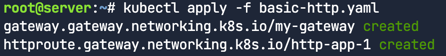

# Cilium Gateway API

사전 준비 
- Cilium은 `kubeProxyReplacement`을 true로 설정
- Gateway API의 CRD를 설치

kubectl get crd 커맨드로 설치 되었는지 확인
```bash
kubectl get crd \
  gatewayclasses.gateway.networking.k8s.io \
  gateways.gateway.networking.k8s.io \
  httproutes.gateway.networking.k8s.io \
  referencegrants.gateway.networking.k8s.io \
  tlsroutes.gateway.networking.k8s.io
```


Cilium 설치

```bash 
cilium install --version v1.17.4 \
  --namespace kube-system \
  --set kubeProxyReplacement=true \
  --set gatewayAPI.enabled=true \
```

cilium status로 올바르게 설치 되었는지 상태를 확인한다. 아래의 명령어는  Cilium이 
정상상태로 작동될때까지 대기한 후 상태를 보고한다.  

```bash
cilium status --wait
```


Cilium이 Gateway API feature와 함께 배포 되어 활성화 되었는지 확인
```bash
cilium config view | grep -w "enable-gateway-api"
```


## GatewayClass와 Gateway
사전에 미리 CRDs를 설치했다면, 설치 도중에  Cilium에 의해 GatewayClass가 배포된다.
(Gateway API 옵션이 선택되었다고 가정)

GatewayClass가 배포되었는지 확인한다.


GatewayClass는 배포될 수 있는 일종의 Gateway다. 다시 말해, GatewayClass는 템플릿과 같은 역할을 하며. 이러한 방식은 인프라 프로바이더가 다양한 종류의 Gateway를 제공할 수 있도록 하기 위함이다. 사용자는 자신이 원하는 Gateway를 선택해서 사용할 수 있다.

예를 들어, 한 인프라 제공자는 인터넷 연결용과 내부 네트워크용을 구분하기 위해 `internet`과 `private`이라는 두 개의 GatewayClass를 만들 수 있다.

여기서는 Cilium Gateway API(io.cilium/gateway-controller)가 실제로 사용될 것이다.

아래 다이어그램은 Gateway API에서 사용되는 다양한 구성 요소를 보여준다. Ingress를 사용할 때는 모든 기능이 하나의 API에 정의되어 있었다. 반면, Gateway API는 인그레스 라우팅 요구사항을 여러 API로 분리하여 사용자에게 더 일반적이고 유연하며 역할에 따라 구분된 모델을 제공한다.


실제 L7(레이어 7) 트래픽 규칙은 HTTPRoute API에 정의된다.


## Bookinfo 애플리케이션 배포
이번에는 `Bookinfo`이라는 애플리케이션을 배포하고 Gateway API HTTPRoute를 설정하여 HTTP 트래픽을 클러스터 내부로 라우팅을 진행해본다. 

서비스 종류
- details
- ratings
- reviews
- productpage


배포 시도
```bash
kubectl apply -f /opt/bookinfo.yml
```

실제 yaml파일 link
https://raw.githubusercontent.com/istio/istio/release-1.12/samples/bookinfo/platform/kube/bookinfo.yaml


파드 배포 확인
```bash
kubectl get pods
```


네임스페이스에 여러개의 파드가 배포되는 것을 확인할 수 있다. Cilium Service Mesh에서는
각 데모 앱 마이크로서비스와 함께 Envoy 사이드카가 생성되지 않는다. 사이드카를 구현하면 출력에 마이크로 서비스용 사이드카 하나와 Envoy
사이드카용 사이드카 하나가 표시된다. 

서비스 배포 확인
```bash
kubectl get svc
```


## Gateway 배포

```bash
kubectl apply -f basic-http.yaml
```


자세히 살펴보기
```bash
yq basic-http.yaml
```


먼저, Gateway 섹션을 보면 `gatewayClassName` 필드의 값이 `cilium`으로 되어 있는 것을 확인할 수 있다. 이는 이전에 설정한 Cilium `GatewayClass`를 참조한다.
이 `Gateway`는 클러스터로 들어오는(남쪽 방향, southbound) HTTP 트래픽을 위해 80번 포트를 수신한다. `allowedRoutes` 필드는 이 `Gateway`에 연결될 수 있는 `Route`의 네임스페이스를 지정한다. `Same`은 이 `Gateway`와 동일한 네임스페이스에 있는 Route만 사용될 수 있음을 의미한다.

만약 Same 대신 All을 사용했다면, 이 Gateway를 어떤 네임스페이스에 있는 Route와도 연결할 수 있게 된다. 이를 통해 여러 팀이 관리하는 다양한 네임스페이스에서 하나의 Gateway를 공유하여 사용할 수 있다.
`HTTPRoute`에서는 서로 다른 네임스페이스를 지정할 수도 있다. 예를 들어, 결제 애플리케이션이 배포된 네임스페이스로 https://acme.com/payments 트래픽을 보내고, 광고 팀의 애플리케이션이 있는 네임스페이스로 https://acme.com/ads 트래픽을 보낼 수 있다.

이제 `HTTPRoute` 매니페스트를 살펴보자. `HTTPRoute`는 HTTP 요청을 `Gateway` 리스너에서 쿠버네티스 서비스로 라우팅하는 동작을 지정하는 Gateway API 타입이다.
이것은 사용자의 요구사항에 따라 트래픽을 전달하는 Rules(규칙)로 구성된다.

첫 번째 `Rule`은 기본적으로 간단한 L7 프록시 라우트이다. 즉, 경로가 `/details`로 시작하는 HTTP 트래픽을 details 서비스의 9080번 포트로 전달한다.


두번째 규칙은 첫 번째 규칙과 비슷하지만, 다른 매칭 기준을 활용한다

이 규칙에 따르면, 다음의 세 가지 조건을 모두 만족하는 HTTP 요청이 들어올 경우, 트래픽을 productpage 서비스의 9080번 포트로 보낸다.

- **magic**이라는 이름의 HTTP 헤더 값이 **foo**일 것
- HTTP 메서드가 **GET**일 것
- **great**이라는 이름의 HTTP 쿼리 파라미터 값이 **example**일 것


보다시피, 이제 일관된 L7 트래픽 규칙을 배포할 수 있다. 이전의 Ingress API에서는 이러한 라우팅 목표를 달성하기 위해 종종 어노테이션(annotation)이 필요했고, 이는 Ingress 컨트롤러마다 불일치를 야기했다.
새로운 Gateway API의 장점 중 하나는 기능이 두 가지 역할로 분리되었다는 점인데 하나는 Gateway 자체를 정의하는 역할이고, 다른 하나는 백엔드 서비스로 향하는 Route를 정의하는 역할이다.
이 두 기능을 분리함으로써, 운영자는 Gateway를 변경하거나 교체하더라도 동일한 라우팅 설정을 유지할 수 있다.
다시 말해, 만약 다른 Gateway API 컨트롤러를 사용하기로 결정하더라도, 기존의 매니페스트를 그대로 재사용할 수 있다.


서비스 확인
- `cilium-gateway-my-gateway`이라는 로드밸런서를 확인할 수 있다. 이 서비스는 Gateway API를 위해 만들어진 것이다. 
>이 랩 환경이 시작될 때 Cilium이 설치되면서 LoadBalancer 기능이 활성화되었다. 따라서 Cilium은 이 기능을 이용해 자동으로 IP 주소를 할당하고, 이 IP 주소를 로컬 L2(레이어 2)를 통해 외부에 알린다. 사용자의 터미널에서 Gateway IP 주소로 연결이 가능한 이유가 바로 이 때문이다.
 
 


외부 IP를 확인
```bash
kubectl get gateway
GATEWAY=$(kubectl get gateway my-gateway -o jsonpath='{.status.addresses[0].value}')
echo $GATEWAY
```


## HTTP 경로 일치

아래와 같이 Gateway API에 의해 프록시된 URL 경로를 베이르소 트래픽을 체크해보자. 
```bash
curl --fail -s http://$GATEWAY/details/1 | jq
```


`/details` 경로로 시작하는 패스는 첫번째 규칙을 충족하므로 port 9080에 대해서 details 서비스로 프록시 된다. 

## HTTP 헤더 매칭
이번에는 header값, 파라메터와 같은 HTTP 파라메터를 베이스로 트래픽 라우팅을 진행해본다. 

```bash
curl -v -H 'magic: foo' "http://$GATEWAY?great=example" 
```


성공적으로 200 code를 리턴하며 HTML응답을 하는 것을 보여주고 있다. 


## HTTPS Gateway  배포

### TLS 자격 그리고 private 키 생성
이번에는 HTTPS 트래픽 라우팅을 위한 Gateway API를 사용할 것이다. 그러므로 우리는 데이터 암호화를 위해 TLS 증명서가 필요하다. 

self-signed CA로 서명된 TLS를 사용하며 이를 쉽게 만드는 한가지 방법은 mkcert를 이용하는 것이다. 
이 Gateway 예제에서는 bookinfo.cilium.rocks와 hipstershop.cilium.rocks라는 호스트 이름을 사용하므로 두 도메인을 모두 유효하게 만드는
인증서를 생성해야한다. 

```bash
mkcert '*.cilium.rocks'
```


<br>

mkcert는 Gateway 서비스에 사용할 키(`_wildcard.cilium.rocks-key.pem`)와 인증서(`_wildcard.cilium.rocks.pem`)를 생성

```bash
kubectl create secret tls demo-cert \
  --key=_wildcard.cilium.rocks-key.pem \
  --cert=_wildcard.cilium.rocks.pem
```


### Gateway 배포

해당 yaml파일을 살펴보고 Gateway를 배포한다. 

```bash
yq basic-https.yaml
```
Gateway 매니페스트에서 다음 부분을 확인


HTTPRoute 매니페스트에서 다음 부분을 확인


HTTPS Gateway API 예제는 기존 HTTP 예제를 기반으로 두 개의 HTTP 경로에 대한 TLS 종단(termination)을 추가한다
- `/details` 접두사는 이전에 HTTP 챌린지에서 배포했던 `details` HTTP 서비스로 라우팅된다.
- `/` 접두사는 HTTP 챌린지에서 배포했던 `productpage` HTTP 서비스로 라우팅된다.
- 이 두 서비스는 TLS를 통해 보안이 강화되며, 다음 두 도메인으로 접근 가능하다.
  - bookinfo.cilium.rocks
  - hipstershop.cilium.rocks
이 예제에서는 Gateway가 `demo-cert Secret` 리소스에 정의된 TLS 인증서를 `bookinfo.cilium.rocks`와 `hipstershop.cilium.rocks`로 들어오는 모든 요청에 대해 제공한다.

적용하자.
```bash
kubectl apply -f basic-https.yaml
```


그리고 GATEWAY 변수에 IP를 할당하여 사용
```bash
GATEWAY=$(kubectl get gateway tls-gateway -o jsonpath='{.status.addresses[0].value}')
echo $GATEWAY
```


### 요청 생성

Mkcert CA를 인스톨하자. 
```bash
mkcert -install
```


Gateway에 대한 요청
```bash
curl -s \
  --resolve bookinfo.cilium.rocks:443:${GATEWAY} \
  https://bookinfo.cilium.rocks/details/1 | jq
```


HTTPS(TLS 핸드쉐이크가 적절하게 아카이브 된) 사용하여 적절하게 데이터가 리턴되었음을 확인할 수 있다. 


## TLSRoute
이전 작업에서 우리는 TLS 종단(Termination)에 대해 살펴보았다. 이는 클라이언트로부터 들어오는 HTTPS 트래픽을 Gateway가 종료시키고, 경로, 메서드, 헤더 같은 HTTP 속성을 기반으로 암호화되지 않은 HTTP 트래픽을 라우팅하는 방식이다.
이번 작업에서는 TLSRoute에 대해 알아본다. TLSRoute 리소스는 TLS 트래픽을 클라이언트로부터 Pod까지 그대로 통과(passthrough)시킨다.
즉, 트래픽이 종단 간(end-to-end)으로 암호화된 상태로 유지할 있다. 


## 데모앱 배포
먼저 nginx 웹서버를 사용할 것이므로 NGINX configuration을 확인한다. 

```bash
cat nginx.conf
```


보다시피 SSL 트래픽을 위해 443번 포트를 수신한다. 이전에 생성했던 인증서와 키를 지정했다는 점에서 주목

서버를 배포할 때는 이 파일을 /etc/nginx-server-certs에 마운트해야한다. nginx 서버 설정은 쿠버네티스 configmap에 저장된다.

```bash
kubectl create configmap nginx-configmap --from-file=nginx.conf=./nginx.conf
```

```bash
yq tls-service.yaml
```


nginx 이미지를 가진 컨테이너를 배포하며 HTML index, NGINX configuration과 인증서와 같은 여러 파일들을 마운트하고있다. 
이전에 만들었던 `demo-cert` TLS 시크릿을 재사용하고있다는 점도 주목한다. 

배포후 확인
```bash
kubectl apply -f tls-service.yaml
kubectl get svc,deployment my-nginx
```

성공적으로 배포하였다.


## 게이트웨이 배포

```bash
yq tls-gateway.yaml \
   tls-route.yaml
```

Gateway API 설정 파일 검토
현재 디렉터리에 있는 tls-gateway.yaml과 tls-route.yaml 파일을 보면, 이전 작업에서 검토했던 것과 거의 동일하다니다. 
단, Gateway 매니페스트에서 Passthrough 모드가 설정된 것이 다르다.


또한 이전에는 HTTPRoute 리소스를 사용했지만 이번에는 TLSRoute를 사용한다.


```bash
kubectl apply -f tls-gateway.yaml -f tls-route.yaml
```

### Terminate vs. Passthrough 모드
Gateway에서 TLS 연결을 종료하는 Terminate 모드와는 달리, 이번에는 Gateway가 Passthrough 모드로 작동한다.
이 두 모드의 주요 차이점은 트래픽의 암호화 상태.

- Terminate 모드: 클라이언트와 Gateway 사이는 HTTPS로 암호화되지만, **Gateway에서 Pod까지는 HTTP로 암호화가 해제된 상태**로 전달된다. 
  - 클라이언트 -> Gateway: HTTPS
  - Gateway -> Pod: **HTTP**

- Passthrough 모드: 트래픽이 클라이언트에서 **Gateway를 거쳐 Pod까지 종단 간(end-to-end)으로 HTTPS 암호화가 유지**된다.
  - 클라이언트 -> Gateway: HTTPS
  - Gateway -> Pod: **HTTPS**

Gateway는 라우팅을 위해 SNI(Server Name Indication) 헤더를 사용하는 것 외에는 트래픽을 실제로 검사하지 않는다.
hostnames 필드는 SNI 셋을 정의하는데 TLS 핸드셰이크의 내의 TLS ClientHello 메시지에 있는 SNI 속성과 일치해야한다. 

<br>

LoadBalancer 서비스를 생성한다.
```bash
kubectl apply -f tls-gateway.yaml -f tls-route.yaml
```
<br>

Gateway에 로드 밸런서 IP 주소가 할당되었는지 확인

```bash
kubectl get gateway cilium-tls-gateway
```


<br>

GATEWAY  변수에 IP지정
```bash
GATEWAY=$(kubectl get gateway cilium-tls-gateway -o jsonpath='{.status.addresses[0].value}')
echo $GATEWAY
```


<br>

프로비저닝 된 TLSRoute를 체크.
```bash
kubectl get tlsroutes.gateway.networking.k8s.io -o json | jq '.items[0].status.parents[0]'
```
<br>

결과 확인


## TLS 요청 생성

```bash
curl -v \
  --resolve "nginx.cilium.rocks:443:$GATEWAY" \
  "https://nginx.cilium.rocks:443"
```

이 명령어를 실행하면 HTTPS를 사용하여 데이터가 올바르게 검색될 것이다.
(이는 TLS 핸드셰이크가 성공적으로 이루어졌음을 의미한다.)

- 443번 포트 연결: `Connected to nginx.cilium.rocks (172.18.255.200) port 443`과 같은 메시지를 통해 443번 포트로 연결이 이루어졌음을 알 수 있다.
- TLS 핸드셰이크 및 버전 협상: TLS 핸드셰이크가 진행되고 TLS 버전이 협상되는 과정을 볼 수 있다. TLSv1.3이 사용되었을 것으로 예상된다.
- 인증서 검증 성공: `SSL certificate verify ok` 메시지가 나타나면 인증서 검증이 성공적으로 완료된 것

- 

## Traffic splitting

트래픽 분할이란?
운영자가 새로운 버전의 애플리케이션을 도입할 때, 일반적으로 전체 트래픽 중 일부만 새로운 백엔드로 보내 사용자 반응이나 부하 상태에서의 애플리케이션 성능을 확인한다. 
이는 A/B 테스트, 블루/그린(blue-green) 배포, 또는 **카나리 릴리스(canary releases)**라고도 불린다.
Cilium Gateway API를 사용하면 이제 이러한 작업을 별도의 도구나 서비스 메시를 설치할 필요 없이 기본 기능으로 수행할 수 있다. 
또한 Cilium Gateway API의 가중치(weights)를 설정하여 트래픽을 손쉽게 나눌 수도 있다.

### 애플리케이션 배포
먼저, 클러스터에 샘플 echo 애플리케이션을 배포한다.
이 애플리케이션은 클라이언트의 요청에 응답할 때, 요청을 받은 Pod와 Node에 대한 정보를 응답 본문에 포함시킨다
우리는 이 정보를 활용해 트래픽이 여러 쿠버네티스 서비스로 분할되는 것을 보여준다.

애플리케이션을 배포
```bash
kubectl apply -f echo-servers.yaml
```

<br>

여러 개의 Pod와 Service가 배포되는 것을 확인한다. `echo-1`과 `echo-2`라는 두 개의 서비스로 트래픽이 분할
```bash
yq echo-servers.yaml
```

```yaml
---
apiVersion: v1
kind: Service
metadata:
  labels:
    app: echo-1
  name: echo-1
spec:
  ports:
    - port: 8080
      name: high
      protocol: TCP
      targetPort: 8080
  selector:
    app: echo-1
---
apiVersion: apps/v1
kind: Deployment
metadata:
  labels:
    app: echo-1
  name: echo-1
spec:
  replicas: 1
  selector:
    matchLabels:
      app: echo-1
  template:
    metadata:
      labels:
        app: echo-1
    spec:
      containers:
        - image: gcr.io/kubernetes-e2e-test-images/echoserver:2.2
          name: echo-1
          ports:
            - containerPort: 8080
          env:
            - name: NODE_NAME
              valueFrom:
                fieldRef:
                  fieldPath: spec.nodeName
            - name: POD_NAME
              valueFrom:
                fieldRef:
                  fieldPath: metadata.name
            - name: POD_NAMESPACE
              valueFrom:
                fieldRef:
                  fieldPath: metadata.namespace
            - name: POD_IP
              valueFrom:
                fieldRef:
                  fieldPath: status.podIP
---
apiVersion: v1
kind: Service
metadata:
  labels:
    app: echo-2
  name: echo-2
spec:
  ports:
    - port: 8090
      name: high
      protocol: TCP
      targetPort: 8080
  selector:
    app: echo-2
---
apiVersion: apps/v1
kind: Deployment
metadata:
  labels:
    app: echo-2
  name: echo-2
spec:
  replicas: 1
  selector:
    matchLabels:
      app: echo-2
  template:
    metadata:
      labels:
        app: echo-2
    spec:
      containers:
        - image: gcr.io/kubernetes-e2e-test-images/echoserver:2.2
          name: echo-2
          ports:
            - containerPort: 8080
          env:
            - name: NODE_NAME
              valueFrom:
                fieldRef:
                  fieldPath: spec.nodeName
            - name: POD_NAME
              valueFrom:
                fieldRef:
                  fieldPath: metadata.name
            - name: POD_NAMESPACE
              valueFrom:
                fieldRef:
                  fieldPath: metadata.namespace
            - name: POD_IP
              valueFrom:
                fieldRef:
                  fieldPath: status.podIP
```


애플리케이션이 제대로 배포되었는지 확인
```bash
kubectl get pods
```


서비스가 제대로 배포되었는지 확인
```bash
kubectl get svc
```


이 서비스들은 클러스터 내부에서만 접근 가능한 ClusterIP 타입이므로, 클러스터 외부에서는 직접 접근할 수 없다.


### 트래픽 로드밸런싱

HTTPRoute를 배포
```bash
kubectl apply -f load-balancing-http-route.yaml
```

HTTPRoute 매니페스트 파일을 검토
 - 규칙은 기본적으로 간단한 L7 프록시 라우트
   - `/echo`로 시작하는 HTTP 트래픽을 각각 8080 포트와 8090 포트로 echo-1 및 echo-2 서비스로 전달하는 역할을 함
   - 가중치 50 대 50으로 설정
```bash
yq load-balancing-http-route.yaml
```


### 트래픽 분할

Gateway와 연결된 IP 주소를 다시 가져온다.
```bash
GATEWAY=$(kubectl get gateway my-gateway -o jsonpath='{.status.addresses[0].value}')
echo $GATEWAY
```

URL 경로를 기반으로 Gateway API가 트래픽을 프록시하는지 확인
```bash
curl --fail -s http://$GATEWAY/echo
```


응답에서 요청을 받은 Pod의 이름을 확인
```bash
Hostname: echo-1-597b976bc7-nkx72
```


루프를 돌려서 요청 횟수를 세어 트래픽이 여러 Pod에 균등하게 분할되는지  확인
```bash
for _ in {1..500}; do
  curl -s -k "http://$GATEWAY/echo" >> curlresponses.txt;
done
```


응답이 (대략적으로) 균등하게 분산되었는지 확인 (248 vs 252)
```bash
grep -o "Hostname: echo-." curlresponses.txt | sort | uniq -c
```


### 99/1 트래픽 분할

이전 매니페스트를 수정해서 다시 적용하거나, vi 에디터를 사용해서 API 서버에 있는 HTTPRoute를 직접 편집한다.
**echo-1**과 **echo-2**의 가중치를 각각 50에서 echo-1은 1, echo-2는 99로 바꾸고 저장

```bash
kubectl edit httproute load-balancing-route
```


아래 메세지가 보이면 수정 성공


수정된 가중치로 트래픽 확인
```bash
for _ in {1..500}; do
  curl -s -k "http://$GATEWAY/echo" >> curlresponses991.txt;
done
```

마지막으로, **echo-2**에 약 99%, **echo-1**에 약 1%의 응답이 분산되었는지 확인
```bash
grep -o "Hostname: echo-." curlresponses991.txt | sort | uniq -c
```


