# Gateway　API의 고급 사용 사례 (Advanced Gateway API Use Cases) 

## 사전 준비 사항

- Cilium은 `kubeProxyReplacement`를 true로 설정


- CRD가 사용 가능한지 확인
```bash
kubectl get crd \
  gatewayclasses.gateway.networking.k8s.io \
  gateways.gateway.networking.k8s.io \
  httproutes.gateway.networking.k8s.io \
  referencegrants.gateway.networking.k8s.io \
  tlsroutes.gateway.networking.k8s.io \
  grpcroutes.gateway.networking.k8s.io
```
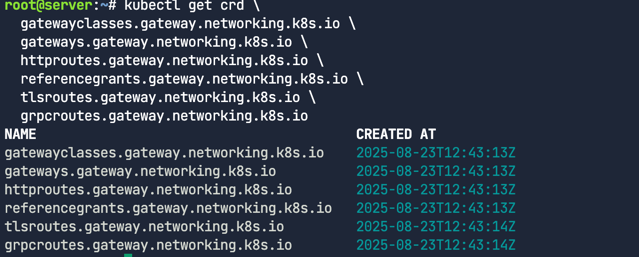

이번 실습 랩에서는 이미 아래와 같은 flag로 Cilium이 설치 되어있다. 
```bash
--set kubeProxyReplacement=true \
--set gatewayAPI.enabled=true
```

Cilium이 제대로 설치되었는지 확인
```bash
cilium status --wait
```

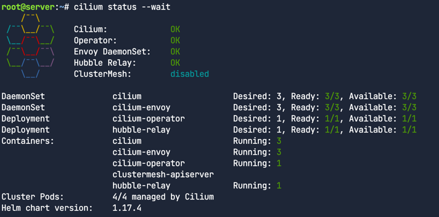

Cilium이 Gateway API 기능과 함께 활성화되고 배포되었는지 확인
```bash
cilium config view | grep -w "enable-gateway-api "
```
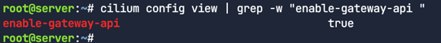

## 로드밸런서
Cilium Service Mesh Gateway API 컨트롤러는 LoadBalancer 타입의 쿠버네티스 서비스를 생성하는 기능이 필요하다.
가상 머신에서 Kind를 사용한다면, 클라우드 제공자가 제공하는 로드 밸런서 통합 기능을 활용할 수 없다.
따라서 이 랩에서는 Cilium 자체의 LoadBalancer 기능을 사용한다.
이 기능은 LoadBalancer 서비스에 할당된 IP 주소 관리(IPAM)와 레이어 2(Layer 2)를 통한 IP 주소 알림을 제공함.


### 애플리케이션 배포
번에는 Gateway가 헤더와 다른 HTTP 매개변수를 어떻게 수정하는지 보여주기 위해 샘플 echo 애플리케이션을 배포한다.
이 앱은 응답 본문에 원래 요청 헤더에 대한 정보를 포함한다.

echo 애플리케이션 배포
```bash
kubectl apply -f echo-servers.yaml
```

```yaml
---
apiVersion: v1
kind: Service
metadata:
  labels:
    app: echo-1
  name: echo-1
spec:
  ports:
    - port: 8080
      name: high
      protocol: TCP
      targetPort: 8080
  selector:
    app: echo-1
---
apiVersion: apps/v1
kind: Deployment
metadata:
  labels:
    app: echo-1
  name: echo-1
spec:
  replicas: 1
  selector:
    matchLabels:
      app: echo-1
  template:
    metadata:
      labels:
        app: echo-1
    spec:
      containers:
        - image: gcr.io/kubernetes-e2e-test-images/echoserver:2.2
          name: echo-1
          ports:
            - containerPort: 8080
          env:
            - name: NODE_NAME
              valueFrom:
                fieldRef:
                  fieldPath: spec.nodeName
            - name: POD_NAME
              valueFrom:
                fieldRef:
                  fieldPath: metadata.name
            - name: POD_NAMESPACE
              valueFrom:
                fieldRef:
                  fieldPath: metadata.namespace
            - name: POD_IP
              valueFrom:
                fieldRef:
                  fieldPath: status.podIP
```

파드 배포확인
```bash
kubectl get pods
```
서비스 배포확인
```bash
kubectl get svc
```
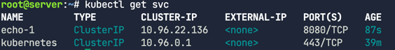

이 서비스는 ClusterIP 타입이라서 클러스터 내부에서만 접근할 수 있고, 외부에서는 접근할 수 없다.

### Gateway와 HTTPRoute 배포

Gateway와 HTTPRoute 매니페스트를 배포
```bash
kubectl apply -f gateway.yaml -f http-route.yaml
```

Gateway API를 위해 생성된 **cilium-gateway-cilium-gw**라는 이름의 LoadBalancer 서비스를 확인

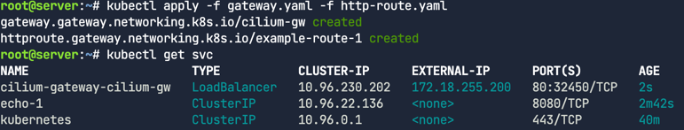

Gateway에도 주소할당 확인
```bash
kubectl get gateway
```
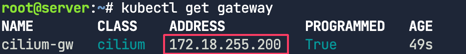

GATEWAY라는 변수에 IP할당하기
```bash
GATEWAY=$(kubectl get gateway cilium-gw -o jsonpath='{.status.addresses[0].value}')
echo $GATEWAY
```
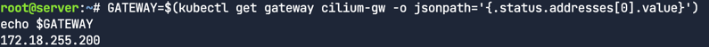

트래픽 프록시 확인. URL경로를 기반으로 Gateway API가 트래픽을 프록시하는지 확인한다. 
```bash
curl --fail -s http://$GATEWAY/echo
```
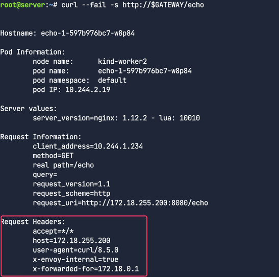

응답에서 원래 요청에 포함되었던 헤더들을 확인할 수 있다. 

## HTTP 헤더 요청 수정 (HTTP Header Request Modifier)

### HTTP 헤더 수정이란?
HTTP 헤더 수정은 들어오는 요청에 있는 HTTP 헤더를 추가, 삭제하거나 변경하는 과정이다.
Cilium Gateway API를 사용하면 들어오는 트래픽을 사용자의 특정 요구사항에 맞게 쉽게 커스터마이즈할 수 있다.

### HTTPRoute 배포

이전 작업에서 배포한 것과 동일한 Gateway를 사용해서 다음 매니페스트를 배포
```bash
kubectl apply -f echo-header-http-route.yaml
```

주석처리된 부분은 나중애 해제
```yaml
---
apiVersion: gateway.networking.k8s.io/v1beta1
kind: HTTPRoute
metadata:
  name: header-http-echo
spec:
  parentRefs:
    - name: cilium-gw
  rules:
    - matches:
        - path:
            type: PathPrefix
            value: /cilium-add-a-request-header
      #filters:
      #- type: RequestHeaderModifier
      #  requestHeaderModifier:
      #    add:
      #    - name: my-cilium-header-name
      #      value: my-cilium-header-value
      backendRefs:
        - name: echo-1
          port: 8080
```

Gateway의 IP 주소를 가져와서 확인하자.
```bash
GATEWAY=$(kubectl get gateway cilium-gw -o jsonpath='{.status.addresses[0].value}')
echo $GATEWAY
```

외부 주소로 HTTP 요청을 보낸다.
```bash
curl --fail -s http://$GATEWAY/cilium-add-a-request-header
```

응답에서 원래 요청 헤더를 볼 수 있다.
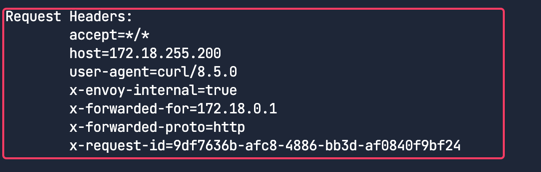

이제 에디터로 돌아가서 echo-header-http-route.yaml 파일의 주석처리된 줄을 해제한다. 

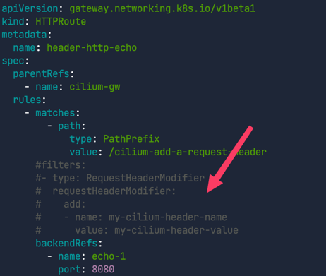

HTTPRoute를 재적용한다.

```bash
kubectl apply -f echo-header-http-route.yaml
```

이제 Cilium Gateway API가 헤더르 수정했는지 확인해본다. 동일한 주소로 curl 요청을 다시보낸다.

```bash
curl --fail -s http://$GATEWAY/cilium-add-a-request-header
```

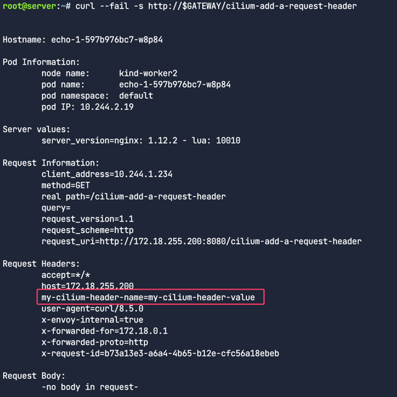

응답의 Request Headers 섹션에 my-cilium-header-name=my-cilium-header-value 헤더가 추가된 것을 확인할 수 있다.


### 관측가능성

Hubble로 트래픽을 관찰해본다. 먼저 hubble 커맨드를 이용해서 트래픽을 필터링해보자.  
```bash
hubble observe --http-path "/cilium-add-a-request-header"
```

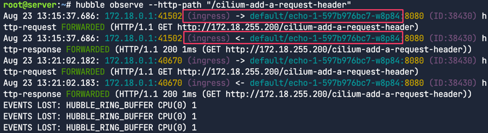

이 출력을 통해 트래픽이 Cilium L7 Ingress(Gateway API를 구현)을 통해 전송되었고 HTTP 경로와 같은 레이어 7 필터를 사용해서 트래픽을 관찰할 수 있다는 것을 알 수 있다.

## HTTP 응답 헤더 재작성 기능
요청 헤더를 수정하는 것이 유용하듯, 응답 헤더도 마찬가지로 재작성이 가능하다.
예를 들어, 특정 백엔드로 리디렉션된 사용자를 식별하기 위해 특정 백엔드에 대해서만 쿠키를 추가하거나 삭제할 수 있다.

또 다른 사용 사례로는, 프론트엔드가 백엔드 서버가 안정(stable) 버전인지 베타(beta) 버전인지 알아야 할 때가 있다.
이를 통해 프론트엔드는 다른 UI를 렌더링하거나 응답을 적절히 파싱할 수 있게 된다.


### 응답 헤더 수정

HTTPRoute를 배포한다.
```bash
kubectl apply -f response-header-modifier-http-route.yaml
yq response-header-modifier-http-route.yaml
```

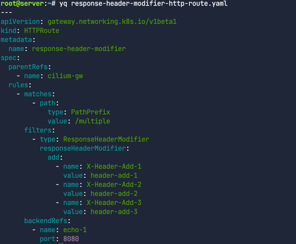

이번에는 type: ResponseHeaderModifier 필터를 사용해서 응답 헤더를 수정하는 것에 주목하자. 한 번에 3개의 헤더를 추가한다.


Gateway IP 주소 확인 및 요청 보내기
```bash
GATEWAY=$(kubectl get gateway cilium-gw -o jsonpath='{.status.addresses[0].value}')
echo $GATEWAY
```

패킷 본문에 원래 요청에 대한 세부 정보가 포함
```angular2html
curl --fail -s http://$GATEWAY/multiple
```
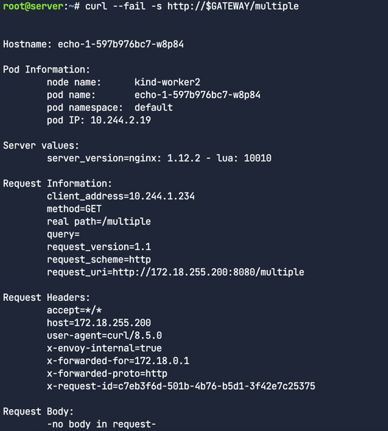


응답 본문의 요청 헤더 섹션만 보기
```bash
curl --fail -s http://$GATEWAY/multiple | grep "Request Headers" -A 10
```
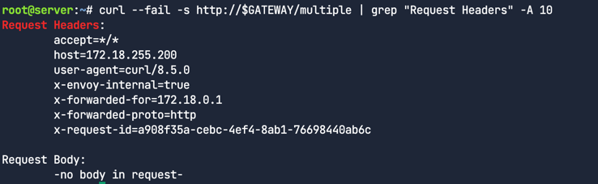


응답의 헤더를 보려면 curl을 상세 모드(-v)로 실행해야한다.
```angular2html
curl -v --fail -s http://$GATEWAY/multiple
```


아래와 같이 `<`로 시작하는 필드에서 응답헤더를 볼 수 있다. Gateway API가 응답에 추가한 헤더들을 확인

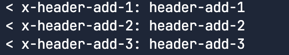

Cilium Gateway API를 사용하면 들어오는 요청이나 나가는 응답의 HTTP 트래픽을 수정하는 것은 굉장히 간단한 것을 알 수있다.

## HTTP 트래픽 미러링

트래픽 미러링은 특정 백엔드로 향하는 트래픽을 다른 백엔드로 복사해서 보내는 기능이다.
이 기능은 다음과 같은 상황에서 특히 유용하다.
- 새로운 서비스 버전 도입 : v2와 같은 새로운 버전의 서비스를 도입할 때, 실제 사용자 트래픽을 그대로 복제해서 v2 백엔드로 보내는 방식으로 테스트할 수 있다. 이를 통해 실제 트래픽 환경에서 v2의 성능이나 안정성을 미리 검증할 수 있다.
- 문제 해결 및 분석 : 실시간 트래픽을 복제해서 분석 도구로 보내면, 프로덕션 환경에 영향을 주지 않고 문제를 진단하거나 사용자 행동을 분석이 가능하다.

### 미러링
Gateway를 사용해서 한 백엔드로 향하는 트래픽을 다른 백엔드로 미러링을 한다.
새로운 데모앱을 배포 한다. (파드와 서비스)
- infra-backend-v1
- infra-backend-v2 (infra-backend-v1으로 들어오는 트래픽을 infra-backend-v2로 미러링)

배포 확인
```bash
kubectl get -f demo-app.yaml
```
다른 백엔드로 트래픽을 미러링하는 것은 문제 해결, 분석, 그리고 관찰 가능성을 높이는 데 유용하다. 트래픽을 미러링하더라도
그 백엔드로부터의 응답은 무시한다.


HTTPRoute를 배포
```bash
kubectl apply -f http-mirror-route.yaml
yq .spec http-mirror-route.yaml
```

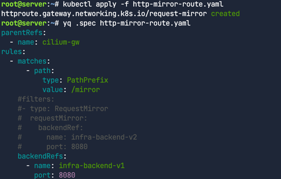


```bash
GATEWAY=$(kubectl get gateway cilium-gw -o jsonpath='{.status.addresses[0].value}')
echo $GATEWAY
```
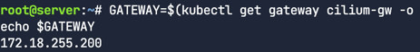

```bash
curl -s http://$GATEWAY/mirror | jq
```

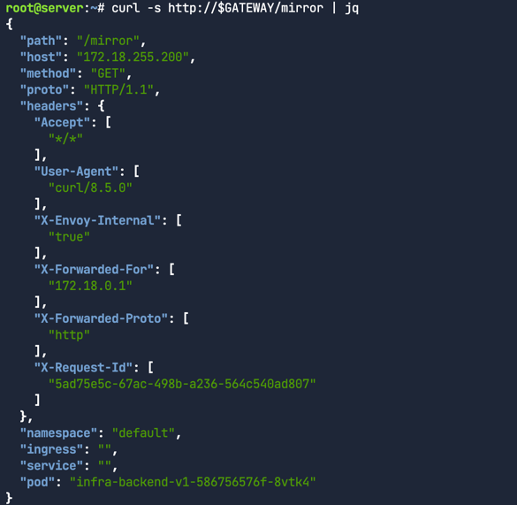


백엔드 로그탭 확인
infra-backend-v1, infra-backend-v2 파드는 접근 로그를 모니터링 중
현재는 왼쪽 패널에서만 로그가 보임
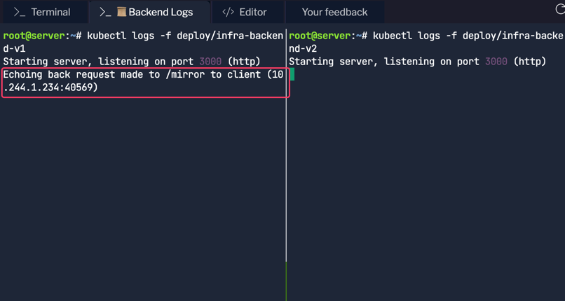


### HTTPRoute 수정 및 재적용

에디터에서 http-mirror-route.yaml 파일의 filters 섹션(14-19행)의 주석을 해제후 재적용
```yaml
apiVersion: gateway.networking.k8s.io/v1beta1
kind: HTTPRoute
metadata:
  name: request-mirror
spec:
  parentRefs:
  - name: cilium-gw
  rules:
  - matches:
    - path:
        type: PathPrefix
        value: /mirror
    filters:
    - type: RequestMirror      
      requestMirror:
        backendRef:
          name: infra-backend-v2
          port: 8080
    backendRefs:
    - name: infra-backend-v1
      port: 8080
```

재적용
```bash
kubectl apply -f http-mirror-route.yaml
```

미러링을 위해 트래픽을 요청해본다. 

```bash
curl -s http://$GATEWAY/mirror | jq
```

화면이 분할된 양쪽 패널 모두에 로그가 보인다. 이는 트래픽이 infra-backend-v1뿐만 아니라 infra-backend-v2에도 복제되어 전송되었다는 것을 의미한다.

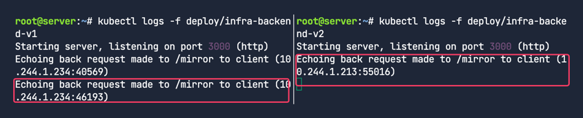

## HTTP URL 재작성

URL 재작성은 클라이언트의 요청이 프록시되기 전에 사용된 URL을 수정하는 기능이다.
- 경로(Path) 수정: 클라이언트가 `/v1/api/users`로 요청을 보냈을 때, 백엔드 서비스에서는 `/users`와 같이 API 버전을 제거한 경로로 보내야 할 때
- 호스트명(Hostname) 변경: 여러 도메인(예: blog.example.com, shop.example.com)으로 들어오는 트래픽을 단일 백엔드 서비스(예: main-service)로 라우팅하면서, 백엔드가 올바른 호스트명을 인식하도록 수정해야 할 때


### HTTPRoute 작성

```
yq http-rewrite-route.yaml
```

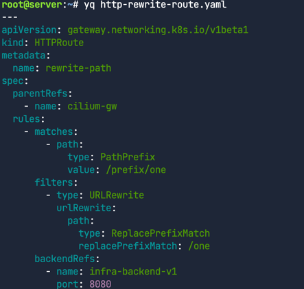

```bash
kubectl apply -f http-rewrite-route.yaml
```

아래와 같이 규칙을 살펴본다. 
- 요청 URL의 /prefix/one을 /one으로 교체하는 역할
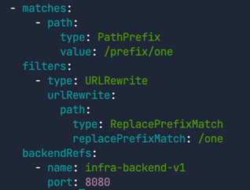


Gateway API가 URL 경로를 프록시하고 수정하는지 확인해 보자. 다음 명령어로 외부 주소와 경로로 HTTP 요청을 보낸다.
```
curl -s http://$GATEWAY/prefix/one | jq
```

요청에 대한 응답을 보면, 에코 서버가 원래 요청을 복사해서 패킷 본문에 응답을 보내준 것을 알 수 있어.

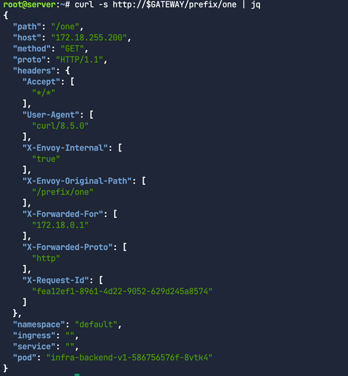


이 출력은 Gateway가 원래 요청의 경로를 `/prefix/one`에서 `/one`으로 변경했다는 것을 보여준다.
출력 결과의 "path" 필드를 보면 확인할 수 있다. L7 트래픽 처리에 Envoy를 사용하기 때문에, Envoy는 패킷에 원래 경로(`"X-Envoy-Original-Path"`)에 대한 정보도 추가한다.
또한, HTTP 요청의 URL 재작성은 이전 랩에서 다뤘던 기능들과 결합해서 사용할 수 있다. 예를 들어, URL 경로를 재작성하면서 동시에 커스텀 HTTP 헤더를 추가할 수도 있다


## HTTP Traffice Redirect
리디렉션은 사용자를 다른 URL로 보내는 기능이다. Gateway API를 사용하면 리디렉션 메시지에서 경로, 호스트명, 그리고 301(영구 이동)이나 302(임시 이동) 같은 HTTP 리디렉션 코드를 직접 지정할 수 있다.
이 기능은 애플리케이션을 일시적으로 또는 영구적으로 마이그레이션할 때 특히 유용하다.

### HTTP Path Redirect
이번 실습에서는 HTTP 트래픽을 리다이렉트 할 것이다. 
HTTPRoute를 배포하고 Gateway IP주소 획득.

```bash
kubectl apply -f redirect-route.yaml
GATEWAY=$(kubectl get gateway cilium-gw -o jsonpath='{.status.addresses[0].value}')
echo $GATEWAY
```

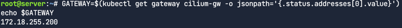

redirect-route.yaml 파일의 첫 번째 규칙을 살펴보자.
```bash
yq '.spec.rules[0]' redirect-route.yaml
```
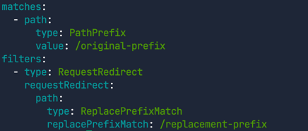
이 설정은 /original-prefix로 들어오는 요청을 /replacement-prefix로 리디렉션하는 규칙이다.

```bash
curl -l -v http://$GATEWAY/original-prefix
```

curl 명령어에 -l 옵션을 사용한 것에 주목하자. 이 옵션은 리디렉션을 자동으로 따라가도록 해준다(기본적으로 curl은 리디렉션을 따라가지 않음).
또한, 응답 헤더를 보기 위해 -v(verbose) 옵션도 사용한다.

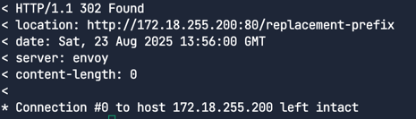
리다이렉션 메시지의 location 헤더는 클라이언트에게 새로운 목적지를 알려주는 역할을 한다.
보다시피, 클라이언트는 http://172.18.255.200:80/replacement-prefix로 리다이렉션 되었다.

### 새로운 호스트네임 및 프리픽스로 리다이렉트

```
yq '.spec.rules[1]' redirect-route.yaml
```

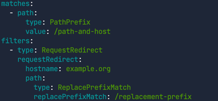
`/path-and-host` 경로로 들어오는 요청을 `example.org` 호스트의 `/replacement-prefix` 경로로 리다이렉션한다


```
curl -l -v http://$GATEWAY/path-and-host
```


클라이언트는 http://example.org:80/replacement-prefix로 리다이렉션되었다.이 예제에서는 호스트명과 경로 접두사가 모두 수정되었다.


### 리다이렉트 - 새로운 상태코드와 새로운 프리픽스
기본적으로, 리다이렉션 상태 코드는 302(임시 이동)이다. 이는 리소스가 임시로 이동했음을 의미한다.

하지만 클라이언트가 접근하려는 리소스가 영구적으로 이동했음을 알리려면 301 상태 코드를 사용할 수 있다. 
이 기능은 경로 접두사 교체와 함께 사용할 수도 있다.

```bash
yq '.spec.rules[2]' redirect-route.yaml
```

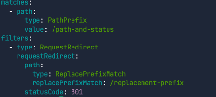

`/path-and-status` 경로로 들어오는 요청에 대해 301 상태 코드를 사용하고, `/replacement-prefix`로 리다이렉션하는 규칙


```
curl -l -v http://$GATEWAY/path-and-status
```
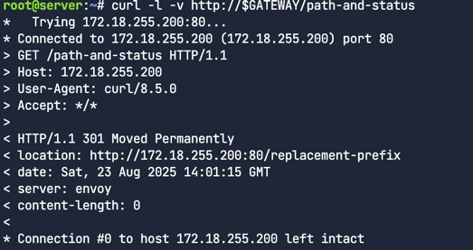


반환된 상태 코드가 **301 Moved Permanently**이고, 클라이언트는 http://172.18.255.200:80/replacement-prefix로 리다이렉션 되어있다.

### 리다이렉트 - HTTP에서 HTTPS로, 그리고 새로운 프리픽스

```
yq '.spec.rules[3]' redirect-route.yaml
```
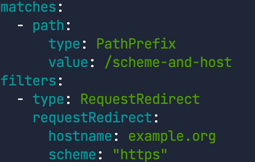
`/scheme-and-host` 경로로 들어오는 요청에 대해 `example.org` 호스트로 리디렉션하면서, 프로토콜 스키마를 `https`로 변경하는 규칙이다.


```bash
curl -l -v http://$GATEWAY/scheme-and-host
```
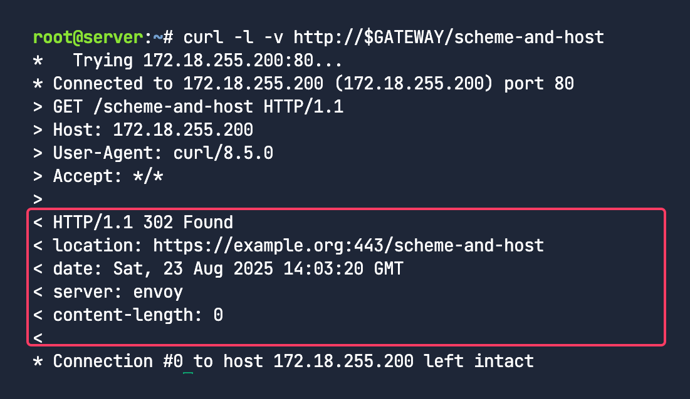

클라이언트는 처음에는 HTTP로 연결을 시도했지만, **https://example.org:443/scheme-and-host**로 리다이렉션 되어있다. 
Gateway API를 통해 스키마를 손쉽게 변경가능하다


## 네임스페이스 간 라우팅의 장점

Gateway API는 네임스페이스 간 라우팅을 핵심적으로 지원해. 이는 여러 사용자나 팀이 하나의 네트워크 인프라를 공유하면서도, 접근 및 장애 범위를 최소화하기 위해 제어와 설정이 분리되어야 할 때 매우 유용해.

Gateway와 Route는 서로 다른 네임스페이스에 배포될 수 있고, Route는 네임스페이스 경계를 넘어 Gateway에 연결될 수 있어.

이러한 분리 덕분에 Route와 Gateway에 대한 사용자 접근 제어를 네임스페이스별로 다르게 적용할 수 있어. 결과적으로, 클러스터 전반의 라우팅 설정 중 각기 다른 부분에 대한 접근과 제어를 효과적으로 분리할 수 있지.

Route가 네임스페이스 경계를 넘어 Gateway에 연결되는 기능은 Route Attachment(라우트 연결)라는 메커니즘으로 제어돼. 이 랩에서는 Route Attachment를 살펴보고, 독립적인 팀들이 어떻게 동일한 Gateway를 안전하게 공유할 수 있는지 보여줄 거야.


## 라우트 연결
Route가 Gateway에 연결되고 라우팅 규칙을 설정하는 방식을 결정하는 중요한 개념이야. 특히 여러 네임스페이스에 걸쳐 Route들이 하나 이상의 Gateway를 공유할 때 더욱 중요해.

라우트 연결의 특징
양방향성: Gateway와 Route의 연결은 양방향적이야. Gateway 소유자와 Route 소유자 모두 관계에 동의해야만 연결이 성공적으로 이루어져.

Gateway의 연결 제약(Attachment Constraints): Gateway는 리스너(listener)에 연결 제약 조건을 설정할 수 있어. 이 조건은 어떤 Route가 Gateway에 연결될 수 있는지 제한하는 역할을 해. Gateway는 네임스페이스와 Route 타입을 연결 제약 조건으로 지원해. 이 제약을 충족하지 못하는 Route는 Gateway에 연결될 수 없어.

Route의 부모 참조(parentRef): 마찬가지로, Route는 parentRef 필드를 통해 자신이 연결하려는 Gateway를 명시적으로 참조해.

이 두 가지 메커니즘이 합쳐져서 인프라 소유자와 애플리케이션 소유자 간의 핸드셰이크를 만들어 내. 이를 통해 양측이 독립적으로 애플리케이션이 Gateway를 통해 어떻게 노출될지 정의할 수 있지.

이것은 관리 부담을 줄여주는 효과적인 정책이야. 애플리케이션 소유자는 자신의 앱이 어떤 Gateway를 사용해야 하는지 지정할 수 있고, 인프라 소유자는 Gateway가 어떤 네임스페이스와 어떤 타입의 Route를 허용할지 제한할 수 있어.


### Cross-Namespaces at ACME

이번에는 가상의 ACME 회사와 그 안에 있는 세 개의 다른 비즈니스 부서를 예시로 들어 본다.
각 부서에는 자체 환경, 애플리케이션, 그리고 네임스페이스가 있다.
- 채용팀(Recruiting Team):  지원자들이 이력서를 제출할 수 있는 대외용 `careers` 앱을 운영하고 있다.
- 제품팀(Product Team): 잠재 고객이 ACME 제품에 대해 더 알아볼 수 있는 대외용 `product` 앱을 운영하고 있다.
- 인사팀(HR Team): 직원들의 개인 정보를 저장하는 내부용 `hr` 앱을 운영하고 있다.

각 앱은 자체 네임스페이스에 배포되어 있다. `careers`와 `product` 앱은 모두 대외용이기 때문에 보안팀이 공유 `Gateway API` 사용을 승인했다. 
공유 `Gateway API`의 장점은 플랫폼 및 보안팀이 인증서 관리를 포함한 `Gateway API`를 중앙에서 통제할 수 있다는 점이다.

퍼블릭 클라우드에서는 비용 절감 효과도 있다(앱당 Gateway API를 사용하면 공개 IP와 클라우드 로드 밸런서가 필요하고, 이들은 무료 자원이 아님).

하지만 보안팀은 `hr` 앱의 정보가 클러스터 외부로 노출되거나 접근되는 것을 원하지 않는다. 그래서 `hr` 네임스페이스에서 Gateway로 HTTPRoute를 연결하는 것을 승인하지 않았다.

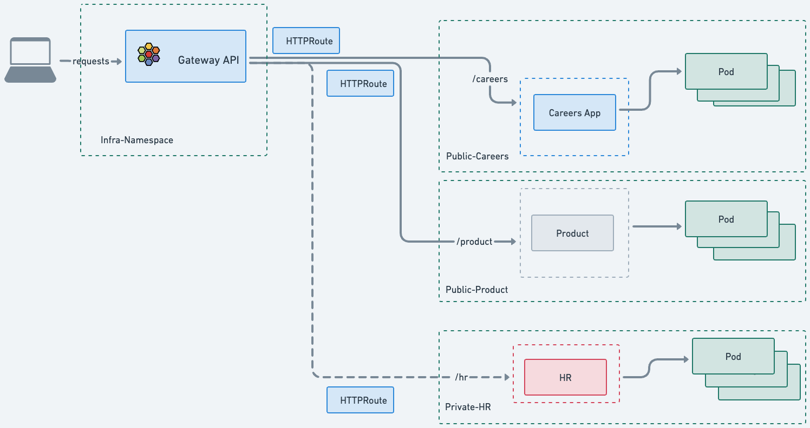

### Cross-Namespaces Gateway
작업이 시작될 때 네 개의 네임스페이스가 생성되었음.

```bash
kubectl get ns --show-labels infra-ns careers product hr
```
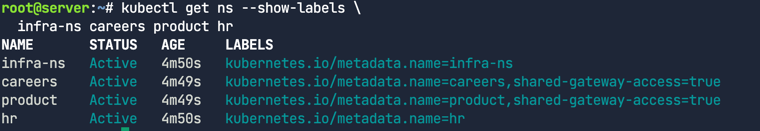
`product`와 `careers`에는 `shared-gateway-access=true` 레이블이 있지만, `hr`에는 이 레이블이 없다.


Gateway 및 HTTPRoute 배포
```bash
kubectl apply -f cross-namespace.yaml
yq cross-namespace.yaml
```


Gateway 정의에서 infra-ns 네임스페이스에 배포된 것 확인
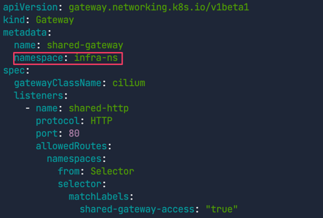

Gateway는 네임스페이스 셀렉터를 사용해서 어떤 HTTPRoute가 연결될 수 있는지 정의하고 있다.
이를 통해 인프라 팀은 특정 네임스페이스 집합을 허용 목록에 추가함으로써 어떤 앱이 이 Gateway를 사용할 수 있는지 제어할 수 있다.
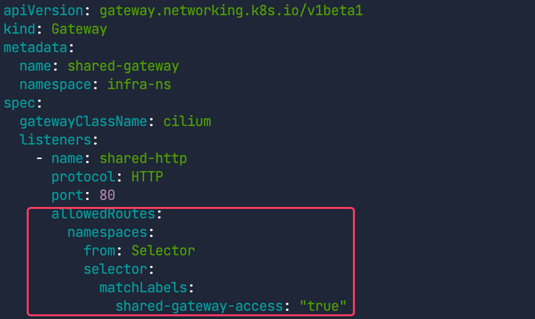
`shared-gateway-access: "true"` 레이블이 있는 네임스페이스만 공유 Gateway에 Route를 연결할 수 있따.

HTTPRoute 정의에서는 parentRefs에서 shared-gateway를 참조한다. 연결하려는 Gateway와 그 Gateway가 속한 네임스페이스를 지정했다.


HTTPRoute를 테스트하기 위해 먼저 Gateway IP를 가져온다.
```bash
GATEWAY=$(kubectl get gateway shared-gateway -n infra-ns -o jsonpath='{.status.addresses[0].value}')
echo $GATEWAY
```
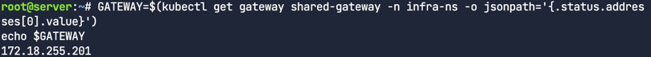


이제 `product`와 `careers` 서비스에 연결한다.
```bash
curl -s -o /dev/null -w "%{http_code}\n" http://$GATEWAY/product
```

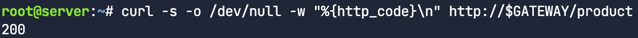
200반환

```bash
curl -s -o /dev/null -w "%{http_code}\n" http://$GATEWAY/careers
```

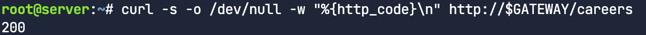
200반환


hr연결시도 
```bash
curl -s -o /dev/null -w "%{http_code}\n" http://$GATEWAY/hr
```

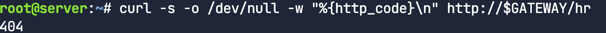
404반환

`hr` 네임스페이스의 HTTPRoute는 `infra-ns/shared-gateway`를 부모로 참조하지만, 연결 제약 조건(네임스페이스 레이블)을 충족하지 못했기 때문에 `Gateway`에 의해 무시됨
<br><br><br>

HTTPRoute의 상태를 확인해서 검증
```bash
echo "Product HTTPRoute Status"
kubectl get httproutes.gateway.networking.k8s.io -n product -o jsonpath='{.items[0].status.parents[0].conditions[0]}' | jq
echo "Careers HTTPRoute Status"
kubectl get httproutes.gateway.networking.k8s.io -n careers -o jsonpath='{.items[0].status.parents[0].conditions[0]}' | jq
echo "HR HTTPRoute Status"
kubectl get httproutes.gateway.networking.k8s.io -n hr -o jsonpath='{.items[0].status.parents[0].conditions[0]}' | jq
```

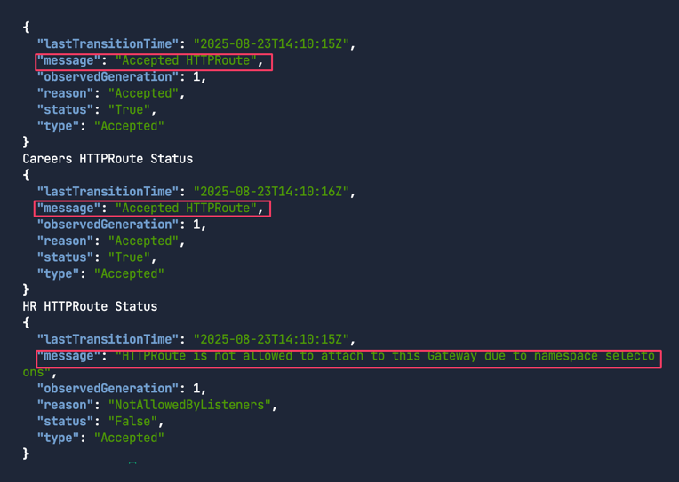

첫 두 명령어는 `Accepted HTTPRoute`를 보여주지만, 마지막 명령어는 거부되었다.(상태가 `False`이고, 메시지는 `HTTPRoute is not allowed to attach to this Gateway`로 시작한다.)
이 기능은 엔지니어들에게 다양한 선택지를 제공한다: 필요하다면 네임스페이스나 앱당 전용 `Gateway API`를 사용하거나, 중앙 집중식 관리와 비용 절감을 위해 공유 `Gateway API`를 사용할 수도 있다.

## gRPC와 Gateway API
gRPC와 Gateway API
웹 프로토콜의 왕좌는 여전히 HTTP가 차지하고 있지만, gRPC는 낮은 지연 시간과 높은 처리량 덕분에 그 사용이 점점 늘고 있다.
Cilium Gateway API를 사용해서 gRPC 애플리케이션을 위한 쿠버네티스 gRPC 라우트를 어떻게 배포하는지 살펴본다.
이번 챌린지에서는 여러 서비스로 구성된 샘플 gRPC 애플리케이션을 배포할 거야.

- 📧 email
- 🛒 checkout 및 cart
- 💡 recommendation
- 👨‍💻 frontend
- 💳 payment
- 🚚 shipping
- 💱 currency
- 📦 productcatalog

이 챌린지에서는 다음 두 가지 경로 접두사를 가진 `gRPCRoute`를 설정한다.
- `/hipstershop.ProductCatalogService`는 `productcatalog` 서비스로 연결된다.
- `/hipstershop.CurrencyService`는 currency 서비스로 연결된다.

어플리케이션 설치
```bash
kubectl apply -f /opt/gcp-microservices-demo.yml
```

gRPC는 바이너리로 인코딩되기 때문에, gRPC 요청을 보내려면 gRPC 서비스의 프로토(proto) 정의가 필요하다. 다음 명령어로 데모 앱의 proto 정의를 다운로드한다.
```bash
curl -o demo.proto https://raw.githubusercontent.com/GoogleCloudPlatform/microservices-demo/main/protos/demo.proto
```

```bash
yq grpc-route.yaml
kubectl apply -f grpc-route.yaml
# 로드 밸런서의 IP 주소를 가져와서 GATEWAY 변수에 저장
GATEWAY=$(kubectl get gateway cilium-gw -o jsonpath='{.status.addresses[0].value}')
echo $GATEWAY
```

grpc-route.yaml은 `productcatalogservice`와 `currencyservice` 마이크로서비스로 라우팅될 요청의 경로를 정의하고 있어.
```yaml
apiVersion: gateway.networking.k8s.io/v1
kind: GRPCRoute
metadata:
  name: productcatalogservice-rule
spec:
  parentRefs:
    - namespace: default
      name: cilium-gw
  rules:
    - matches:
        - method:
            service: hipstershop.ProductCatalogService
            method: ListProducts
      backendRefs:
        - name: productcatalogservice
          port: 3550
---
apiVersion: gateway.networking.k8s.io/v1
kind: GRPCRoute
metadata:
  name: currencyservice-rule
spec:
  parentRefs:
    - namespace: default
      name: cilium-gw
  rules:
    - matches:
        - method:
            service: hipstershop.CurrencyService
            method: GetSupportedCurrencies
      backendRefs:
        - name: currencyservice
          port: 7000
```


다음 명령어를 차례로 실행해서 모든 배포가 준비되었는지 확인
```bash
kubectl rollout status deploy/emailservice
kubectl rollout status deploy/checkoutservice
kubectl rollout status deploy/recommendationservice
kubectl rollout status deploy/frontend
kubectl rollout status deploy/paymentservice
kubectl rollout status deploy/productcatalogservice
kubectl rollout status deploy/cartservice
kubectl rollout status deploy/loadgenerator
kubectl rollout status deploy/currencyservice
kubectl rollout status deploy/shippingservice
kubectl rollout status deploy/redis-cart
kubectl rollout status deploy/adservice
```

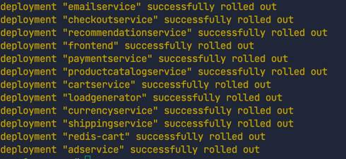


이제 쇼핑 앱이 지원하는 통화를 나열하는 애플리케이션의 CurrencyService에 접근해보자.
```bash
grpcurl -plaintext -proto ./demo.proto $GATEWAY:80 hipstershop.CurrencyService/GetSupportedCurrencies | jq
```

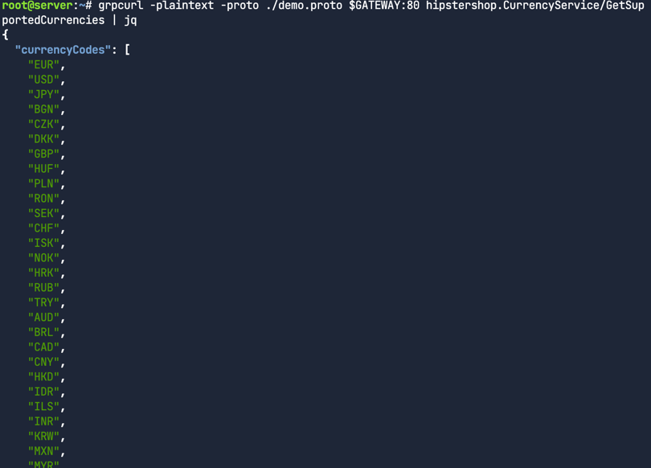

ProductCatalogService에도 접근해보자.
```bash
grpcurl -plaintext -proto ./demo.proto $GATEWAY:80 hipstershop.ProductCatalogService/ListProducts | jq
```
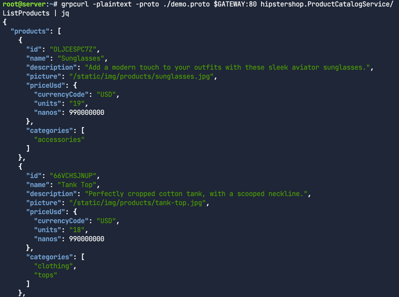

## 쿠버네티스 서비스의 한계

쿠버네티스에서 Service 리소스는 클러스터 내부 트래픽(East-West)의 로드 밸런싱을 가능하게 한다. 하지만 로드 밸런싱 옵션이 매우 제한적이다.
L3/L4만 가능하고, 선택적으로 토폴로지 힌트를 사용할 수 있을 뿐이다.
레이어 7 로드 밸런싱과 고급 라우팅을 구현하려면 보통 클러스터에 서비스 메시 솔루션을 배포해야 한다.
이는 주로 서비스 메시 솔루션에 특화된 비표준 리소스 타입을 사용한다는 의미이며
그렇다면 추가 컴포넌트 없이, 표준 리소스를 사용해서 이러한 결과를 얻을 수 있는 방법은 없을까의 고민이 필요했다.

## GAMMA 이니셔티브
GAMMA(Gateway API for Mesh Management and Administration) 이니셔티브는 Gateway API 하위 프로젝트의 전용 작업 스트림이다.
이니셔티브의 목표는 서비스 메시를 구성하기 위해 Gateway API를 어떻게 사용할 수 있는지 정의하는 것이며 이때, Gateway API에 최소한의 변경을 가하면서 Gateway API의 역할 중심적(role-oriented) 성격을 항상 유지하는 것을 목표로 삼고 있다.

## GAMMA 이니셔티브의 역할
Gateway API v1.0에서 GAMMA는 HTTPRoute를 부모로서 Service에 바인딩함으로써 서비스에 추가적인 HTTP 라우팅을 지원한다. 
이는 지금까지 랩에서 본 것처럼 HTTPRoute를 Gateway에 바인딩하는 북/남(north/south) 방향의 Gateway API 사용과는 대조적이다.
GAMMA는 클러스터 내부에서 레이어 7 트래픽 관리 기능을 위한 표준 API를 제공한다.

이번 챌린지에서 자세히 알아본다. 


### 샘플 애플리케이션 배포

샘플애플리케이션 배포 확인
```bash
kubectl apply -f gamma-manifest.yaml
kubectl -n gamma get pods,svc
```
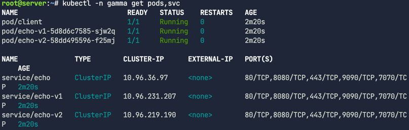

### EAST/WEST HTTPRoute 배포
```bash
yq gamma-route.yaml
```

```yaml
---
apiVersion: gateway.networking.k8s.io/v1
kind: HTTPRoute
metadata:
  name: gamma-route
  namespace: gamma
spec:
  parentRefs:
    - group: ""
      kind: Service
      name: echo
  rules:
    - matches:
        - path:
            type: Exact
            value: /v1
      backendRefs:
        - name: echo-v1
          port: 80
    - matches:
        - path:
            type: Exact
            value: /v2
      backendRefs:
        - name: echo-v2
          port: 80
```

라우트를 (북/남 방향의) Gateway에 연결하는 대신, parentRefs 필드를 사용해서 **echo**라는 부모 Service에 라우트를 연결

이 부모 서비스로 향하는 트래픽은 Cilium에 의해 가로채져서 노드별 Envoy 프록시를 통해 라우팅된다.

여기서는 `/v1` 경로로 향하는 트래픽을 `echo-v1` 서비스로 전달하고, `/v2`도 마찬가지로 설정하는 것을 볼 수 있다.
예를 들어, 이런 방식으로 내부 앱에 대한 A/B 테스트나 그린/블루 카나리 테스트를 수행할 수 있다.

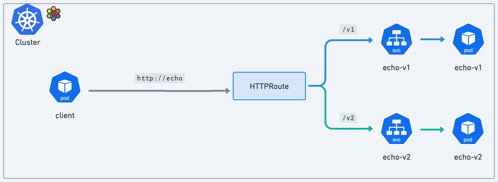


먼저 클라이언트 파드가 준비되어있는지 확인

```bash
kubectl get -n gamma pods client
```
이제 클라이언트에서 http://echo/v1에 접근해 본다. echo-v1 Pod가 자신의 호스트명을 포함한 정보로 응답한다..
```bash
kubectl -n gamma exec -it client -- curl http://echo/v1
```

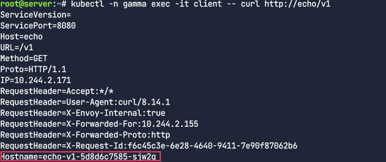

이번에는 클라이언트에서 http://echo/v2에 접근해 본다.
이번에는 트래픽이 echo-v2 서비스를 제공하는 echo Pod로 전달된다.
grep을 사용해서 echo-v2 Pod가 트래픽을 받았는지 확인한다.
```
kubectl -n gamma exec -it client -- curl http://echo/v2
```

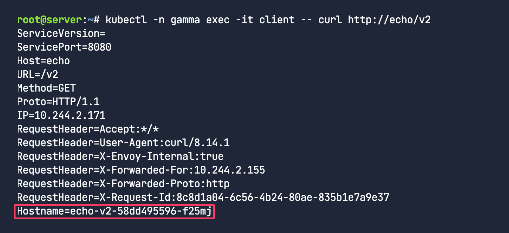

Gateway API와 동일한 API와 로직을 사용해서 클러스터 내부의 동/서 트래픽에 대해 경로 기반 라우팅을 할 수 있다.


### East-West 로드밸런스

```bash
kubectl apply -f load-balancing-http-route.yaml
yq load-balancing-http-route.yaml
```

매니페스트는 간단한 L7 프록시 라우트 규칙을 추가한다. /load-balancing으로 시작하는 HTTP 트래픽을 echo-v1 및 echo-v2 서비스로 전달

```yaml
apiVersion: gateway.networking.k8s.io/v1
kind: HTTPRoute
metadata:
  name: gamma-route
  namespace: gamma
spec:
  parentRefs:
    - group: ""
      kind: Service
      name: echo
  rules:
    - matches:
        - path:
            type: Exact
            value: /v1
      backendRefs:
        - name: echo-v1
          port: 80
    - matches:
        - path:
            type: Exact
            value: /v2
      backendRefs:
        - name: echo-v2
          port: 80
    - matches:
        - path:
            type: PathPrefix
            value: /load-balancing
      backendRefs:
        - kind: Service
          name: echo-v1
          port: 80
          weight: 50
        - kind: Service
          name: echo-v2
          port: 80
          weight: 50
```
50/50으로 균등하게 가중치가 설정된 것을 주목
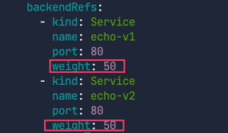
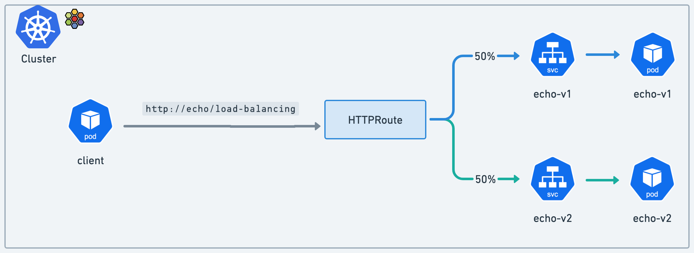

루프를 실행하고 요청 횟수를 세어 트래픽이 두 서비스에 균등하게 분할되는지 다시 확인한다. 
```bash
kubectl -n gamma exec -it client -- bash -c '
for _ in {1..500}; do
  curl -s -k "http://echo/load-balancing" >> curlresponses.txt;
done
grep -o "Hostname=echo-v1" curlresponses.txt | sort | uniq -c
grep -o "Hostname=echo-v2" curlresponses.txt | sort | uniq -c
'
```
대략적으로 아래와 같이 응답이 50:50으로 분산되었다.


### 90/10 트래픽 분할


`load-balancing-http-route.yaml` 파일을 편집한다. `echo-v1`과 `echo-v2`의 가중치 50을 각각 `echo-v1`은 90, `echo-v2`는 10으로 대체한다.

```bash
kubectl -n gamma exec -it client -- bash -c '
for _ in {1..500}; do
  curl -s -k "http://echo/load-balancing" >> curlresponses9010.txt;
done
grep -o "Hostname=echo-v1" curlresponses9010.txt | sort | uniq -c
grep -o "Hostname=echo-v2" curlresponses9010.txt | sort | uniq -c
'
```


### Timeouts

먼저 서비스의 응답 헤더를 확인한다. 
```bash
kubectl -n gamma exec -it client -- curl http://echo/v1
```

이 시점에는 타임아웃을 언급하는 헤더가 없다. 
`load-balancing-http-route.yaml`파일에 이제 라우트에 10ms 타임아웃을 추가해보자. 


```bash
- matches:
    - path:
        type: Exact
        value: /v1
    backendRefs:
    - name: echo-v1
      port: 80
    timeouts:
      request: 10ms
```


재적용
```bash
kubectl apply -f load-balancing-http-route.yaml
```

테스트요청
```bash
kubectl -n gamma exec -it client -- curl http://echo/v1
```


응답에서 타임아웃 설정을 나타내는 새로운 Envoy 헤더인 `X-Envoy-Expected-Rq-Timeout-Ms:10`을 볼 수 있다.

같은 방식으로 1ms로 변경해보자. 아래와 같이 매우 낮은 임계값 때문에, 대부분의 경우 타임아웃 오류가 발생한다.

