# k8s 성능
## 실습환경구성
- kind로 kube-ops-view, metrics-server,kube-prometheus-stack을 설치
```bash
# Prometheus Target connection refused bind-address 설정 : kube-controller-manager , kube-scheduler , etcd , kube-proxy
kind create cluster --name myk8s --image kindest/node:v1.33.2 --config - <<EOF
kind: Cluster
apiVersion: kind.x-k8s.io/v1alpha4
nodes:
- role: control-plane
  extraPortMappings:
  - containerPort: 30000
    hostPort: 30000
  - containerPort: 30001
    hostPort: 30001
  - containerPort: 30002
    hostPort: 30002
  - containerPort: 30003
    hostPort: 30003
  kubeadmConfigPatches: # Prometheus Target connection refused bind-address 설정
  - |
    kind: ClusterConfiguration
    controllerManager:
      extraArgs:
        bind-address: 0.0.0.0
    etcd:
      local:
        extraArgs:
          listen-metrics-urls: http://0.0.0.0:2381
    scheduler:
      extraArgs:
        bind-address: 0.0.0.0
  - |
    kind: KubeProxyConfiguration
    metricsBindAddress: 0.0.0.0
EOF

# kube-ops-view
helm repo add geek-cookbook https://geek-cookbook.github.io/charts/
helm install kube-ops-view geek-cookbook/kube-ops-view --version 1.2.2 --set service.main.type=NodePort,service.main.ports.http.nodePort=30003 --set env.TZ="Asia/Seoul" --namespace kube-system
open "http://localhost:30003/#scale=1.5"
open "http://localhost:30003/#scale=2"

# metrics-server
helm repo add metrics-server https://kubernetes-sigs.github.io/metrics-server/
helm upgrade --install metrics-server metrics-server/metrics-server --set 'args[0]=--kubelet-insecure-tls' -n kube-system

# 확인
kubectl top node
kubectl top pod -A --sort-by='cpu'
kubectl top pod -A --sort-by='memory'
```

- prometheus-stack 설치 by helm
```bash
# 파라미터 파일 생성
cat <<EOT > monitor-values.yaml
prometheus:
  prometheusSpec:
    scrapeInterval: "15s"
    evaluationInterval: "15s"
  service:
    type: NodePort
    nodePort: 30001

grafana:
  defaultDashboardsTimezone: Asia/Seoul
  adminPassword: prom-operator
  service:
    type: NodePort
    nodePort: 30002

alertmanager:
  enabled: false
defaultRules:
  create: false
prometheus-windows-exporter:
  prometheus:
    monitor:
      enabled: false
EOT
cat monitor-values.yaml

helm repo add prometheus-community https://prometheus-community.github.io/helm-charts
helm repo update

# 배포
helm install kube-prometheus-stack prometheus-community/kube-prometheus-stack --version 75.15.1 \
-f monitor-values.yaml --create-namespace --namespace monitoring

# 웹 접속 실행
open http://127.0.0.1:30001 # macOS prometheus 웹 접속
open http://127.0.0.1:30002 # macOS grafana 웹 접속 ( admin , prom-operator )
```

- 대시보드 추가
  - K8S new 15661 : JSON 다운로드 후 업로드

  - K8S API old 12006

## kube-burner
Kube-burner는 Kubernetes 클러스터의 성능과 확장성을 테스트하는 데 사용되는 도구다. Go 언어로 작성된 바이너리 애플리케이션이며, 공식 client-go 라이브러리를 활용해 대규모 Kubernetes 리소스를 다룬다.

Kube-burner가 하는 일
- 대규모 리소스 관리: 대량의 Pod, Deployment 같은 Kubernetes 리소스를 생성, 삭제, 읽기, 수정하는 작업을 수행한다. 예를 들어, 클러스터가 수천 개의 Pod를 동시에 얼마나 잘 처리하는지 테스트할 수 있다.

- 지표(Metric) 수집: 테스트 과정에서 Prometheus와 연동해 클러스터의 다양한 지표를 수집하고 색인화한다. 이를 통해 클러스터의 성능 변화를 정량적으로 분석할 수 있다.

- 측정 및 경고: 테스트 결과를 측정하고, 미리 설정된 임계값을 초과하면 경고를 발생시킨다. 이는 성능 저하를 빠르게 파악하는 데 도움이 된다.

Kube-burner는 Kubernetes 클러스터가 최대 부하를 얼마나 견딜 수 있는지 확인하고, 특정 시나리오에서 성능이 어떻게 변하는지를 검증하는 데 주로 사용된다.

```bash
git clone https://github.com/kube-burner/kube-burner.git
cd kube-burner

# 바이너리 설치(추천) : mac M1
curl -LO https://github.com/kube-burner/kube-burner/releases/download/v1.17.3/kube-burner-V1.17.3-darwin-arm64.tar.gz # mac M
tar -xvf kube-burner-V1.17.3-darwin-arm64.tar.gz

curl -LO https://github.com/kube-burner/kube-burner/releases/download/v1.17.3/kube-burner-V1.17.3-linux-x86_64.tar.gz # Windows
tar -xvf kube-burner-V1.17.3-linux-x86_64.tar.gz

sudo cp kube-burner /usr/local/bin

kube-burner -h
# 버전 확인 : 혹은 go run cmd/kube-burner/kube-burner.go -h
kube-burner version
Version: 1.17.3
```
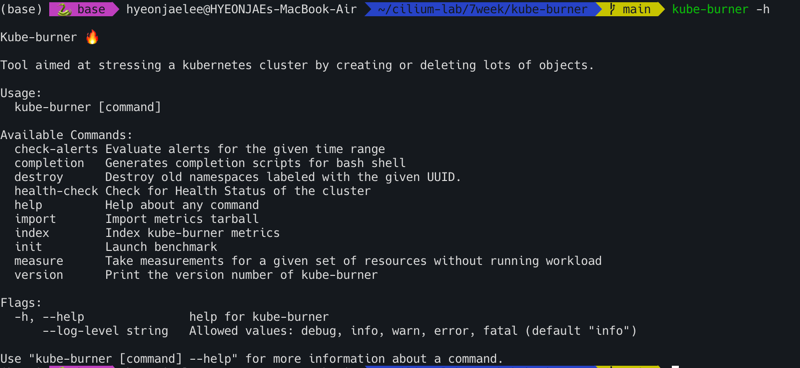
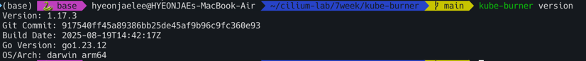

### 시나리오1 : 디플로이먼트 1개(파드 1개) 생성 → 삭제 , jobIterations qps burst 의미 확인
```bash
cat << EOF > s1-config.yaml
global:
  measurements:
    - name: none

jobs:
  - name: create-deployments
    jobType: create
    jobIterations: 1  # How many times to execute the job , 해당 job을 5번 반복 실행
    qps: 1            # Limit object creation queries per second , 	초당 최대 요청 수 (평균 속도 제한) - qps: 10이면 초당 10개 요청
    burst: 1          # Maximum burst for throttle , 순간적으로 처리 가능한 요청 최대치 (버퍼) - burst: 20이면 한순간에 최대 20개까지 처리 가능
    namespace: kube-burner-test
    namespaceLabels: {kube-burner-job: delete-me}
    waitWhenFinished: true # false
    verifyObjects: false
    preLoadImages: true # false
    preLoadPeriod: 30s # default 1m
    objects:
      - objectTemplate: s1-deployment.yaml
        replicas: 1
EOF

#
cat << EOF > s1-deployment.yaml
apiVersion: apps/v1
kind: Deployment
metadata:
  name: deployment-{{ .Iteration}}-{{.Replica}}
  labels:
    app: test-{{ .Iteration }}-{{.Replica}}
    kube-burner-job: delete-me
spec:
  replicas: 1
  selector:
    matchLabels:
      app: test-{{ .Iteration}}-{{.Replica}}
  template:
    metadata:
      labels:
        app: test-{{ .Iteration}}-{{.Replica}}
    spec:
      containers:
        - name: nginx
          image: nginx:alpine
          ports:
            - containerPort: 80
EOF


# 모니터링 : 터미널, kube-ops-view
watch -d kubectl get ns,pod -A


# 부하 발생 실행 Launch benchmark
kube-burner init -h
kube-burner init -c s1-config.yaml --log-level debug
...

#
kubectl get deploy -A -l kube-burner-job=delete-me
kubectl get pod -A -l kube-burner-job=delete-me
kubectl get ns -l kube-burner-job=delete-me

#
ls kube-burner-*.log
kube-burner-86508d5e-52dc-45de-88ab-d933f48ae0c8.log
cat kube-burner-*.log


# 삭제!
## deployment 는 s1-deployment.yaml 에 metadata.labels 에 추가한 labels 로 지정
## namespace 는 config.yaml 에 job.name 값을 labels 로 지정
cat << EOF > s1-config-delete.yaml
# global:
#   measurements:
#     - name: none

jobs:
  - name: delete-deployments-namespace
    qps: 500
    burst: 500
    namespace: kube-burner-test
    jobType: delete
    waitWhenFinished: true
    objects:
    - kind: Deployment
      labelSelector: {kube-burner-job: delete-me}
      apiVersion: apps/v1
    - kind: Namespace
      labelSelector: {kube-burner-job: delete-me}
EOF

#
kube-burner init -c s1-config-delete.yaml --log-level debug
```

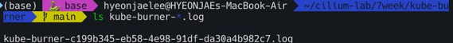


테스트의 핵심 내용
주요 변경 사항 및 테스트 목표
- `preLoadImages: false`: 테스트 전에 미리 도커 이미지를 받아두는 작업을 하지 않도록 설정한다. 이미지 다운로드 시간이 테스트 결과에 어떤 영향을 주는지 확인하려는 목적이다.
- `waitWhenFinished: false`: 모든 테스트가 끝난 후 바로 종료하지 않고 대기하도록 설정하는 대신, 테스트 종료 후 바로 다음 작업으로 넘어가도록 설정한다.
- `jobIterations`: 테스트를 몇 번 반복할지 설정한다. 5번, 10번, 100번으로 값을 바꿔가며 반복 횟수가 늘어날 때 어떤 변화가 있는지 확인한다.
- `objects.replicas`: 생성할 Pod의 개수를 지정한다. 2개로 설정값을 변경하여 리소스의 양을 늘렸을 때의 성능을 확인한다.

qps (Queries Per Second)와 burst
- `qps`: Kube-burner가 Kubernetes API 서버에 초당 보낼 수 있는 최대 요청 수다.
- `burst`: qps를 초과하여 일시적으로 보낼 수 있는 최대 요청 수다.
이 두 값들을 다양하게 조합하여 API 서버에 얼마나 많은 부하를 줄 수 있는지 실험한다. 예를 들어, qps: 1은 초당 1개의 요청만 보내도록 제한하는 것이고, qps: 10은 초당 10개의 요청을 보낼 수 있도록 허용하는 것이다.


### 시나리오2 : 노드 1대에 최대 파드(150개) 배포 시도 1
```bash
kube-burner init -c s1-config.yaml --log-level debug
```
- jobIterations: 100, qps: 300, burst: 300 objects.replicas: 1 변경 후 실행 → 모든 파드가 배포 되는지 확인

```bash
kubectl get pod -A | grep -v '1/1     Running'
kubectl describe pod -n kube-burner-test-99 | grep Events: -A5
kubectl describe node
```
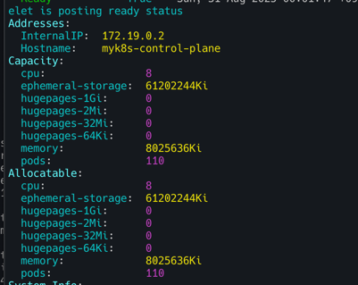

해결 
```bash
# maxPods 항목 없으면 기본값 110개
kubectl get cm -n kube-system kubelet-config -o yaml

#
docker exec -it myk8s-control-plane bash
----------------------------------------
cat /var/lib/kubelet/config.yaml

apt update && apt install vim -y
vim /var/lib/kubelet/config.yaml
maxPods: 150

systemctl restart kubelet
systemctl status kubelet
exit
----------------------------------------
```

```bash
kubectl describe node
```

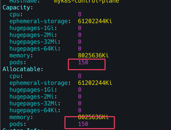

```bash
kube-burner init -c s1-config-delete.yaml --log-level debug
```
### 시나리오3 : 노드 1대에 최대 파드(300개) 배포 시도 2
- `kube-burner init -c s1-config.yaml --log-level debug`
- `jobIterations: 300, qps: 300, burst: 300` `objects.replicas: 1` 변경 후 실행 → 모든 파드가 배포 되는지 확인

```bash
kubectl get pod -A | grep -v '1/1     Running'

# maxPods: 400 상향
docker exec -it myk8s-control-plane bash
----------------------------------------
cat /var/lib/kubelet/config.yaml

apt update && apt install vim -y
vim /var/lib/kubelet/config.yaml
maxPods: 400

systemctl restart kubelet
systemctl status kubelet
exit
----------------------------------------

kubectl describe pod -n kube-burner-test-250 | grep Events: -A5
Events:
  Type     Reason                  Age                  From               Message
  ----     ------                  ----                 ----               -------
  Warning  FailedScheduling        5m15s                default-scheduler  0/1 nodes are available: 1 Too many pods. preemption: 0/1 nodes are available: 1 No preemption victims found for incoming pod.
  Normal   Scheduled               4m51s                default-scheduler  Successfully assigned kube-burner-test-250/deployment-250-1-775b95b6b5-954kk to myk8s-control-plane
  Warning  FailedCreatePodSandBox  4m38s                kubelet            Failed to create pod sandbox: rpc error: code = Unknown desc = failed to setup network for sandbox "f8b705fa3a0e185cb831de2d9ccd2fe3e7ced6eb9d81a4227d9433cbb4344711": plugin type="ptp" failed (add): 
  ... failed to allocate for range 0: no IP addresses available in range set: 10.244.0.1-10.244.0.254

kubectl describe pod -n kube-burner-test-299 | grep Events: -A5
kubectl describe node myk8s-control-plane | grep -i podcidr
```
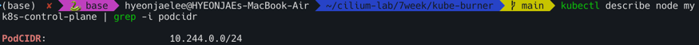

# 2025년 K8S Blog : 성능 관련 정보
## Kubernetes v1.34 Sneak Peek : 8월 27일 릴리즈
- 동적 리소스 할당 (DRA)
  - DRA는 GPU나 커스텀 하드웨어와 같은 디바이스를 유연하게 요청하고 사용할 수 있도록 지원합니다. v1.34에서 안정(stable) 단계로 승격될 예정이며, 이를 통해 resource.k8s.io/v1 API가 기본적으로 활성화됩니다. DRA는 장치 드라이버 및 관리자가 장치 클래스를 정의하고, 워크로드가 이를 요청하여 쿠버네티스가 해당 장치를 할당하는 방식으로 작동합니다.
- ServiceAccount 토큰을 사용한 이미지 풀 인증 
  - kubelet이 OIDC(OpenID Connect)를 준수하는 단기적이고 자동 갱신되는 ServiceAccount 토큰을 사용하여 컨테이너 이미지를 인증하도록 합니다. 이는 기존의 장기적인 이미지 풀 시크릿을 대체하여 보안을 강화하고 운영 오버헤드를 줄입니다. v1.34에서 베타(beta) 단계로 승격되어 기본적으로 활성화될 예정입니다.
- 디플로이먼트(Deployment)의 Pod 교체 정책
  - 디플로이먼트 업데이트 시 새로운 Pod를 생성하는 시점을 제어하는 .spec.podReplacementPolicy 필드가 알파(alpha) 기능으로 도입됩니다. TerminationStarted 정책은 기존 Pod가 종료를 시작하자마자 새 Pod를 생성하여 더 빠른 롤아웃을 가능하게 하고, TerminationComplete 정책은 기존 Pod가 완전히 종료된 후에 새 Pod를 생성하여 리소스 소비를 제어할 수 있습니다.
- kubelet 및 API 서버 추적 기능
  - 분산 시스템의 디버깅을 돕기 위해 OpenTelemetry 표준을 기반으로 하는 추적 기능이 안정(stable) 단계로 승격됩니다. 이를 통해 kubelet과 API 서버의 중요한 작업(예: Pod 시작)에 대한 상세한 가시성을 확보하여 대기 시간 및 오류의 원인을 쉽게 파악할 수 있습니다.
- 서비스(Service) 트래픽 분산 개선
  - 서비스의 트래픽을 분산하는 spec.trafficDistribution 필드에 새로운 값인 **PreferSameZone**과 **PreferSameNode**가 도입됩니다. v1.33에서 도입된 PreferClose는 더 이상 사용되지 않고 PreferSameZone으로 대체되며, PreferSameNode는 트래픽을 클라이언트와 동일한 노드에 있는 엔드포인트로 우선적으로 전송합니다. 이 기능은 v1.34에서 베타(beta) 단계로 승격될 예정입니다.
- KYAML 지원
  - KYAML은 YAML의 단점을 보완하기 위해 쿠버네티스 전용으로 설계된 YAML의 부분 집합입니다. v1.34부터 kubectl에서 새로운 출력 형식으로 지원될 예정입니다. KYAML은 YAML보다 안전하고 모호함이 적으며, JSON의 일부 특징(예: 중괄호 {} 및 대괄호 [] 사용)을 채택하면서도 주석을 지원합니다.
- HPA(Horizontal Pod Autoscaler)의 정밀한 허용 오차 제어
  - HPA의 spec.behavior에 tolerance 필드가 추가되어, 사용자가 HPA별로 자동 스케일링 허용 오차를 세밀하게 설정할 수 있습니다. 이는 기존의 클러스터 전체에 적용되는 10%의 허용 오차 설정보다 유연성을 제공하여, 스케일 업 및 스케일 다운 동작을 워크로드에 맞게 최적화할 수 있도록 돕습니다. 이 기능은 v1.34에서 베타(beta) 단계로 승격될 예정입니다.

## Announcing etcd v3.6.0
- v3store로의 완전한 전환
  - 이전 버전에서 사용되던 v2store가 완전히 제거되고, v3store가 멤버십 데이터를 포함한 모든 데이터의 유일한 저장소로 사용. v3store는 더 나은 성능과 트랜잭션 지원을 제공.
- 다운그레이드 지원
  - v3.6.0은 공식적으로 다운그레이드를 지원하는 첫 번째 버전. 이를 통해 사용자는 etcdctl 명령어를 사용해 데이터 스키마를 이전 버전(예: v3.5)에 맞춰 마이그레이션한 후, 롤링 다운그레이드를 진행할 수 있음.
- 기능 게이트(Feature Gates)
  - 쿠버네티스와 유사하게 알파, 베타, GA(General Availability) 단계를 거치는 기능 게이트 시스템이 도입. 이는 이전의 --experimental 플래그 방식보다 더 부드러운 업그레이드 및 다운그레이드 경험을 제공
- livez / readyz 엔드포인트
  - 쿠버네티스 Liveness와 Readiness 프로브와 유사한 **/livez**와 /readyz 엔드포인트가 추가되어, etcd 인스턴스의 상태를 더 명확하게 확인할 수 있습니다. 기존의 /health 엔드포인트도 계속 사용 가능
- 성능 향상
  - 메모리 사용량: 기본 스냅샷 카운트(--snapshot-count)가 100,000에서 10,000으로 줄어들고 Raft 히스토리 압축이 더 자주 일어나면서, 평균 메모리 사용량이 50% 이상 감소
- 처리량(Throughput): 
  - 여러 작은 최적화 덕분에 읽기 및 쓰기 처리량이 평균 10% 정도 향상
## Kubernetes v1.33: Updates to Container Lifecycle
- 컨테이너 라이프사이클 훅의 'Sleep' 액션 개선
  - 쿠버네티스 v1.29부터 PreStop과 PostStart 훅에 Sleep 액션이 도입되어 컨테이너 종료나 시작 시 지정된 시간만큼 멈출 수 있게 되었다. 이전에는 컨테이너 이미지에 sleep 명령 바이너리가 있어야만 가능했던 작업을, 이제는 Sleep 액션으로 간편하게 처리할 수 있다.
v1.33에서는 이 Sleep 액션의 지속 시간을 0초로 설정할 수 있는 기능이 기본적으로 활성화되었다. time.Sleep(0)처럼 즉시 다음 단계로 넘어가는 동작을 라이프사이클 훅에서도 사용할 수 있게 된 것이다. 이 기능은 PodLifecycleSleepActionAllowZero라는 기능 게이트를 통해 v1.32에서 도입되었고, v1.33에서 베타 단계로 승격되어 별도의 설정 없이 바로 사용할 수 있다.

- 컨테이너 정지 신호(Stop Signal) 사용자 지정 기능
  - 기존에는 컨테이너를 종료할 때 보내는 정지 신호(stop signal)를 바꾸려면 컨테이너 이미지 자체를 수정해야 했다. 쿠버네티스 v1.33에서는 컨테이너 정지 신호를 Pod API에 직접 지정할 수 있는 기능이 알파 단계로 추가되었다.

spec.os.name 필드를 통해 운영 체제를 명시하고, containers[*].lifecycle.stopSignal 필드에 SIGUSR1와 같은 원하는 신호를 지정하는 방식이다. 이 기능은 **ContainerStopSignals**라는 기능 게이트를 활성화해야 사용할 수 있다. 윈도우 노드에서는 SIGTERM과 SIGKILL만 허용되며, 리눅스에서는 더 많은 신호가 지원된다.
## Kubernetes v1.33: Image Pull Policy the way you always thought it worked!
- 기존의 문제점
  - `IfNotPresent`는 노드에 이미지가 있으면 새로 이미지를 내려받지 않는 정책이다. 이 정책 때문에 다음과 같은 보안 문제가 발생했다. 
    - A Pod가 비밀번호(Secret)를 이용해 개인 저장소에서 이미지를 성공적으로 내려받는다. 
    - 같은 노드에 B Pod가 배포된다. B Pod는 이미지를 내려받을 수 있는 권한(Secret)이 없지만, Kubelet은 `IfNotPresent` 정책에 따라 이미지가 노드에 있으므로 새로 내려받지 않는다. 
    - 결과적으로 B Pod는 권한 없이 A Pod가 받아온 개인 이미지를 사용하게 된다.

이 문제는 IfNotPresent나 Never 정책을 사용하는 모든 경우에 발생할 수 있었다. 유일한 해결책은 Always 정책을 사용해 이미지를 매번 인증하도록 강제하는 것뿐이었다. 그러나 이는 이미지 저장소의 가용성에 의존하게 되어 서비스의 안정성을 떨어뜨릴 수 있었다.

- v1.33에서 해결된 방식 
  - 쿠버네티스 v1.33은 Kubelet이 이미지를 제공하기 전에 Pod의 권한을 확인하도록 함으로써 이 문제를 해결했다. 이 기능은 KubeletEnsureSecretPulledImages라는 알파 기능 게이트를 활성화하면 사용할 수 있다. 
- 동작 원리
  - Kubelet은 이미지를 성공적으로 내려받은 뒤, 어떤 자격 증명(credential)을 사용했는지 기록으로 남긴다.
  - 이후 다른 Pod가 동일한 이미지를 요청할 때, Kubelet은 새로운 Pod가 제공하는 자격 증명이 이전에 기록된 것과 일치하는지 확인한다. 
  - 자격 증명이 일치하면, 이미 노드에 있는 이미지를 사용하도록 허용한다.
  - 자격 증명이 일치하지 않으면, 이미지가 노드에 있더라도 이미지 저장소에 다시 인증을 시도한다.

이 방식은 `IfNotPresent`나 `Never` 정책을 사용하더라도 권한 없는 Pod가 개인 이미지를 사용하는 것을 막는다. 
또한, `Always` 정책처럼 매번 이미지를 다시 내려받을 필요 없이, 자격 증명만 확인하므로 성능 저하도 최소화한다. 향후 이 기능은 kubelet이 이미지 자격 증명에 사용하는 '프로젝티드 서비스 어카운트 토큰'과도 연동될 예정이다.

## Kubernetes v1.33: Streaming List responses
- 기존 방식의 문제점
  - 기존 쿠버네티스 API 서버는 대규모 리소스 목록을 요청받았을 때, 모든 데이터를 하나의 큰 메모리 덩어리로 만든 다음 클라이언트에 보냈다. 이는 다음과 같은 문제를 일으켰다.
    - 높은 메모리 사용량: 수백 메가바이트에 달하는 큰 응답 데이터를 한 번에 메모리에 올리면서, API 서버의 메모리 사용량이 급증했다.
    - OOM(메모리 부족) 위험: 여러 개의 대용량 List 요청이 동시에 발생하면, 메모리 사용량이 감당할 수 없을 정도로 커져 서버가 강제 종료(OOM-killed)될 위험이 있었다. 
    - 비효율적인 메모리 관리: 네트워크 지연 등으로 데이터 전송이 느려질 경우, 큰 메모리 덩어리가 해제되지 않고 오랫동안 유지되어 리소스 낭비를 초래했다.

- 새로운 스트리밍 인코딩 방식
  - 새로운 스트리밍 인코딩 방식은 대용량 List 응답의 핵심인 Items 필드를 처리하는 방법을 바꿨다.
    - 점진적 처리: 전체 목록을 한 번에 메모리에 올리는 대신, 각 아이템을 개별적으로 인코딩하고 전송한다.
    - 메모리 효율성: 각 아이템이 전송될 때마다 메모리가 점진적으로 해제되므로, API 서버의 메모리 점유율이 획기적으로 낮아진다.
    - 향상된 안정성: 대규모 요청이 동시에 들어와도 메모리 급증 현상이 없어 OOM 위험이 줄고, 클러스터 안정성이 높아졌다.

이 개선은 클라이언트 측에서 별도의 변경 없이도 작동하도록 완벽하게 하위 호환성을 유지한다. 벤치마크 결과에 따르면, 이 새로운 방식은 대용량 List 요청 처리 시 메모리 사용량을 70~80GB에서 3GB로 줄이는, 즉 20배 향상된 성능을 보여주었다.
## Kubernetes v1.33: Image Volumes graduate to beta!
- 이미지 볼륨이란?
  - 이미지 볼륨은 컨테이너 이미지를 마치 볼륨처럼 마운트해서 사용할 수 있게 해주는 기능. 컨테이너 이미지의 내용을 읽기 전용으로 컨테이너 내의 특정 경로에 연결할 수 있다.

- v1.33 업데이트: subPath 및 새 메트릭
  - 이번 베타 버전 승격에서 가장 큰 변화는 subPath와 subPathExpr 지원이다. 이제 컨테이너 이미지 전체를 마운트하는 대신, 이미지 내의 특정 하위 디렉토리만 선택적으로 마운트할 수 있다.
    - subPath 사용 예시: YAML 파일에서 volumeMounts 필드에 subPath: dir을 추가하면, 이미지 볼륨의 'dir' 디렉토리만 컨테이너에 마운트된다.
    - 안전성 강화: 절대 경로 또는 상대 경로 구성 요소는 허용되지 않는다. 만약 존재하지 않는 하위 디렉토리를 마운트하려고 하면 컨테이너 생성에 실패하고 사용자에게 피드백을 제공한다.
    - 새로운 메트릭: 이미지 볼륨과 관련된 세 가지 새로운 kubelet 메트릭이 추가되었다.
      - `kubelet_image_volume_requested_total`: 요청된 이미지 볼륨의 총 개수
      - `kubelet_image_volume_mounted_succeed_total`: 이미지 볼륨 마운트 성공 횟수
      - `kubelet_image_volume_mounted_errors_total`: 이미지 볼륨 마운트 실패 횟수

이 기능은 아직 기본적으로 활성화되어 있지 않고, CRI-O나 containerd와 같은 컨테이너 런타임에서도 지원이 진행 중이다.
## Kubernetes v1.33: Continuing the transition from Endpoints to EndpointSlices
요약

쿠버네티스 v1.15부터 도입된 EndpointSlices가 v1.21에서 정식(GA) 버전이 된 이후, 기존의 Endpoints API는 거의 사용되지 않고 있다. 듀얼 스택 네트워킹과 트래픽 분배 같은 새로운 서비스 기능은 EndpointSlice API를 통해서만 지원된다. 따라서 모든 서비스 프록시, 게이트웨이 API 구현체 및 유사 컨트롤러들은 Endpoints에서 EndpointSlices로 전환해야 한다. Endpoints API는 더 이상 사용하지 않는 워크로드와 스크립트와의 호환성을 위해 유지될 뿐이다.
쿠버네티스 1.33부터 Endpoints API는 공식적으로 사용이 중단되었으며(deprecated), Endpoints 리소스를 읽거나 쓰는 사용자에게 API 서버가 경고를 반환한다.
궁극적인 목표는 Endpoints 컨트롤러가 엔드포인트를 생성하지 않도록 쿠버네티스 적합성(Conformance) 기준을 변경하는 것이다.
따라서 여전히 Endpoints API를 사용하는 워크로드나 스크립트를 가진 사용자들은 EndpointSlices로 마이그레이션을 시작해야 할 것이다.

Endpoints에서 EndpointSlices로 마이그레이션하기

1. Endpoints 대신 EndpointSlices 사용하기 
    - Endpoints API와 EndpointSlice API의 가장 큰 차이점은 Endpoints는 서비스당 하나의 오브젝트를 가지는 반면, EndpointSlices는 여러 개를 가질 수 있다는 점이다.
      - EndpointSlice가 여러 개 생성되는 경우
        - 듀얼 스택 서비스: IPv4와 IPv6 주소를 위한 별도의 EndpointSlice가 생성된다. (Endpoints는 듀얼 스택을 지원하지 않는다.)
        - 포트 변경: 엔드포인트 포트가 변경되는 경우, 업데이트 중에는 이전 포트와 새 포트를 위한 별도의 EndpointSlice가 필요하다.
        - 100개 이상의 엔드포인트: 엔드포인트가 100개를 초과하면, 여러 개의 EndpointSlice로 분할되어 관리된다.

EndpointSlice는 서비스당 1대1 매핑이 아니므로, 서비스 이름을 통해 특정 EndpointSlice를 조회할 수 없다. 대신 kubernetes.io/service-name 레이블을 사용하여 해당 서비스에 속한 모든 EndpointSlice를 조회해야 한다.

2. Endpoints 대신 EndpointSlices 생성하기
- 오브젝트를 생성하는 경우, YAML 또는 Go 코드를 새 타입으로 업데이트해야 한다. Endpoints와 EndpointSlice는 정보를 구성하는 방식이 약간 다르다.

Endpoints YAML 예시:
```yaml
apiVersion: v1
kind: Endpoints
metadata:
  name: myservice
subsets:
- addresses:
  - ip: 10.180.3.17
    nodeName: node-4
  ports:
  - name: https
    protocol: TCP
    port: 443
```
EndpointSlice YAML 예시:
```yaml
apiVersion: discovery.k8s.io/v1
kind: EndpointSlice
metadata:
  name: myservice
  labels:
    kubernetes.io/service-name: myservice
addressType: IPv4
endpoints:
- addresses:
  - 10.180.3.17
  nodeName: node-4
  conditions:
    ready: true
ports:
- name: https
  protocol: TCP
  port: 443
```
주요 차이점
- EndpointSlice는 name이 중요하지 않으며, kubernetes.io/service-name 레이블을 사용한다. generateName을 사용하여 고유한 이름을 자동 생성할 수도 있다.
- addressType: IPv4 (또는 IPv6)를 명시적으로 지정해야 한다.
- Endpoints의 subsets 배열과 달리, EndpointSlice는 endpoints 배열 내에 각 엔드포인트의 주소를 포함한다.
- Endpoints는 "ready"와 "not-ready" 엔드포인트를 분리하지만, EndpointSlice는 conditions 필드에 ready: false와 같은 상태를 명시한다.
- Endpoints 오브젝트에 여러 subsets가 있는 경우, EndpointSlices에서는 각 포트별로 별도의 EndpointSlice를 생성해야 할 수 있다.

마이그레이션이 완료되면 토폴로지 힌트와 같은 EndpointSlice 전용 기능을 사용할 수 있다.


# Cilium 성능
## 실습환경구성
Cilium에서 실습환경을 구축하고 성능을 측정해보자. 
아래와 같이 kind 클러스터 + Cilium CNI를 환경 배포한다. 
- kind k8s + Cilium CNI
```bash
# Prometheus Target connection refused bind-address 설정 : kube-controller-manager , kube-scheduler , etcd , kube-proxy
kind create cluster --name myk8s --image kindest/node:v1.33.2 --config - <<EOF
kind: Cluster
apiVersion: kind.x-k8s.io/v1alpha4
nodes:
- role: control-plane
  extraPortMappings:
  - containerPort: 30000
    hostPort: 30000
  - containerPort: 30001
    hostPort: 30001
  - containerPort: 30002
    hostPort: 30002
  - containerPort: 30003
    hostPort: 30003
  kubeadmConfigPatches: # Prometheus Target connection refused bind-address 설정
  - |
    kind: ClusterConfiguration
    controllerManager:
      extraArgs:
        bind-address: 0.0.0.0
    etcd:
      local:
        extraArgs:
          listen-metrics-urls: http://0.0.0.0:2381
    scheduler:
      extraArgs:
        bind-address: 0.0.0.0
  - |
    kind: KubeProxyConfiguration
    metricsBindAddress: 0.0.0.0
networking:
  disableDefaultCNI: true
  kubeProxyMode: none
  podSubnet: "10.244.0.0/16"   # cluster-cidr
kubeadmConfigPatches:
- |
  kind: ClusterConfiguration
  controllerManager:
    extraArgs:
      allocate-node-cidrs: "true"
      cluster-cidr: "10.244.0.0/16"
      node-cidr-mask-size: "22"
EOF

# node 별 PodCIDR 확인
kubectl get nodes -o jsonpath='{.items[*].spec.podCIDR}'

# cilium cni 설치
cilium install --version 1.18.1 --set ipam.mode=kubernetes --set ipv4NativeRoutingCIDR=172.20.0.0/16 \
--set routingMode=native --set autoDirectNodeRoutes=true --set endpointRoutes.enabled=true --set directRoutingSkipUnreachable=true \
--set kubeProxyReplacement=true --set bpf.masquerade=true \
--set endpointHealthChecking.enabled=false --set healthChecking=false \
--set hubble.enabled=true --set hubble.relay.enabled=true --set hubble.ui.enabled=true \
--set hubble.ui.service.type=NodePort --set hubble.ui.service.nodePort=30003 \
--set prometheus.enabled=true --set operator.prometheus.enabled=true --set envoy.prometheus.enabled=true --set hubble.metrics.enableOpenMetrics=true \
--set hubble.metrics.enabled="{dns,drop,tcp,flow,port-distribution,icmp,httpV2:exemplars=true;labelsContext=source_ip\,source_namespace\,source_workload\,destination_ip\,destination_namespace\,destination_workload\,traffic_direction}" \
--set debug.enabled=true  # --dry-run-helm-values

# hubble ui
open http://127.0.0.1:30003

# metrics-server
helm repo add metrics-server https://kubernetes-sigs.github.io/metrics-server/
helm upgrade --install metrics-server metrics-server/metrics-server --set 'args[0]=--kubelet-insecure-tls' -n kube-system
```

- 확인
```bash
kubectl top node
kubectl top pod -A --sort-by='cpu'
kubectl top pod -A --sort-by='memory'
```

- 프로메테우스 및 그라파나 설치하기
```bash
kubectl apply -f https://raw.githubusercontent.com/cilium/cilium/1.18.1/examples/kubernetes/addons/prometheus/monitoring-example.yaml

kubectl get deploy,pod,svc,ep -n cilium-monitoring
kubectl get cm -n cilium-monitoring
kc describe cm -n cilium-monitoring prometheus
kc describe cm -n cilium-monitoring grafana-config
kubectl get svc -n cilium-monitoring

kubectl patch svc -n cilium-monitoring prometheus -p '{"spec": {"type": "NodePort", "ports": [{"port": 9090, "targetPort": 9090, "nodePort": 30001}]}}'
kubectl patch svc -n cilium-monitoring grafana -p '{"spec": {"type": "NodePort", "ports": [{"port": 3000, "targetPort": 3000, "nodePort": 30002}]}}'

open "http://127.0.0.1:30001"  # prometheus
open "http://127.0.0.1:30002"  # grafana
```

## 쿠버네티스 환경에서 속도 측정 테스트

```bash
# 배포
cat <<EOF | kubectl apply -f -
apiVersion: apps/v1
kind: Deployment
metadata:
  name: iperf3-server
spec:
  selector:
    matchLabels:
      app: iperf3-server
  replicas: 1
  template:
    metadata:
      labels:
        app: iperf3-server
    spec:
      containers:
      - name: iperf3-server
        image: networkstatic/iperf3
        args: ["-s"]
        ports:
        - containerPort: 5201
---
apiVersion: v1
kind: Service
metadata:
  name: iperf3-server
spec:
  selector:
    app: iperf3-server
  ports:
    - name: tcp-service
      protocol: TCP
      port: 5201
      targetPort: 5201
    - name: udp-service
      protocol: UDP
      port: 5201
      targetPort: 5201
  type: ClusterIP
---
apiVersion: apps/v1
kind: Deployment
metadata:
  name: iperf3-client
spec:
  selector:
    matchLabels:
      app: iperf3-client
  replicas: 1
  template:
    metadata:
      labels:
        app: iperf3-client
    spec:
      containers:
      - name: iperf3-client
        image: networkstatic/iperf3
        command: ["sleep"]
        args: ["infinity"]
EOF
```

- 확인 : 서버와 클라이언트가 어떤 노드에 배포되었는지 확인
```bash
kubectl get deploy,svc,pod -owide
```
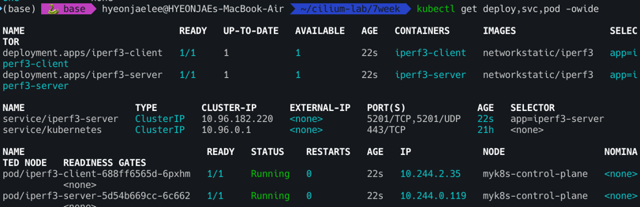


### TCP 5201 5초간 측정

- 클라이언트 파드에서 아래 명령 실행
```bash
kubectl exec -it deploy/iperf3-client -- iperf3 -c iperf3-server -t 5
```

- 서버 파드 로그 확인 : 기본 5201 포트 Listen
```bash
kubectl logs -l app=iperf3-server -f
```

- 결과
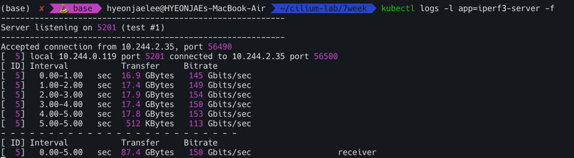

### UDP 사용, 역방향 모드(-R)
```bash
kubectl exec -it deploy/iperf3-client -- iperf3 -c iperf3-server -u -b 20G
```
-결과
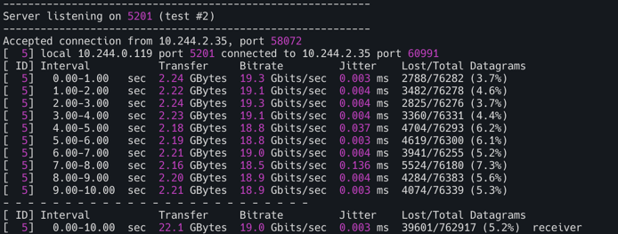

### TCP, 쌍방향 모드(-R)
```bash
kubectl exec -it deploy/iperf3-client -- iperf3 -c iperf3-server -t 5 --bidir
```
- 결과
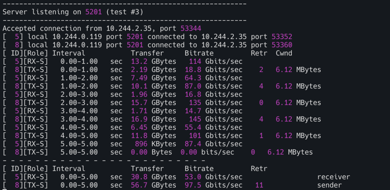

### TCP 다중 스트림(30개), -P(number of parallel client streams to run)****
```bash
kubectl exec -it deploy/iperf3-client -- iperf3 -c iperf3-server -t 10 -P 2
```
- 결과
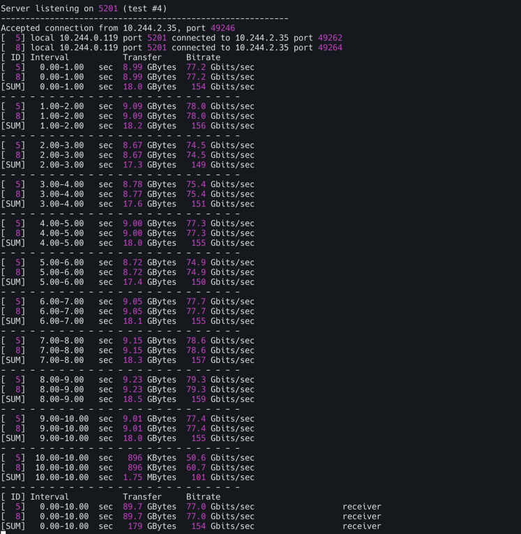


- 측정 완료후 삭제
```bash
kubectl delete deploy iperf3-server iperf3-client && kubectl delete svc iperf3-server 
```


## cilium connectivity {test, perf}

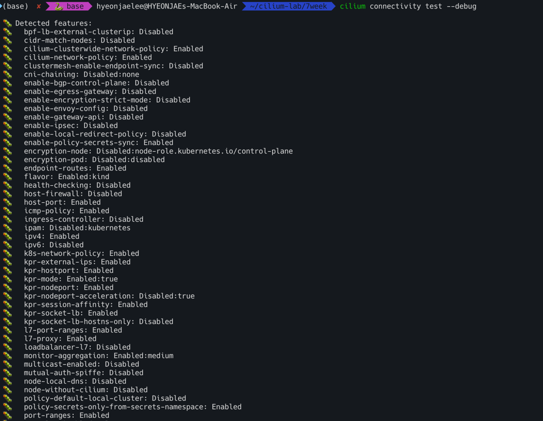

- 실습후 리소스 삭제
```bash
kubectl delete ns cilium-test-1 
```

## cilium connectivity perf : 성능 측정(Gbsp, Latency) - Throughput, Retransmit, Latency
```bash
cilium connectivity perf -h
```
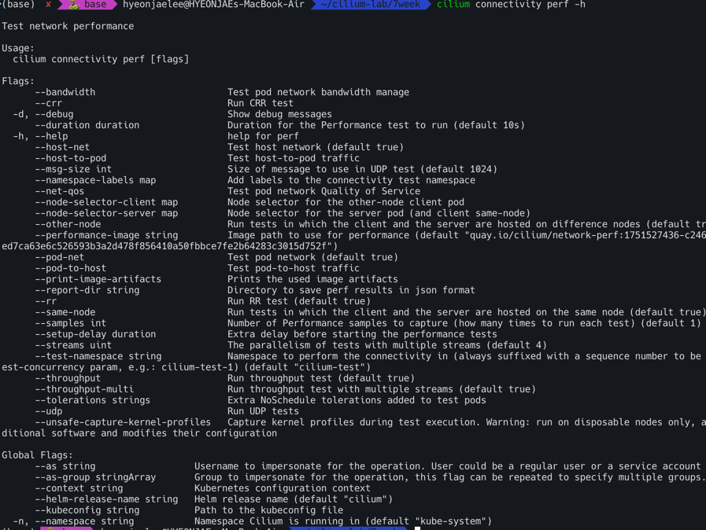

# Cilium 성능 및 튜닝

## Deep Dive Into Cilium Resilient Architecture
https://www.youtube.com/watch?v=YX0sql_3dt8

Cilium은 BPF(Berkeley Packet Filter)를 활용하여 Kubernetes 네트워킹 문제를 해결하는 데 중요한 역할을 해왔다.
하지만 이러한 발전과 함께 프로젝트의 복잡성도 증가하였다. 특히, Cilium 에이전트는 Kubernetes 클러스터에서 가장 중요한 구성 요소 중 하나이며, 
Kubernetes API 서버와의 연결 손실, API 서버 과부하, 또는 BPF 인프라 호출 실패와 같은 다양한 문제에 직면할 수 있다.
이러한 문제들을 해결하고 에이전트의 복원력과 오류 허용 범위를 개선하기 위해 StateDB와 Reconciler라는 새로운 구성 요소가 도입되었다.


StateDB (인메모리 데이터베이스)
- 목적: StateDB는 에이전트 내에서 수동으로 작성된 해시맵, 뮤텍스 및 수정 메커니즘을 대체하기 위한 인메모리 데이터베이스이다. 이는 다양한 소스(API 서버, Cluster Mesh 등)에서 이벤트를 수신하고 **희망 상태(desired state)**를 계산하여 저장하는 역할을 한다.
- 주요 특징:
  - 트랜잭션 방식: 단일 트랜잭션으로 쓰기 작업을 수행할 수 있으며, 이는 배치(batch)로 관찰되어 처리량을 향상시킨다. 
  - 불변 트리 저장: 모든 데이터는 불변 트리(immutable trees)에 저장되어 **락 없는 읽기(lockless readers)**를 가능하게 하고, 리더가 잠금을 너무 오래 유지하는 등의 문제를 방지한다.
  - 리비전 관리: 모든 데이터는 리비전(revision)이 부여되어 시간 경과에 따른 변경 사항을 쿼리할 수 있다. 
  - 알림 메커니즘: 데이터 변경 시 채널 기반 알림 메커니즘을 통해 리더를 깨워 추가 작업을 수행하게 한다. 
  - 내부 구조: 레지스트리가 접두사로 인덱싱되어 바이트 단위 조회가 가능하며, 변경 시 트리의 변경된 부분만 복제하여 기존 리더에게 영향을 주지 않는다. 
  - 사용 예시: Go 언어에서 테이블을 생성하고 데이터 유형과 인덱스를 정의한 다음, 네임스페이스별로 서비스를 쿼리하여 서비스 객체와 리비전을 얻는 방식으로 사용된다.
  - 일관성 및 가용성: StateDB는 인메모리 저장소이므로, 에이전트가 재시작되면 BPF 맵, Kubernetes API 서버 및 기타 입력에서 상태를 처음부터 다시 빌드하며 이는 영구적인 저장소가 아니다. 에이전트 간의 교차 트랜잭션은 요구되지 않으며, 외부 시스템(예: Kubernetes API 서버)에 대해서는 **최종적 일관성(eventually consistent)**을 유지한다.
  - 메모리 사용량: 기존 버전과 유사하지만, 많은 리더가 이전 스냅샷을 오래 보유할 경우 메모리 사용량이 증가할 수 있다.
  - 내부 통신: Cilium 에이전트 내의 여러 하위 구성 요소들이 StateDB를 통해 메시지 버스처럼 통신할 수 있도록 한다. 예를 들어, Envoy로부터의 피드백 루프는 데이터베이스에 기록하고 서비스 관리자는 이를 보고 반응할 수 있다.
  
Reconciler (조정자)
- 목적: Reconciler는 StateDB 테이블을 참조하여 객체에 대한 업데이트, 삭제, 가지치기(prune)와 같은 작업을 정의하는 재사용 가능한 유틸리티이다. 이는 BPF 맵과 같은 시스템에 희망 상태를 적용하는 역할을 한다.
- 오류 처리: BPF 맵 업데이트와 같은 작업이 실패할 경우 (예: ENOSPC 오류), Reconciler는 다음과 같이 처리한다.
  - 오류를 상위로 전파합니다. 
  - 나중에 재시도하도록 스케줄링한다.
  - 메트릭과 상태를 업데이트한다.(오류 카운트 증가, 에이전트 상태 저하).
  - 실패 상태를 다시 StateDB에 기록하여 검사할 수 있도록 한다. 
- Kubelet과의 유사성: Reconciler의 개념과 API는 Kubelet과 매우 유사하여, 새로운 구성 요소를 추가할 때 유연성을 제공하고 다른 구성 요소와의 간섭을 방지하는 동일한 보장을 제공한다.

데모 시나리오를 통한 이해

  제시된 데모에서는 다음과 같은 문제가 발생하였다:
  - "서비스 백엔드를 찾을 수 없어" 발생하는 드롭, 서비스 BPF 맵이 가득 참, 에이전트 상태 저하, Reconciler의 실패 보고. StateDB를 통해 희망 상태가 서비스 맵에 대해 실현되지 않았음이 명확히 드러났고, BPF 맵이 가득 찼다는 힌트를 얻었다. 이는 클러스터에 너무 많은 서비스가 있거나 BPF 맵 크기를 늘려야 함을 의미했습니다. 데모에서는 서비스를 삭제하여 문제를 해결했고, 그 결과 맵은 더 이상 가득 차지 않았고 드롭이 감소하여 클러스터가 다시 정상 상태로 돌아왔다.
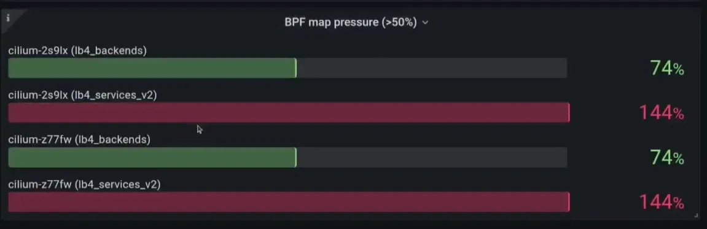


영향 및 향후 계획

  StateDB, Reconciler, 에이전트 상태와 같은 인프라는 Cilium 에이전트의 관찰 가능성(observability)과 복원력(resilience)을 크게 향상시킨다. Cilium 1.16에서는 장치 감지 및 노드 주소와 관련된 첫 번째 유즈케이스가 등장하여, 에이전트가 장치 및 IP 주소 변경에 반응하지 않던 문제를 해결하고 있다. 새로운 기능들은 이러한 도구를 활용하여 더 나은 관찰 가능성과 복원력을 얻도록 권장된다.

## Deep Dive Into Cilium Resilient Architecture 
쿠버네티스 API와의 동작관계

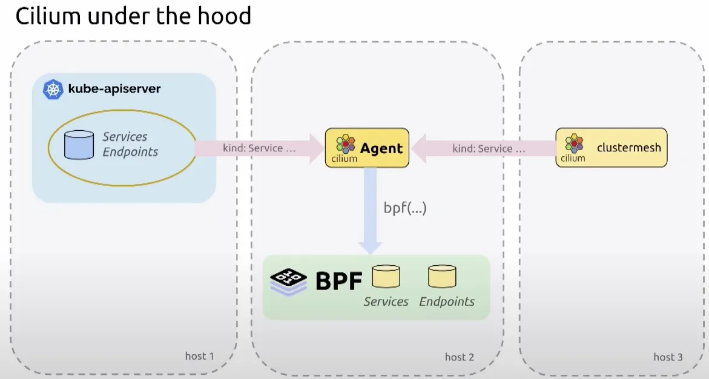

DB와 Reconciler를 Cilium에서도 구현함

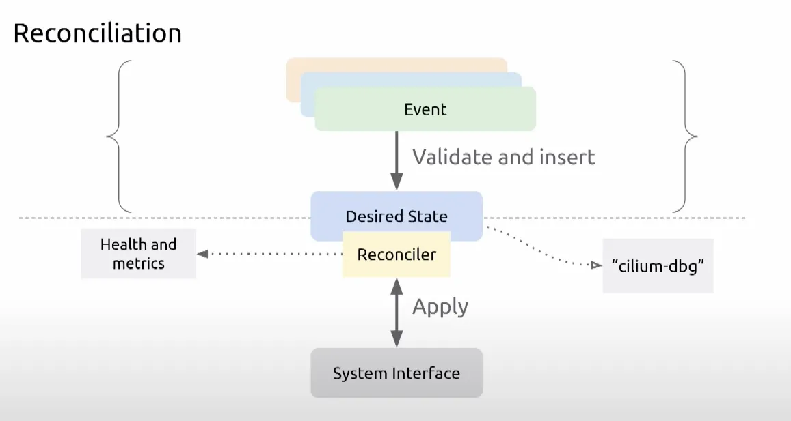

## eBPF Maps

- BFP map사이즈 확인
```bash
kubectl exec -it -n kube-system ds/cilium -- cilium status --verbose
```
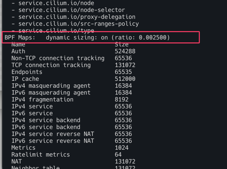

<br>

- 사이즈 조정
```bash
helm upgrade cilium cilium/cilium --version 1.18.1 --namespace kube-system --reuse-values \
--set bpf.distributedLRU.enabled=true --set bpf.mapDynamicSizeRatio=0.01
kubectl -n kube-system rollout restart ds/cilium
```

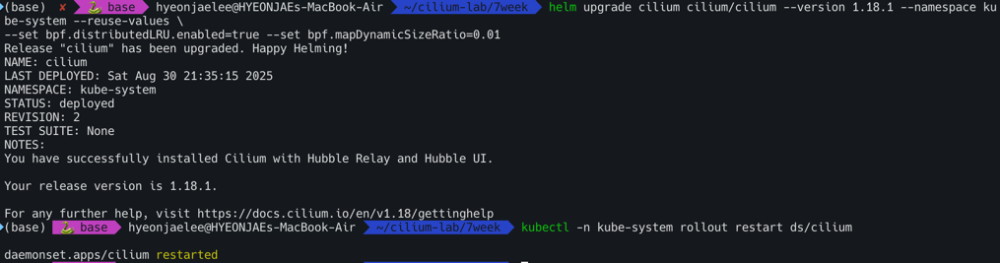


- BPF Maps 에 많은 값들이 노드 총 메모리 비중별로 반영

```bash
kubectl exec -it -n kube-system ds/cilium -- cilium status --verbose
```
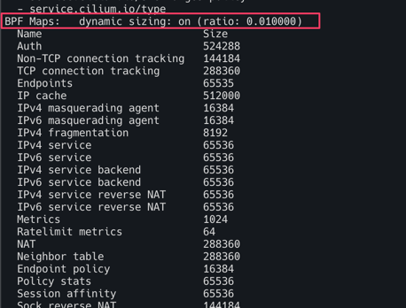


- The following table presents the value that kube-proxy and Cilium sets for their own connection tracking tables when Cilium is configured with --bpf-map-dynamic-size-ratio: 0.0025.
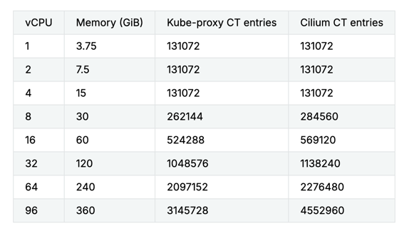


## Kubernetes API server improvements 
`kube-proxy`를 Cilium으로 대체하려면, Cilium 에이전트가 쿠버네티스 API 서버와 통신하여 클러스터 내의 변경 사항(예: 새로운 서비스 또는 엔드포인트)을 인지해야 한다.

- v1.18 이전: Cilium 에이전트는 하나의 API 서버 인스턴스와만 통신하도록 설정할 수 있었다. 대부분의 프로덕션 환경에서는 고가용성을 위해 여러 API 서버를 배포하기 때문에, 이는 문제이기도 하였다.
- v1.18 이후: API 서버 장애 시 고가용성을 제공하기 위해 새로운 `--k8s-api-server-urls` 플래그가 추가되었다. 이 플래그를 사용하면 사용자가 여러 쿠버네티스 API 서버를 지정할 수 있다.

Cilium은 이 목록에서 작동하는 API 서버를 찾아 초기 통신에 사용한 다음, 부하 분산과 고가용성을 제공하는 내부 쿠버네티스 API 서비스 주소를 사용하도록 전환한다.

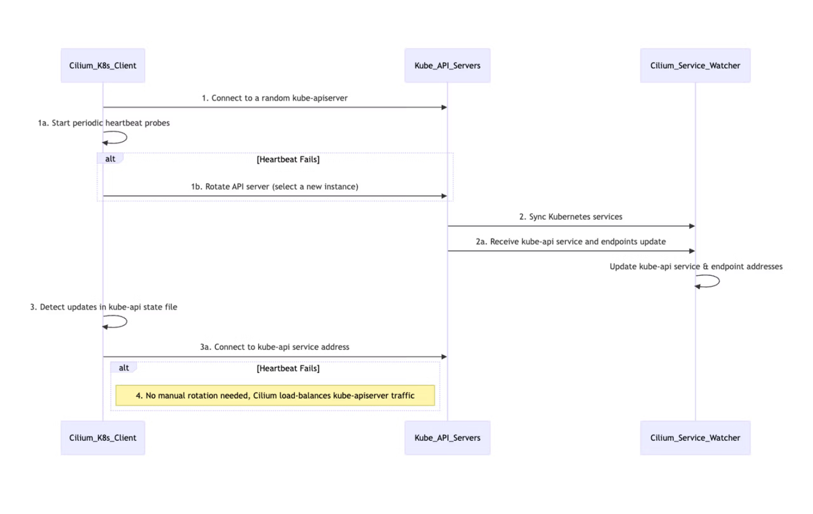

```bash
kubectl exec -it -n kube-system ds/cilium -- cilium-agent -h
```

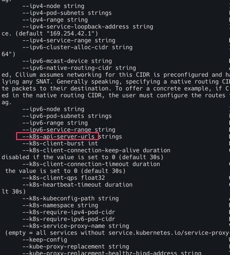

- 일부 시나리오에서는 Kubernetes API 서버에서 정보를 검색하면 과부하가 걸리거나 API 서버의 가용성에 해로울 수 있습니다(특히 LIST 요청).
- API 서버에 요청 시 exponential back-off 설정 가능.
```bash
 k8sClientExponentialBackoff:
    enabled: true
    backoffBaseSeconds: 1
    backoffMaxDurationSeconds: 120
```


# Cilium Tuning Guide
## Cilium Endpoint Slices
Cilium Endpoint Slice 도입:
- 문제점: 기존 Cilium 아키텍처에서는 각 Pod에 대해 CiliumEndpoint라는 CRD(Custom Resource Definition)를 생성하여 네트워크 메타데이터(포트 및 IP 정보 등)를 관리했다. Cilium 에이전트가 네트워크 정책을 적용하기 위해 클러스터 내 모든 CiliumEndpoint를 감시해야 했고, 이는 API 서버에 상당한 압력을 가했다. 예를 들어, 5천 개의 노드 클러스터에서 10만 개의 엔드포인트가 업데이트되면, 각 에이전트가 한 번에 50만 개의 감시 이벤트를 처리해야 했다.
- 해결책: Cilium Endpoint Slice는 Kubernetes의 Endpoint Slice와 유사한 개념으로, 여러 CiliumEndpoint를 CiliumEndpointSlice라는 단일 리소스에 일괄 처리한다. 특히, 동일한 배포(deployment)에 속하는 CiliumEndpoint들을 스마트하게 묶어 처리한다.
- 작동 방식: Cilium 에이전트가 개별 CiliumEndpoint를 직접 감시하는 대신, Cilium 오퍼레이터가 CiliumEndpoint를 감시하고 이러한 슬라이스를 생성한다. 각 노드 에이전트는 개별 엔드포인트 대신 이 CiliumEndpointSlice들을 감시함으로써, API 서버의 감시 부하를 대폭 줄인다.
- 효과: 1,000개 노드와 약 2만 개의 Pod를 가진 테스트 환경에서 API 서버의 지연 시간이 87% 감소했으며, Pod 네트워크 SLA도 약 60% 향상되었다. 이 기능은 Cilium 버전 1.16부터 안정화되었다.

사전조건
- CEP(CiliumEndpoint)가 활성화되었는지 확인한다.(`-disable-endpoint-crd` 플래그가 true로 설정되지 않았다.)
- Egress Gateway에 의존하지 않는지 확인한다. Egress Gateway는 CES와 호환되지 않는다.
```bash
kubectl get ciliumendpoints.cilium.io -A
kubectl get ciliumendpoints.cilium.io -A | wc -l
kubectl get crd

#
helm upgrade cilium cilium/cilium --version 1.18.1 --namespace kube-system --reuse-values \
--set ciliumEndpointSlice.enabled=true

kubectl rollout restart -n kube-system deployment cilium-operator
kubectl rollout restart -n kube-system ds/cilium 

# Bactches CEPs into CiliumEndpointSlice CRDs : Significantly fewer watch events.
kubectl get crd
kubectl get ciliumendpointslices.cilium.io -A | wc -l
kubectl get ciliumendpointslices.cilium.io -A
```
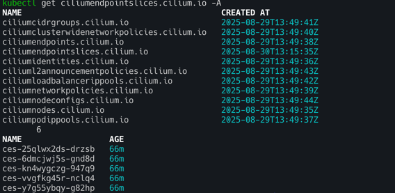

## eBPF Host Routing
- eBPF 호스트 라우팅
  - 해결책: eBPF 호스트 라우팅을 활성화하면 이 오버헤드를 크게 줄일 수 있다. BPF redirect peer라는 헬퍼 함수를 사용하여 호스트 네트워크 네임스페이스에 도착한 패킷을 호스트 네트워크 스택의 대부분을 우회하여, 애플리케이션이 목적지로 하는 네트워크 네임스페이스로 직접 전환할 수 있다.
  - 효과: 이는 기존 컨테이너 네트워킹의 처리량과 비교하여 호스트 네트워킹 성능에 상당히 근접한 수준까지 성능을 향상시킨다. 하지만 가상 이더넷 연결과 CPU당 큐에 의한 TCP 백프레셔는 여전히 존재한다.

bpf_redirect_peer 함수를 통해 호스트 NET NS 도착 시 → 바로 파드의 NET NS 로 전달
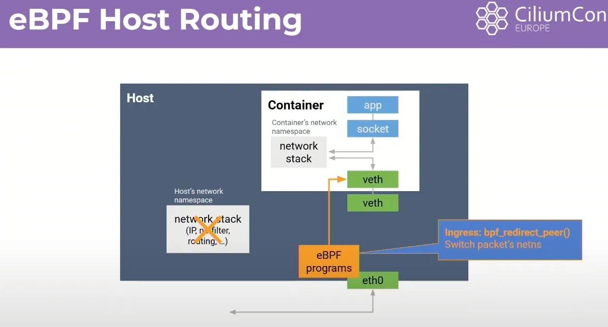

Egress 는 호스트 네트워크 스택(per-CPU backlog queue)을 통과해야한다.
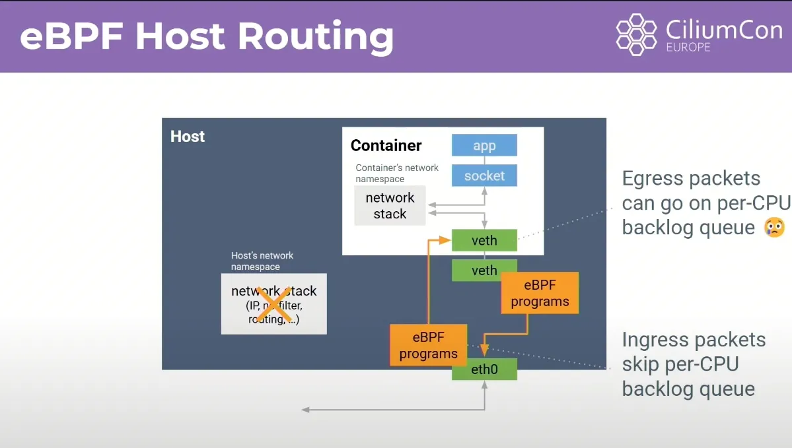

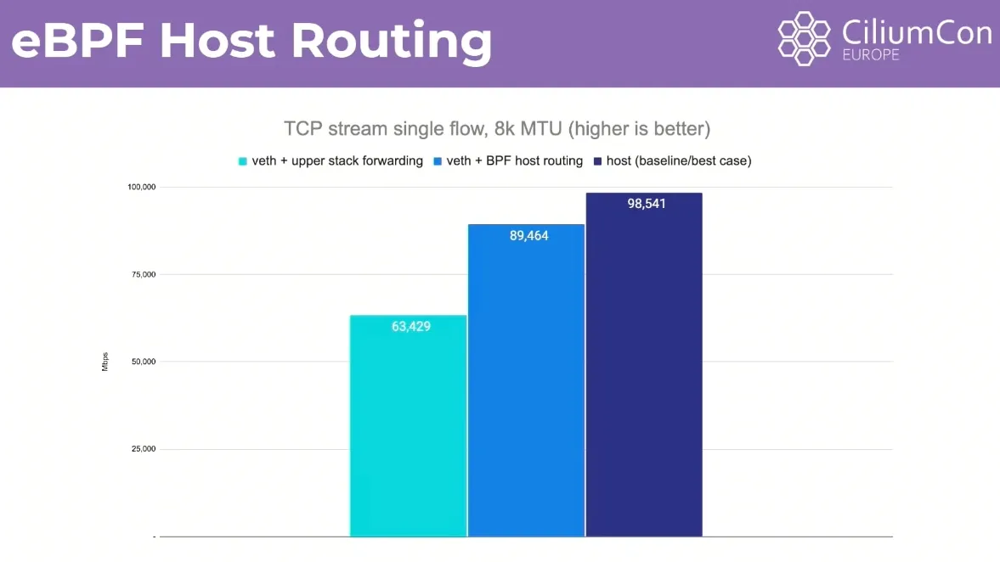

설정
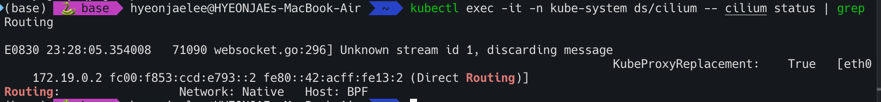


## Netkit Devices
Netkit 장치 (Netkit Devices) 
- 궁극적인 최적화: Daniel Balkman에 의해 커널에 도입된 Netkit 장치는 한 단계 더 나아간 최적화를 제공한다. 이는 가상 이더넷과 유사한 쌍 장치이지만, Netkit 장치의 호스트 측 프라이머리는 컨테이너의 네트워크 네임스페이스 내 eBPF 프로그램을 조작할 수 있다.
- 작동 방식: 이를 통해 가상 이더넷 연결을 완전히 없애고, 패킷이 애플리케이션을 떠난 후 eBPF 헬퍼 함수가 네트워크 네임스페이스에서 직접 호스트 네트워크 네임스페이스로 패킷을 전환할 수 있다. 이로써 양방향으로 TCP 백프레셔나 CPU당 큐잉이 발생하지 않게 된다.
- 효과: Netkit을 사용하면 컨테이너 네트워킹 성능은 처리량과 지연 시간 모두에서 호스트 네트워킹 성능과 동등해진다. 이는 컨테이너가 없는 경우와 동일한 성능을 달성할 수 있음을 의미한다.


veth 와 유사(쌍), ingress + egress 큐(CPU) 대기 없이 모두 빠르게 전달 가능.
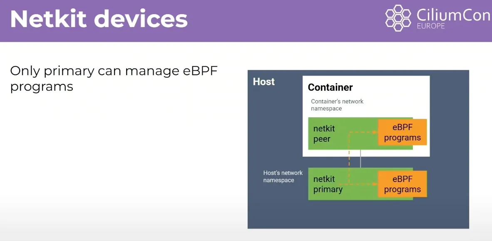

netkit + host Routing 경우 host(base) 와 거의 동등한 성능 → 컨테이너 NW 오버헤드 제거되라고 볼 수 있음.
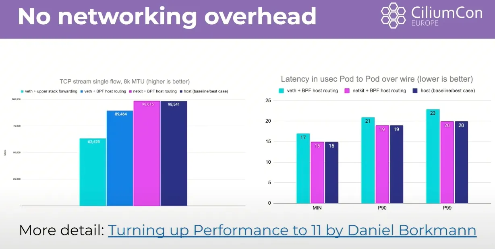

netkit 설정 시도 : 커널 6.8 이상 , eBPF host-routing

- 랜카드 넷킷 지원할경우만 테스트 가능
```bash
#
docker exec -it myk8s-control-plane uname -r
6.10.14-linuxkit

#
helm upgrade cilium cilium/cilium --version 1.18.1 --namespace kube-system --reuse-values \
--set bpf.datapathMode=netkit

kubectl rollout restart -n kube-system deployment cilium-operator
kubectl rollout restart -n kube-system ds/cilium 

#
kubectl logs -n kube-system cilium-k84hl
time=2025-08-24T09:33:36.486143842Z level=fatal source=/go/src/github.com/cilium/cilium/pkg/logging/slog.go:159 
.. msg="netkit devices need kernel 6.7.0 or newer and CONFIG_NETKIT"

#
helm upgrade cilium cilium/cilium --version 1.18.1 --namespace kube-system --reuse-values \
--set bpf.datapathMode=veth
```

```bash
kubectl exec -it -n kube-system ds/cilium -- cilium status | grep 'Device Mode'
```
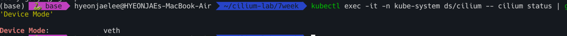

## BIC TCP
https://www.youtube.com/watch?v=oVAu8M6RZ3k 요약정리

Big TCP는 대규모 데이터 센터, 특히 100 기가비트 이상의 네트워크에서 발생하는 높은 패킷 처리량 문제를 해결하기 위해 고안된 기능이다.
초당 8백만 개의 패킷을 처리해야 하는 100 기가비트 네트워크와 같은 환경에서 시스템의 부담을 줄이고 지연 시간을 감소시키며 처리량을 향상시키는 것이 목표임

Big TCP의 핵심 개념
- 기존 제한 극복: 기존에는 리눅스 네트워크 스택 내에서 GRO(Generic Receive Offload) 및 TSO(Transmit Segmentation Offload)를 사용하여 1.5K 바이트 패킷을 64KB 슈퍼 사이즈 패킷으로 묶었다. 이 64KB 제한은 IP 헤더 내 16비트 필드가 패킷 길이를 옥텟 단위로 지정하기 때문에 발생했다 (최대값 2^16 = 64KB). 
- 새로운 접근 방식: Big TCP는 이 64KB 제한을 넘어 더 큰 패킷을 처리하기 위해 16비트보다 큰 필드를 가진 패킷 헤더를 활용한다. 이는 IPv6 점보그램(jumbograms)을 가능하게 하는 오래된 RFC를 사용하며, 32비트 필드를 가진 '허브-바이-허브(Hub-by-Hub) 헤더'를 삽입한다. 이론적으로는 4기가바이트 크기의 패킷도 가능하지만, 현재 Big TCP는 64KB에서 512KB까지 확장할 수 있도록 하며, Cilium은 기본적으로 192KB로 제한하고 있다. 
- 리눅스 커널 통합: Big TCP는 Google의 리눅스 커널 전문가들이 최근 개발하여 리눅스 커널 5.19에 도입되었다. 
- 지원 현황: 현재는 IPv6에서 먼저 지원되며, IPv4 지원도 계획 중 
- 점보 프레임과의 차이: Big TCP는 물리적 장치에서 이더넷 프레임 크기를 늘리는 점보 프레임(jumbo frames)과는 달리, 리눅스 네트워크 스택 내에서 작동한다.

Cilium의 Big TCP 지원 (버전 1.13)
- Cilium 1.13 릴리스와 함께 Big TCP 지원이 추가되었다. 
- Cilium은 Big TCP 기능을 활성화하면 자동으로 파드(pods)의 GSO 설정을 업데이트하여 더 큰 패킷 크기를 지원한다.

데모 환경 및 성능 결과
- 데모 환경: 리눅스 커널 5.19, GCP 이미지, 3개의 노드로 구성된 Kind 클러스터, 듀얼 스택(IPv4 및 IPv6 주소 모두 할당), Cilium 1.13 버전 사용. Netperf 클라이언트와 서버 파드는 서로 다른 노드에 배포되었다.

Big TCP 활성화 전:
- GSO 최대 크기: 64KB.
- Netperf 테스트 결과: 처리량 6739, P99 지연 시간 341 마이크로초.

Big TCP 활성화 후:
- Cilium에서 Big TCP 기능을 활성화한 후, 파드를 재시작하여 GSO 설정을 업데이트했다.
- GSO 최대 크기: 192KB로 업데이트되었다
- Netperf 테스트 결과: 처리량 8577 (이전보다 증가), P99 지연 시간 280 마이크로초 (이전보다 감소).

Big TCP 활성화를 통해 처리량이 향상되고 지연 시간이 단축되는 상당한 성능 이점을 보여주고있음
