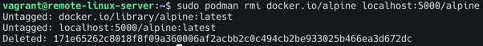
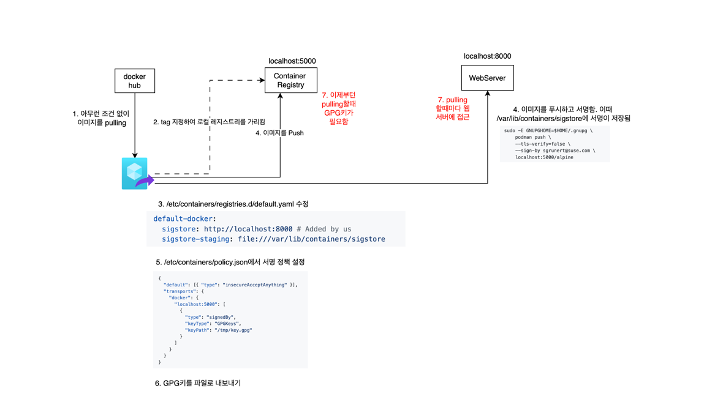

# 컨테이너 이미지에 서명을 하는 이유

중간자 공격이나 컨테이너 레지스트리 공격을 완화하기 위해 전담 이미지 제공업체만 신뢰한다는, 즉 믿을 수 있는 오피셜 이미지만 사용하겠다는 
동기에서 비롯되었다. 이미지 서용을 위한 방법중 하나는 GPG키를 활용하는 것이며 `Quay.io`와 같은 모든 OCI 컨테이너 레지스트리와 일반적으로 호환된다. 
OpenShift 통합 컨테이너 레지스트리는 이 서명 메커니즘을 기본적으로 지원하므로 별도의 서명 저장소가 필요하지 않다.

기술적인 관점에서 Podman을 사용하여 원격 레지스트리에 이미지를 푸시하기 전에 서명할 수 있다. 그 후 Podman을 실행하는 모든 시스템은 원격서버에서 서명을 가져오도록
구성해야한다. 즉 서명되지 않은 모든 이지미는 풀 작업중에 거부된다. 그러면 이러한 기능은 어떻게 작동하는 것일까?


## 주요 구성요소
- GPG 키 : 이미지 서명에 사용
- 컨테이너 레지스트리 : 이미지 저장소
- 웹 서버 : 서명 파일 배포용
- 정책설정 : 서명 검증 규칙

## 방법

- GPG 키 쌍을 생성하거나 로컬에서 이미 사용 가능한 키 쌍을 선택
- 키가 존재하지 않으므로 GPG키를 아래 명령어로 생성하자

```bash
gpg --full-gen-key
```

- 컨테이너 레지스트리를 실행하자. 
```bash
sudo podman run -d -p 5000:5000 docker.io/registry
```

레지스트리는 이미지 서명에 대해 전혀 알지 못하고 컨테이너 이미지의 원격 저장소만 제공한다는 점이다. 
즉 이제부터 이미지에 서명하려면 서명을 어떻게 배포할지 고려해야한다. 

- `alpine` 서명 실험을 위해 표준 이미지를 선택해보자.

```bash
sudo podman pull docker://docker.io/alpine:latest
```


```bash
podman images alpine
```


- 이제 이미지에 다시 태그를 지정하여 로컬 레지스트리를 가리킬 수 있다.
```bash
sudo podman tag alpine localhost:5000/alpine
```
- 이미지 확인. 동일 IMAGE 아이디에 REPOSITORY가 두곳인것을 확인할 수 있다.
```bash
sudo podman images alpine
```


- `/etc/containers/registries.d/default.yaml`를 생성하거나 존재한다면 수정해야하는데 여기서 이미지를 푸시할때 생성되는 서명을 저장할 서버 및 디렉토리를 지정할 수 있다. 

```bash
default-docker:
  sigstore: http://localhost:8000 # Added by us
  sigstore-staging: file:///var/lib/containers/sigstore
```

- 이미지를 서명하여 푸시한다. 

```bash
sudo -E GNUPGHOME=$HOME/.gnupg \
    podman push \
    --tls-verify=false \
    --sign-by <YOUR_EMAIL> \
    localhost:5000/alpine
```


- 이때 시스템 저장소(서명이 저장되는 곳)를 살펴보면 이미지 푸시로 인해 새로운 서명이 생성되었다. 


- 서명저장소에 접근이 가능한 파이썬 웹서버를 기동하자.이제 Podman이 이미지를 Pull할때 여기서 서명을 다운로드한다. 


- 검증 테스트를 위해 기존에 풀링하여 로컬에 저장된 이미지를 제거한다.




- 서명이 유효할 경우에만 풀링이 가능하도록 정책을 강제한다.
  - `/etc/containers/policy.json`

default값


정책 변경

```json
{
  "default": [{ "type": "insecureAcceptAnything" }],
  "transports": {
    "docker": {
      "localhost:5000": [
        {
          "type": "signedBy",
          "keyType": "GPGKeys",
          "keyPath": "/tmp/key.gpg"
        }
      ]
    }
  }
}
```

- 그리고 아직 GPG키가 없으므로 `/tmp` 이하 경로에 key.gpg로 넣는다. 
```bash
gpg --output /tmp/key.gpg --armor --export <YOUR-EMAIL>
```

- 모든것이 준비 되었으므로 이미지 앞서 태그로 지정한 로컬 컨테이너 레지스트리에서 이미지를 풀링한다.

```bash
sudo podman pull --tls-verify=false localhost:5000/alpine
```

- 성공적으로 풀링이 가능한 것을 확인할 수 있다. 


- 웹서버 로그에서도 `GET /alpine@sha256...` 을 보면 풀링한 로그가 기록되는 것을 확인할 수 있다. 


- 키를 잘못 지정한 경우 pulling이 불가능한것을 확인할 수 있다.


### Podman과 GPG를 사용하여 컨테이너 이미지에 서명할때 고려해야할 주요사항
1. 서명 머신에는 유효한 개인 GPG키가 필요하고 이미지를 가져올 모든 시스템에는 해당 공개키가 필요하다. 
2. 웹 서버에는 서명 저장소(sigstore)에 액세스할 수 있어야한다. (`/var/lib/containers/sigstore`) 
3. 웹 서버는 어떤 `/etc/containers/registries.d/*.yaml` 파일에서 구성되어야한다. 
4. 모든 이미지 풀링 시스템은 `policy.conf`를 통해 정책 구성을 적용하도록 해야한다. 

이러한 설정은 CRI-O 에서도 바로 작동하며 쿠버네티스 환경에서 컨테이너 이미지에 서명하는데 사용할 수 있다. 
# Wrap up


