Podman Remote Client를 구성하기 앞서 Podman의 기본 명령어를 알아보자. 

## Podman설치하기

`sudo apt install podman -y`

## Podman 명령어 모음

- 리모트상에 존재하는 이미지를 검색할 수 있다.

```bash
podman search http --filter=is-official
```

- 이미지 다운로드 (Pulling)

```bash
podman pull docker.io/library/httpd
```


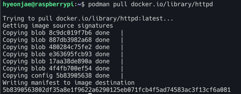

- 다운로드 후에 머신 위에 올라온 이미지를 리스트화 한다. 
```bash
podman images
```
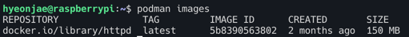


- 컨테이너 기동하기
```bash
podman run -dt -p 8080:80/tcp docker.io/library/httpd
```
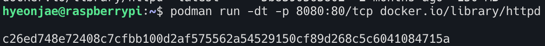

- 기동중인 컨테이너를 리스트화 한다. `-a` 옵션을 붙이면 created, exited, running 상태의 컨테이너를 전부 볼 수 있다. 
```bash
podman ps
```
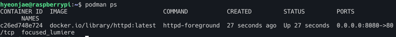

- 기동중 컨테이너에 curl 요청해보기

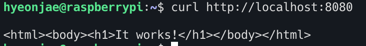


<br>

- podman inspect 명령어로 기동중 컨테이너의 메타데이터와 상세정보를 확인 할 수 있다.  
  - 환경변수 및 네트워크 설정 또는 할당된 리소스와 같은 많은 유용한 정보를 제공한다.
  - `-l` 옵션 : 최신 컨테이너에 대한 편의 파라메터 (`--latest`)
  - 아래의 경우 컨테이너가 rootless 모드에서 실행되므로 IP주소가 할당되지 않았다. 

```bash
podman inspect -l | grep IPAddress
```


<br>
- 로그 확인

```bash
podman logs -l
```

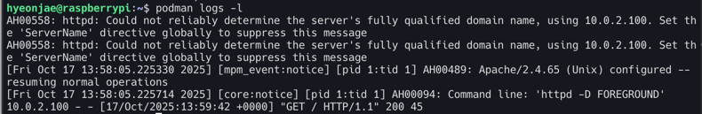

- 컨테이너에서 http pid를 관찰

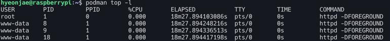

```bash
# 컨테이너 정지
podman stop -l

# 컨테이너 제거
podman rm -l
```

# Podman remote-client 튜토리얼

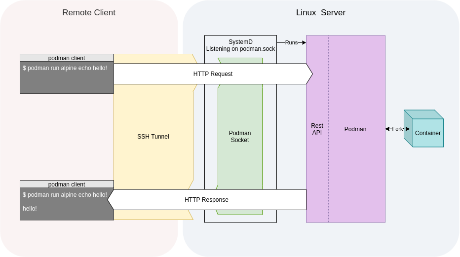


1. 목적

Podman 원격 클라이언트의 목적은 사용자가 별도의 클라이언트에 있으면서도 Podman 백엔드(Backend)와 상호 작용할 수 있도록 하는 것이다.
- 클라이언트 인터페이스: 원격 클라이언트의 명령어 인터페이스는 일반적인 Podman 명령어와 정확히 동일하다. 다만, 원격 클라이언트에는 적용되지 않는 일부 플래그(옵션)는 제거된다.

2. 작동방식

- 원격 클라이언트는 클라이언트-서버 모델을 활용하여 작동한다.

- 서버 설정 (백엔드): Podman이 설치되어 있고 SSH 데몬이 실행 중인 Linux 머신 또는 VM이 필요하다. 이것이 컨테이너 작업을 수행하는 서버 역할을 한다.

- 클라이언트 동작 (로컬): 사용자가 로컬 OS에서 Podman 명령을 실행하면, 다음과 같은 과정이 진행된다.
  - Podman은 SSH를 통해 원격 서버에 연결한다.
  - 서버에서 systemd 소켓 활성화를 사용하여 Podman 서비스에 연결하고, REST API를 호출한다.
  - 실제 Podman 명령은 원격 서버에서 실행된다.
- 사용자 관점: 클라이언트 사용자 입장에서는 Podman이 마치 로컬에서 실행되는 것처럼 보인다.

>SSH 데몬이 실행중인 Linux 머신이나 VM에 Podman이 설치되어 있어야 한다. 로컬 운영체제에서 Podman 명령을 실행하면 Podman은 SSH를 통해 서버에 연결한다. 
그런다음 `systemd` 소켓 활성화를 통해 Podman서비스로 연결하며 Podman명령어는 서버에서 실행된다. 따라서 Podman이 로컬에서 실행되는 것처럼 보이는 것이다. 

3. 플랫폼 주의사항 (Platform Caveat)

이 설명은 Linux에서 Podman을 원격으로 실행하는 경우에 대한 튜토리얼이므로 Mac 또는 Windows PC를 사용하는 경우, 해당 운영체제에 맞는 별도의 튜토리얼을 따라야 한다. (이는 Mac과 Windows는 SSH 데몬이 기본적으로 활성화된 Linux 서버와 다르기 때문에 Podman 설정을 위한 추가 단계가 필요하기 때문)

## Podman 설치 및 설정 (클라이언트 및 서버)
### 1. 클라이언트 기기 (Client machine)

클라이언트 기기에는 Podman 전체 또는 podman-remote 클라이언트만 설치하면 된다. 

Podman vs. podman-remote

- podman-remote : 컴파일된 원격 클라이언트로 백엔드 서버에만 연결 가능
- Podman: 로컬 Podman 명령 실행은 물론 --remote 옵션을 사용하여 원격 클라이언트 역할도 가능

podman-remote만 설치하려면 릴리스 설명 페이지에서 다운로드하거나, make podman-remote 명령으로 소스에서 빌드할 수 있다.

### 2. 서버 기기 (Server Machine)

서버 기기에는 podman을 반드시 설치해야한다


### 3. 퍼스트 커넥션 생성

#### Podman 서비스 활성화
원격 클라이언트 명령을 실행하기 전에 서버에서 Podman 서비스를 활성화해야 한다. 

이 예시에서는 루트리스(rootless) 사용자로 Podman을 실행하며, 기본 소켓은 `/run/user/${UID}/podman/podman.sock`에서 수신한다.

```bash
systemctl --user enable --now podman.socket
```

`systemctl --user status podman.socket`의 명령어로 현재 podman 소켓상태를 확인할 수 있으며 Listening URI를 확인할 수 있다.

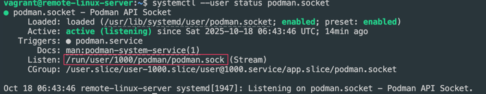


#### 사용자 링거(Linger) 활성화 : 사용자가 로그아웃한 후에도 소켓이 작동하도록 링거 기능을 활성화 한다. 

```bash
sudo loginctl enable-linger $USER
```

#### 소켓 작동확인 - `--remote info` 명령으로 소켓이 수신중인지 확인 가능

```bash
podman --remote info
```
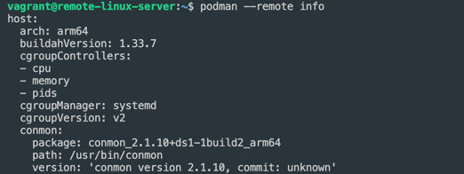


## SSH 설정 및 원격 연결 사용

### 4. sshd 활성화 

클라이언트가 서버와 통신하려면 서버에 SSH데몬(sshd)이 활성화 되어 있어야한다. 

```bash
sudo systemctl enable --now sshd
```
아래와 같이 라즈베리 파이OS에서는 sshd로 명명된 데몬이라할지라도 ssh.service로 등록되어 있어서 
`sudo systemctl enable --now ssh`로 활성화 해야한다.
> In many Debian-based systems, including Raspberry Pi OS, the service unit name for the OpenSSH server is often registered as ssh.service, even though the daemon binary itself is named sshd (SSH Daemon).

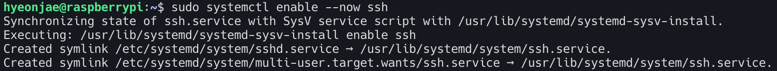


### 5. SSH 설정(Setting up SSH)

원격 Podman은 SSH를 통해 통신하며 SSH 키를 사용하는 것이 원활

- SSH키 쌍 생성(클라이언트 기기) : 연결 문제를 피하기 위해 ed25519 유형의 키를 생성하는 것을 권장한다.

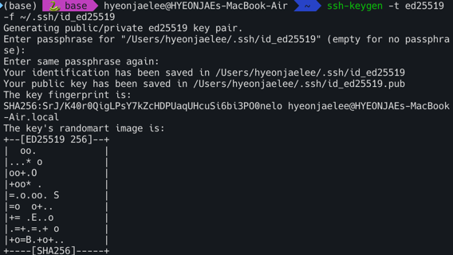


### 6. 클라이언트 사용

- 원격 연결 설정 추가 : `podman system connection add` 명령으로 첫번째 연결을 구성
  - identity 부분의 경로에 private_key 경로를 수정하여 넣어준다. 
  - 두번째 인자로 소켓 URL를 정확하게 넣어준다. 
```bash
podman-remote system connection add vagrant-k8s-root \
  --identity <PRIVATE_KEY_PATH> \
  ssh://vagrant@127.0.0.1:60000/run/user/1000/podman/podman.sock
```

- 기본 연결로 설정한다.
```bash
podman-remote system connection default vagrant-k8s-root
```


- 연결 리스트 확인

```bash
podman-remote system connection list 
```

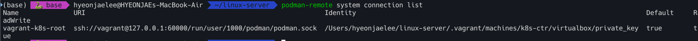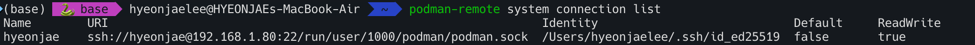

- 연결 테스트 
  - 아래의 사진처럼 Client와 host의 정보를 볼 수 있다.
```bash
podman-remote info 
```

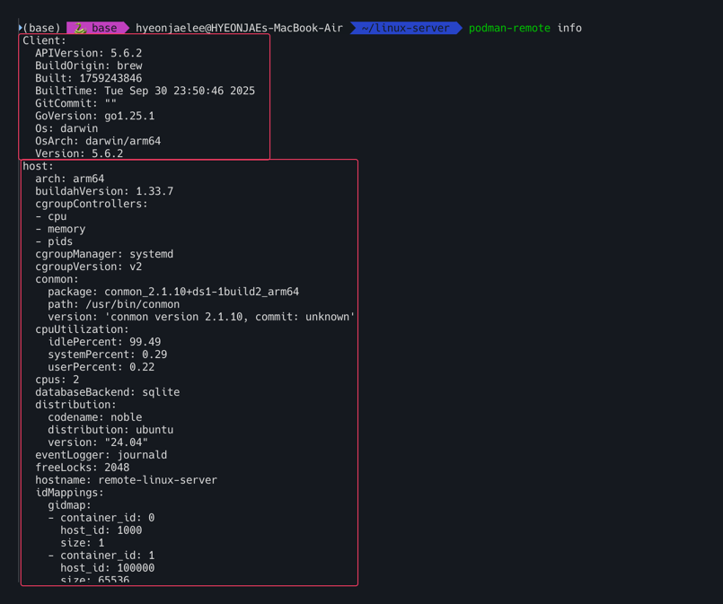


# Wrap up

macOS 및 윈도우에서 Podman 원격 클라이언트를 사용하여 리눅스 서버에서 실행되는 컨테이너를 관리 할 수 있다. 
클라이언트와 서버간의 통신은 SSH연결에 크게 의존하므로 SSH키 사용을 권장한다. 원격 클라이언트에 Podman을 설치한 후에 podman system connection add는 다음 Podman 명령에서 사용할 연결을 설정해야 한다.
