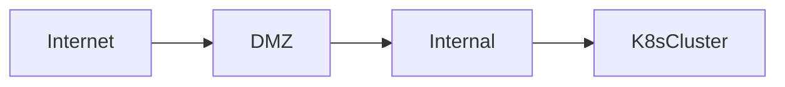

# 1. 왜 kubespray Offline인가

일반적인 Kubernetes 설치는 인터넷이 연결된 환경을 전제로 한다. 그러나 실제 기업 환경에서는 다음과 같은 구조를 가진다.

- 내부망에서는 외부 인터넷 접속이 불가능
- 필요시 방화벽 정책 승인 후 Bastion을 통해 접근
- 모든 패키지와 이미지가 사전 승인 되어야 한다.

 이러한 환경을 폐쇄망(Air Gap)이라하며 Kubespray Offline은 폐쇄망에서 쿠버네티스가 동작하기 위한 모든 공급망을 구축하는 과정이다.

# 2. 폐쇄망에서 쿠버네티스 운영에 필수 구성 요소

| 구성요소                           | 용도             | 예시 솔루션                  |
| ------------------------------ | -------------- | ----------------------- |
| **NTP Server**                 | 시간 동기화         | 어플라이언스 장비 (HA 구성)       |
| **DNS Server**                 | 도메인 네임 서비스     | 어플라이언스 장비 (HA 구성)       |
| **Network Gateway**            | 내부/외부망 통신      | 라우터/스위치                 |
| **Local YUM/DNF Repo**         | Linux 패키지 미러링  | reposync + createrepo   |
| **Private Container Registry** | 컨테이너 이미지 저장소   | Harbor, Docker Registry |
| **Helm Artifact Repo**         | Helm 차트 저장소    | ChartMuseum, Zot (OCI)  |
| **Private PyPI Mirror**        | Python 패키지 미러링 | Devpi                   |
| **Private Go Module Proxy**    | Go 모듈 프록시      | Athens                  |

# 3. 실습 환경 

#### 구성
- admin (인터넷 가능)
- k8s-node1(Control Plane)
- k8s-node2(Worker)
- VirtualBox + Vagrant 기반

