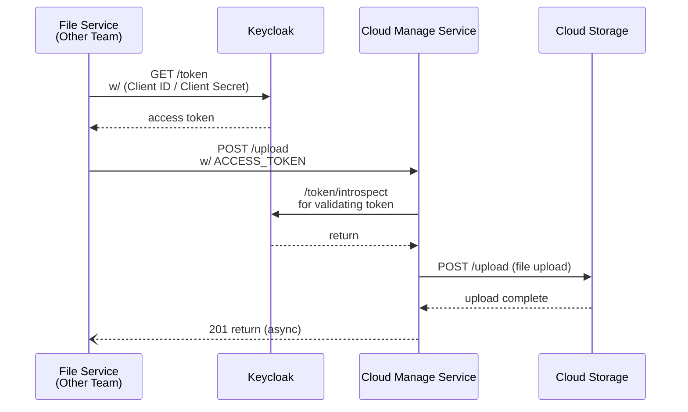
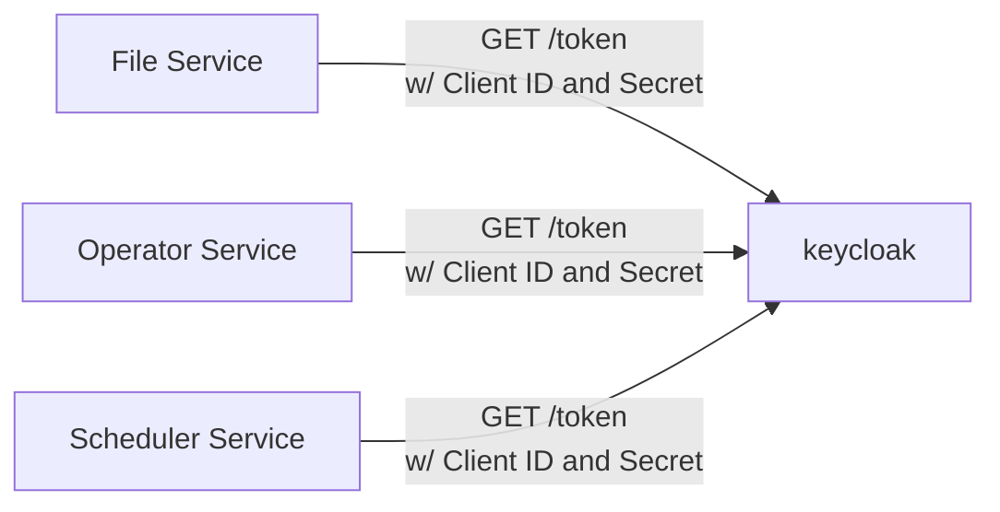
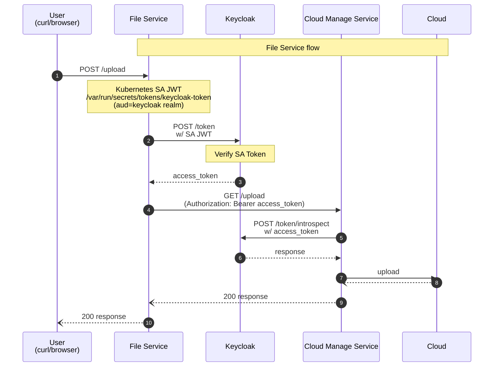

# 배경

저희 팀은 중앙 집중식 데이터 관리 팀으로, Keycloak과 데이터 업로드 서비스를 포함한 핵심 인프라를 운영하고 있습니다. 각 서비스는 Kubernetes Pod로 운용되며 네임스페이스로 팀을 구분하고 있습니다.

# 기존 인증 흐름

기존의 서비스 간 인증 흐름은 아래와 같습니다.

1. File Service 등 다른 팀의 서비스가 Keycloak에 Client ID / Client Secret으로 토큰을 요청합니다.
2. 발급된 access_token을 가지고 Cloud Manage Service에 파일 업로드를 요청합니다.
3. Cloud Manage Service는 Keycloak에 토큰을 검증(introspect)하고, 정상이면 S3에 업로드합니다.



## 무엇이 문제였나?

얼핏 보면 문제없어 보이지만, 실제로는 아래와 같이 각각의 Service가 서로 다른 네임스페이스에 있음에도 불구하고 동일한 Client ID / Secret을 공유하고 있었습니다. (물론 Client를 어떻게 정의하냐에 따라 다르겠지만 엄연히 서비스 역할이 전혀 다른만큼 네임스페이스를 보지않더라도 별도의 클라이언트로 보는 것이 바람직합니다. )

서비스마다 별도의 Client와 Secret을 발급한다면 만에하나 시크릿이 유출 되더라도 피해 반경 최소화(Minimizing the Blast Radius)을 최소화 할 수 있습니다. 하지만 서비스가 늘어날수록 시크릿 관리 부담이 선형으로 증가합니다. 인력이 부족한 SRE팀 입장에서는 받아들이기 어려운 방식이였습니다.





# Workload Identity 개념의 부상

 결국 해결해야 할 근본 문제는 클라이언트별 인증을 수행할 시크릿이 탈취되었을 때 피해 범위를 최소화하는 것입니다.  하지만 파드 스스로를 플랫폼 레벨에서 증명할 수 있다면? 그렇다면 우리는 별도의 시크릿이 필요없어집니다. 서비스가 증가함에따라 Keycloak에 접근하는 Client들이 늘어나더라도 애초에 취급하는 시크릿이 존재하지 않기 때문에 관리 비용은 크게 증가하지 않습니다. 

다행히도 이미 클라우드 벤더들이 이 문제를 먼저 풀었습니다. AWS의 IRSA, GCP의 Workload Identity, Azure의 Workload Identity for AKS가 대표적입니다. 이들의 공통 아이디어는 Kubernetes Service Account 토큰을 OIDC federation으로 신뢰하는 것입니다. 더 쉽게 말하면 별도의 시크릿을 사용하는대신 파드에 종속된 Service Account Token을 사용하자는 것입니다. 

구체적으로 Kubernetes 1.20+에서 안정화된 **Service Account Token Volume Projection**이 핵심입니다.
- **audience 지정 가능**: 특정 서비스(Keycloak realm)에만 유효한 토큰 발급
- **expiration 지정 가능**: 최소 600초(10분), 최대 3600초(1시간)
- **kubelet 자동 갱신**: 만료 80% 시점에 파일이 자동으로 교체됨. 사람이 개입할 필요 없음

즉, Kubernetes 자체가 단기 수명의 audience-bound 토큰을 발급하는 **OIDC Provider**로 동작하고, 이를 Keycloak이 신뢰하는 외부 IdP로 등록하는 구조입니다.

# 키클락 설정

## 1. Identity provider 추가

2026년 1월 기준 아직 Preview 단계이지만, Keycloak은 Kubernetes SA 토큰 기반 인증을 지원하기 시작했습니다. Keycloak 서버 기동 시 feature flag를 활성화하면 Identity Providers 목록에 Kubernetes가 나타납니다.(`--features=preview` 또는 `--features=kubernetes`로 활성화 할 수 있습니다. )

>Kubernetes service accounts trust relationship provider is **Preview** and is not fully supported. This feature is disabled by default.
To enable start the server with `--features=preview` or `--features=kubernetes`
https://www.keycloak.org/2026/01/federated-client-authentication

```yaml
# Keycloak StatefulSet env
- name: KC_FEATURES
  value: "client-auth-federated,kubernetes-service-accounts"
```

활성화 할 경우 아래와 같이 `Identity providers`로서 `Kubernetes`를 선택할 수 있게됩니다. 


Identity Providers → Add provider → Kubernetes를 선택하고 Kubernetes Issuer URL을 입력합니다.  Keycloak이 동일 클러스터 내 파드로 존재하기 때문에 FQDN으로 접근 가능합니다.

```bash
Kubernetes Issuer URL: https://kubernetes.default.svc.cluster.local
```


>**주의**: Keycloak의 issuer URL과 SA 토큰의 `aud` 클레임이 정확히 일치해야 합니다. HTTP/HTTPS, trailing slash 등 한 글자도 다르면 `Invalid token audience` 에러가 발생합니다.


## 2. Client 설정

각 클라이언트(서비스)에 대해 아래와 같이 설정합니다.
### General settings
-  Client ID: `system:serviceaccount:<namespace>:<serviceaccount>`
- Client authentication : `ON`
- Service account roles : Check

### Credentials
-  Client Authenticator: `Signed JWT - Federated`
- Identity Provider: `kubernetes`
- Federated Subject: `system:serviceaccount:<namespace>:<serviceaccount>`


## 3. Authentication Flow

기존 realms의 경우 client authentication flow에 `Signed JWT - Federated`를 Alternative 실행 단계로 추가해야 합니다. Built-in flow는 수정이 불가하므로 기존 flow를 복제한 뒤 수정해야 합니다.


# 파드 설정

File Service의 Deployment에 SA 토큰을 볼륨으로 마운트합니다.

```yaml
apiVersion: apps/v1
kind: Deployment
metadata:
  name: file-service
  namespace: dev-file-manage-team
spec:
  replicas: 1
  selector:
    matchLabels:
      app: file-service
  template:
    spec:
      serviceAccountName: sa-file-service
      volumes:
        - name: kc-token
          projected:
            sources:
              - serviceAccountToken:
                  # Keycloak Realm URL을 audience로 설정 (issuer URL과 정확히 일치해야 함)
                  audience: "https://<YOUR_KEYCLOAK_URL>/realms/master"
                  expirationSeconds: 600
                  path: keycloak-token
      containers:
        - name: app
          image: <YOUR_IMAGE>
          volumeMounts:
            - name: kc-token
              mountPath: /var/run/secrets/tokens
              readOnly: true
          env:
            - name: KC_TOKEN_URL
              value: "https://<YOUR_KEYCLOAK_URL>/realms/master/protocol/openid-connect/token"
            - name: KC_CLIENT_ID
              value: "system:serviceaccount:dev-file-manage-team:sa-file-service"
            - name: SA_TOKEN_PATH
              value: "/var/run/secrets/tokens/keycloak-token"
```


**네임스페이스와 SA의 관계에서 주의할 점**: Pod는 자신과 **같은 네임스페이스의 SA만** `serviceAccountName`으로 참조할 수 있습니다. 다른 네임스페이스의 SA를 직접 참조하는 방법은 없습니다. SA는 반드시 Pod와 동일한 네임스페이스에 생성해야 합니다.

# 전체 인증 흐름




### Keycloak의 SA 토큰 검증 과정

Keycloak이 SA JWT를 검증하는 순서는 아래와 같습니다.

1. JWT payload의 `iss` 클레임을 확인합니다. (`https://kubernetes.default.svc.cluster.local`)
2. `<iss>/.well-known/openid-configuration`으로 OIDC discovery를 조회합니다.
3. 응답에서 `jwks_uri`를 얻어 JWKS(공개키 목록)를 가져옵니다.
4. JWT 헤더의 `kid`와 일치하는 공개키를 찾아 서명을 검증합니다.
5. `aud`, `sub`, `exp` 등 클레임을 검증하고 `access_token`을 발급합니다.
 


요청을 받은 FileSystem은 Keycloak에게 Service Account Token을 Body에 담아 Cloud Manage Service에 접근하기 위한 access_token을 요청합니다. 
이때 Service Account Token을 파드에 주입하기 위한 방법은 다음과 같습니다.  

- KC_TOKEN_URL: 토큰을 요청하기 위한 Keycloak 엔드포인트입니다.
- KC_CLIENT_ID: 요청한 클라이언트가 어떤지 지정해줍니다. 
- SA_TOKEN_PATH : File Service 파드가 Keycloak 에게 토큰을 요청시 Service Account JWT를 알아야함으로 경로를 환경변수로 지정해줍니다. 


```yaml
apiVersion: apps/v1
kind: Deployment
metadata:
  name: fileSystem
  namespace: dev-file-manage-team
spec:
  replicas: 1
  selector:
    matchLabels:
      app: fileSystem
  template:
    metadata:
      labels:
        app: fileSystem
    spec:
      serviceAccountName: sa-fileSystem

      volumes:
        - name: kc-token
          projected:
            sources:
              - serviceAccountToken:
                  # Set Keycloak Realm Issuer URL as audience (required)
                  audience: "https://<YOUR_KEYCLOAK_URL>/realms/master"
                  # Token expiration time in seconds. Recommended: 600 seconds (10 minutes)
                  expirationSeconds: 600
                  # File path within the volume
                  path: keycloak-token

      containers:
        - name: app
          image: <YOUR_IMAGE>
          imagePullPolicy: "Always"
          volumeMounts:
            - name: kc-token
              mountPath: /var/run/secrets/tokens
              readOnly: true

          env:
            # Keycloak token endpoint
            - name: KC_TOKEN_URL
              value: "https://<YOUR_KEYCLOAK_URL>/realms/master/protocol/openid-connect/token"
            # Keycloak Client ID for this Pod
            - name: KC_CLIENT_ID
              value: "system:serviceaccount:dev-file-manage-team:sa-fileSystem"
            # SA Token file path
            - name: SA_TOKEN_PATH
              value: "/var/run/secrets/tokens/keycloak-token"
```

### 애플리케이션 코드 (File Service)

```javascript
...

// Request an access token from Keycloak
async function getKeycloakToken() {
  const saToken = readSAToken();

  const body = new URLSearchParams({
    grant_type: GRANT_TYPE,
    client_id: KC_CLIENT_ID,
    client_assertion_type: CLIENT_ASSERTION_TYPE,
    client_assertion: saToken,
  });

  const res = await fetch(KC_TOKEN_URL, {
    method: "POST",
    headers: { "Content-Type": "application/x-www-form-urlencoded" },
    body: body.toString(),
  });
    ...
}
```

```bash
curl --location 'https://<YOUR_KEYCLOAK_URL>/realms/master/protocol/openid-connect/token' \
--header 'Content-Type: application/x-www-form-urlencoded' \
--data-urlencode 'grant_type=client_credentials' \
--data-urlencode 'client_assertion_type=urn:ietf:params:oauth:client-assertion-type:jwt-bearer' \
--data-urlencode 'client_assertion=eyJhbs....cTUKw80sRw' \
--data-urlencode 'client_id=system:serviceaccount:dev-file-manage-team:sa-fileSystem'
```

실제로 Keycloak이 받을 SA JWT 토큰은 아래와 같습니다. 

```json
// Header
{

  "alg": "RS256",
  "kid": "9k0R1cjNEVMbke7q2qmpGo9D6kG4_-IlYERu2u99spM"
}
// Payload
{
  "aud": [
    "https://<YOUR_KEYCLOAK_URL>/realms/master"
  ],
  "exp": 1772266046,
  "iat": 1772265446,
  "iss": "https://kubernetes.default.svc.cluster.local",
  "jti": "c16c0249-2f79-487b-aee1-f4531ae34326",
  "kubernetes.io": {
    "namespace": "ns-a",
    "node": {
      "name": "raspberrypi",
      "uid": "bedaaeaf-a6ae-4849-949c-23535529639f"
    },
    "pod": {
      "name": "client-a-7c6d6ff75d-mqd5z",
      "uid": "c719ef40-0581-4410-bb70-ba8d7a15b4ea"
    },
    "serviceaccount": {
      "name": "sa-fileSystem",
      "uid": "34c6a96d-7edc-45aa-967c-02b2b40f5f53"
    }
  },
  "nbf": 1772265446,
  "sub": "system:serviceaccount:dev-file-manage-team:sa-fileSystem"
}
```


Keycloak은 SA JWT payload의 `iss`(issuer) 클레임을 기준으로 OIDC discovery를 조회합니다.

```
GET https://<issuer>/.well-known/openid-configuration
```

SA 토큰의 발급자는 Kubernetes이므로 issuer는 `https://kubernetes.default.svc.cluster.local`이 됩니다. Keycloak이 동일 클러스터 내 파드로 존재하기 때문에 이 FQDN으로 직접 접근할 수 있습니다.

OIDC discovery 응답에서 `jwks_uri`를 얻고, 해당 엔드포인트에서 JWKS(공개키 목록)를 가져옵니다. 이후 SA JWT 헤더의 `kid`와 일치하는 공개키를 찾아 서명을 검증하고, 검증이 통과되면 `access_token`을 발급합니다.

```
iss 확인 → OIDC discovery → jwks_uri 획득 → JWKS 조회 → kid 매칭 → 서명 검증 → access_token 발급
```


## Cloud Manage Service의 인가 처리

Cloud Manage Service는 토큰을 introspect하여 `client_id`를 확인하고, 경로별 접근 권한을 검사합니다.

```javascript
function isAllowedForPath(pathname, clientId) {
  if (pathname === "/upload") return clientId === CLIENT_FILE_SERVICE;
  if (pathname === "/batch") return clientId === CLIENT_OPERATOR_SERVICE;
  return false;
}
```

| Client                                                        | 허용경로           |
| ------------------------------------------------------------- | -------------- |
| `system:serviceaccount:dev-file-manage-team:sa-file-service`  | `POST /upload` |
| `system:serviceaccount:dev-operator-team:sa-operator-service` | `POST /batch`  |

File Service가 `/batch`를 시도하면 403 Forbidden이 반환됩니다. **토큰이 유효하더라도, 어떤 서비스에서 발급된 토큰인지에 따라 접근 가능한 API가 제한**됩니다.


# 실습

위의 과정을 직접 체험해볼 수 있도록 Helm Chart와 데모 애플리케이션을 만들었습니다. kind 클러스터 위에서 단 3줄의 명령어로 전체 흐름을 실행해볼 수 있습니다.

👉 [https://github.com/hyeonjae1122/keycloak-preview-playground](https://github.com/hyeonjae1122/keycloak-preview-playground)

```
# kind 클러스터 생성
kind create cluster --config kind-config.yaml --name keycloak-cluster

# 설치
helm upgrade --install keycloak-preview ./helm

# 키클락 세팅
./keycloak-setup.sh http://localhost:30080 master admin changeme
```


## 1) kind 클러스터 생성 화면


```bash
kubectl get pods -A
```


## 2) 설치

```bash
helm upgrade --install keycloak-preview ./helm
```


## 3) Keycloak 세팅

- `Test`  Realm을 생성하고 client 및 Identity Provider를 생성합니다. 

```bash
./keycloak-setup.sh http://localhost:30080 Test admin changeme
```


## 4) 테스트

- File Service(30083 포트)에 `POST /upload`요청합니다.

```bash
curl -X GET http://localhost:30083/upload
```

- `POST /upload` API는 File Service에게 허용된 API이므로 응답이 성공합니다. 

```json
{
  "client": "system:serviceaccount:dev-file-manage-team:sa-file-service",
  "cloudManagerService": {
    "ok": true,
    "path": "/upload",
    "client_id": "system:serviceaccount:dev-file-manage-team:sa-file-service",
    "message": "Mock upload API accepted"
  }
}
```


- `POST /batch` API는 File Service에게 허용된 API가 아니므로 에러를 반환합니다.

```json
{
  "client": "system:serviceaccount:dev-file-manage-team:sa-file-service",
  "error": "Service error 403: {\"error\":\"Forbidden\",\"path\":\"/batch\",\"client_id\":\"system:serviceaccount:dev-file-manage-team:sa-file-service\"}"
}
```

- Operator Service(30082 포트)에 `POST /batch`요청합니다.

```bash
curl -X GET http://localhost:30082/batch
```


- `POST /batch` API는 Operator Service에게 허용된 API이므로 정상응답을 반환합니다.

```json
{
  "client": "system:serviceaccount:dev-operator-team:sa-operator-service",
  "cloudManagerService": {
    "ok": true,
    "path": "/batch",
    "client_id": "system:serviceaccount:dev-operator-team:sa-operator-service",
    "message": "Mock batch delete API accepted"
  }
}
```


- `POST /upload` API는 Operator Service에게 허용된 API가 아니므로 에러를 반환합니다.

```json
{
  "client": "system:serviceaccount:dev-operator-team:sa-operator-service",
  "error": "Service error 403: {\"error\":\"Forbidden\",\"path\":\"/upload\",\"client_id\":\"system:serviceaccount:dev-operator-team:sa-operator-service\"}"
}
```


